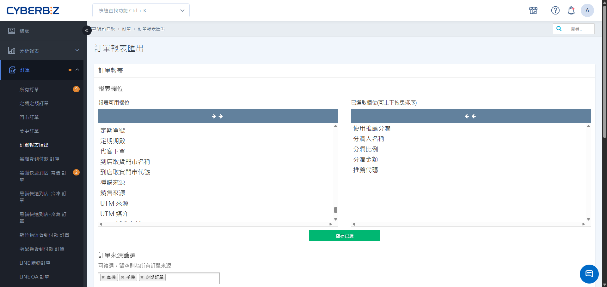

# ExportReferral Reports

With Referral Reports, you can accurately track the performance and corresponding Referral amount of each type of promoter. The system provides official reports after settlement and a real-time Order overview before settlement.
{ .subtitle }

[:lucide-layers:{ title="適用產品" }](../../resources/conventions#適用產品) | Brand Official Website / Smart POS
[:lucide-tag:{ title="適用方案" }](../../resources/conventions#適用方案) | Advanced / Expert / All PLUS plans / Enterprise
{ .doc-badge }

!!! tip "Use Cases"
	- **Monthly Reconciliation and Settlement**: At the beginning of each month, Export the previous month's **Completed** profit-sharing summary to issue bonuses.
	- **Third-Party Performance Tracking**: Provide dedicated links to influencers or group-buy organizers so they can view promotion Order details in real time.
	- **Real-Time Performance Monitoring**: Before Order settlement, use Order Report to preview potential profit-sharing expenses.

## Important Notes

- **Permission Differences**:
    - **Website Owner**: Can view profit-sharing data for all personnel across the website.
    - **Collaborative Administrator (Employee)**: Can view only their own profit-sharing performance.

## Procedure

### Task 1: Export Official Referral Reports

This applies to settlement for all profit-sharing programs, including referrals, registrations, checkout, and pickup.

1. Log in to the CYBERBIZ Admin, then go to **Profit Sharing Referral Reports**.
2. In the **Report type** drop-down menu, select the type to query.
3. Select a specific report name:
    - **Referral Profit Sharing**: Select **Referral Profit-Sharing Summary** or **Individual Referral Referral Reports**.
    - **Registration Profit Sharing**: Select **Registration Profit-Sharing Summary** or **Employee Registration Referral Reports**.

    !!! note "Understanding Report Content"
        - **Profit-Sharing Summary**: Shows each **partner's** referral profit-sharing Total price within a specific Month. Use it for monthly financial settlement and aggregate reconciliation.
        - **Individual Referral Referral Reports/Employee Registration Referral Reports**: Shows all referral Order details and the Referral amount list for a **single partner** within a specific Month. Use it to provide partners with compensation details for each Order.

    - **Checkout/Pickup Profit Sharing**: Select the corresponding summary or individual report directly.

4. Select the **Month** to Export.
5. Enter the **Recipient Email**, then click **Export Report**.

    > The system processes the report in the background and sends a download link to your email address.

!!! note "Settlement and Output Rules"
    - **Settlement Criteria**: Official Referral Reports includes only Order from **Completed**. If an Order is created at the end of December but is not settled until January, its data appears in the January report.
    - **Data Range**: The report Export is limited to a **single Month** and cannot Export across months.

{ .screenshot }

### Task 2: Export Real-Time Profit-Sharing Information

To preview **referrer profit sharing** before Order settlement, use the Order Report feature.

1. Go to **Order Order Data Export**.
2. Under **Avaliable Fields**, select the following profit-sharing fields:
    - **Referral bonus**
    - **Referrer's name**
    - **Referral ratio**
    - **Referral amount**
    - **Referral code**
3. Filter the Order status to query.
4. Set the Time range and Email, then click **Export**.

{ .screenshot }

## Frequently Asked Questions

??? quote "What should I do if a referrer cannot find an Order?"
    1. Confirm that the customer entered the referral code or clicked the referral link when placing the order.
    2. Check whether the Order was created within the program's **effective period**.
    3. For a third-party query link, confirm that the Order appears under **Referral Search** in the Admin.

