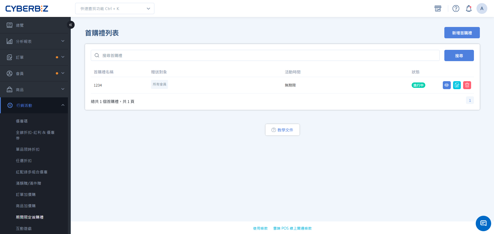

#  Limited-Time First Purchase Gift

Limited-Time First Purchase Gift is a promotional tool designed specifically for new members' first purchase. When an eligible member completes their first payment order, the system will automatically send a designated gift.
{ .subtitle }

[:lucide-tag:{ title="適用方案" }](../../../resources/conventions#適用方案) | All PLUS / Enterprise
{ .doc-badge }

!!! info " Version Differences "
     The "Limited-Time First Purchase Gift" is an optional module (choose 2 out of 11) in the PLUS plan. Merchants must confirm that this module has been selected to use it. The Enterprise version has this function built-in.

{ .hero-page }

!!! tip " Application Scenarios "
    -  **store-wide New Customer Recruitment**: Regardless of the amount, all new customers receive a small gift or a 50 RMB discount coupon upon their first purchase.
    -  **Specific Group Incentives**: High-value gifts or high bonus points are offered to first-time purchases by members with specific tags.
    -  **Holiday Season Traffic Diversion**: Limited-time first-purchase gifts are offered to new members who register during specific months (such as Double 11) to increase the conversion rate for that month.

---

## Instructions for Use
Before setting up your first purchase gift, please be sure to understand the following core rules: **First Purchase Definition:** This refers to the first order under a member's account whose status changes to `已付款`. Even long-registered members who have never had a successful payment record are still eligible for a first purchase. **Login Requirements:** Members must **log in** to their account before checking out for the system to determine their first purchase status and send the gift. **Parallel Activity Logic:** The system supports multiple first purchase gift activities scheduled simultaneously. If a member meets the conditions for multiple activities, the system will **send the gift to all of them**. **Gift Sending Time:** The sending logic varies depending on the gift type.
    -  **Bonus/Coupon**: During the promotion period and frequency, coupons will be sent based on the **order closing** time (the time of purchase determines eligibility for the "spend and receive" promotion; closing may occur after the promotion period).
    -  **Product/Cash Discount**: During the promotion period and frequency, discounts or gifts will be applied to the member's **first order**.

System logic and operational limitations are as follows:

-  **Product Adjustment Risk**: If a product has been set as a **first-purchase gift**, do not adjust its **style settings** individually. This will result in a 404 error on the checkout page. If you need to adjust the style, please remove the gift setting first, adjust it, and then re-add it.
-  **Not Supported**: This function does not support **regular fixed-amount orders, POS orders, CYBERBIZ NOW express delivery, e-tickets**, and **LINE group purchase orders**.
-  **Temperature Control**: The first-purchase gift item is not temperature-sensitive. Merchants should assess whether to ship together or split the order and pay attention to the freshness of the goods.
-  **Multiple Cart Detection**: If a consumer has two shopping carts, both of which meet the requirements, the first-purchase gift information will be displayed on both carts. After one cart is checked out, the other cart will still display the gift information, but the system will determine that it is not a first-purchase order and will not include it in the checkout.
-  **Disqualification Restriction**: If the first order experiences **payment failure, cancellation, or return**, it will be considered a forfeiture of the first-purchase qualification, and the system will not reissue the gift during the promotion period.

    !!! info " Return and Closure Logic "
        -  **Returned Orders**: If an order is marked as `已退貨`, clicking **Closing** will **not** send the first-purchase gift. The member must wait until the next "First-Purchase Gift Frequency" cycle to be eligible for the gift again.
        -  **Return Processing Status**: If the order is in `退貨中` or `退貨審查` status, clicking **Closing** will still trigger the **first-purchase gift**. To avoid mistakenly sending gifts, merchants are advised to ensure that the order process is completely completed before clicking "Closing".

    

## Operating procedures

### Step 1: Set up the first purchase gift program and basic settings

1. Log in to the CYBERBIZ admin panel and go to **Marketing Activities > Limited-Time First Purchase Gift**.
2. Click the **New Free Gift for First Purchase** button.
3. Enter the **Activity Name**.
4. Select the **Activity Start and End Time**.
  > Once the activity is created and saved, the system does not support modifying the activity's expiration date. Please ensure the sending date and time are correct before sending.

### Step 2: Set target members and threshold rules

1. **Target Members** (Choose one of three):
    - **All Customers**: All newly registered members making their first purchase.
    - **Member Tags**: Limited to members with specific tags (multiple tags can be bound).
    - **Specified Registration Period**: Limited to members who registered within a specific time frame.
2. **Event Rule Frequency**: Sets a limit on the number of times a member can receive a gift.
3. **Rule Type** (Determines the threshold):
    - **Consumption Threshold**: The order amount (excluding shipping) must reach the set minimum value.
    - **Product Tags**: The order must contain products with the specified tags.

{ .screenshot }

### Step 3: Configure gift details

You can choose one of the following four gift types:

=== " Free Gift Items "

     You can set physical or virtual goods as gifts.

    -  **Priority Mechanism**: You can select up to 10 items. The system will send them in the order of the list.
    -  **Automatic Inventory Replenishment**: When the first gift is out of stock, the system will automatically send the next alternative gift.
    -  **Pricing Logic**: Gifts will be counted as 0 yuan in the order.
    -  **Inventory Depletion Handling**: If all gifts in the list are sold out, the system will stop sending the first purchase gift, but **will not automatically close** the activity. Merchants must monitor and replenish gift inventory in a timely manner.

=== " Cash Discount "

     Direct discount in order.

    -  **Type**: Can be set as a "fixed amount" or "percentage discount" (e.g., 10% off).
    -  **Usage**: Members who meet the first-purchase conditions will receive a first-purchase gift cash discount on the checkout page.

=== " Send Coupon "

     Send coupon with preset rules.

    -  **Settings**: Includes coupon name, discount amount, minimum spending threshold, validity period, and applicable products.
    -  **Concurrent Use Restrictions**: You can individually select whether to use it concurrently with other promotions such as "store-wide Discount" and "VIP Discount".

=== " Bonus Gift "

     Send Bonus Points.

    -  **Settings**: Enter the bonus point value and validity period (0 indicates permanent validity).

## Frequently Asked Questions

??? quote "Can an existing member who has never purchased before get the first-purchase gift? "
    Yes. As long as their account has 0 **paid orders** in the backend and meets the **target member** criteria set for the activity, the member can receive the gift after completing their first order.

??? quote "If an order is canceled or returned after the gift has been sent, will the system automatically reclaim the coupon or bonus? "
    The system **will not automatically reclaim** coupons or bonuses that have already been issued. If an order is cancelled or returned after the bonus has been sent, and the merchant wishes to reclaim the coupon or bonus, they can go to **Members Member Management** and manually deduct the amount from the member's account page.
