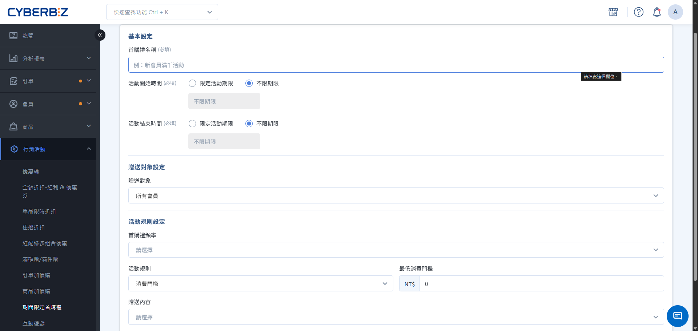

# limited-time first-purchase gift

limited-time first-purchase gift is a promotional tool for a new member's first purchase. When an eligible member completes their first paid order, the system automatically issues a designated gift.
{ .subtitle }

[:lucide-tag:{ title="適用方案" }](../../../resources/conventions#適用方案) | All PLUS / Enterprise
{ .doc-badge }

!!! info "Plan differences"
    In the PLUS plan, "limited-time first-purchase gift" is an optional "Marketing B" module (choose 2 of 11). Confirm that this module is selected before you use the feature. Enterprise includes this feature by default.

{ .hero-page }

!!! tip "Use cases"
    - **Store-wide new-customer acquisition**: No minimum spend. Every new customer's first purchase gets a branded gift or a NT$50 coupon.
    - **Segment incentive**: For first purchases by members with specific tags, issue a high-value gift or extra Bonus.
    - **Holiday traffic campaign**: For new members who register in a specific month (such as Double 11), set a limited-time first-purchase gift to raise that month's conversion rate.

---

## Usage notes

Before you set up first-purchase gift, review these core rules:

- **first-purchase definition**: The first order under a member account whose Status changes to `已付款`. Long-registered members still qualify if they have no successful payment record.
- **Sign-in requirement**: The member must **log in** before checkout so the system can identify first-purchase status and issue the gift.
- **Concurrent campaign logic**: The system supports multiple first-purchase gift campaigns running at the same time. If a member qualifies for more than one campaign, the system **issues all of them**.
- **When the gift is issued**: Issue timing depends on the gift type, as follows.
    - **Bonus / coupon**: During the campaign period and frequency, issue them at the merchant's **Close Order** time (eligibility for the spend-threshold gift is judged at purchase time; Close Order can occur after the campaign ends).

        For full conditions and scenarios, see [coupon / bonus credit rules](../references/coupon-and-bonus-credit-rules.en.md).

    - **Product / cash discount**: During the campaign period and frequency, apply the discount or gift on the member's **first placed** order.

System logic and operational limits:

- **Product change risk**: If a product is already set as a **first-purchase gift gift**, do not change that product's **variant settings** alone. This causes a 404 error on the storefront checkout page. To change variants, remove the gift setting first, then add it back after the change.
- **Not supported**: This feature does not support **recurring orders, POS, CYBERBIZ NOW express delivery, e-tickets**, or **LINE group-buy orders**.
- **temperature zone handling**: first-purchase gift gift products apply to any temperature zone. Assess whether to ship together or split the shipment, and watch the goods' freshness Status.
- **Multiple carts**: If a customer has two carts and both qualify, both carts show first-purchase gift details. After one cart checks out, the other cart may still show the gift, but checkout treats it as a non-first-purchase order and does not apply it.
- **Disqualification**: If the first order has **payment failure, cancellation, or return**, the member forfeits first-purchase eligibility. The system does not reissue the gift during the campaign.

    !!! info "Return and Close Order issue logic"
        - **Returned orders**: If the order is marked `已退貨`, clicking **Close Order** does **not** issue first-purchase gift. The member must wait until the next "Event Rule Frequency" cycle to qualify again.
        - **Return in progress Status**: If the order is in `退貨中` or `退貨審查` Status, clicking **Close Order** still triggers** first-purchase gift issue. To avoid issuing the gift by mistake, confirm that the order flow is fully complete before you click "Close Order".

## Procedure

### Step 1: Create a first-purchase gift campaign and Basic Setting

1. Log in to the CYBERBIZ admin, then go to **Marketing Activities limited-time first-purchase gift**.
2. Click the **New Free Gift for First Purchase** button.
3. Enter the **Campaign Name**.
4. Select the **Start Time** and **End Time**.
  > After you create and Save the campaign, you cannot change the campaign period. Confirm the date and time before you submit.

### Step 2: Set target members and threshold rules

1. **Target Customers** (choose one of three):
    - **All Customers**: All newly registered members making their first purchase.
    - **Member tags**: Only members with specific tags (you can bind multiple tags).
    - **Specified registration period**: Only members who registered within a set time range.
2. **Event Rule Frequency**: Set the limit on how many times a member can obtain the gift.
3. **Rule type** (sets the qualification threshold):
    - **Consumption Threshold**: The order amount (excluding shipping) must meet the set minimum.
    - **Product tags**: The order must include a product with the specified tag.

{ .screenshot }

### Step 3: Configure gift content

Choose one of the following four gift types:

=== "Gift product"

    Set a physical or virtual product as the gift.

    - **Priority**: Select up to 10 products. The system issues them in list order.
    - **Auto inventory backup**: When the first gift is out of stock, the system automatically sent the next backup gift.
    - **Price logic**: The gift is counted as NT$0 on the order.
    - **When inventory runs out**: If every gift in the list is gone, the system stops issuing first-purchase gift, but it **does not automatically close** the campaign. Watch inventory and restock gifts in time.

=== "Cash discount"

    Applied as a discount on the order.

    - **Type**: Set a "fixed amount" or a "percentage discount" (for example 9% of list price).
    - **Usage**: If the member qualifies for first purchase, the checkout page shows the first-purchase gift cash discount.

=== "Issue coupon"

    Issue a coupon with default rules.

    - **Settings**: Includes the coupon name, discount value, minimum spend threshold, valid days, and applicable products.
    - **Stacking limits**: Check whether to stack with other campaigns such as "store-wide discount" and "VIP discount".

=== "Issue Bonus"

    Issue Bonus.

    - **Settings**: Enter the points to issue and the validity period (0 means never expires).

## FAQ

??? quote "Can an existing member who has never purchased get first-purchase gift now?"
    Yes. If **Paid order count** is 0 in the admin and the member matches the campaign **Target Customers** condition, they obtain it after completing the first order.

??? quote "If the order is canceled or returned after the gift is issued, does the system automatically reclaim the coupon or Bonus?"
    The system **does not automatically reclaim** issued coupon or Bonus.

    > If the order is "canceled" or "returned" after Bonus is issued, and you need to reclaim that coupon or Bonus, go to **Members Member Management**, open the member account, and deduct it manually.

