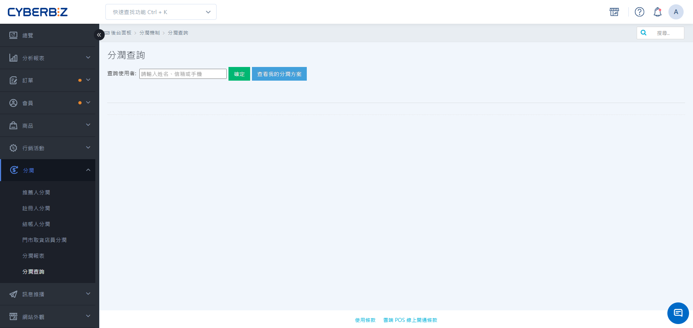
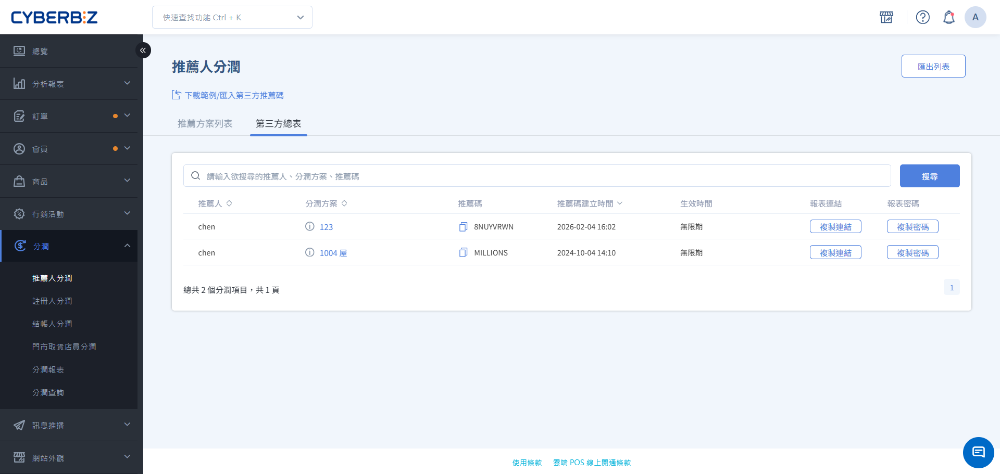

#  Allows You To Query Profit-sharing Partners And Codes.

lets you check the profit-sharing plans and exclusive codes of all profit-sharing partners (including external influencers, on-site members, and internal employees) in the backend at any time, so that you can provide promotional information to your partners at any time.
{ .subtitle }

[:lucide-layers:{ title="適用產品" }](../../resources/conventions#適用產品) | Brand Official Website / Smart POS
[:lucide-tag:{ title="適用方案" }](../../resources/conventions#適用方案) | Advanced / Expert / All PLUS / Enterprise
{ .doc-badge }

!!! tip " Application Scenarios "
	-  **Assist Partners in Obtaining Codes**: When a partner influencer forgets their exclusive referral code, the administrator can quickly retrieve and notify them.
	-  **Verify Program Binding Status**: Confirm whether a specific employee has been correctly added to the expected profit-sharing program.
	-  **Verify Referral Relationship**: When a customer reports an invalid referral, first verify that the referrer's code is correct.

## Instructions For Use

-  **Query Permissions**:
    -  **Website Owner**: Has the highest privileges and can query the profit-sharing information of **themselves** and **all other users**.
    -  **Collaborative Administrator**: Can only click **View my plan** to view information related to themselves.

## Operating Procedures

### Task 1: Check The Profit-sharing Information Of Partners

is used to query all entities that have joined a profit-sharing scheme.

1.  Log in to the CYBERBIZ management backend and go to **Profit Sharing > Referral Search**.
2.  If you are a **website owner**, you will see a search bar:
    -  Enter the partner's **name, email address**, or **mobile phone number** in the search box.
    -  The system will automatically display a list of matching results; select the target entity.
3.  The system will list all profit-sharing scheme information for that entity, including:
    -  **Profit-sharing type**: Referral profit-sharing, registration profit-sharing, etc.
    -  **Scheme name**: The specific scheme currently linked.
    -  **Profit-sharing code**: The entity's unique referral code or registration code within that scheme.
    - **Profit Sharing Ratio**: Corresponding online/offline commission percentage.

{ .screenshot }

### Task 2: Employees Can Check Their Own Profit-sharing Information.

is suitable for store staff or website administrators to check their promotional codes.

1. : After logging into the backend, employees can go to **Profit Sharing > Referral Search**.
2. : Click on **View my plan** on the page.
3. : The page will directly display all profit sharing plans currently belonging to the employee and their corresponding code links.

    > : Employees can directly click on the link icon to copy it, or generate a QR code for promotion.

### Task 3: Provide External Query Links For Third-party Recommenders
For external partners (such as group leaders and influencers), you can provide a dedicated link so they can instantly view results without accessing the backend. Go to **Profit Sharing > With Referrers** and click the **Third-Party Summary Report** tab. Find the designated partner, copy the **report link** and **password** from the page, and provide them to the referrer. This report will list all orders placed through the referral code (**including orders in unpaid or pending statuses**), allowing the referrer to track promotional progress. Before providing the report link to the referrer, please communicate in advance to explain that this report is for "performance tracking" reference only, and **the final profit sharing amount is still subject to the settlement data after the order is "closed".**

{ .screenshot }

## Next Steps

- :lucide-cable:{ .lg }
  [__Application of Referral Code Links__](referral-link-applications.en.md) 
   Master the integration techniques of referral links and marketing channels, including QR code creation, URL shortening, and UTM performance tracking.

