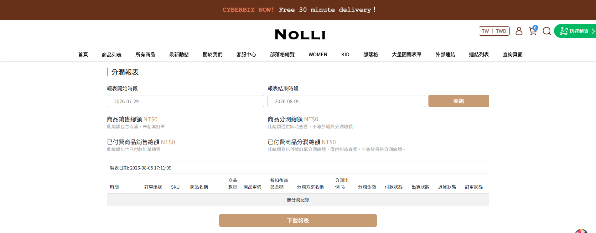
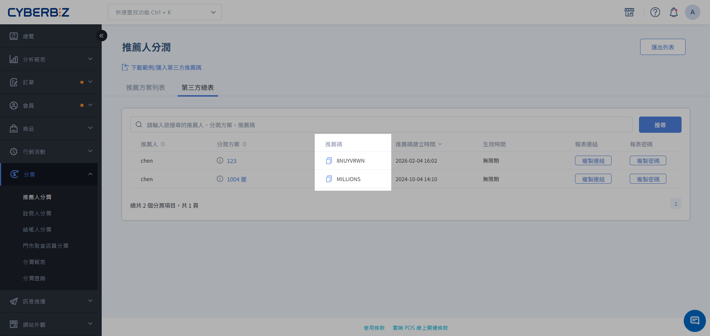

# Query Profit-Sharing Partners and Codes

View the profit-sharing plans and exclusive codes of all profit-sharing partners, including external influencers, site members, and internal employees, in the admin panel at any time. Use this information to provide partners with promotional details.
{ .subtitle }

[:lucide-layers:{ title="適用產品" }](../../resources/conventions#適用產品) | Brand Official Website / Smart POS
[:lucide-tag:{ title="適用方案" }](../../resources/conventions#適用方案) | Advanced / Expert / All PLUS Plans / Enterprise
{ .doc-badge }

!!! tip "Use Cases"
	- **Help partners retrieve codes**: When an influencer partner forgets their exclusive referral code, an administrator can quickly look it up and provide it.
	- **Check plan assignments**: Confirm whether a specific employee has been correctly added to the intended profit-sharing plan.
	- **Verify referral relationships**: When a customer reports that a referral did not work, first check whether the referrer's code is correct.

## Usage Notes

- **Query permissions**:
    - **Website owner**: Has the highest level of access and can view profit-sharing data for **themselves** and **all other users**.
    - **Collaborator**: Can only click **View my plan** to view data related to their own account.

## Procedure

### Task 1: Query a Partner's Profit-Sharing Information

Use this procedure to query anyone who has joined a profit-sharing plan.

1. Log in to the CYBERBIZ admin panel. Go to **Profit Sharing Referral Search**.
2. If you are the **website owner**, the search fields appear:
    - Enter the partner's **name, email address**, or **mobile number** in the search box.
    - The system automatically displays a list of matches. Click the target partner.
3. The system lists all profit-sharing plans in which the partner participates, including:
    - **Profit-sharing type**: Referral profit sharing, registration profit sharing, and other types.
    - **Plan name**: The specific plan currently assigned.
    - **Profit-sharing code**: The partner's exclusive referral or registration code for the plan.
    - **Profit-sharing percentage**: The corresponding online/offline commission percentage.

{ .screenshot }

### Task 2: Query an Employee's Own Profit-Sharing Information

Use this procedure when store staff or Brand Official Website editors need to query their own promotional codes.

1. After logging in to the admin panel, go to **Profit Sharing Referral Search**.
2. Click **View my plan** on the page.
3. The page directly displays all profit-sharing plans to which the employee currently belongs and the corresponding code links.

    > Click the link icon to copy a link, or generate a QR Code for promotion.

### Task 3: Provide an External Query Link to a Third-Party Referrer

=== "Merchant"

    For external partners such as group-buying organizers and influencers, provide an exclusive link that lets them check performance in real time without accessing the admin panel.

    1. Go to **Profit Sharing Referrer Profit Sharing**, then click the **Third-Party Overview** tab.
    2. Find the specified partner. Copy the **report link** and **password** on the page, then provide them to the referrer.

    { .screenshot }

=== "External partners such as group-buying organizers and influencers"

    After receiving the query information from the merchant, follow these steps to view promotional performance:

    1. Open the **report link** provided by the merchant and enter the corresponding **report password**.
    2. On the report page, view the information and status of orders placed using your referral code.

    { .screenshot }

!!! info "Reminder"
    This report lists all orders placed using a referral code, **including unpaid orders and orders that have not been closed**. This helps referrers track promotional activity in real time.

    This report is for performance tracking only. **The final profit-sharing amount is based on settlement data after the order is closed**.

### Task 4: Copy a Referral Code with One Click

The **Third-Party Overview** displays all third-party profit-sharing referrers in one place.

1. Go to **Profit Sharing Referrer Profit Sharing**, then click the **Third-Party Overview** tab.
2. Click the copy icon to copy the referrer's referral code with one click.

{ .screenshot }

## Next Steps

- :lucide-cable:{ .lg }
  [__Using Referral Code Links__](referral-link-applications.en.md) 
  Learn how to integrate referral links with marketing channels, including QR Code creation, short URL use, and UTM performance tracking.

 