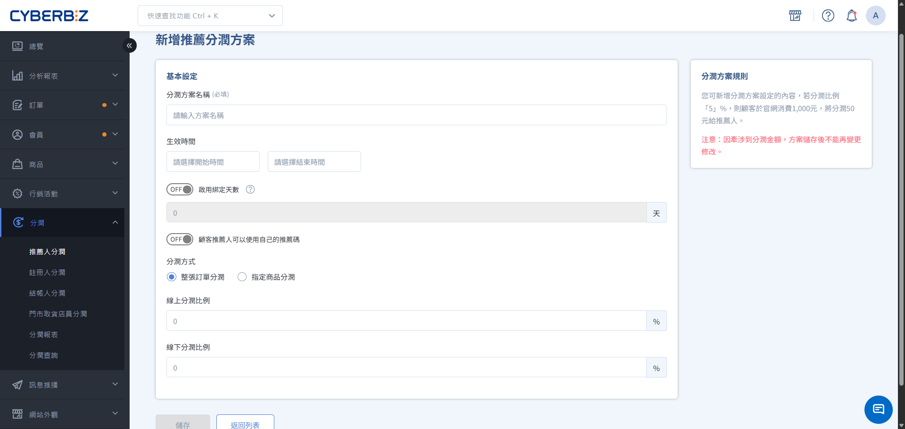
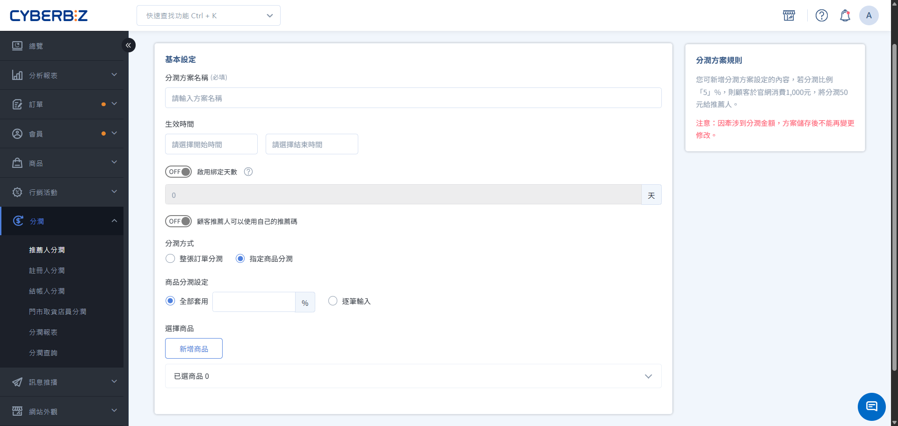

#  Referral Bonus:

allows you to set exclusive commission rates and consumer rewards for different partners (such as influencers, members, or employees) by establishing a referral bonus program.
{ .subtitle }

[:lucide-layers:{ title="適用產品" }](../../resources/conventions#適用產品) | Brand Official Website / Smart POS
[:lucide-tag:{ title="適用方案" }](../../resources/conventions#適用方案) | Advanced / Expert / All PLUS / Enterprise
{ .doc-badge }

 { .hero-page }

!!! tip " Application Scenarios "
	-  **Cross-Industry Cooperation**: Collaborate with bloggers or KOLs, providing exclusive profit-sharing links and tracking order performance.
	-  **Referral Program:** Encourages existing members to share their referral codes with friends, achieving a "referral bonus" for existing customers.
	-  **Internal Promotion:** Sets up unique referral codes for store staff, accurately attributing online traffic to the promoters.

## Instructions For Use

-  **Storage Limitation**: Once a revenue-sharing plan is created and saved, **the "Revenue-Sharing Ratio" and "Revenue-Sharing Method" cannot be modified.** To adjust the ratio, please create a new plan.
-  **Referral Binding Period**: Referral revenue sharing supports setting a "Binding Days". Within the set number of days, if a consumer makes another purchase using the same device and browser, the system will automatically use the same referral code.

## Operating Procedures

### Step 1: Establish A Profit-sharing Plan And Basic Settings
Log in to the CYBERBIZ management backend (
1. ) and go to **Profit Sharing > With Referrers**. (
2. ) Ensure that **Enable Revenue Sharing Function** has been switched to `ON`. (
3. ) Enable **Show referral code in checkout page**. (
4. ) Click **Create Plan** in the upper right corner. (
5. ) Fill in the following information in the **Basic Settings** section: (
    - ) **Revenue Sharing Plan Name**: Set the name used for management (e.g., 2026 Influencer Spring Collaboration). (
    - ) **Effective Date**: Set the start and end dates of the plan (leaving it blank means it takes effect immediately and has no expiration date). (
    - ) **Enable Binding Days**: Set the number of days the referral relationship will be retained in the consumer's browser.
      > ON – Binds a customer, meaning that the owner of this referral code will also receive a share of the profits from any subsequent orders placed by that customer.  
        OFF – This referral code is a one-time binding; the binding is cleared after an order is placed. You need to enter the referral code again or click the referral code's URL to generate profits again.
    -  **Customer referrers can use their own referral codes**: enable or disable as needed.

!!! tip " Profit Sharing Scheme Naming and Management "
     Please set the **scheme name** here, not a specific **referrer name**. You can consolidate rules with the same profit sharing ratio into a single scheme and then distribute the scheme to corresponding employees, third-party partners, or customers.

### Step 2: Select The Profit-sharing Method

=== " Order-wide Revenue Sharing "

     Calculated based on the total order amount (after deducting shipping costs).

    1.  **Online/Offline Revenue Sharing Ratio**: Enter the percentage of commission the referrer can receive.

        !!! info " POS System Compatibility Integration "
             **Offline Revenue Sharing** Function requires the CYBERBIZ POS system to function.
            
    { .screenshot }

=== " Specific Product Profit Sharing "

     Sets an independent profit sharing percentage only for specific products.

    1.  **Product Profit Sharing Setting**:
          -  **Apply to All**: Sets the same profit sharing percentage for all products.
          -  **Enter Each Item**: Sets an independent profit sharing percentage for each product.
    2.  **Select Product**: Click **Add Product**.
          -  If the merchant selected **Enter Each Item**, please continue to fill in the profit sharing percentage for each product.

    !!! info " Function Application Notes "
         **Profit sharing for specified products only applies to EC orders, and is only applicable to PLUS and Enterprise versions.**

    { .screenshot }

### Step 3: Set Up Consumer And Referrer Feedback
After saving the basic settings for
, you will be redirected to the **Rewards Settings** tab, where you can determine the two-way rewards mechanism:

1.  **Checkout Discount (Member)**: The discount available to consumers using a referral code for that transaction.
    -  **Discount Types**: You can choose between "amount" or "percentage" discounts.
    -  **Spending Threshold**: You can specify a minimum spending amount or have no minimum spending requirement.
    -  **Use with store-wide Discount, Optional Discount**: Choose whether to use it with [store-wide Discount] (../marketing/discounts/storewide-discounts.en.md) or [Optional Discount] (../marketing/discounts/mix-and-match-discounts.en.md).

        !!! warning " Scope of Application Restriction "
             This setting is only for specifying whether to use it with the **store-wide Discount** and **Optional Discount** marketing campaigns. This setting **does not apply to all marketing campaigns on the entire site**, and it is not possible to exclude or specify other unlisted campaigns.
    
    { .screenshot }

2.  **Give Coupons (Members)**: After a consumer reaches the threshold, the system automatically sends a coupon for the consumer to use next time.
    -  **Discount Type**: You can choose between "Amount" or "Percentage" discount.
    -  **Spending Threshold**: You can specify an amount threshold or have no amount limit.
    - **Validity Period**: Sets the expiration date of this coupon.
    - **Marketing Activity Restrictions**: No restrictions/Partial restrictions/Cannot be used with promotional activities.

    { .screenshot }

3. **Bonus (Member)**: Consumers receive a specified number of bonus points after reaching a certain spending threshold.
    - **Spending Threshold**: Sets the spending threshold at which bonuses will be awarded.
    - **Bonus Award**: Sets the bonus amount awarded after meeting certain conditions.
    - **Validity Period**: Sets the expiration date of this bonus.

    { .screenshot }

4. **Bonus (Customer Referrer)**: After a consumer reaches the threshold, the referrer can receive bonus points based on the order amount.
    - **Validity Period**: Sets the validity period of this bonus.

    { .screenshot }

    !!! info "Rules for Sending Bonuses to Referrers "
        - **Calculation Method**: The bonus points awarded are calculated according to the profit-sharing ratio set in the plan. For example, with a 5% commission and an order amount of :lucide-dollar-sign:800 yuan, 40 points will be awarded (:lucide-dollar-sign:800 × 5%). **Decimal Handling:** Any decimal points in the calculation result will be unconditionally discarded. **Query Path:** Referrers can query their points in the front-end member center; the point name will be displayed as `【訂單編號】分潤紅利`. **Return Processing:** Bonuses are only issued upon initial settlement; if a return (including partial returns) occurs, the system will fully reclaim the bonus. Subsequent settlements or returns will not result in reissue or reclaim of the bonus. **

**### Step 4: Bind The Referrer And Obtain The Code

Switch to the corresponding tab to bind your partners. One plan can include multiple partners simultaneously.

=== " Third-party list (influencers/group moms) "

     Applicable to external partners.

    === " Single addition "
    
        1.  Switch to the **Third-party list** tab and select **Add referrer**.
        2.  Enter the **referrer name**, and you can customize a unique **referral code** (if left blank, the system will generate a random one).
        3.  Select **Save**.
        4.  Click the **Copy Share Link** icon next to the list to get a shortened URL or QR code with a referral code.

    === " Batch Import "

        1.  Go to **Profit Sharing > With Referrers** and click the **Third Party Summary Table** tab.
        2.  Click **Download Sample/Import Third Party Referral Code** to get the Excel template.
        3.  After filling in the information, upload the file.

=== " Customer List (General Members) "

     Applicable for incentivizing existing members to share word-of-mouth. Switch to the **Customer List** tab and change **Enable Customer Referral Code Function** to `ON`. Select **Assign Customer Referral Codes**, search for and select the members you wish to add. Select **Join Program**. Members can view their unique referral codes on the front-end page (**會員中心 > 我的帳戶**). You can specify a program to apply to all new members. The employee list (") is suitable for employees or POS staff who have already created accounts in the system.
    
    1.  Switch to the **Employee List** tab.
    2.  Select **Add to Plan User**, filter by name, identity, or store.
    3.  Check the box and then select **Add to Plan**.

!!! info " Referral Code and Name Setting Rules "
    -  **Referral Code Format**: Supports up to 20 alphanumeric characters (including `-` and `_`), English letters are limited to **uppercase**. If not filled in, the system will automatically generate a random one.
    -  **Plan Binding Logic**: A single third-party referrer can join multiple plans and have different referral codes; however, within the same plan, the referrer can only have one set of referral codes.
    -  **Name Management Notes**:
        -  The system allows setting duplicate referrer names (e.g., multiple "Influencer A" names). Merchants are advised to use clear labeling (e.g., "Influencer A-FB", "Influencer A-IG") for easy identification.
        -  Once a referrer name is saved, it **cannot be deleted**. Please ensure its accuracy when setting it.

## Frequently Asked Questions
Why doesn't the referral code appear on the checkout page even though the customer clicked the referral link? Please check the following two points: **Is **Enable display of referral code field on checkout page** enabled in the plan settings?** If the customer previously clicked on someone else's link and it's within the **link duration**, the first referral will be retained. Can the referrer earn commission using their own referral code? This depends on your settings. In the plan's **Basic Settings**, you can control this permission through the **Customer Referrer Can Use Their Own Referral Code** switch. Does the **specified product profit sharing** model support offline POS orders? Currently, **specified product profit sharing is only applicable to online website (EC) orders.** Offline POS orders can only use the **whole order profit sharing** model.

??? quote "
