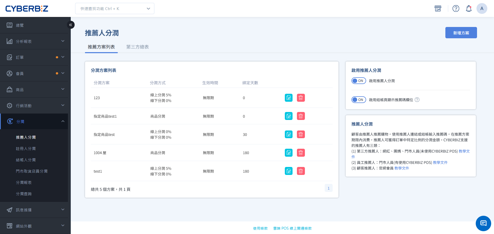

# Referral Program

Create an Referral Program plan to set custom sales commission rates and customer rewards for different partners, such as influencers, members, or employees.
{ .subtitle }

[:lucide-layers:{ title="適用產品" }](../../resources/conventions#適用產品) | Brand Official Website / Smart POS
[:lucide-tag:{ title="適用方案" }](../../resources/conventions#適用方案) | Advanced / Expert / All PLUS / Enterprise
{ .doc-badge }

{ .hero-page }

!!! tip "Use Cases"
	- **Cross-industry partnerships**: Partner with bloggers or KOLs, provide dedicated profit-sharing links, and track order performance.
	- **Member referrals**: Encourage existing members to share their Referral Code with friends and earn rewards for successful referrals.
	- **Internal promotion**: Assign each store employee an exclusive Referral Code to accurately attribute online referral sales to the employee.

## Before You Begin

- **Save restrictions**: After an Referral Plan is created and saved, the **Profit-Sharing Rate** and **Online/Offline/Product Commission** cannot be changed. Create a new plan to adjust the rate.
- **Referral Binding Period**: Referral Program supports the **Referral Binding Period** setting. If a customer makes another purchase on the same device and browser within the configured number of days, the system automatically applies the same Referral Code.

## Procedure

### Step 1: Create an Referral Plan and Configure Basic Settings

1. Log in to the CYBERBIZ Admin, then go to **Profit Sharing Referral Program**.
2. Ensure that **Enable Profit Sharing** is set to `ON`.
3. Open **Show referral code in checkout page**.
4. Click **Create Plan** in the top-right corner.
5. Enter the following information in the **Basic Settings** section:
    - **Referral Plan Name**: Enter a name for administrative use, such as 2026 Influencer Spring Partnership.
    - **Effective Date**: Set the plan's start and end dates. Leave these fields blank for the plan to take effect immediately with no expiration date.
    - **Enable Referral Binding Period**: Set the number of days the referral relationship remains stored in the customer's browser.
      > ON – Bind the customer so that profit sharing from future orders is credited to the owner of this Referral Code. 
        OFF - Bind this Referral Code once and remove the binding after the order is placed. Enter the Referral Code again or click the Referral Code URL to generate profit sharing again.
    - **Customers with an Referrer can use their own Referral Code**: Turn this setting on or off as needed.

!!! tip "Referral Plan Naming and Management"
    Enter a **Plan Name** here, not the name of a specific **Referrer**. Group rules with the same profit-sharing rate into one plan, then assign the plan to the relevant employees, third-party partners, or customers.

### Step 2: Select Online/Offline/Product Commission

=== "Profit Sharing for the Entire Order"

    Calculate profit sharing as a percentage of the order total after shipping fees are deducted.

    1. **Online/Offline Profit-Sharing Rate**: Enter the commission percentage that the Referrer receives.

        !!! info "POS System Compatibility"
            **Offline Profit Sharing** requires the CYBERBIZ POS system.

    { .screenshot }

=== "Profit Sharing for Specific Products"

    Set separate profit-sharing rates for specific products only.

    1. **Product Profit-Sharing Settings**:
          - **Apply to All**: Set the same profit-sharing percentage for all products.
          - **Enter Individually**: Set a separate profit-sharing percentage for each product.
    2. **Select Products**: Click **Add Product**.
          - If **Enter Individually** is selected, continue entering the profit-sharing percentage for each product.

    !!! info "Availability"
        **Profit sharing for specific products applies only to EC orders and is available only for PLUS and Enterprise plans.**

    { .screenshot }

### Step 3: Configure Rewards for Customers and Referrer

After saving the basic settings, go to the **Reward Settings** tab to configure rewards for both parties:

1. **Checkout Discount (Member)**: Set the discount for customers who use an Referral Code on the current order.
    - **Discount Type**: Select a fixed-amount or percentage discount.
    - **Minimum Spend**: Set a minimum purchase amount or no minimum.
    - **Combine with store-wide discount and Mix-and-Match Discounts**: Select whether this reward can be used with [store-wide discount](../marketing/discounts/storewide-discounts.en.md) and [Mix-and-Match Discounts](../marketing/discounts/mix-and-match-discounts.en.md).

        !!! warning "Scope Restrictions"
            This setting only determines whether the reward can be combined with the **store-wide discount** and **Mix-and-Match Discounts** marketing campaigns. It does **not apply to all marketing campaigns across the site**. Other unlisted campaigns cannot be excluded or selected.

    { .screenshot }

2. **Send coupon (Member)**: After the customer meets the threshold, the system automatically sentcoupon for use on a future purchase.
    - **Discount Type**: Select a fixed-amount or percentage discount.
    - **Minimum Spend**: Set a minimum purchase amount or no minimum.
    - **Validity Period**: Set the validity period of the coupon.
    - **Marketing Campaign Combination Restrictions**: No restrictions/partial restrictions/cannot be combined with promotional campaigns.

    { .screenshot }

3. **Send Bonus Points (Member)**: After the customer meets the threshold, they receive the specified bonus points.
    - **Minimum Spend**: Set the purchase threshold for awarding bonus points.
    - **Bonus Points Awarded**: Set the number of bonus points awarded after the conditions are met.
    - **Validity Period**: Set the validity period of the bonus points.

    { .screenshot }

4. **Send Bonus Points (Customer Referrer)**: After the customer meets the threshold, the Referrer receives bonus points based on a percentage of the order amount.
    - **Validity Period**: Set the validity period of the bonus points.

    { .screenshot }

    !!! info "Rules for Sending Bonus Points to Referrer"
        - **Calculation**: The bonus points awarded is calculated using the plan's profit-sharing rate. For example, if the profit-sharing rate is 5% and the order amount is :lucide-dollar-sign:NT$800, 40 points are awarded (:lucide-dollar-sign:800 × 5%).
        - **Decimal Handling**: Any decimal portion of the calculated result is discarded.
        - **Where to Check**: The Referrer can check the points in the storefront Member Center. The points are labeled `【訂單編號】分潤紅利`.
        - **Returns**: Bonus points are issued only when the order is closed for the first time. If a full or partial return occurs, the system revokes all bonus points from the order. If the order is closed or returned again, the system does not reissue or revoke any points.

### Step 4: Bind Referrers and Obtain Codes

Go to the tab for the relevant partner type and bind the referrer. One plan can include multiple partner types.

=== "Third-Party List (Influencers/Group-Buying Organizers)"

    For external partners.

    === "Add Individually"

        1. Go to the **Third-Party List** tab and click **Add Referrer**.
        2. Enter the **Referrer Name** and optionally customize the dedicated **Referral Code**. If left blank, the system generates one at random.
        3. Click **Save**.
        4. Click the **Copy Sharing Link** icon next to the list entry to obtain a short URL or QR code containing the Referral Code.

    === "Batch Import"

        1. Go to **Profit Sharing Referral Program**, then click the **Third-party Referrer List** tab.
        2. Click **Download Sample / Upload Referral Codes** to download the Excel template.
        3. Complete the required information, then upload the file.

=== "Customer List (General Members)"

    For encouraging existing members to share recommendations.

    1. Go to the **Customer List** tab and set **Enable Customer Referral Code** to `ON`.
    2. Click **Assign Customer Referral Code**, Search, and select the members to add.
    3. Click **Add to Plan**.
    4. Members can view their dedicated Referral Code on the storefront under **Member Center My Account**.
    5. Assign a specified plan to all new members.

=== "Employee List (Store Staff)"
    For employees or POS staff with existing system accounts.

    1. Go to the **Employee List** tab.
    2. Click **Add Plan User**, then filter employees by name, identity, or store.
    3. Select the employees, then click **Add to Plan**.

!!! info "Referral Code and Name Setting Rules"
    - **Referral Code Format**: Supports up to 20 alphanumeric characters, including `-` and `_`. Letters must be **uppercase**. If left blank, the system generates one at random.
    - **Plan Binding Logic**: A single third-party Referrer can join multiple plans and have different Referral Code. However, within the same plan, the Referrer can have only one Referral Code.
    - **Name Management Notes**:
        - The system allows duplicate Referrer names, such as multiple entries named "Influencer A." Use clear labels, such as "Influencer A-FB" and "Influencer A-IG," to distinguish them.
        - After an Referrer name is saved, it **cannot be deleted**. Confirm that the name is correct before saving.

## FAQ

??? quote "Why doesn't the Referral Code appear at checkout after the customer clicks the referral link?"
    Check the following:

    1. Confirm that **Show referral code in checkout page** is enabled in the plan settings.
    2. If the customer previously clicked another person's link and is still within the **Referral Binding Period**, the first referrer's information is retained.

??? quote "Can an Referrer use their own Referral Code to earn profit sharing?"
    This depends on the settings. Under **Basic Settings** in the plan, use the **Customers with an Referrer can use their own Referral Code** toggle to control this permission.

??? quote "Does **Profit Sharing for Specific Products** support offline POS orders?"
    Currently, **profit sharing for specific products applies only to online Brand Official Website (EC) orders**. Offline POS orders support only the **Profit Sharing for the Entire Order** mode.

