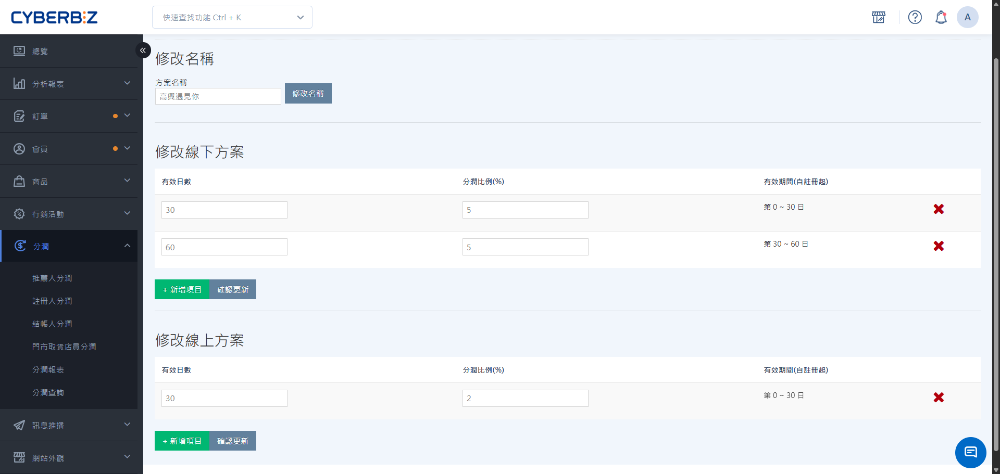
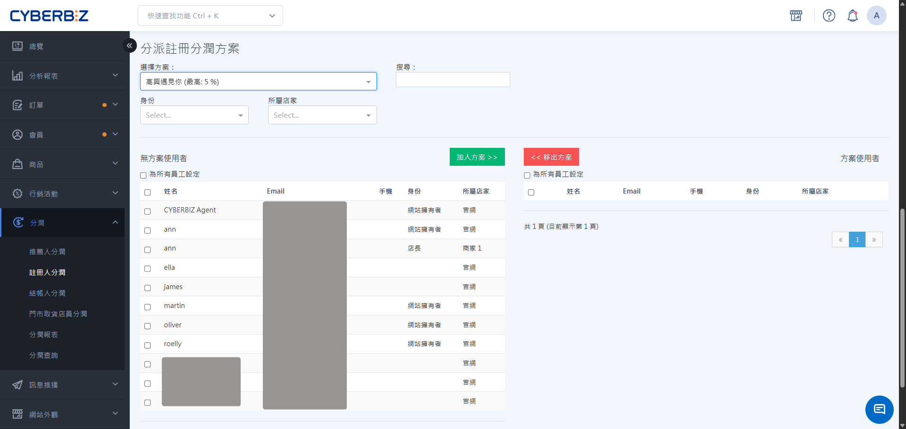

#  And

adopt a "permanent binding" profit-sharing mechanism. When a customer enters a specific registrant code during registration, the system will automatically calculate and distribute profits to the code owner for all future purchases made by that customer on the official website or in physical stores.
{ .subtitle }

[:lucide-layers:{ title="適用產品" }](../../resources/conventions#適用產品) | Brand Official Website / Smart POS
[:lucide-tag:{ title="適用方案" }](../../resources/conventions#適用方案) | Expert / All PLUS / Enterprise
{ .doc-badge }

{ .hero-page }

!!! tip " Application Scenarios "
	-  **Store Promotion Development**: Store clerks guide customers into the store to register as members of the official website and bind their clerk codes to ensure that the performance of the customer's future repurchases can be attributed to the clerk.
	-  **Long-Term Distribution Cooperation**: Partner with a distribution network where new members developed by your partner will form a long-term relationship, generating continuous development rewards.
	-  **Phased Incentives**: Set a high commission rate for the first month after registration, decreasing in subsequent months to incentivize promoters to actively drive sales during the initial registration period.

## Instructions For Use

-  **Permanent Binding**: Once bound, the registrant code **cannot be changed**, and all future online and offline orders from customers will be associated with that registrant.
-  **POS Restriction**: Currently, filling in the registrant code is not supported when using the **Quick Registration** function of a store POS.
-  **Identity Restriction**: To set a person as a registrant, that person must have the identity of a **website administrator** or a **store employee**.

## Operating Procedures

### Step 1: Enable The Feature And Establish The Plan
Log in to the CYBERBIZ management backend and go to **Profit Sharing > With Registrants**. Switch the **Enable Registrant Profit Sharing Function** to `ON`. Enter the profit sharing plan name below and click **Add Plan**. In the **Registrant Profit Sharing Plan Overview** list, click **Edit** next to the plan you want to edit.### Step 2: Set The Profit-sharing Ratio For Different Tiers

You can set different profit-sharing ratios for different stages for the **online website** and **offline stores**.

1.  On the plan editing page, click **Profit Sharing > With Registrants**.
2.  Fill in the following information:
    -  **Valid Days**: Set the number of days after registration for this ratio to apply.
    -  **Profit-Sharing Ratio**: Enter the corresponding commission percentage.
3.  If you need to set multiple levels, you can click **Add Project** again.

    !!! example " Example Settings "
        -  First transaction: Valid Days `30` days, Profit-Sharing Ratio `5` %.
        -  Second transaction: Valid days `60` days, profit sharing ratio `2` %.
         **Effect**: For purchases made by customers on days 0-30 after registration, the registrant receives 5%; for purchases made on days 31-60, the registrant receives 2%.
        
4.  After setting, click **Save** at the bottom of the page.

!!! info " POS system compatibility integration "
     **Registrant Profit Sharing List** function requires the CYBERBIZ POS system to function.

{ .screenshot }

### Step 3: Assign Registrants And Codes

assigns profit-sharing schemes to specific employees or stores to generate unique registrant codes.

1.  Go to **Profit Sharing > With Registrants** and click the **Assign Registration Profit-Sharing Scheme** section at the bottom of the page.
2.  Select the **scheme** to be assigned.
3.  Filter by **identity** (e.g., store manager, employee) or **affiliated store** according to your needs.
4.  Check the personnel you want to add and click **Join Scheme**.
    >  If not using POS functionality, the personnel must be set as **website administrators** to be selected.

{ .screenshot }

## Frequently Asked Questions

??? quote " Can the code be filled in after the customer registers and the binding can be done later? "
     No. The registrant binding must be done by filling in the code at the **time of registration**. Once the account is created, the system does not support filling in or changing the registrant information.

??? quote " How is the registrant's profit share calculated for offline store consumption? "
     Two conditions must be met:

    1.  The customer has already bound the registrant.
    2.  The merchant uses the CYBERBIZ POS function and the **offline plan** ratio has been set in the plan.

     When a customer reports their phone number at checkout (to identify a member), the system automatically compares it with the linked registrant and calculates commission.

??? quote " If an employee is in multiple registrant programs simultaneously, will the referral code be the same? "
     Employees may have different referral codes in different programs, but it is generally recommended that one person correspond to one specific program to avoid confusion in performance statistics.

---

