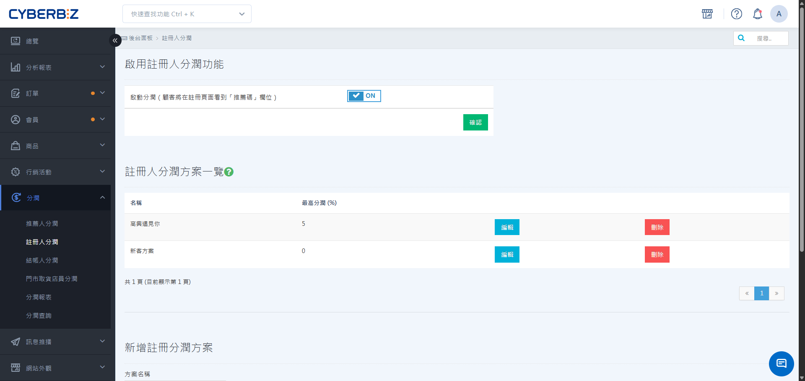
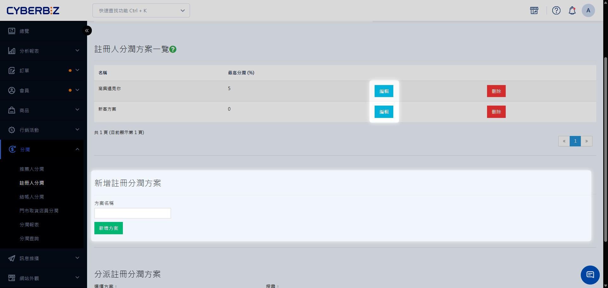

# Registrants Fee

Registrants Fee uses permanent binding. When a customer enters a specific registrant code during registration, the system automatically calculates profit sharing for the code owner whenever the customer makes a future purchase through the Brand Official Website or at a physical store.
{ .subtitle }

[:lucide-layers:{ title="適用產品" }](../../resources/conventions#適用產品) | Brand Official Website / Smart POS
[:lucide-tag:{ title="適用方案" }](../../resources/conventions#適用方案) | Expert / All PLUS / Enterprise
{ .doc-badge }

{ .hero-page }

!!! tip "Use Cases"
	- **In-store customer acquisition**: Store staff help in-store customers register as Brand Official Website members and bind their accounts to the staff member's code. This ensures that revenue from the customers' future purchases is attributed to that staff member.
	- **Long-term distributor partnerships**: New members acquired by distribution partners are permanently bound to those partners, allowing the partners to continue earning acquisition rewards.
	- **Phased incentives**: Set a high commission rate for the first month after registration and lower rates for subsequent months. This encourages promoters to actively drive purchases soon after customers register.

## Important Notes

- **Permanent binding**: Once a registrant code is bound, it **cannot be changed**. All future online and in-store orders from the customer are associated with that registrant.
- **POS limitation**: The **Quick Registration** feature in the in-store POS currently does not support entering a registrant code.
- **Role requirement**: A person must be a **Website Administrator** or **Store Staff** member to be designated as a registrant.

## Procedure

### Step 1: Enable the Feature and Create a Plan

1. Log in to CYBERBIZ Admin and go to **Profit Sharing Registrants Fee**.
2. Switch **Active Registrant Profit Sharing Feature** to `ON`.
3. Enter the profit-sharing Plan name below, then click **Add Plan**.
4. In the **Registrant Profit Sharing List** list, click **Edit** next to the plan to edit.

{ .screenshot }

### Step 2: Set Tiered Profit-Sharing Rates

Set different phased profit-sharing rates for the **Online Store** and **Physical Store**.

1. On the plan editing page, click **Add Item**.
2. Enter the following information:
    - **Valid Days**: Set the number of days after registration during which this rate applies.
    - **Profit-Sharing Rate**: Enter the corresponding commission percentage.
3. To add more tiers, click **Add Item** again.

    !!! example "Example Configuration"
        - First entry: Valid Days: `30`; Profit-Sharing Rate: `5`%.
        - Second entry: Valid Days: `60`; Profit-Sharing Rate: `2`%.
        **Result**: For purchases made within days 0–30 after registration, the registrant earns 5%. For purchases made within days 31–60, the registrant earns 2%.
        
4. After completing the settings, click **Save** at the bottom of the page.

!!! info "POS System Compatibility"
    The **Offline Profit Sharing** feature requires the CYBERBIZ POS system.

{ .screenshot }

### Step 3: Assign Registrants and Codes

Assign a profit-sharing plan to specific employees or stores to generate unique registrant codes.

1. Go to **Profit Sharing Registrants Fee**, then click the **Assign Registrant Profit Sharing Plan** section at the bottom of the page.
2. Select the **Plan** to assign.
3. Filter by **Role** (such as Store Manager or Store Staff) or **Assigned Store**, as needed.
4. Select the people to add, then click **Add to Plan**.
    > If the POS feature is not used, a person must be a **Website Administrator** to be selected.

{ .screenshot }

## FAQ

??? quote "Can a code be added and bound after a customer registers?"
    No. A registrant code must be entered **during registration** for the binding to take effect. After the account is created, the system does not support adding or changing registrant information.

??? quote "How is Registrants Fee calculated for purchases at a physical store?"
    Both of the following conditions must be met:

    1. The customer is bound to a registrant.
    2. The merchant uses the CYBERBIZ POS feature and has configured an **Offline Plan** rate in the plan.

    When a customer provides a phone number at in-store checkout for member identification, the system automatically matches the bound registrant and calculates profit sharing.

??? quote "If an employee is included in multiple registrant plans, will the referral code be the same?"
    An employee may have different referral codes for different plans. However, assigning each person to one clearly defined plan is generally recommended to avoid confusion in performance reporting.

---

