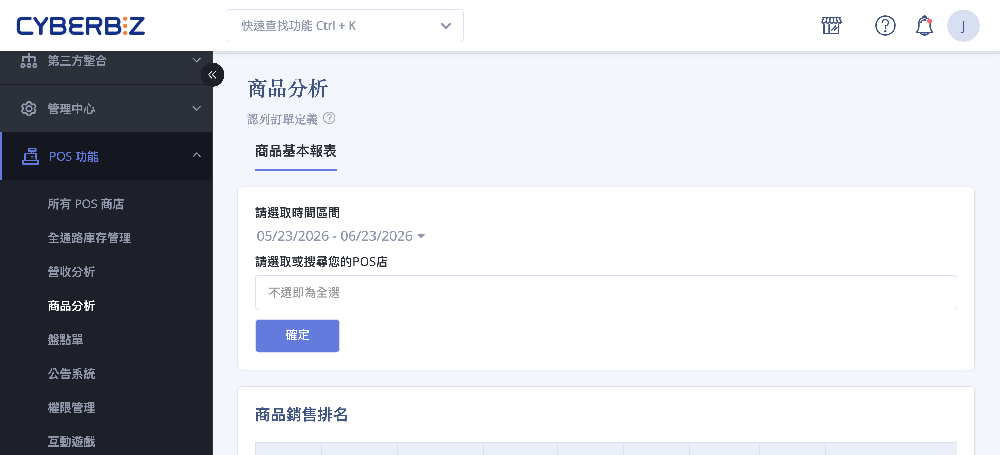
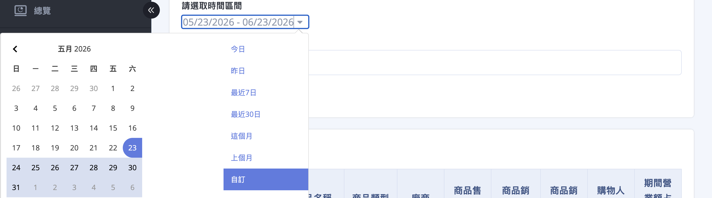
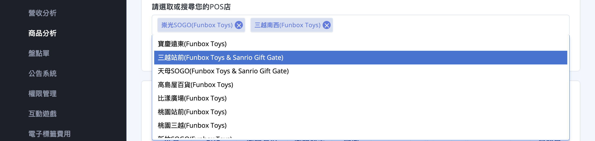
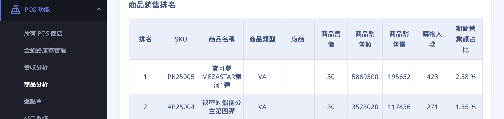
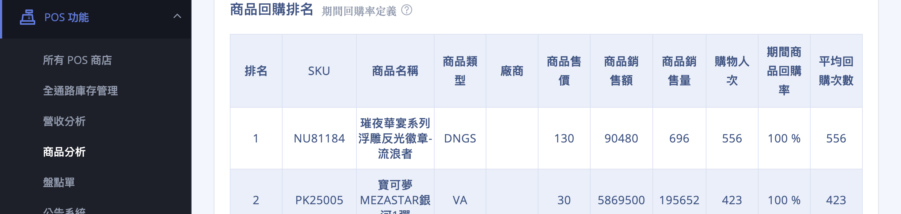
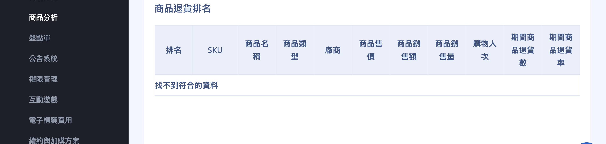

{ title="POS 商品分析頁面" .hero-page }

## POS 商品分析說明 { #intro-pos-product }

「商品分析」協助您觀察各 POS 實體門市在一段期間內的商品銷售狀況，從銷售額、銷售量、購物人次，到回購與退貨表現，作為門市選品、補貨與行銷的依據。

報表依分析主題分為三張排名表：「商品銷售排名」、「商品回購排名」與「商品退貨排名」。您可以指定時間區間並選擇一家或多家 POS 門市，系統會列出符合條件的商品排名。

!!! info "提示"
    本頁數據為每日批次更新、非即時，當天剛成立的訂單可能要等下次更新才會出現。報表所有數字僅計入非取消訂單，詳見[認列訂單定義](#specs-pos-product-order-recognition){ title="認列訂單定義" }。

## 頁面功能總覽 { #overview-pos-product }

| 報表 | 看什麼 | 主要用途 |
| :-- | :-- | :-- |
| [商品銷售排名](#商品銷售排名) | 各商品的銷售額、銷售量、購物人次與期間營業額占比 | 找出帶來最多營收的明星商品 |
| [商品回購排名](#商品回購排名) | 各商品的期間商品回購率與平均回購次數 | 找出顧客願意一買再買的商品 |
| [商品退貨排名](#商品退貨排名) | 各商品的期間商品退貨數與期間商品退貨率 | 留意退貨率偏高、需要檢討的商品 |

## 使用前提與限制 { #prerequisites-pos-product }

### 開通條件 { #prerequisites-pos-product-plan }

- [x] **使用 CYBERBIZ POS**：「商品分析」位於後台「POS 功能」選單下，需要您的商店已開通並使用 CYBERBIZ POS，選單才會出現。
- [x] **方案包含圖表分析功能**：本報表屬於 CYBERBIZ 的圖表分析（數據分析）功能，需方案已包含圖表分析才能開啟報表內容。

!!! plan "方案 / 開通條件"
    若您已使用 POS、卻在「POS 功能」選單中找不到「商品分析」，或點進頁面顯示無權限，代表目前方案尚未包含圖表分析功能。實際開通內容請以方案合約為準，或聯絡您的開店顧問與客服確認。

---

### 數據基準 { #prerequisites-pos-product-basis }

- **僅計非取消訂單**：報表所有數字僅計入非取消訂單，已取消的訂單會從取消當日的營業額扣除。詳見[認列訂單定義](#specs-pos-product-order-recognition){ title="認列訂單定義" }。
- **每日批次更新**：數據為每日批次更新、非即時，當天剛成立的訂單與退貨可能尚未反映在報表中。

## 操作步驟 { #operate-pos-product }

### 查詢並檢視商品排名 { #operate-pos-product-query }

進入頁面後，系統會先以「最近一個月、全部門市」自動載入一次報表[^default]。您可以重新設定條件再查詢：

1. **進入報表：** 前往後台「**POS 功能**」>「**商品分析**」。
2. **選取時間區間：** 點擊「請選取時間區間」的日期欄位，選擇要分析的起訖日期。系統提供「今日」、「昨日」、「最近 7 日」、「最近 30 日」、「這個月」、「上個月」等快捷選項，也可在行事曆上自訂區間，選好後按 **「套用」**。

    { title="選取時間區間" }

3. **選擇 POS 門市：** 在「請選取或搜尋您的POS店」欄位點選或輸入門市名稱，可同時選擇多家門市一起比較；若不選任何門市，系統會自動納入全部 POS 門市[^allstores]。

    { title="選擇 POS 門市" }

4. **執行查詢：** 點擊 **「確定」**，系統即依設定條件重新載入下方三張排名報表。
5. **檢視排名報表：** 下方會依序顯示三張報表，每張每頁顯示 30 筆，可使用表格下方的頁碼翻頁：
    * **商品銷售排名**：以「商品銷售額」由高至低排名，掌握帶來最多營收的商品。
      { #商品銷售排名 }
    * **商品回購排名**：觀察各商品的「期間商品回購率」與「平均回購次數」，找出顧客願意一買再買的商品[^repurchase]。
      { #商品回購排名 }
    * **商品退貨排名**：觀察各商品的「期間商品退貨數」與「期間商品退貨率」，留意退貨偏高的商品。
      { #商品退貨排名 }

    === "商品銷售排名"

        { title="商品銷售排名" }

    === "商品回購排名"

        { title="商品回購排名" }

    === "商品退貨排名"

        { title="商品退貨排名" }

三張報表的完整欄位說明，請見[共同欄位對照表](references/pos-product-metrics-reference.md#reference-pos-product-common){ data-preview }與[各報表專屬指標](references/pos-product-metrics-reference.md#reference-pos-product-special){ data-preview }。

[^default]: 進入頁面時預設帶入「最近一個月」的區間並涵蓋全部門市，您可再依需求調整條件後重新查詢。
[^allstores]: POS 門市欄位的提示文字為「不選即為全選」，留空即代表納入全部門市。
[^repurchase]: 「期間商品回購率」的定義為：購買此商品兩次以上之顧客數 ÷ 購買過此商品之顧客數。

## 重要規範與限制 { #specs-pos-product }

### 認列訂單定義 { #specs-pos-product-order-recognition }

- 本報表僅計入「非取消訂單」。
- 被取消的訂單不計入購買數量與購買次數；訂單成立當天仍保留訂單金額，並從取消當日的營業額扣除。

---

### 回購率定義 { #specs-pos-product-repurchase }

- 「期間商品回購率」＝購買此商品兩次以上之顧客數 ÷ 購買過此商品之顧客數。
- 數值反映該商品在所選期間內讓顧客重複購買的能力，比率越高代表回購表現越好。

---

### 預設條件與顯示 { #specs-pos-product-display }

- 進入頁面預設顯示「最近一個月」、「全部門市」的資料。
- 數據為每日批次更新、非即時，當天剛成立的訂單可能要等下次更新才會出現。
- 每張報表每頁顯示 30 筆，超過時以表格下方的頁碼翻頁。

## 後續操作 { #next-steps-pos-product }

- :lucide-store:{ .lg }  
  [__OMO 分析報表__](../../ec/business-intelligence/omo-analysis-report.md){ title="OMO 分析報表" }  
  比較線上官網（EC）與實體門市（POS）的營收、訂單與商品表現。

- :lucide-package:{ .lg }  
  [__商品圖表__](../../ec/business-intelligence/product-chart.md){ title="商品圖表" }  
  觀察單一商品每日的瀏覽、購買與成交轉換趨勢。

- :lucide-clipboard-list:{ .lg }  
  [__訂單分析__](../../ec/business-intelligence/order-analysis.md){ title="訂單分析" }  
  從訂單角度檢視門市與通路的整體經營健康度。

## 常見問題 { #faq-pos-product }

??? quote "在後台選單找不到「商品分析」？"
    { #faq-pos-product-menu-missing }
    「商品分析」位於「POS 功能」選單下，需要同時符合兩個條件才會出現並可使用：

    - 商店已開通並使用 CYBERBIZ POS。
    - 方案已包含圖表分析（數據分析）功能。

    若您已使用 POS 卻仍看不到或無法進入，請洽詢您的開店顧問或客服確認方案內容。

??? quote "報表數字和「訂單管理」看到的金額對不起來？"
    { #faq-pos-product-number-mismatch }
    本報表有固定的[認列訂單定義](#specs-pos-product-order-recognition){ title="認列訂單定義" data-preview }：僅計入非取消訂單，且被取消的訂單會從取消當日的營業額扣除，因此營業額會與即時的訂單列表略有差異，屬於正常現象。此外數據為每日批次更新，當天剛成立的訂單可能尚未反映。

??? quote "「期間商品回購率」是怎麼計算的？"
    { #faq-pos-product-repurchase-rate }
    回購率的計算方式為：購買此商品兩次以上之顧客數 ÷ 購買過此商品之顧客數。詳見[回購率定義](#specs-pos-product-repurchase){ title="回購率定義" }。

??? quote "要怎麼一次看到所有門市的銷售？"
    { #faq-pos-product-select-all }
    在「請選取或搜尋您的POS店」欄位不要選取任何門市即可，系統會自動納入全部 POS 門市（欄位提示文字為「不選即為全選」）。

??? quote "可以把報表匯出成 Excel 嗎？"
    { #faq-pos-product-export }
    此報表頁面未提供匯出按鈕。若需要保存分析結果，可框選表格內容後複製，再貼到 Excel 等試算表工具中整理。

## 參考資料 { #reference-pos-product }

- [POS 商品分析對照表](references/pos-product-metrics-reference.md#reference-pos-product-common)
