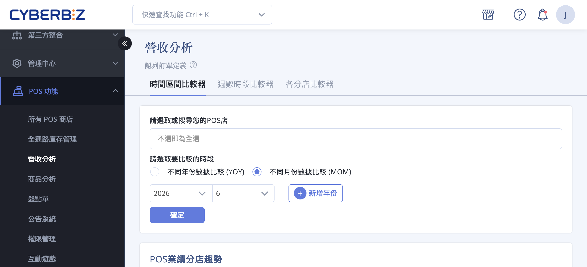{ .hero-page }

## POS 營收分析說明 { #intro-pos-revenue }

「POS 營收分析」把您旗下各 POS 實體門市的營業數據集中在同一個頁面，讓您不需要逐店切換，就能比較不同門市、不同時間的營業表現，找出績效優劣與成長機會。

頁面提供三種「比較器」，分別從不同角度切入分析。您可以自由選取要納入的門市與時間區間，系統會以圖表與排名表呈現營業額、訂單數、平均客單價、消費人數與人均消費額等核心指標。各指標的意義與計算方式，請參考[指標對照表](references/pos-revenue-metrics-reference.md#reference-pos-revenue-metrics){ data-preview }。

## 使用前提與限制 { #prerequisites-pos-revenue }

### 開通條件 { #prerequisites-pos-revenue-plan }

!!! plan "方案 / 開通條件"
    使用「POS 營收分析」需同時符合以下兩項條件：

    - [x] **已開通 CYBERBIZ POS**：報表才會出現在後台「POS 功能」選單下，並呈現實體門市的數據。
    - [x] **方案支援數據總覽分析**：支援的方案包含高手版、高手PLUS 版、專業PLUS 版、進階PLUS 版、企業版，以及 POS 獨賣方案。

    實際開通狀態請以方案合約為準，或聯絡您的開店顧問。

---

### 數據基準 { #prerequisites-pos-revenue-basis }

- **僅計入認列訂單**：報表所有數字僅計入認列訂單，已取消、需退貨的訂單不列入。詳見[認列訂單定義](#specs-pos-revenue-counted-orders){ title="認列訂單定義" data-preview }。
- **非即時更新**：數據為批次彙整，當天剛成立的訂單不會即時出現，通常需待隔日才會完整呈現。

## 頁面功能總覽 { #overview-pos-revenue }

進入頁面後，可在上方切換以下三種比較器：

| 比較器 | 適合分析 | 呈現方式 |
| :-- | :-- | :-- |
| 時間區間比較器 | 同一批門市在不同年份或不同月份的營業趨勢 | POS 業績分店趨勢圖（折線圖） |
| 週數時段比較器 | 一段期間內各星期、各時段的營業分布 | 星期週數業績表＋時段銷售累計圖 |
| 各分店比較器 | 所有門市在指定區間的營業排名 | 業績比較排名表 |

三種比較器都共用同一組營業指標：營業額、訂單數、平均客單價、消費人數、人均消費額。各指標意義見[指標對照表](references/pos-revenue-metrics-reference.md#reference-pos-revenue-metrics){ data-preview }。

## 操作步驟 { #operate-pos-revenue }

!!! path "進入後台路徑：「POS 功能」>「營收分析」，再依分析需求切換比較器。"

### 時間區間比較器 <small>比較年度或月份趨勢</small> { #operate-pos-revenue-window }

適合比較同一批門市在不同年份（YOY）或不同月份（MOM）的營業趨勢。

1. **選取 POS 店：** 在「請選取或搜尋您的POS店」欄位選擇要納入的門市，可同時選取多家；不選取則預設涵蓋全部門市。

    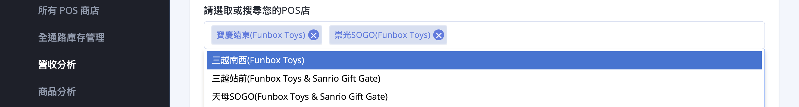

2. **選擇比較類型：** 在「請選取時間區間」選擇 **「不同年份數據比較（YOY）」** 或 **「不同月份數據比較（MOM）」**。

    

3. **新增比較區間：** 點擊 **「＋ 新增年份」**（或新增月份）加入要對比的年份或月份，最多可選擇 10 組[^1]。

    

4. **送出查詢：** 點擊 **「確定」**，下方的「POS 業績分店趨勢」圖表即會載入。
5. **切換指標：** 點選圖表上方的 **「營業額」**、**「訂單數」**、**「平均客單價」**、**「消費人數」**、**「人均消費額」** 按鈕，即可切換查看不同指標的趨勢折線圖。

    === "營業額"

        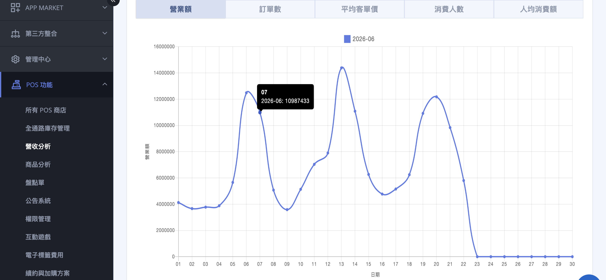

    === "訂單數"

        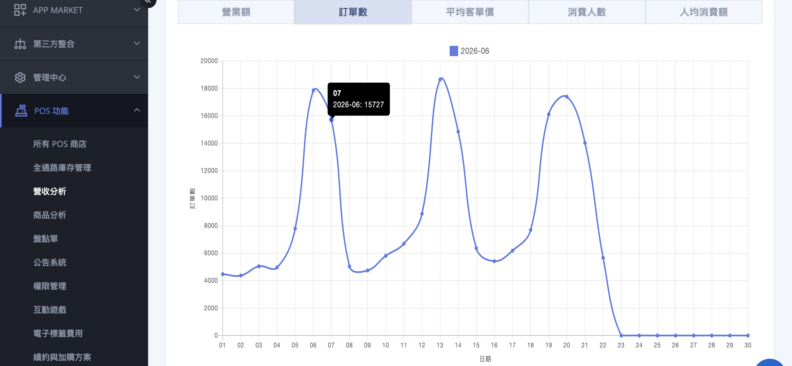

    === "平均客單價"

        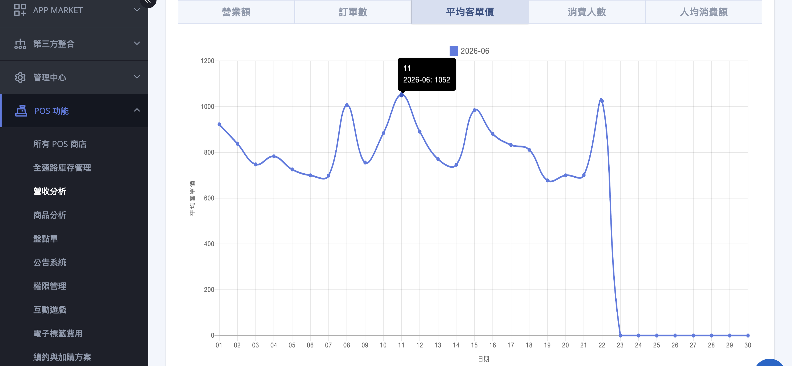

    === "消費人數"

        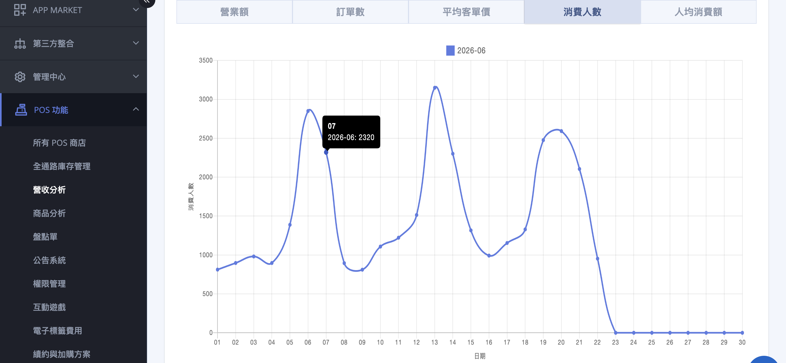

    === "人均消費額"

        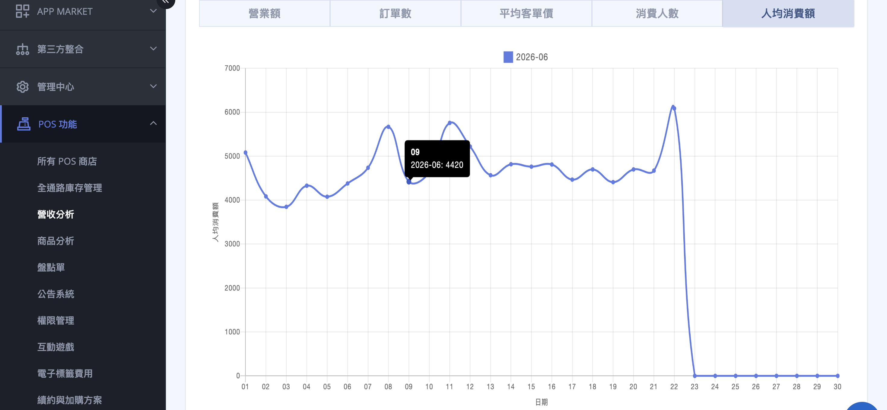

[^1]: 超過 10 組會跳出提醒「至多選擇 10 組 年份/月份」。

---

### 週數時段比較器 <small>分析星期與時段分布</small> { #operate-pos-revenue-week }

適合分析一段期間內，營業集中在哪些星期、哪些時段，協助安排人力與檔期。

1. **選擇時間區間：** 在「請選取時間區間」選擇要分析的起訖日期，區間不得超過三個月[^2]。

    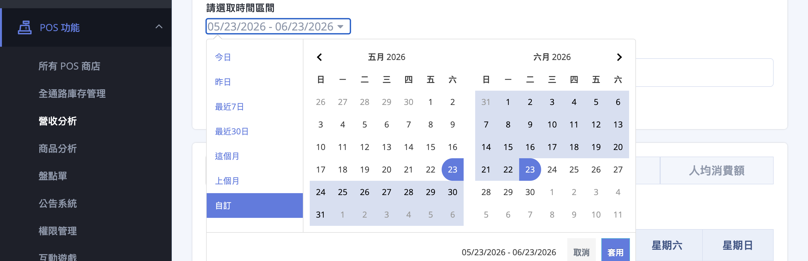

2. **選取 POS 店：** 在「請選取或搜尋您的POS店」欄位選擇要納入的門市，可同時選取多家；不選取則預設涵蓋全部門市。

    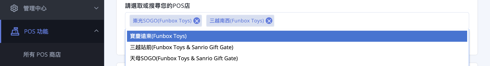

3. **送出查詢：** 點擊 **「搜尋」**。
4. **查看星期週數業績表：** 上方的「星期週數業績表」會列出各星期（週一至週日）的營業指標，可比較週間的客流與營收分布。

    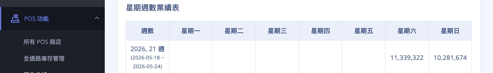

5. **查看時段銷售累計：** 下方的「時段銷售累計表」以折線圖呈現各時段（00:00～23:59）的營業表現。

    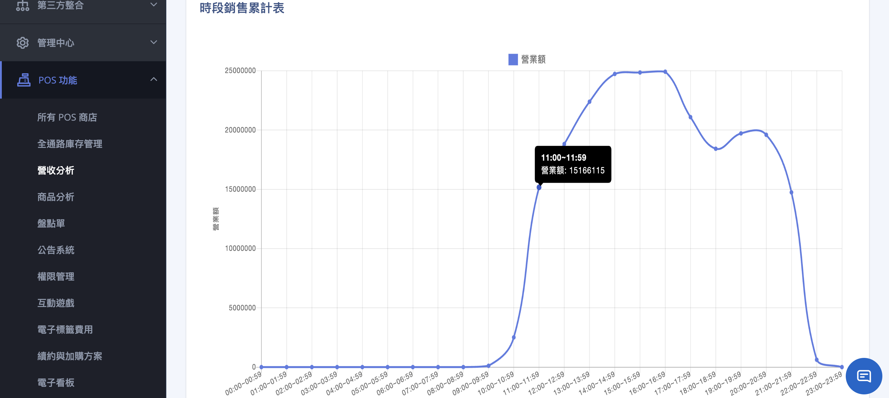

6. **切換指標：** 點選 **「營業額」**、**「訂單數」**、**「平均客單價」**、**「消費人數」**、**「人均消費額」** 按鈕，切換表格與圖表呈現的指標。

    

[^2]: 起訖日期相差超過約 100 天時，系統會跳出提醒「選擇的時間區間不得大於三個月」。

---

### 各分店比較器 <small>門市績效排名</small> { #operate-pos-revenue-store }

適合一次比較所有門市的營業表現並排名，快速找出績效優劣。

1. **選擇日期區間：** 在頁面上方的日期欄位選擇要查詢的起訖日期。

    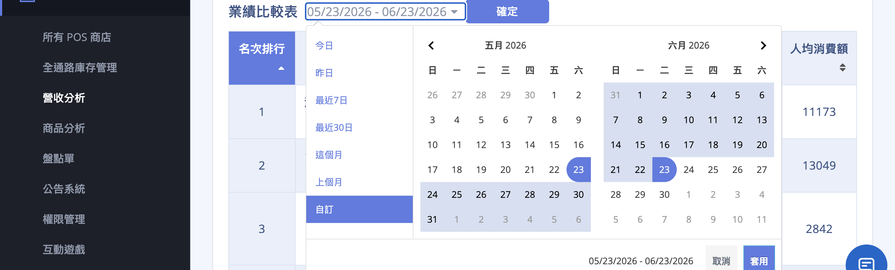

2. **送出查詢：** 點擊 **「確定」**。
3. **查看排名表：** 系統會以「業績比較表」列出所有門市，預設依銷售額由高到低排名，並一併呈現訂單數、消費人數、日均消費額、平均客單價與人均消費額。各欄位意義見[各分店比較器欄位對照表](references/pos-revenue-metrics-reference.md#reference-pos-revenue-store-columns){ data-preview }。

    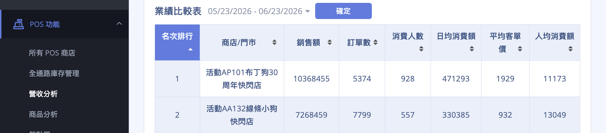

## 重要規範與限制 { #specs-pos-revenue }

### 認列訂單定義 { #specs-pos-revenue-counted-orders }

報表的營業指標僅計入「認列訂單」，定義為：

- [x] **訂單狀態：** 非取消訂單。
- [x] **退貨狀態：** 不需退貨或拒絕退貨。

被取消的訂單不計入購買數量與購買次數；訂單成立當天仍會保留訂單金額，並從取消當日的營業額扣除。

---

### 其他限制 { #specs-pos-revenue-limits }

- **數據非即時：** 報表呈現的是已彙整的每日資料，當天剛成立的訂單通常需待隔日才會完整呈現。
- **時間區間比較器：** 一次最多比較 10 組年份或月份。
- **週數時段比較器：** 查詢的起訖區間不得超過三個月（約 100 天）。
- **消費人數僅計會員：** 「消費人數」與「人均消費額」僅統計有綁定會員的訂單，散客訂單不會計入這兩項指標。
- **無內建匯出：** 頁面目前沒有直接匯出功能，若需保存數據，可複製表格內容後貼至 Excel 另行整理。

## 後續操作 { #next-steps-pos-revenue }

- :lucide-line-chart:{ .lg }  
  [__OMO 分析報表__](../../ec/business-intelligence/omo-analysis-report.md)  
  整合線上官網與線下門市，跨通路比較營收與會員表現。

- :lucide-dollar-sign:{ .lg }  
  [__營收分析__](../../ec/business-intelligence/revenue-analysis.md)  
  深入看全店營收組成、毛利與成長趨勢。

## 常見問題 { #faq-pos-revenue }

??? quote "後台選單找不到「POS 營收分析」"
    { #faq-pos-revenue-missing-menu }
    此報表需要先開通並使用 CYBERBIZ POS 才會顯示。

    - 未開通 POS 的商店不會在「POS 功能」選單下看到「營收分析」。
    - 如需開通，請聯絡客服或您的開店顧問。

??? quote "今天的訂單還沒出現 / 數據對不上"
    { #faq-pos-revenue-data-delay }
    報表為批次彙整，並非即時統計。

    - 當天剛成立的訂單通常需待隔日才會完整呈現。
    - 報表僅計入認列訂單，已取消、需退貨的訂單不列入，因此數字可能與訂單列表的總金額不同。詳見[認列訂單定義](#specs-pos-revenue-counted-orders){ title="認列訂單定義" data-preview }。

??? quote "「消費人數」比實際結帳人數少"
    { #faq-pos-revenue-customer-count }
    「消費人數」與「人均消費額」僅統計有綁定會員的訂單。

    - 未綁定會員的散客訂單仍會計入營業額與訂單數，但不會計入消費人數。
    - 若希望數據更完整，建議引導顧客於結帳時加入會員。

??? quote "查詢區間無法選超過三個月"
    { #faq-pos-revenue-date-limit }
    「週數時段比較器」的查詢區間上限為約三個月（100 天）。

    - 若需分析更長期間，可分段查詢，或改用「時間區間比較器」以年份／月份為單位比較。

??? quote "可以把報表匯出成 Excel 嗎"
    { #faq-pos-revenue-export }
    頁面目前沒有直接匯出功能。

    - 若需保存數據，可複製表格儲存格後貼至 Excel 另行整理。
    - 若需更精細的帳務資料，建議改由 POS 商店的報表下載功能取得。

## 參考資料 { #reference-pos-revenue }

- [POS 營收分析指標與欄位對照表](references/pos-revenue-metrics-reference.md)
