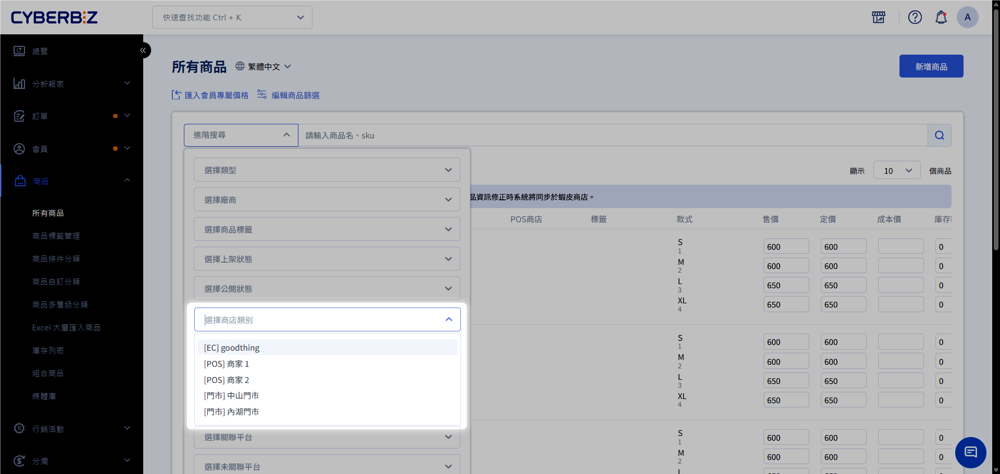
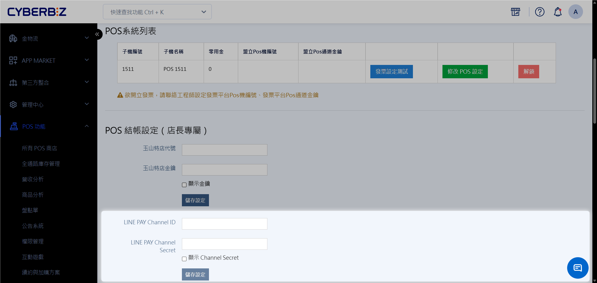
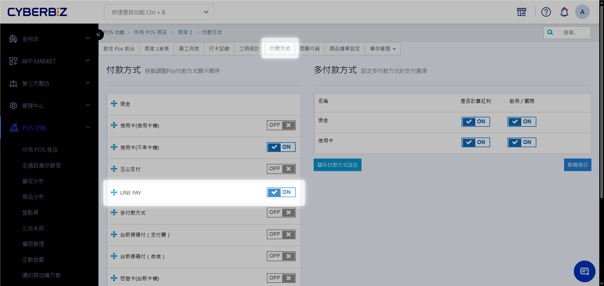
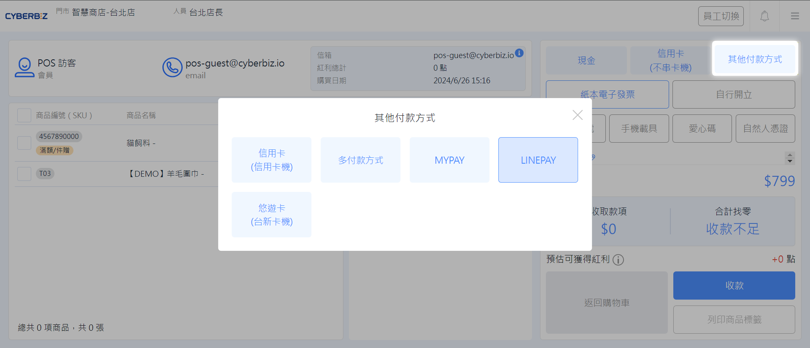
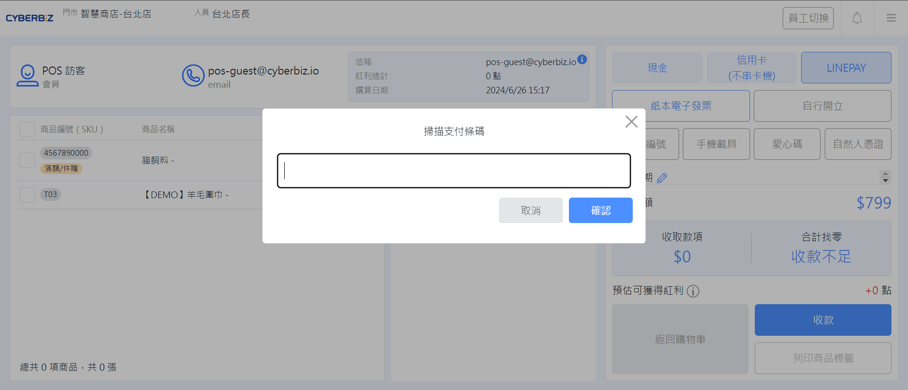

# LINE Pay 掃碼支付
串接 LINE Pay 掃碼支付，POS 店員可使用掃碼槍直接讀取顧客手機的付款條碼，實現快速、無接觸的結帳體驗。
{ .subtitle }

[:lucide-tag:{ title="適用方案" }](../../resources/conventions#適用方案) | 進階 PLUS / 高手 PLUS / 企業
{ .doc-badge }

!!! tip "應用情境"
    - **快速結帳**：在人潮眾多時，透過掃碼槍秒速完成收款，縮短顧客排隊時間。
    - **無接觸支付**：符合防疫與現代消費習慣，提供顧客安全便捷的支付選擇。
    - **跨店管理**：直營連鎖門市可透過單一統編帳號，搭配 Device ID 區分各分店業績。

## 使用須知

- **申請週期**：資料完整送出後，審核與開通作業約需 **3 至 4 週**。
- **硬體需求**：門市需配備可掃描手機螢幕的 **掃碼槍**。
- **手續費查詢**：具體費率請至 **管理中心 > 對帳中心 > 金流手續費** 查看。
- **支付限制**：目前 **僅支援商家掃描顧客條碼**，**不支援顧客掃描商店 QR code** 後自行輸入金額。

## 申請流程

### 1. 線上填寫申請表

請先準備基本營運資訊，並前往 [CYBERBIZ x LINE Pay 串接表單](https://docs.google.com/forms/d/13H2sqFvR_99iDtHOPEOmPzTjoYv6fX-eTEYSTJTXPeU/edit) 進行填寫。

### 2. 準備必要證明文件

請提供以下文件的清晰電子檔（掃描檔），並以信件主旨 **【商店名稱-申請 POS LINE Pay 功能】** 寄送至客服信箱：

- **公司證明**：公司設立/變更登記表、商業登記抄本或稅籍證明。
- **店面照片與選單**：
    - 包含店面招牌、店內陳設、商品價格照片。
    - 提供實體 Menu 或 [從後台匯出]() 的商品清單。

        !!! tip "如何依商店別匯出商品清單？"
            1. 前往 **商品 > 所有商品**。
            2. 開啟 **進階搜尋**，於 **商店** 欄位選擇要匯出目標店名。
            3. 全選篩選後的商品清單，點擊 **匯出商品**。

            { .screenshot }

- **負責人證件**：身分證正反面影本（外籍人士請提供護照）。
- **公司銀行存摺**：提供撥款用之銀行帳戶，戶名必須與公司登記名稱一致，不可使用個人帳戶。

### 3. 審核與開通

1. **進度追蹤**：送件後約 10 個工作天會收到初步審核通知。
2. **獲取金鑰**：審核通過後，CYBERBIZ 將提供專屬的 **LINEPAY 帳戶帳密**、**Channel ID** 與 **Channel Secret**。
3. **領取宣傳物**：提供收件資訊後，我們將寄送 LINE Pay 立牌與 LOGO 貼紙，請於 **門市佈置完成後回傳照片** 以結束上線流程。
    > 收件資訊請包含收件人姓名、電話、地址。

## 操作流程

### 步驟一：後台綁定金鑰

1. 登入 CYBERBIZ 管理後台，前往 **POS 功能 > 所有 POS 商店**。
2. 點選欲設定的商店，進入 **POS 結帳設定**。
3. 填寫 **LINE Pay Channel ID** 及 **LINE Pay Channel Secret**。
    > **注意**：若您同時有官網 (EC) 與 POS，兩者的金鑰不可共用，請務必填寫專為 POS 申請的資訊。
4. 儲存設定。

{ .screenshot }

### 步驟二：啟用付款方式

1. 點擊 **付款方式** 頁籤。
2. 將 **LINE Pay** 開關切換為 `開啟 (ON)`。

{ .screenshot }

### 步驟三：POS 前台結帳操作

1. 在結帳畫面，點選 **其他付款方式**，選擇 **LINE Pay**。
    { .screenshot }
3. 系統跳出 **掃描支付條碼** 視窗後，使用掃碼槍對準消費者的手機條碼。
    { .screenshot }
4. 點擊 **確認**，系統顯示結帳成功後即完成交易。

!!! tip "小技巧"
    若不慎關閉掃碼視窗，可點擊畫面上的 **收款** 按鈕再次喚起掃描框。

## 常見問題

??? quote "我已經有 LINE Pay 帳號了，可以直接用在 CYBERBIZ POS 嗎？"
    請先與 [LINE Pay 商店客服](https://pay.line.me/merchant-apply/tw/contact-request?locale=zh_TW) 確認原帳號是否支援 **線下 POS 串接**。若支援，需向 LINE Pay 申請將代理商轉移至 CYBERBIZ，以取得對應的串接金鑰。

??? quote "門市有多個櫃台，可以申請多個立牌嗎？"
    可以。請聯繫您的技術客服或專員，說明需要的組數，我們將安排寄送。

??? quote "如何確認 LINE Pay 的撥款時間？"
    請登入 [LINE Pay 商家後台](https://pay.line.me/)，前往 **管理基本資訊 > 管理商家資訊 > 合約內容 > 撥款週期** 中查看詳細規則。

??? quote "什麼是 [LINE Pay 好康地圖](https://pay.line.me/portal/tw/customer/faq?categoryId=cooperate)？對我的商店有什麼實質效益？"
    **LINE Pay 好康地圖** 是 LINE 錢包內建的商店地圖與搜尋功能。 
    - **核心效益**：讓鄰近的 LINE 用戶透過 **自動定位** 或 **關鍵字搜尋**，快速發現您的商店位置與優惠。
    - **如何增加曝光**：請登入 [LINE Pay 商家後台](https://pay.line.me/tw/login/) 完成資料登記，步驟如下：
        1.  前往 **管理基本資訊** > **商店資料**。
        2.  點擊 **商店資料登記**，詳實填寫經營內容與服務地址。
        3.  **上傳形象圖**：上傳一張 **1:1（正方形）** 的商店代表圖或品牌 LOGO，提升品牌辨識度。