# 結帳
從會員識別到收款發票，帶您熟悉門市結帳的每一個關鍵環節，提供流暢的顧客消費體驗。
{ .subtitle }

[:lucide-tag:{ title="適用方案" }](../../resources/conventions#適用方案) | 進階 PLUS / 高手 PLUS / 企業
{ .doc-badge }

!!! tip "應用情境"
    - **日常銷售**：快速錄入商品並完成收款，即時同步庫存。
    - **會員回饋**：登入會員以套用特定等級優惠、折抵紅利或使用優惠券。

## 完整結帳流程

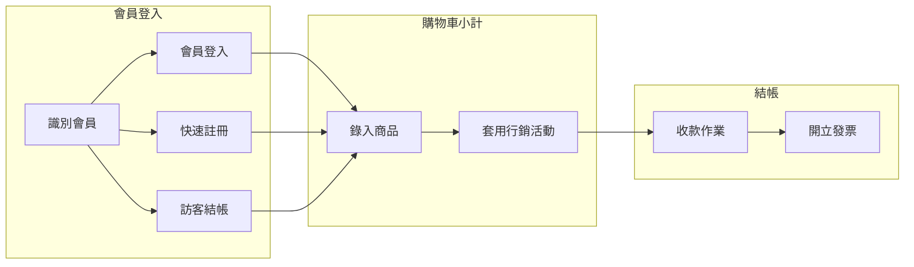

## 步驟一：會員登入

在開始結帳前，識別顧客身分能確保正確套用會員權益與記錄消費。

=== "介面說明"

    ### 於登入頁選擇顧客身分

    1. **啟動結帳**：點選 POS 前台右側的 **結帳** 按鈕。
    2. **選擇顧客結帳身分**：
        - **會員登入**：
            - **手機號碼**：最常用的登入方式，快速輸入顧客門號。
            - **顧客條碼**：掃描顧客手機 APP 出示的會員條碼。
            - **信箱搜尋**：輸入 Email 進行搜尋。
        - **會員快速註冊**：若顧客非會員且願意加入，輸入手機號碼並點擊 **快速註冊**。系統將自動發送 **帳號啟用通知** 簡訊。
        - **訪客結帳**：若顧客不願提供資料，點選 **訪客結帳** 直接進入購物車。
    3. **綁定註冊人分潤**：指定 **註冊人分潤** 代碼。

    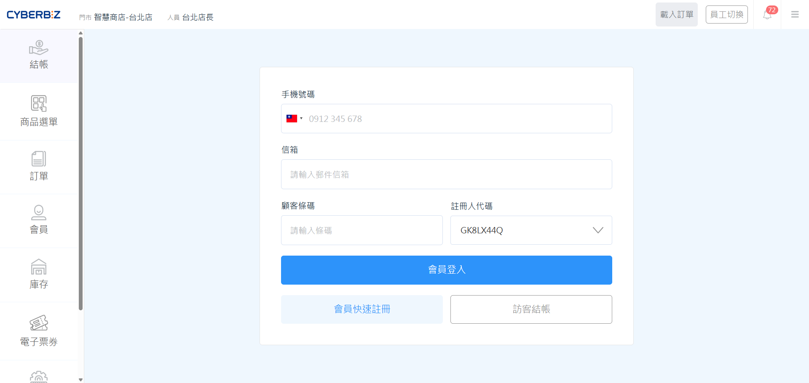{ .screenshot }

    ### 於結帳頁補登

    === "會員登入"

        登入後可查看顧客的 VIP 等級、現有紅利及消費紀錄。點擊可查看詳細資訊。

        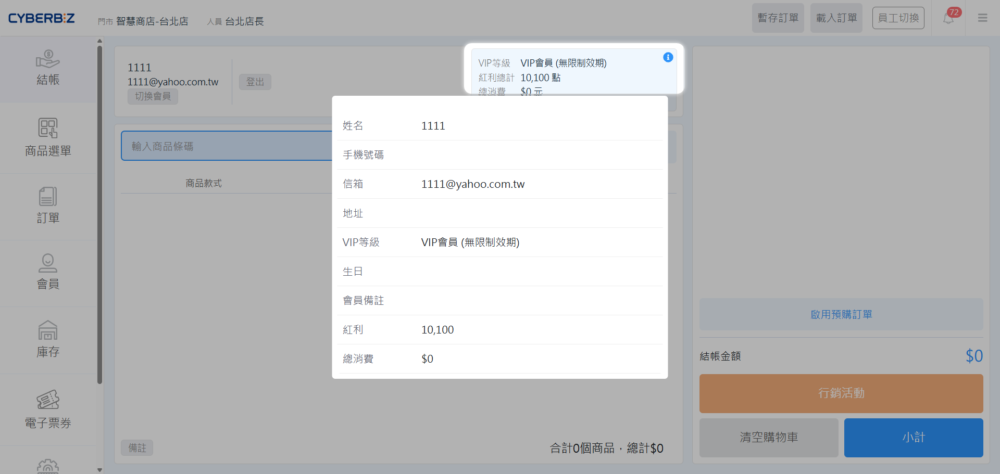{ .screenshot }

    === "會員快速註冊"

        若需更換顧客，點擊 **切換會員** 即可重新登入。

        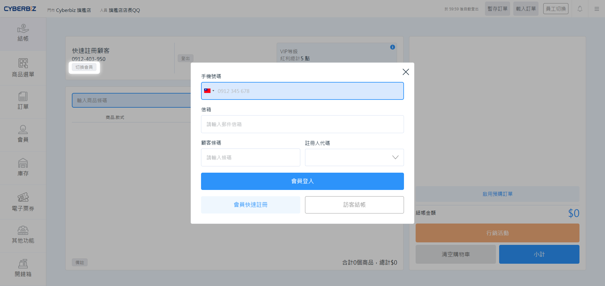{ .screenshot }

    === "訪客結帳"

        訪客結帳模式下，可點擊 **登入會員**，轉換為會員結帳，訂單將自動轉換為會員訂單並享有相應權益。

        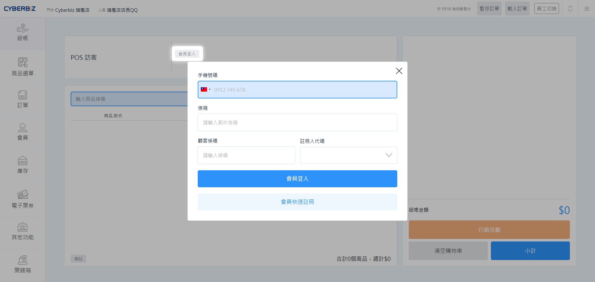{ .screenshot }

=== "相關操作"

    

    - :lucide-plug:{ .lg }
    [__訪客結帳__](訪客結帳模式/) 
    適用不提供資料的顧客，快速進入購物車。

    - :lucide-plug:{ .lg }
    [__離線結帳__](離線結帳模式/) 
    網路不穩時，確保交易正常紀錄不中斷。

    - :lucide-plug:{ .lg }
    [__註冊人分潤__](../../ec/profit-sharing/設定註冊人分潤方案) 
    設定推廣回饋，獎勵引導新客註冊者。

    

## 步驟二：購物車小計

將顧客購買的品項錄入系統，並確認是否符合行銷活動條件。

### 錄入商品

=== "介面說明"

    1. **掃碼/輸入**：使用掃描槍讀取商品條碼，或於搜尋欄輸入 SKU、廠商編號。
    
    2. **手動搜尋**：點擊 **商品搜尋**，開啟彈窗。

        - **搜尋方式**：選擇 **開頭符合** 或 **模糊搜尋**。
        - **多維度搜尋**：支援以 **商品**、**SKU** 或 **商品廠商編號** 進行搜尋。
        - **快捷選取**：點擊商品列即可加入清單，再次點擊則快速移出。

        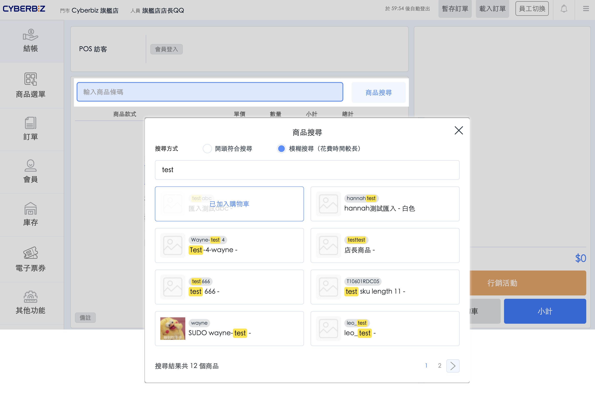{ .screenshot }

    3. **數量調整**：點擊已加入的商品列，可直接修改數量。

    4. **備註**：點擊下方 **備註** 按鈕進行編輯。

        - **商家備註**：**僅內部可視**。此資訊僅供後台管理員查看，顧客端無法察覺。
        - **訂單備註**：**雙方可視**。此資訊將同步揭露予商家與會員。

            > 會員查閱路徑：會員可登入官網，至 **訂單 > 所有訂單**，於訂單明細頁中查閱此備註。

        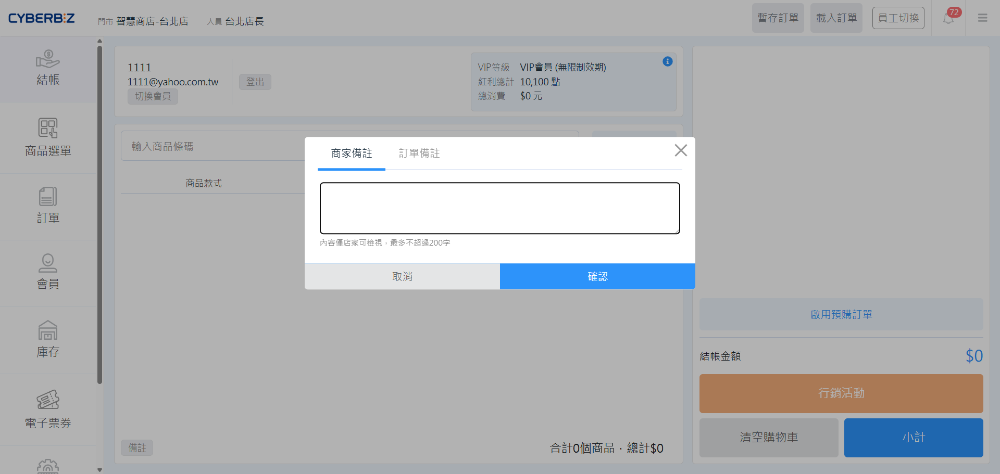{ .screenshot }

=== "相關操作"

    

    - :lucide-plug:{ .lg }
    [__設定庫存不足提醒方式__](庫存不足通知/) 
    即時掌握庫存狀態，避免超賣或無貨可賣。

    

### 套用行銷活動

=== "介面說明"

    1. **紅利點數**：手動輸入折抵金額（不得超過上限）或選擇 **折抵全部**。
    2. **優惠碼**：下拉選單選取顧客適用的 **優惠碼** 或 **優惠券**。

        !!! info "頁面中並未顯示 **紅利折扣** 或 **優惠碼** 欄位？"
            若欄位缺失，通常與身份驗證設定有關。請至管理後台調整：

            前往 **行銷活動 > 全館折扣 – 紅利 & 優惠券**，將 **POS 使用優惠券/紅利點數是否需要條碼進行身份驗證** 功能改為 **否**，即可於頁面顯示欄位。

    3. **推薦碼**：指定推薦碼，為此筆訂單套用 **推薦人分潤** 方案。
    4. **切換結帳分潤人員**：指定結帳人員，為此筆訂單套用 **結帳人分潤** 方案。

        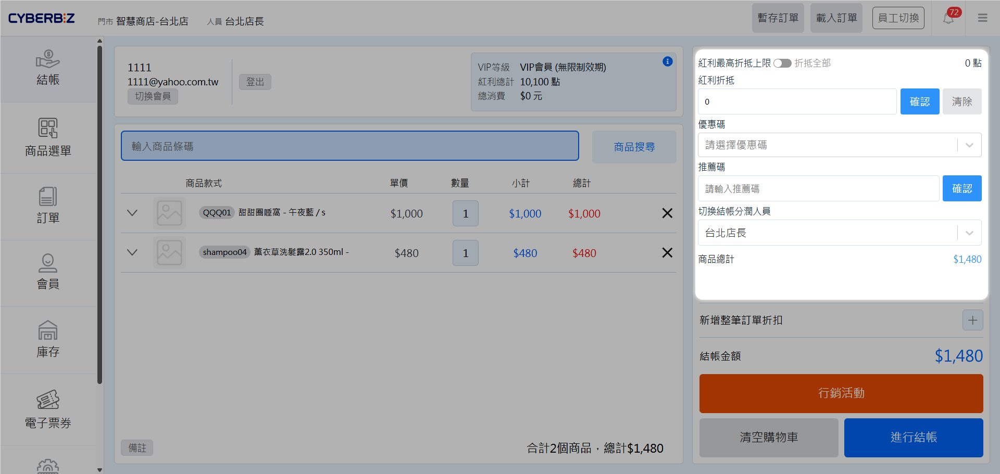{ .screenshot }

    5. **新增訂單折扣**：**店長** 可執行訂單改價。

        - **整筆訂單折扣**：點擊 **新增整筆訂單折扣**，輸入折扣值。
        - **指定商品折扣**：點擊指定商品，於下拉選單輸入折扣值。

        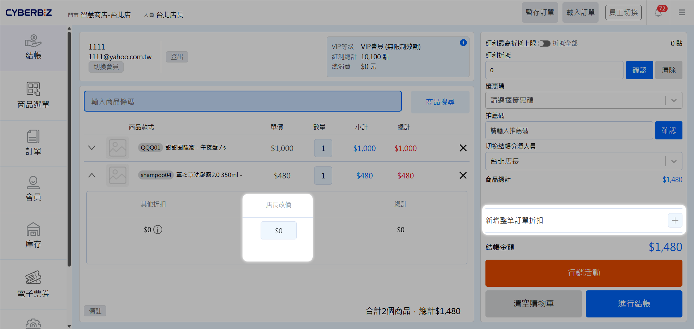{ .screenshot }

    6. 其他行銷活動：點擊 **行銷活動**，開啟彈窗。
        - **加價購**：系統將出現符合條件之加價購商品，可掃描條碼或勾選加購。
        - **滿額/件贈**：查看未滿活動條件的訂單差額，若達標系統將自動帶入贈品。

            > 若贈品庫存不足，系統會彈窗提醒且不會自動加入。

        - **紅利商城**：選擇並套用顧客欲兌換之紅利商品。

        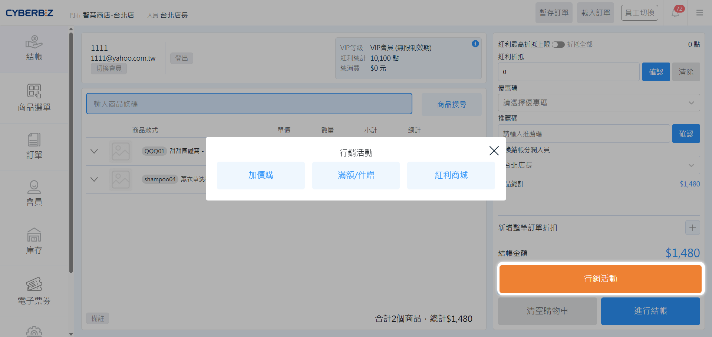{ .screenshot }

=== "相關操作"

    

    - :lucide-plug:{ .lg }
    [__發送會員專屬紅利點數__]() 
    發放紅利獎勵，提升會員回購率與忠誠度。

    - :lucide-plug:{ .lg }
    [__建立優惠碼__]() 
    製作專屬折扣碼，供顧客結帳時手動輸入。

    - :lucide-plug:{ .lg }
    [__建立優惠券__]() 
    管理優惠券，自動套用或供顧客選取。

    - :lucide-plug:{ .lg }
    [__建立推薦人分潤__](../../profit-sharing/設定推薦人分潤方案/) 
    設定推薦分潤，獎勵介紹新客的現有客戶、員工與第三方。

    - :lucide-plug:{ .lg }
    [__建立結帳人分潤__]() 
    激勵門市人員，根據結帳金額計算獎金。

    - :lucide-plug:{ .lg }
    [__店長改價__]() 
    具備權限人員，可手動調整訂單或價金。

    - :lucide-plug:{ .lg }
    __建立加價購活動__ 
    增加客單價，在結帳時推薦超值加購品。
        - [訂單加價購](../../ec/marketing/設定訂單加價購/)
        - [商品加價購](../../ec/marketing/設定商品加價購/)

    - :lucide-plug:{ .lg }
    [__建立滿額贈滿件贈活動__](../../ec/marketing/設定滿額贈與滿件贈/) 
    引導顧客多買，達成門檻即自動送禮品。

    - :lucide-plug:{ .lg }
    [__設定庫存不足提醒方式__](庫存不足通知/) 
    即時掌握庫存狀態，確保銷售流程順暢。

    - :lucide-plug:{ .lg }
    [__建立紅利商城__](紅利商城/) 
    提供多樣兌換選擇，讓紅利點數具兌換價值。
        - [建立 POS 紅利商城](紅利商城/#於後台建立商城) 
        - [紅利商城商品結帳](紅利商城/#於前台結帳)

    

## 步驟三：完成結帳

最後的付款與憑證處理階段，完成後訂單即正式成立。

=== "介面說明"

    ### 收款作業

    1. **進行結帳**：點擊右下角 **進行結帳** 進入收款頁面。
    2. **選擇付款方式**：
        - **單一支付**：如現金或信用卡，直接點選並輸入實收金額。
        - **多付款方式**：若顧客需混合支付（如部分現金、部分五倍券），點選 **多付款方式** 並依序輸入各項金額。
    3. **認單日期**：預設為今日，若需將業績認列至其他日期，可手動修改。
        - 本日期欄位為系統產出 **POS 訂單報表** 時的檢索依據。系統將依照此處設定的時間點，將訂單劃分至對應的報表呈現區間。

    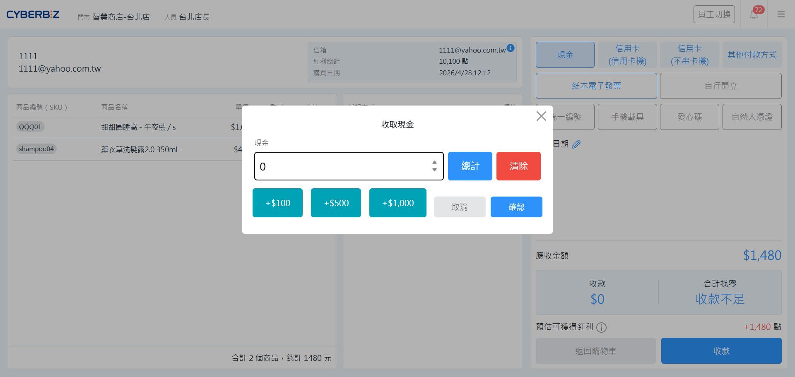{ .screenshot }

=== "相關操作"

    

    - :lucide-plug:{ .lg }
    [__開啟付款方式__](payment-method/) 
    管理店面支付管道，設定最適合結帳順序。

    - :lucide-plug:{ .lg }
    [__建立多付款方式__](payment-method/多付款方式/) 
    支援混合支付，滿足顧客多元付款需求。

    

### 開立發票

=== "介面說明"

    1. **選擇發票形式**：
        - **會員載具 (個人/公司)**：配合發票機，輸入統編或載具碼開立電子發票。
        - **自行開立 (手開發票)**：若無串接發票機，選擇此項並於結帳後補填發票號碼。

            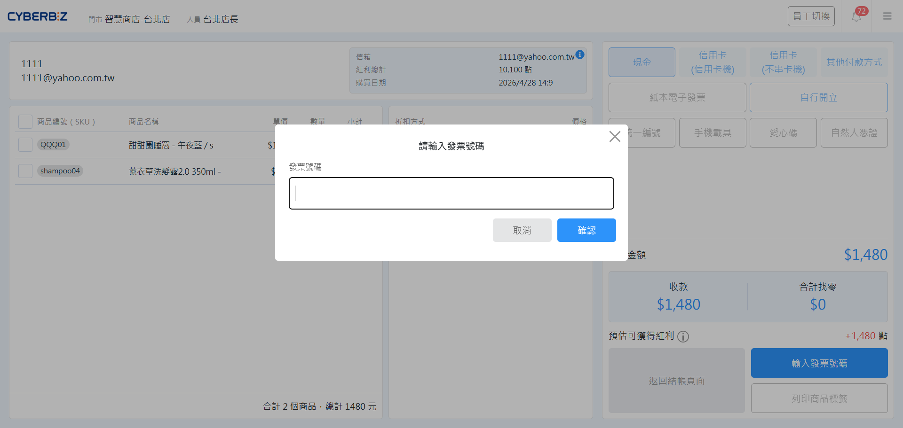{ .screenshot }

            > 您也可於 **訂單** 頁 [補開發票](../orders_ann/管理一般訂單/#補開發票--列印明細)。
        - **其他載具**：手機條碼、自然人憑證或捐贈代碼。
    2. **完成結帳**：確認金額正確後，點擊 **收款**。

    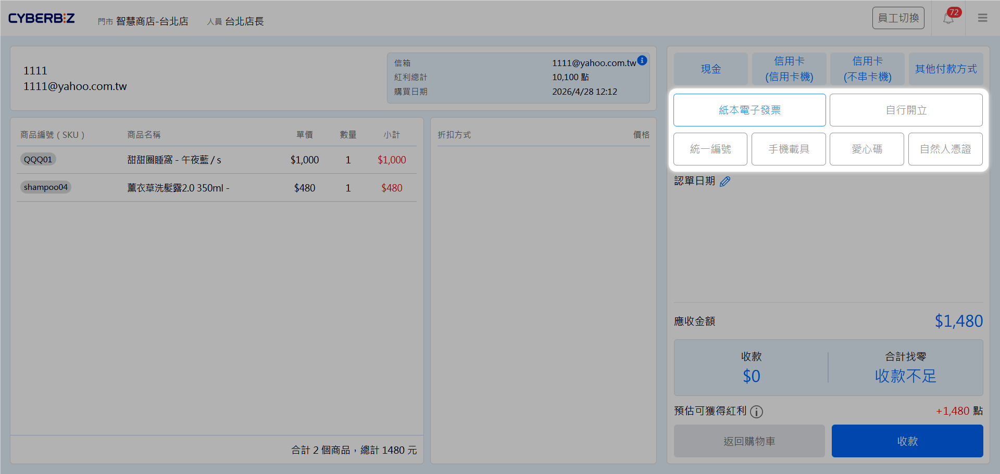{ .screenshot }

=== "相關操作"

    

    - :lucide-plug:{ .lg }
    [__自動列印發票與明細__](列印發票明細/) 
    結帳自動出單，或者關閉自動列印節省發票紙。

    - :lucide-plug:{ .lg }
    [__開立混稅發票__](混稅發票/) 
    處理不同稅率商品，準確計算並開立。

    - :lucide-plug:{ .lg }
    [__全通路庫存管理__](../inventory/全通路庫存管理/) 
    管理各通路庫存，確保線上線下無落差。

    

