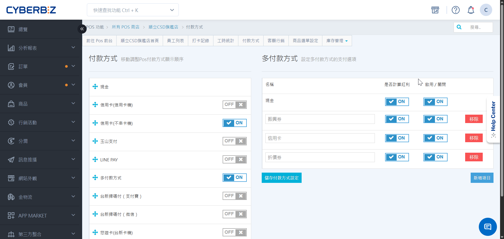
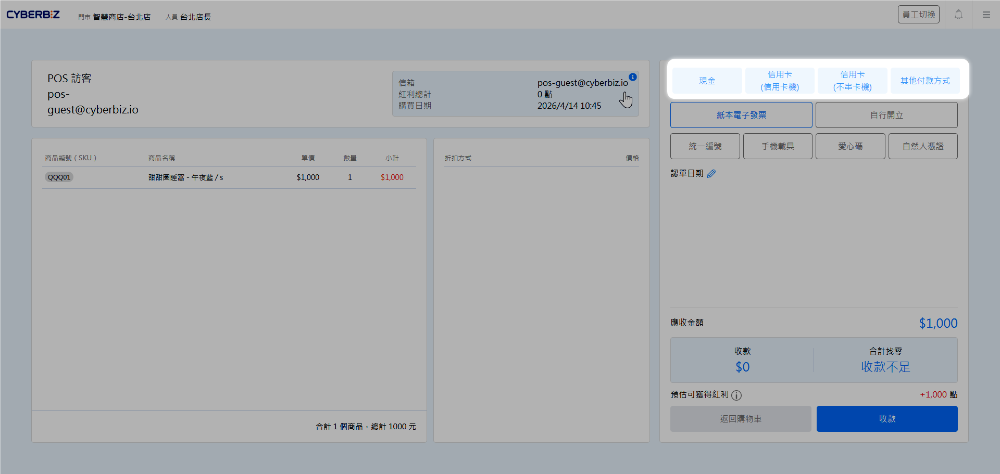
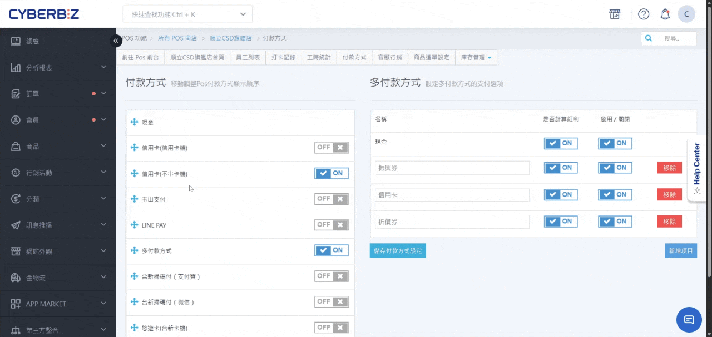

# 付款方式
管理 POS 前台提供的支付工具，包含現金、信用卡串接及行動支付。
{ .subtitle }

[:lucide-tag:{ title="適用方案" }](../../resources/conventions#適用方案) | 進階 PLUS / 高手 PLUS / 企業
{ .doc-badge }

{ .hero-page }

## 使用須知

- **人員權限**：此功能僅限 **網站擁有者** 與 **POS店長** 可操作。
- **硬體需求**：部分支付方式（如信用卡機、悠遊卡）需搭配特定型號之刷卡機。

## 操作流程

### 開啟付款方式

=== "後台設置"

    1. 登入 POS 管理後台，前往 **POS 功能 > 所有 POS 商店 > [點擊 POS 店]**，點擊 **付款方式** 頁籤。
    2. 依門市結帳需求，開啟付款選項：

        

        - :lucide-banknote-arrow-down:{ .lg }   
        __現金__ 
        系統預設付款方式，無須另行啟用。

        - :lucide-credit-card:{ .lg }   
        [__信用卡 (信用卡機)__](../hardware/有線刷卡機.md)   
        串接台新銀行有線刷卡機，自動同步交易金額至卡機，減少手動輸入錯誤。
        
        - :lucide-credit-card:{ .lg }   
        __信用卡 (不串卡機)__ 
        適用於手動輸入金額的刷卡機或百貨專櫃業者。 

        - :lucide-qr-code:{ .lg }   
        __玉山支付__ 
        僅限已與玉山銀行洽談開通支付寶掃碼功能之商家使用。

        - :lucide-smartphone:{ .lg }   
        [__MYPAY__](../hardware/商米無線刷卡機.md)  
        適用於平板操作，需搭配商米 P2 PRO 刷卡機服務。

        - :lucide-wallet:{ .lg }   
        [__LINE Pay__](LINE PAY 掃碼支付.md) 
        串接 LINE Pay 支付，支援前台掃碼付款。
        
        - :lucide-layers:{ .lg }   
        [__多付款方式__](多付款方式.md)  
        支援單筆訂單拆分多種支付（如現金 + 禮券） 
        使用場景：**五倍券、振興券、動滋券**

        - :lucide-scan-line:{ .lg }   
        __台新掃碼付 (支付寶)__ 
        透過台新銀行提供的支付寶掃碼服務進行收款。

        - :lucide-scan-line:{ .lg }   
        __台新掃碼付 (微信)__ 
        透過台新銀行提供的微信支付掃碼服務進行收款。

        - :lucide-smartphone-nfc:{ .lg }   
        __悠遊卡 (台新卡機)__ 
        需搭配台新銀行刷卡機，支援感應悠遊卡支付。

        

=== "前台顯示"

    1. 登入 POS 前台，前往 **結帳**。
    2. 可於結帳頁右上角查看 POS 機台成功建立的付款選項。

        !!! info "支付選項顯示檢查"
            若前台未顯示特定支付選項，代表該選項並未建立成功，請先核對教學文件確認設置步驟，若仍無法排除請聯繫 CYBERBIZ 客服協助。

    { .screenshot }

### 前台顯示排序

=== "後台設置"

    - **自定義順序**：長按 :lucide-move: (移動圖示)，即可自由拖拉選項以調整前台顯示權重。

    { .screenshot }

=== "前台顯示"

    - **黃金版位機制**：前台預設僅顯示 **前三項** 付款選項，其餘選項將收摺至 **其他付款方式** 中。
    - **展開與選取**：點擊 **其他付款方式** 後，系統將彈窗展開剩餘選項供快速點選。
    - **優化建議**：建議將高頻率使用的支付工具於後台前移排序，以提升結帳轉單率。
