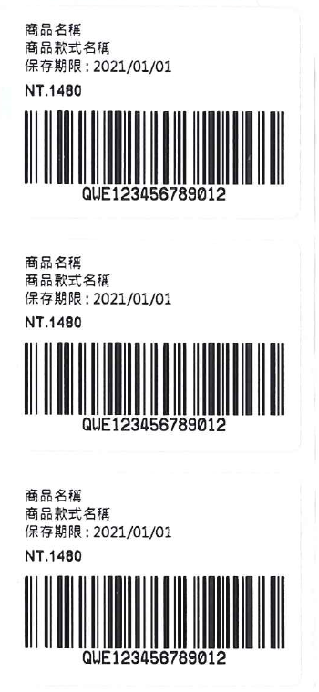
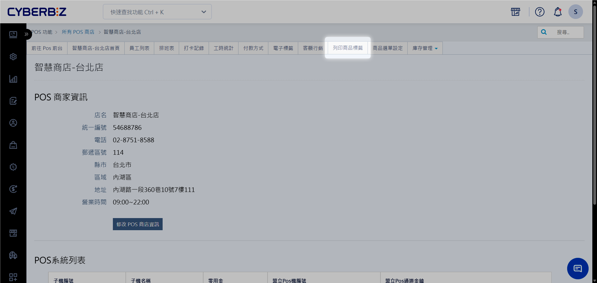
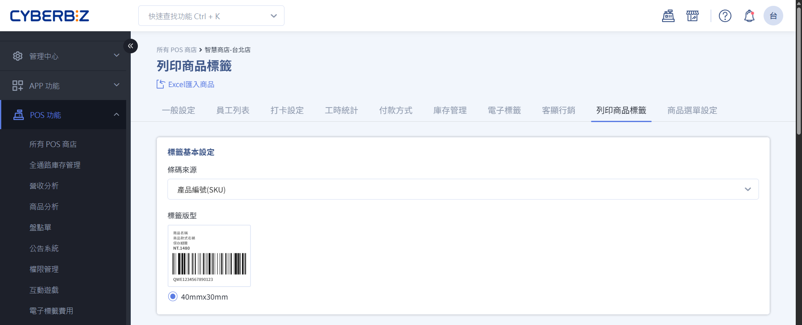
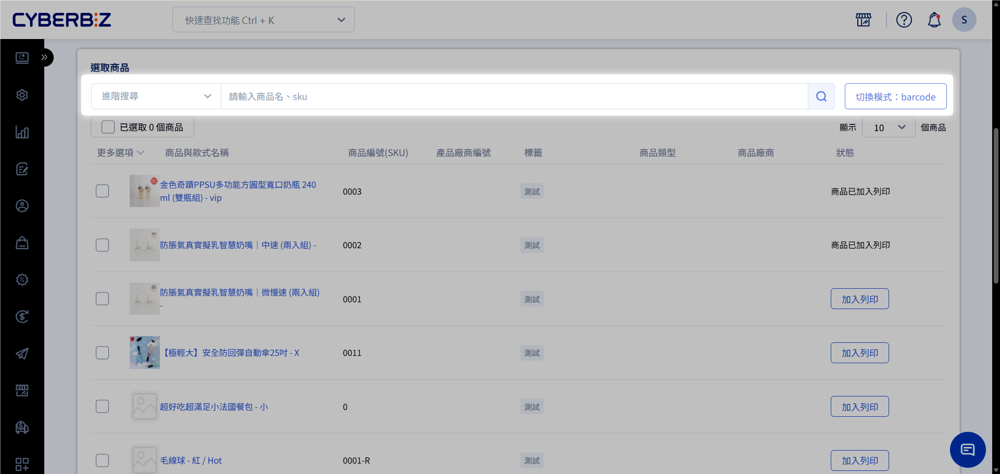
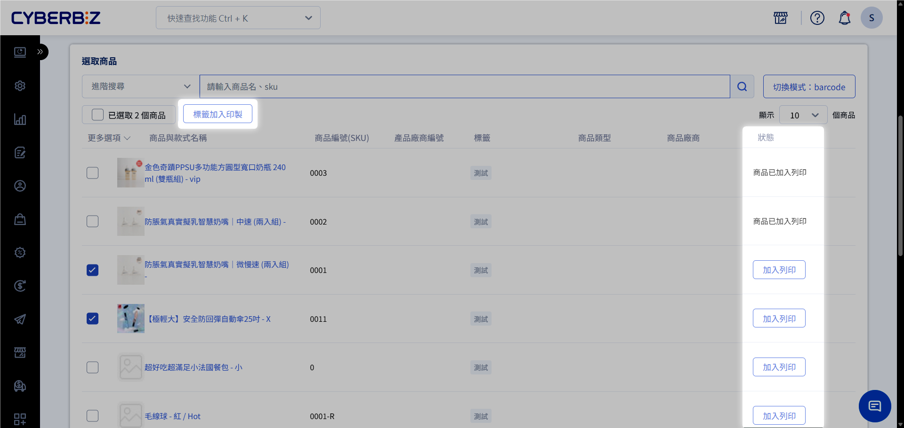
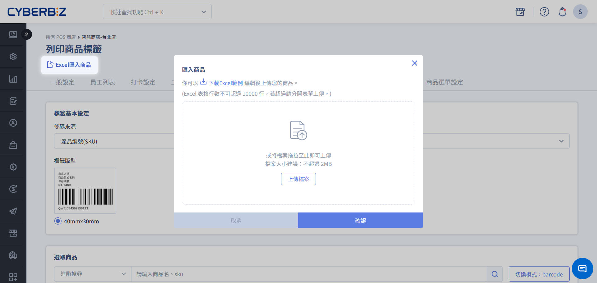
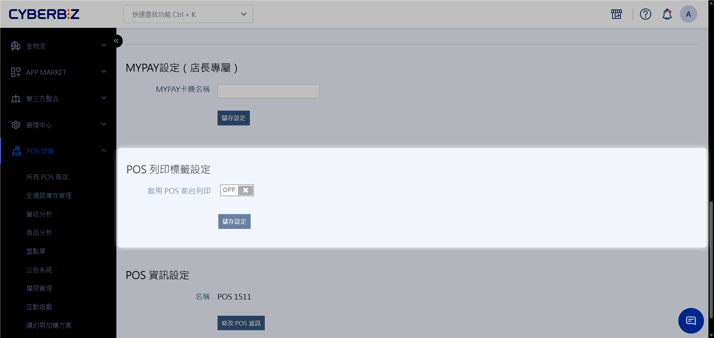
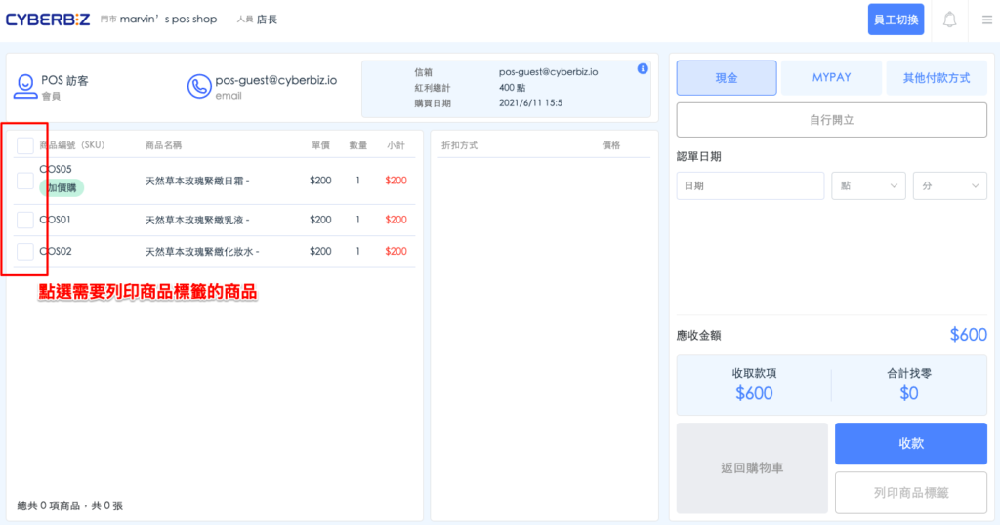
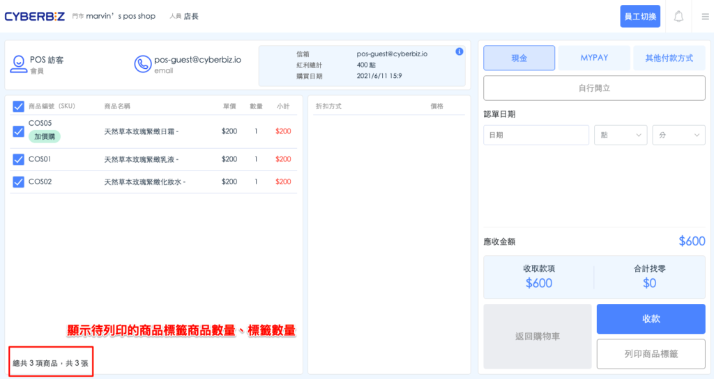
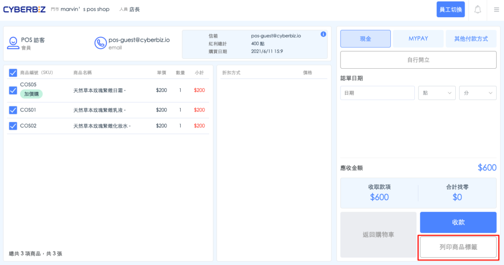

# 列印商品標籤
除了在後台批次列印，CYBERBIZ POS 支援在結帳前台直接列印商品標籤。店員在結帳或重新貼標商品時，可直接產出標籤。
{ .subtitle }

{ .small-image }

[:lucide-tag:{ title="適用方案" }](../../resources/conventions#適用方案) | 進階 PLUS / 高手 PLUS / 企業
{ .doc-badge }

!!! tip "應用情境"
    - **結帳前貼標**：顧客選購無標籤商品時，店員可在前台直接搜尋商品並即時印出標籤。
    - **拆單補標**：當商品需要拆分銷售或更換包裝時，在前台快速補印條碼。
    - **即時價格核對**：在前台確認商品資訊後，若發現標籤毀損，可立即重新列印。

## 使用須知

- **硬體前提**：必須先完成標籤機的驅動程式安裝與連線測試，詳細請參閱 [標籤機安裝教學](標籤機安裝與後台列印教學.md)。
- **功能開通**：此功能需聯繫 CYBERBIZ 客服人員協助開啟 **POS 前台標籤列印** 權限。

## 於後台列印標籤

=== "單筆建立"

    ### 步驟一：標籤樣式設定

    1. 登入 CYBERBIZ 管理後台，前往 **POS 功能 > 所有 POS 商店**，選擇欲設定的商店後點擊 **列印商品標籤** 頁籤。
        { .screenshot }
    2. 進入 **標籤基本設定**。
    3. **條碼來源**：選擇要列印 **商品編號(SKU)** 或 **商品廠商條碼** 作為條碼。
    4. **標籤版型**：選擇版型，調整標籤上顯示的內容項目。
        { .screenshot }

    ### 步驟二：建立標籤

    1. 在下方商品列表中，勾選欲列印標籤的商品項目。
    2. **搜尋商品**：
        - **掃碼搜尋**：點擊 **切換模式：barcode**，使用掃碼槍讀取商品條碼。
        - **手動搜尋**：點擊 **切換模式：商品搜尋**，輸入 **商品名稱** 或 **SKU 碼**。
        { .screenshot }
    3. 點選 **標籤加入印製**。
        { .screenshot }
    4. 輸入 **列印數量** 並視需求填寫 **保存期限**。
    5. 點選 **確認** ，系統即會將指令傳送至標籤機產出標籤。
        

=== "批次匯入"

    1. 點擊 **Excel 匯入商品**。
    2. 下載 Excel 範例。
    3. 依範本欄位填寫標籤資訊。
    4. 於彈窗中上傳檔案。

    { .screenshot }

## 於前台列印標籤

### 步驟一：啟用前台列印功能

在操作 POS 前台前，必須先在管理後台針對特定機台開啟權限。

1. 登入 CYBERBIZ 管理後台，前往 **POS 功能 > 所有 POS 商店**。
2. 點選欲設定的 **POS 商店名稱**，進入商店詳情頁面。
3. 找到欲啟用的機台，點選其後方的 **修改 POS 設定**。
4. 在 **POS 列印標籤設定** 區塊中，將 **啟用 POS 前台列印功能** 切換為 **開啟 (ON)**。

{ .screenshot }

### 步驟二：POS 前台勾選與列印

完成後台設定後，請重新整理或登入 POS 前台 APP。

1. 在 POS 前台的結帳頁面（購物車畫面），點選商品列表中的商品。
2. 勾選欲列印標籤的商品項目。
    { .screenshot }
3. 勾選後，畫面左下角會顯示 **待列印商品數量** 與 **標籤總張數**。
    { .screenshot }
4. 確認無誤後，點擊 **列印商品標籤** 按鈕。
    { .screenshot }
5. 標籤機即會根據勾選的商品與數量，連續印出對應的商品標籤。
    - **標籤內容**：列印出的標籤將包含：**商品名稱**、**款式**（若有）、**售價**、**商品條碼** 及 **SKU**。

!!! warning "注意事項"
    - 若列印出的條碼無法掃描，請檢查標籤紙是否對齊或標籤機感應器是否需要校準。
    - 建議先列印一張進行樣式確認，避免大量列印時造成素材浪費。

## 常見問題

??? quote "一次可以勾選多個商品列印嗎？"
    是的，您可以一次勾選多個不同商品，系統會依序連續印出所有標籤。

