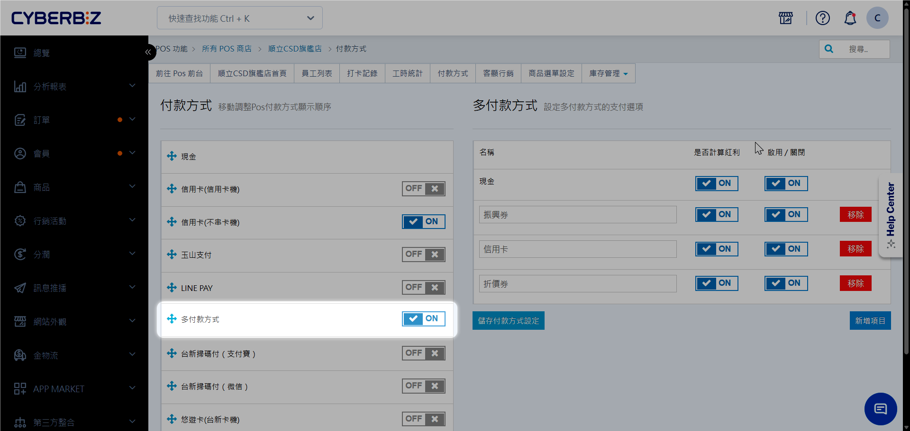
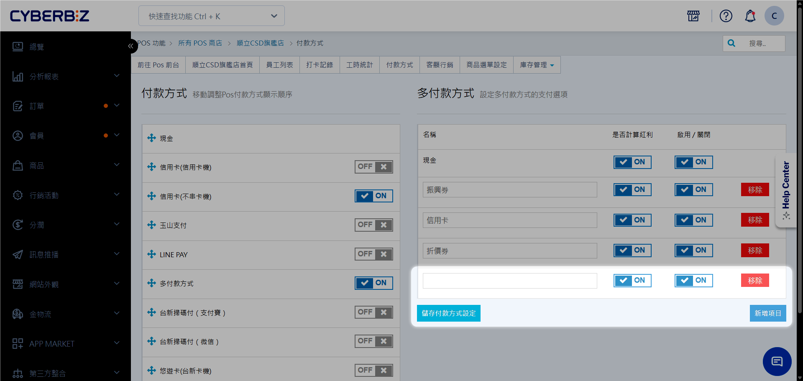
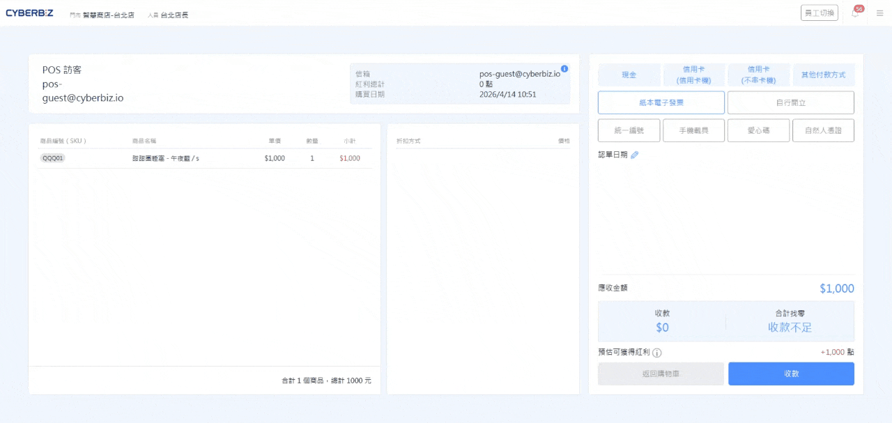
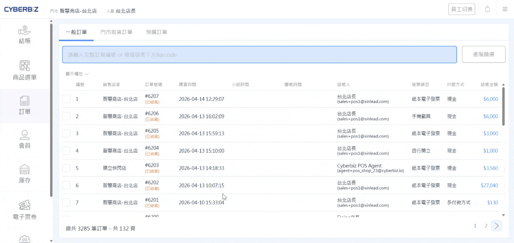
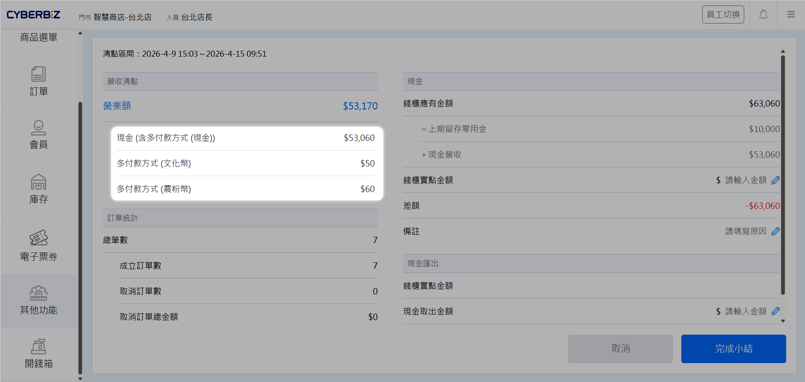
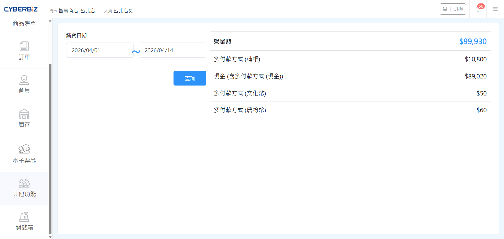

# 設定 POS 多付款方式
當一筆交易需要由多種支付方式組成（例如：現金 + 禮券）時，可透過「多付款方式」功能進行拆分與記錄。
{ .subtitle }

[:lucide-tag:{ title="適用方案" }](../../resources/conventions#適用方案) | 進階 PLUS / 高手 PLUS / 企業
{ .doc-badge }

!!! tip "應用情境"
	- **組合支付**：顧客想要使用現金支付部分金額，剩餘金額使用信用卡刷卡。
	- **票券抵用**：顧客持有品牌禮券、五倍券或動滋券，需先扣除票券面額後再支付差額。
	- **紅利控制**：針對特定支付方式（如禮券）設定不發放紅利點數。

## 使用須知

- **手動記錄性質**：多付款方式僅提供 **付款紀錄**，**無法自動串接** 實體刷卡機或行動支付設備。若涉及刷卡，店員需在刷卡機上手動輸入金額。
- **紅利計算邏輯**：系統會根據各支付項目的 **累計紅利** 設定，自動計算該筆訂單最終可獲得的紅利點數。

## 後台設置

### 步驟 1：開啟多付款方式

1. 登入 CYBERBIZ POS 管理後台，前往 **POS 功能 > 所有 POS 店 > [點擊 POS 店] > 付款方式**。
2. 於左方 **付款方式** 列表，開啟 **多付款方式** 選項。

{ .screenshot }

### 步驟2：設定支付項目

1. 於右方 **多付款方式** 列表，點擊 **新增項目**，輸入自訂名稱（如：禮券、振興券）。

    > 支援建立多組支付類別（如：禮券、招待券）以應對多元收款情境。

2. 設定 **累計紅利** 開關：
    - `開啟`：使用此方式支付的金額會計算紅利。
    - `關閉`：此部分金額不計入紅利發放基礎。

    !!! example "紅利計算範例"
        訂單總計 5,000 元，支付方式拆分為：

        - **現金**：2,000 元（設定累計紅利：開啟）
        - **禮券**：3,000 元（設定累計紅利：關閉）

        則該筆訂單僅會以 **2,000 元** 作為發放紅利的計算基準。

3. 將 **啟用 / 關閉** 開關切換為 `ON(啟用)`。
4. 點擊 **儲存付款方式設定**，完成配置。

{ .screenshot }

## 前台操作

### 結帳

1. 在 POS 前台結帳頁面，點選 **其他付款方式**。
2. 選擇 **多付款方式**。
3. 點擊 **新增付款項目**，從下拉選單選擇已設定好的支付工具。
4. 輸入各支付工具的扣抵金額。
    - **小技巧**：點擊 **補差額** 按鈕，系統會自動填入剩餘待支付的金額。
5. 確認總額無誤後，點擊 **確認**。
6. 選取發票開立方式後，點擊 **收款** 完成結帳。

{ .screenshot }

### 訂單明細查詢

1. 在 **POS 功能 > 訂單** 中，點擊右上方 :lucide-info: 資訊框，查看訂單明細。
2. 明細首位會顯示拆分的支付細節與金額。

{ .screenshot }

### 關帳核對

1. 登入 POS 前台，前往 **其他功能 > 小結關帳**。
2. 可於 **營業額** 區塊查看當班收到的各項金額。

{ .screenshot }

### 紀錄查詢

1. 登入 POS 前台，前往 **其他功能 > 對帳**。
2. 設定時間區間。
2. 可於 **營業額** 區塊查看該區間內收到的各項金額。

{ .screenshot }

