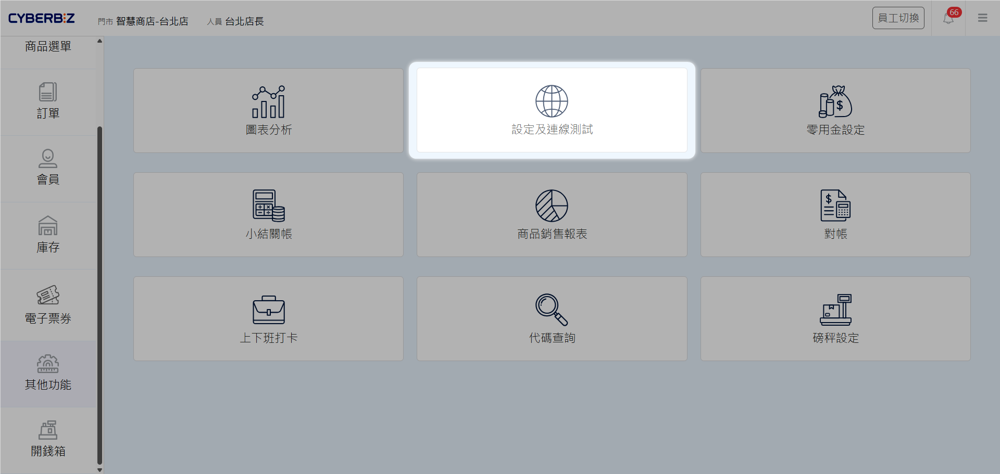
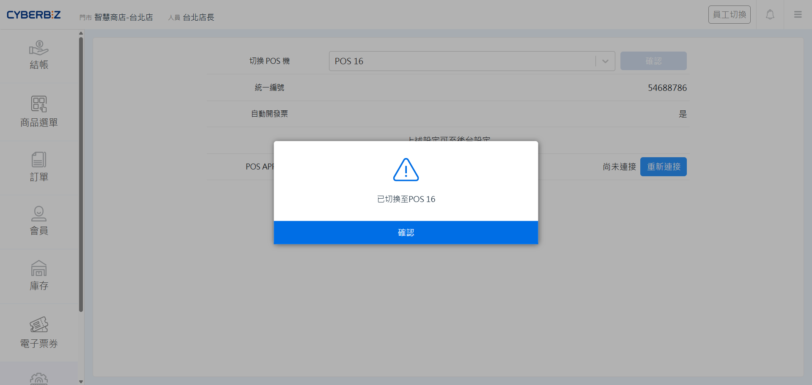
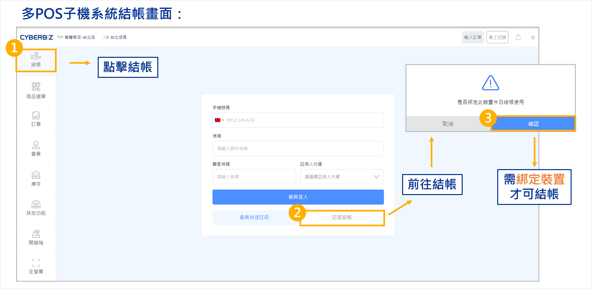
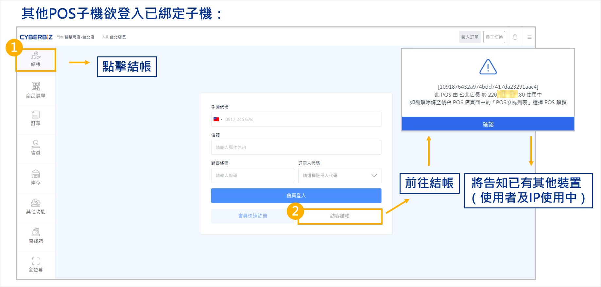
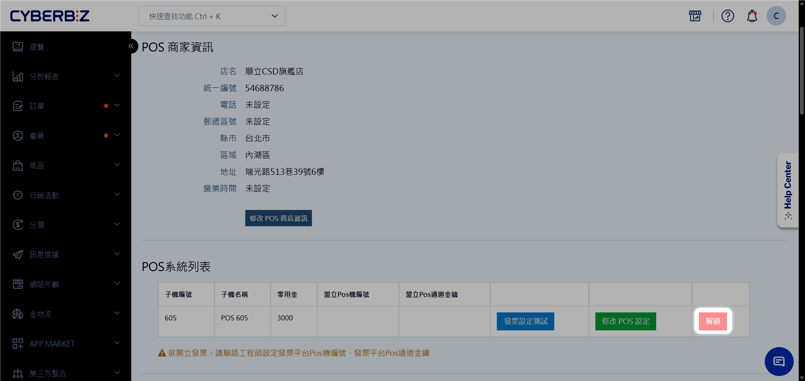
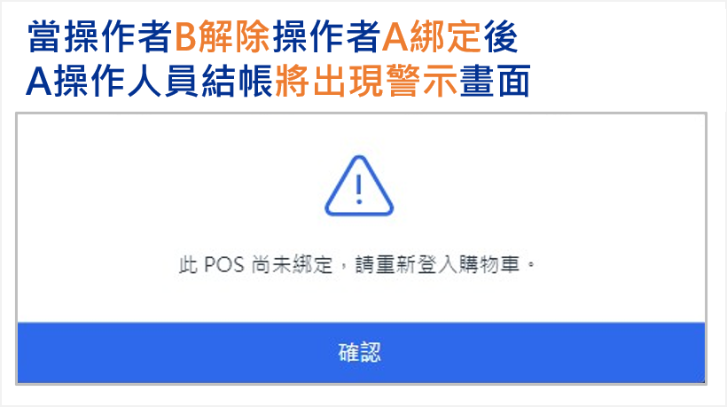

# 子機結帳綁定
瞭解 POS 子機綁定機制，防止多個裝置同時使用同個 POS 子機系統，造成結帳時發票重複開立或資訊混亂。
{ .subtitle }

[:lucide-tag:{ title="適用方案" }](../../resources/conventions#適用方案) | 進階 PLUS / 高手 PLUS / 企業
{ .doc-badge }

!!! tip "應用情境"
    - **設備排他性管控**：系統強制實施 **單一子機對應單一設備** 原則，防止多台裝置同時存取同一 POS 子機，以確保交易歸屬準確。
    - **避免發票異常**：系統透過鎖定機制，防止同一組發票字軌在不同登入狀態下被重複使用。
    - **裝置交接管理**：當班次更換或裝置更換時，透過正確的解鎖流程完成交接。

## 使用須知

- **系統預設機制**：此功能為系統核心預設，旨在保護帳務與發票正確性，無法手動關閉。
- **解鎖權限限制**：僅 **網站擁有者** 與 **POS 店長** 具備解除子機綁定的權限。一般店員無法自行解鎖。
- **解除影響**：一旦解除原操作人員的綁定，該裝置將立即被強制登出結帳頁面，請在解鎖前確認不影響他人工作。

## 操作流程

### 子機登入與結帳綁定

當您開始使用某台 POS 子機結帳時，系統會自動建立綁定關係。

1. 登入 POS 前台，前往 **其他功能 > 設定及連線測試**。
    { .screenshot }
2. 選擇欲使用的子機編號（若店內僅有一台子機，系統將自動跳過此步）。
    { .screenshot }
3. 前往 **結帳**，選擇任一方式結帳，即可於彈窗點選 **確認綁定**。
    { .screenshot }

### 解鎖與重新綁定

每一台 POS 子機僅限單一設備登入。若其他設備需接手子機結帳，請依以下流程排除佔用：

1. 當操作者 B 點擊 **結帳** 時，系統提示 **此 POS 機目前由 [操作者 A] 使用中**。
    { .screenshot }
2. 若操作者 B 確定接手該子機，請先確認具備管理後台權限，並執行遠端解鎖。
3. 登入 CYBERBIZ 管理後台，前往 **POS 功能 > 所有 POS 商店**。
4. 找到對應門市並進入該店 **POS 系統列表**。
5. 在子機管理清單中，找到使用中的裝置，點選 **解鎖**。
    { .screenshot }

6. 解鎖後，新設備即可重新執行綁定並進入結帳畫面。
7. 原本的操作者 A 若嘗試進行任何結帳動作，畫面會立即跳出 **POS 未綁定** 的警示，且無法繼續結帳作業。

    { .small-image }

## 常見問題

??? quote "我只是更換店員，一定要解鎖嗎？"
    不需要。如果是同一台裝置更換人員，建議直接使用 [員工切換](../others2/人員登入/#員工切換) 功能，這不會破壞子機的綁定關係，也能確保銷售紀錄正確歸給新員工。

