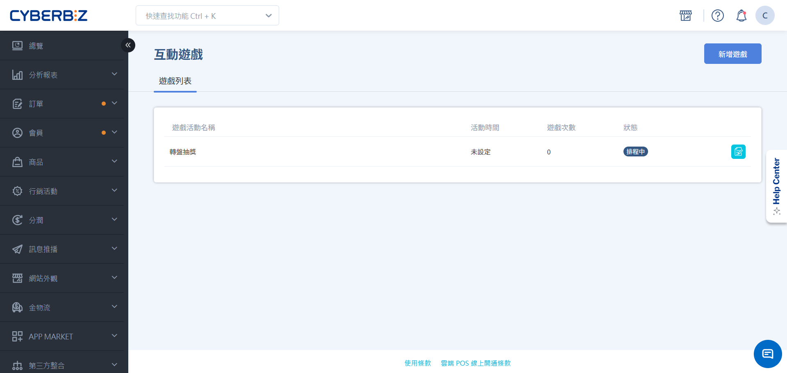
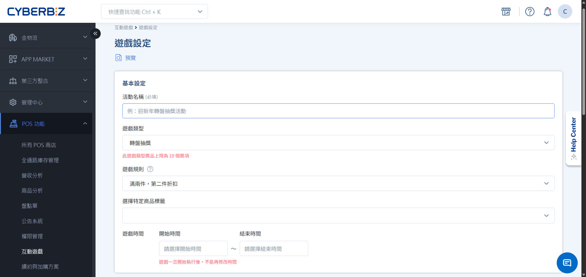
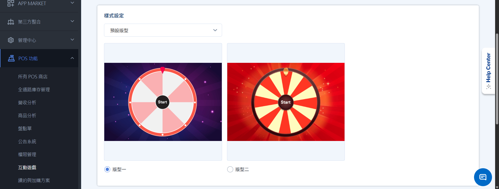
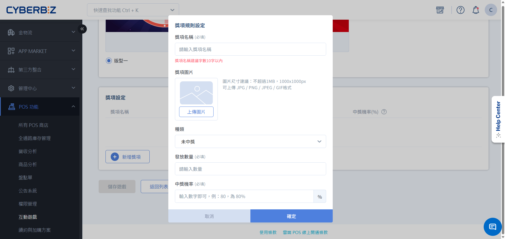

# 客顯互動遊戲
透過在客顯螢幕上設定趣味互動遊戲，商家可有效吸引顧客注意力，並針對特定標籤商品進行促銷與折扣。
{ .subtitle }

[:lucide-tag:{ title="適用方案" }](../../resources/conventions#適用方案) | 進階 PLUS / 高手 PLUS / 企業
{ .doc-badge }

{ .hero-page }

!!! tip "應用情境"
	- **新品促銷**：針對新上架商品設定「滿件抽獎」，增加顧客購買意願。
	- **節慶活動**：更換遊戲版型（如紅包、轉蛋），營造門市節慶氛圍。
	- **庫存去化**：將特定標籤商品設定為遊戲門檻，加速庫存流轉。

## 使用須知

- **不可刪除性**：遊戲一旦建立並儲存，系統將無法刪除該筆紀錄。
- **時間限制**：必須填寫 **開始** 與 **結束** 時間，遊戲方可啟用。
- **修改限制**：遊戲一旦儲存，其 **獎項內容** 與 **開始時間** 即無法更動。
- **圖片限制**：單篇遊戲上傳的所有圖片（樣式圖、獎項圖）總量不得超過 **10MB**。
- **自動結束**：若獎項在活動期間內全數抽完，遊戲將立即自動結束。

## 遊戲狀態說明

| 狀態 | 說明 |
| :--- | :--- |
| **排程中** | 遊戲開始時間未到，或時間設定尚未完成。 |
| **進行中** | 遊戲活動進行中，此時類型、標籤、開始時間與獎項皆不可修改。 |
| **已結束** | 活動時間已過，或獎項已全數發放完畢。 |
| **暫停中** | 活動手動暫停，需點擊「繼續遊戲」方可恢復。 |

## 操作流程

### 步驟一：建立遊戲

1. 前往 CYBERBIZ POS 管理後台，點選 **POS 功能 > 互動遊戲**。
2. 點擊 **新增遊戲**。
3. **基本設定**：
    - **活動名稱**：輸入易於識別的活動名稱。
    - **遊戲類型**：選擇「轉盤抽獎」或「紅包抽獎」。
    - **遊戲時間**：設定精確的起訖時間。
4. **設定觸發規則**：
    - **滿兩件，第二件折扣**：購買指定標籤商品 2 件為一組，即可抽獎。
    - **滿額抽獎**：指定標籤商品總額達標，即可抽獎（不累計）。
    - **滿件抽獎**：指定標籤商品總件數達標，即可抽獎（不累計）。
5. **選擇商品標籤**：勾選欲參與活動的商品標籤。

{ .screenshot }

### 步驟二：樣式與獎項設定

1. **樣式設定**：
    - 選擇預設版型（紅包、禮物、扭蛋）或上傳自訂主題圖片。
2. **獎項設定**：
    - 點擊 **新增獎項**。
    
        > 輪盤遊戲最多僅能新增 10 筆獎項。

    - **獎項名稱**：建議 10 字元內，以利在螢幕上清晰顯示。
    - **獎項種類**：可選「未中獎」、「折扣金額」、「百分比」或「贈品」（僅限滿額/滿件抽獎）。
    - **中獎機率**：所有獎項機率相加必須等於 **100%**。

{ .screenshot }

### 步驟三：綁定客顯機台

設定完成後，需至商店設定中啟用功能。

1. 前往 CYBERBIZ POS 管理後台，點選 **POS 功能 > 所有 POS 商店**。
2. 選擇目標商店，點選 **客顯行銷**。
3. 選擇對應的 POS 機台，點選 **編輯**。
4. 勾選 **啟用客顯行銷功能**。
5. 勾選 **客顯遊戲**，並從下拉選單選擇欲執行的遊戲。
6. 點擊 **儲存**。

{ .screenshot }

## 前台動畫效果

=== "轉盤抽獎"

    { .small-image }

=== "紅包抽獎"

    { .small-image }

## 常見問題

??? quote "抽中 **贈品** 後，系統會自動帶入嗎？"
    不會。抽中贈品後，**需由店員手動掃描贈品條碼加入購物車**，系統將自動將該品項轉為 0 元。

??? quote "遊戲時間結束了，但獎項沒抽完可以延長嗎？"
    可以。您可以直接修改遊戲的 **結束時間** 來延長活動。

??? quote "為什麼我的客顯螢幕沒有出現遊戲？"
    請確認：
    1. 遊戲狀態是否為 **進行中**。
    2. 商店設定中的 **客顯行銷** 是否已正確勾選該遊戲。
    3. 購物車內的商品是否符合設定的 **商品標籤** 與 **門檻**。

## 更多操作

- :lucide-layout-template:{ .lg }   
  [__客顯螢幕設置與布局__](../hardware/客顯螢幕){ data-preview }    
  了解如何正確連接客顯螢幕，並自訂客顯螢幕的顯示內容與版面配置。

