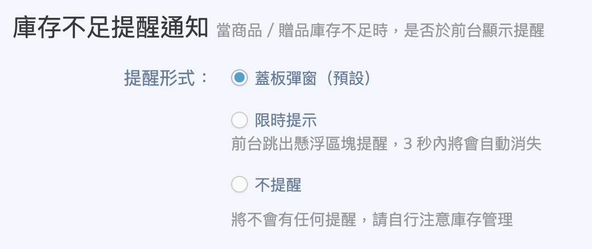
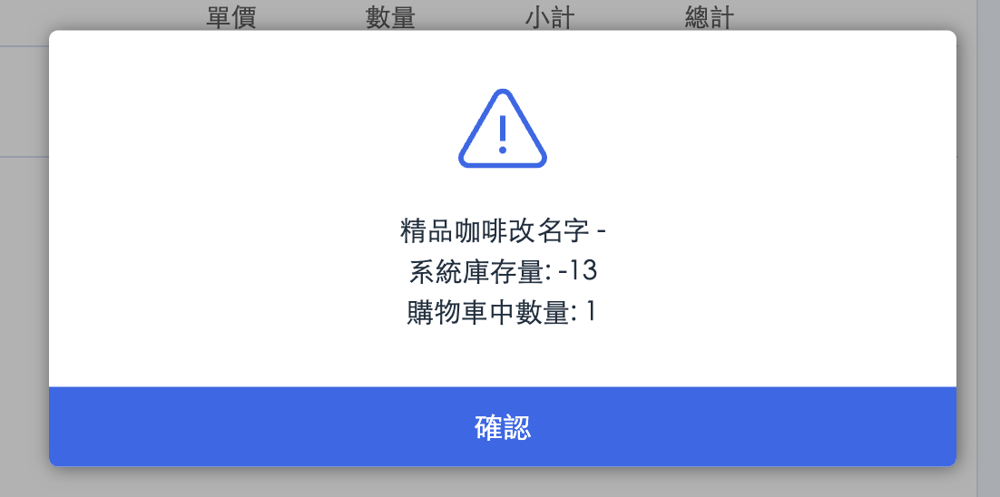
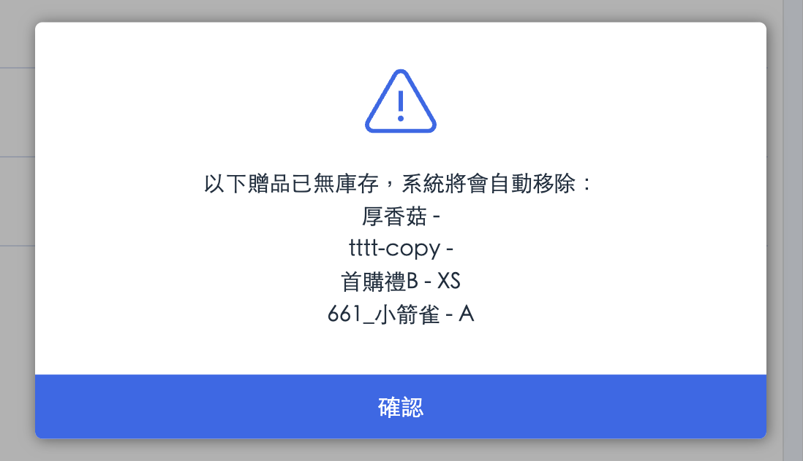
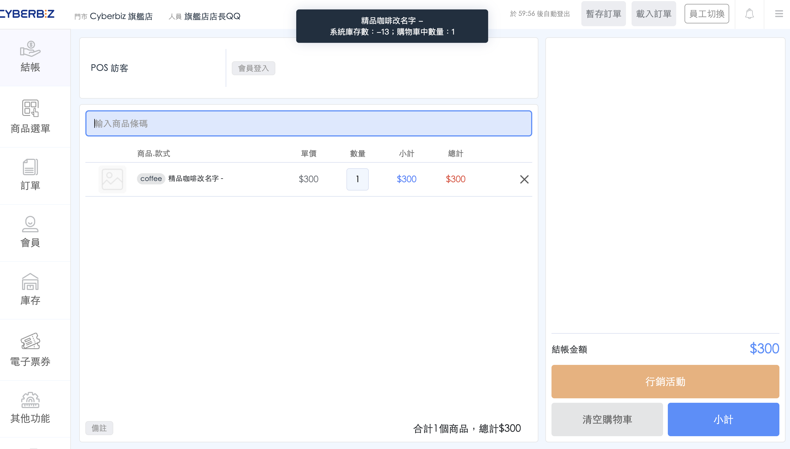
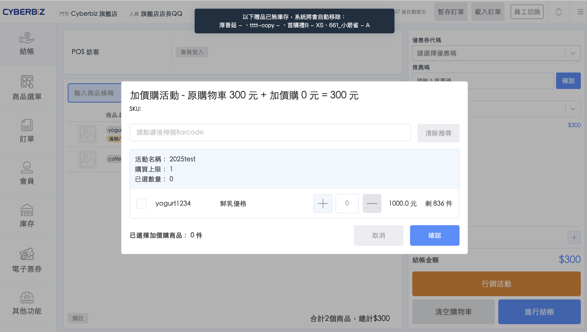

# 庫存不足通知
商家可根據門市作業習慣，彈性設定 POS 前台在商品或贈品庫存不足時的提醒方式，確保銷售流程順暢並降低誤售風險。
{ .subtitle }

[:lucide-tag:{ title="適用方案" }](../../resources/conventions#適用方案) | 進階 PLUS / 高手 PLUS / 企業
{ .doc-badge }

!!! tip "應用情境"
    - **嚴格控管庫存**：選擇「蓋板彈窗」強制門市人員確認，避免超賣。
    - **追求操作流暢**：選擇「限時提示」僅作視覺提醒，不中斷結帳動作。

## 設定提醒形式

1. 登入 CYBERBIZ 管理後台，前往 **POS 功能 > 所有 POS 商店**。
2. 在 **POS 商店列表** 中，點選欲設定的 **POS 店名**。
3. 下滑至 **庫存不足提醒通知** 區塊。
4. 根據門市需求，選擇以下三種提醒形式之一：

    | 提醒形式 | 顯示方式說明 | 適用情境 |
    | :--- | :--- | :--- |
    | **蓋板彈窗（預設）** | 前台會跳出彈窗提醒，需點擊 **確認** 才能關閉 | 適合需強制確認商品庫存，以免誤售的門市 |
    | **限時提示** | 前台上方顯示浮動提醒，3 秒內自動消失，不影響操作 | 適合希望保留操作流暢度的門市 |
    | **不提醒** | 不會顯示任何提醒，需自行注意庫存狀態 | 適合另有庫存控管機制的門市 |

5. 點擊頁面最下方的 **儲存**。

{ .screenshot }

## 前台顯示樣式參考

以下為不同提醒形式在商品與贈品庫存不足時的實際顯示效果：

| 提醒形式 | 商品庫存不足 | 贈品庫存不足 |
| :--- | :--- | :--- |
| **蓋板彈窗** | { .screenshot } | { .screenshot } |
| **限時提示** | { .screenshot } | { .screenshot } |
| **不提醒** | 無任何通知 | 無任何通知 |

