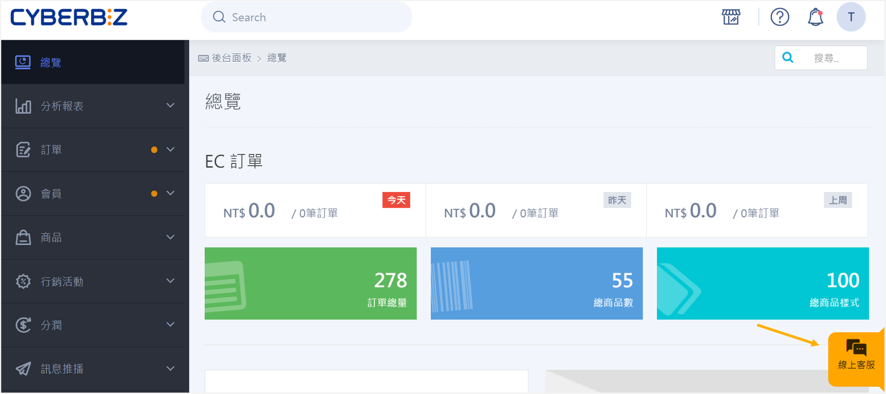
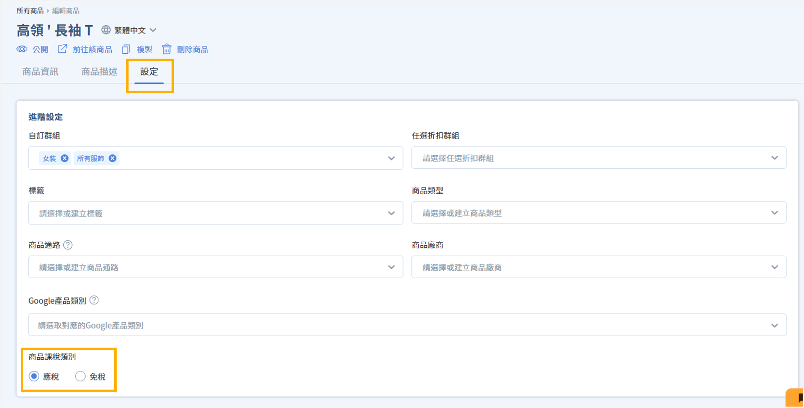
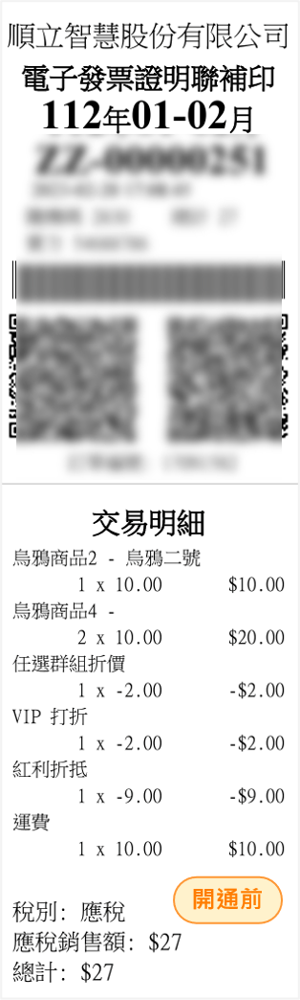
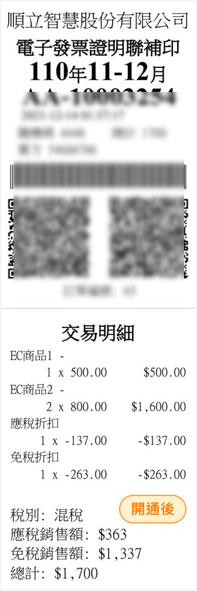

# 混稅發票
瞭解如何設定商品應稅或免稅屬性，並在結帳時自動計算並開立包含應稅與免稅項目的混稅發票。
{ .subtitle }

[:lucide-tag:{ title="適用方案" }](../../resources/conventions#適用方案) | 進階 PLUS / 高手 PLUS / 企業
{ .doc-badge }

!!! tip "應用情境"
    - **複合經營商家**：同時販售一般應稅商品（如生活雜貨）與免稅商品（如農產品）的商家。
    - **合規開立發票**：在一張發票中同時處理不同稅別的商品，符合台灣電子發票規範並簡化結帳流程。
    - **運費稅別自動歸類**：系統自動將運費歸類為應稅項目，確保混稅計算精確無誤。

## 使用須知

- **結帳管道限制**：混稅發票功能目前僅開放於 **EC 官網** 與 **POS 結帳** 使用。
- **功能開通**：此功能需聯繫客服人員進行後台權限開通。

## 操作流程

### 步驟 1：申請開通混稅功能

在開始設定商品前，需先聯繫 CYBERBIZ 客服團隊啟用混稅模組。

1. 登入 CYBERBIZ 管理後台。
2. 點選畫面右下角的 **客服視窗** 圖示。
3. 發送訊息告知客服人員欲申請開通 POS 混稅發票功能。

{ .screenshot }

### 步驟 2：設定商品稅別

針對不同屬性的商品設定其應稅或免稅屬性。

1. 前往 **商品 > 所有商品**。
2. 點選欲設定的商品進入編輯頁面。
3. 在商品資訊中找到 **設定** 區塊。
4. 將 **商品稅別** 欄位下拉選擇 **應稅** 或 **免稅**。
5. 點擊 **儲存** 完成設定。

{ .screenshot }

!!! tip "大量設定建議"
    若需設定多項商品，可 [匯出]() 商品，編輯 Excel 檔案中的 **商品稅別** 欄位，執行 [匯入]()，即可批次編輯。

## 系統計算邏輯

當混稅功能開通後，系統將依據以下邏輯處理發票與折扣：

- **發票明細**：發票將分別列出 **應稅銷售額** 與 **免稅銷售額**。
- **折扣比例分攤**：行銷活動產生的折扣金額，將依據商品原始金額比例，自動拆分為 **應稅折扣** 與 **免稅折扣**。
- **合併開立**：系統僅會開立 **一張** 混稅發票，不會分別開立免稅發票與應稅發票。
- **運費處理**：系統一律將運費歸類為 **應稅項目**。即使整單皆為免稅商品，若產生運費，發票亦會以混稅形式開立。

    

    - { .small-image title="開立應稅發票" }
    - { .small-image title="開立混稅發票" }

    

## 常見問題

??? quote "退貨或折讓時該如何處理？"
    混稅發票的退貨與折讓流程與一般發票相同。系統會根據原發票上的定價、應稅折扣及免稅折扣欄位自動進行對應處理，商家僅需依照標準折讓流程執行即可。

