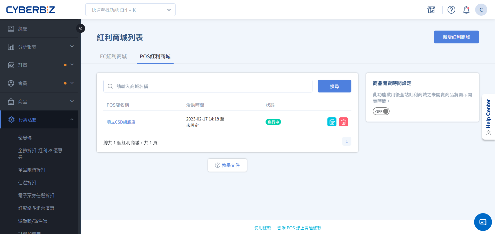
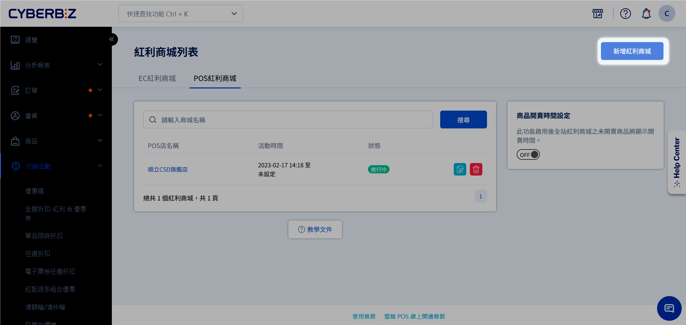
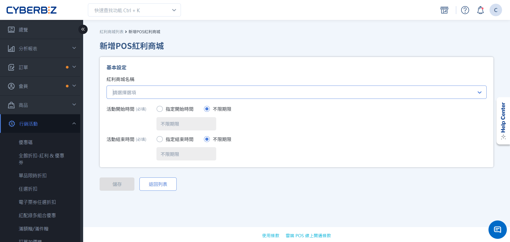
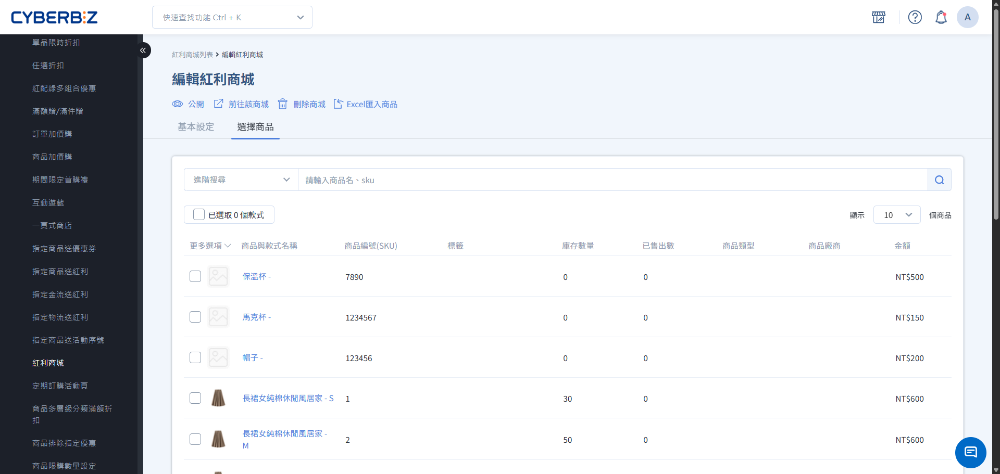
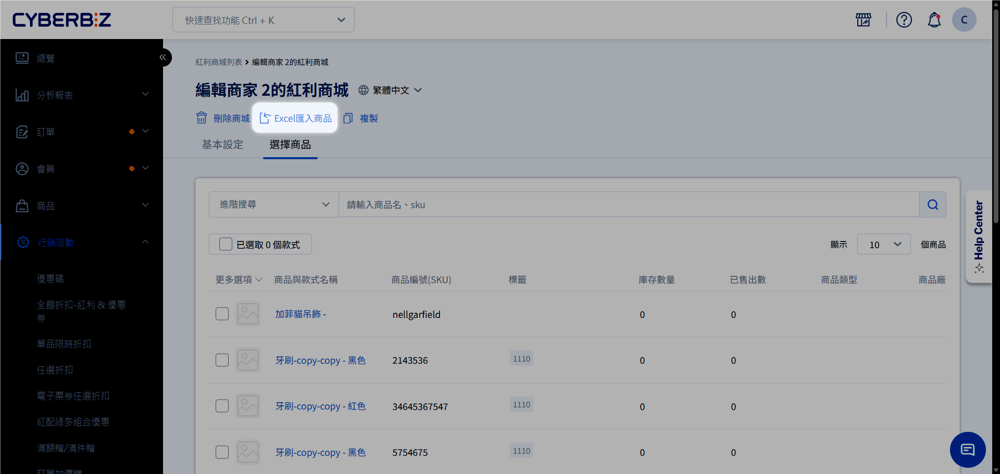
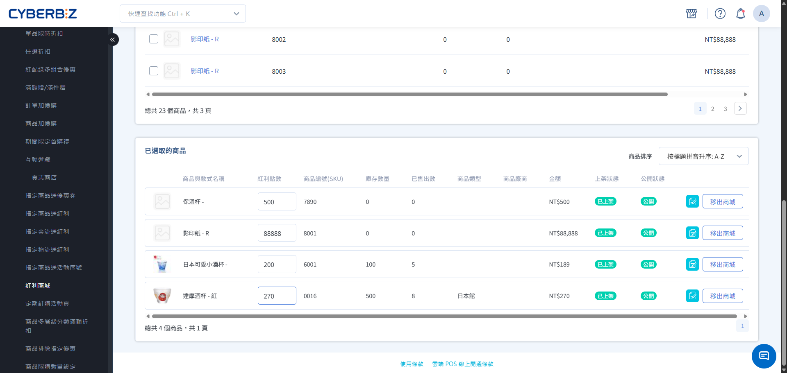
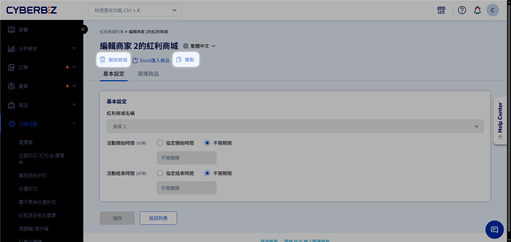

# 設定紅利商城 (POS)
建立專屬的線上紅利兌換商城，設定商品兌換所需點數，透過紅利積點機制提升會員回訪與品牌忠誠度。
{ .subtitle }

[:lucide-tag:{ title="適用方案" }](../../resources/conventions#適用方案) | 進階 PLUS / 高手 PLUS / 企業
{ .doc-badge }

{ .hero-page }

!!! info "版本差異說明"
    - **電商官網 (EC)** 與 **實體門市 (POS)** 皆支援紅利商城功能，此文件僅適用 **智能 POS** 紅利商城之設定方式。
    - 紅利商城在 PLUS 方案中屬於「行銷 A」選配模組（11 選 2），商家需確認已選配該模組方可使用。企業版則直接內建此功能。

## 紅利商城說明

**紅利商城** 提供一個獨立的商品展示與兌換空間，讓會員能將平日消費累積的紅利點數轉化為實質商品。透過這種 **只換不賣** 或 **點數專購** 的機制，能有效活化會員帳戶內的點數餘額，並建立長期的品牌黏著度。

同一商品在一般商店維持現金購買，在紅利商城則為點數兌換，兩者庫存共用。

!!! tip "應用情境"
    - **會員回饋計畫**：提供高價值商品僅限紅利兌換，激勵會員持續消費累積點數。
    - **點數消耗策略**：針對即將到期的點數，推出限時紅利商城活動，導流會員進站兌換。
    - **新品試用**：將試用品放入紅利商城，讓忠誠會員以點數搶先體驗，收集產品回饋。

## 使用須知

### 前台顯示與視覺規範
- **上架條件**：商品必須處於 **已上架** 且 **公開** 狀態，才會顯示在紅利商城中。
- **多款式商品顯示限制**：若加入紅利商城的商品具有多個款式（如不同顏色、尺寸），前台僅會固定顯示該商品的 **第一張主圖**，且消費者無法在商城頁面切換查看其他款式的對應圖示。建議商家選擇單一款式或確保主圖具代表性。
- **外觀色系**：紅利商城頁面恕不支援色票功能。

### 人員權限與操作範圍

- **管理權限**：僅限 **網站管理員** 具備後台設置與編輯紅利商城之權限。
- **店員前台權限**：
    - **商品檢索**：支援手動選取或直接掃描條碼（掃碼）搜尋紅利商品。
    - **即時試算**：檢視紅利商品之價格加總，並確認全單總紅利消耗（含一般折抵與商城兌換）。
    - **資格檢查**：結帳時系統將自動檢核顧客剩餘紅利是否足夠支付該筆交易。

### 售後退貨規則

- **紅利返還政策**：紅利商品一旦完成交易，若發生退貨情境，系統 **不返還** 該次交易所消耗之紅利點數。

## 於後台建立商城

### 步驟 1：建立紅利商城基本資訊

1. 登入 CYBERBIZ 管理後台，前往 **行銷活動 > 紅利商城**，點選 **POS 紅利商城** 頁籤。
2. 點擊右上角 **新增紅利商城**。
    { .screenshot }
3. 填寫以下欄位：
    - **紅利商城名稱**：**指定要綁定的 POS 門市**。
        - **一對一綁定**：一間 POS 店僅限綁定一個紅利商城，已綁定商城的門市將自動隱藏選項，不可重複建立。
    - **活動開始/結束時間**：勾選並設定生效區間。
    { .screenshot }
6. 點擊 **儲存**。

### 步驟 2：加入兌換商品

=== "手動勾選加入"

    1. 在商城編輯頁面中，切換至 **選擇商品** 頁籤。
    2. 透過名稱、SKU 或商品標籤搜尋欲加入的商品。
    3. 點擊商品右側的 **未加入商城** 按鈕（加入後文字會變更為已加入）。
    4. 若需一次加入多項商品，可勾選左側核取方塊後，點擊 **加入商城**。

    { .screenshot }

=== "EXCEL批次匯入"

    1. 若需加入大量商品、批次編輯或移除，可點擊右上角選單的 **Excel 匯入商品**：
    2. 選擇操作行為，依照格式填入商品 **SKU** 與對應的 **紅利換購金額**。
        - 檔案格式僅限 **.xlsx**。
        - 單一檔案大小不得超過 **2MB**。
        - 每次上傳上限為 **200 行**（若超過請分批上傳）。
    3. 系統將於背景執行，完成後會寄送 Email 通知。

    { .screenshot }

### 步驟 3：設定兌換所需點數

> 當您透過 **手動勾選加入** 商品時，請完成此步驟。 
    若您透過 **EXCEL批次匯入**，則請依匯入範本直接填寫換購金額，無須於此處設定。

1. 於 **選擇商品** 頁籤，捲動至下方的 **已選取的商品** 區塊。
2. 在 **紅利點數** 欄位中，輸入該商品兌換所需的點數數值（系統預設會帶入商品原價）。
3. 按下 **Enter** 或點擊空白處，系統將自動儲存設定。

{ .screenshot }

## 多門市紅利商城管理

### 複製商城

- **一鍵同步配置**：系統採取 **一個門市** 對應 **一個商城** 的一對一綁定邏輯，當多個門市需建立相同規格的商城時，可透過複製功能快速建立。
- **自動映射商品**：進入編輯頁點擊 **複製** 並指定 **門市** 與 **檔期** 後，系統將自動帶入具備相同的商品清單，大幅縮短上架時間。

### 刪除商城

- **解除綁定機制**：紅利商城與門市一旦綁定即無法直接變更；若門市需切換至新商城，須先將原商城 **刪除** 以釋放門市權限，方可重新進行綁定。

{ .screenshot }

## 於前台結帳

門市人員在 POS 前台為會員結帳時，可透過以下兩種方式將紅利商城商品加入購物車。

### 手動選取可換購紅利商品

1. 按照正常結帳流程，將一般商品加入購物車。
2. 點擊右下角 **小計** 進入結帳準備頁面。
3. 點擊 **行銷活動** 按鈕。
4. 在行銷活動清單中選擇 **紅利商城**。
5. 在彈出的紅利商城視窗中，選取欲換購的商品。
    - **限制**：若商品庫存不足或會員紅利點數不足，將無法選取。
6. 點擊 **確認**，紅利商品將加入購物車，並標示 **紅利商品** 標籤。
7. 點擊 **進行結帳**，結帳頁面會自動統計並顯示換購所需的紅利點數。

{ .screenshot }

### 結帳時掃到可紅利換購的商品

1. 當掃描槍掃描到已加入紅利商城的商品時，系統會自動偵測並顯示 **可紅利換購** 提示字樣。
2. 門市人員可點擊該提示字樣，直接開啟紅利商城選購視窗。
3. 選取欲換購的商品並點擊 **確認**。
    - **限制**：若商品庫存不足或會員紅利點數不足，將無法選取。
4. 系統將自動把該品項轉為紅利換購模式，並扣除對應點數。

{ .screenshot }