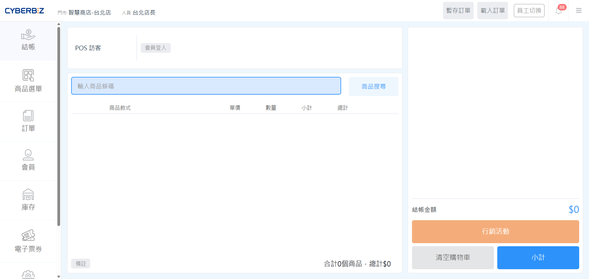
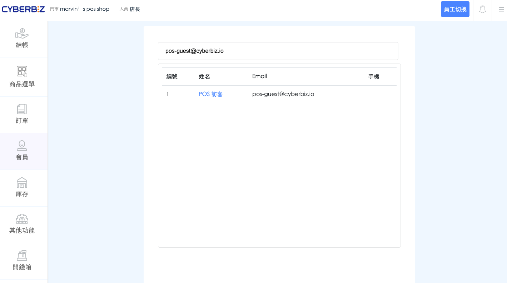

# 訪客結帳
訪客結帳功能讓商家能為「非會員」且「無意願註冊」的顧客完成交易。系統會自動套用預設帳號，協助門市在不強迫入會的前提下順利結帳。
{ .subtitle }

[:lucide-tag:{ title="適用方案" }](../../resources/conventions#適用方案) | 進階 PLUS / 高手 PLUS / 企業
{ .doc-badge }

!!! tip "應用情境"
    - **快速完成交易**：顧客趕時間或不願提供個人資料時，店員可快速進入訪客模式完成收銀，避免櫃檯塞車。
    - **保留經營彈性**：不強迫所有顧客入會，維持良好的消費體驗，同時仍能透過預設帳號追蹤訂單紀錄。

## 使用須知

- **系統預設帳號**：訪客結帳統一使用 `pos-guest@cyberbiz.io` 作為登入信箱，此設定為系統固定，無法手動更改。
- **會員權益限制**：訪客訂單 **無法** 累積消費金額、紅利點數、VIP 等級，亦無法使用註冊禮或會員專屬優惠券。
- **訂單歸屬**：所有訪客訂單皆會歸在同一個系統預設帳號下，建議僅在顧客明確表示不入會時使用。

## 操作流程

### 步驟一：後台開啟功能

在使用訪客結帳前，必須先在管理後台完成授權設定。

1. 登入 CYBERBIZ 管理後台，前往 **POS 功能 > 所有 POS 商店**。
2. 在商店列表中點選目標 **POS 店名**，進入商店設定。
3. 下滑找到 **開啟訪客結帳功能** 並勾選。
4. 點擊頁面下方的 **儲存**，完成設定。

{ .screenshot }

### 步驟二：POS 前台訪客登入

完成後台設定後，POS 前台的登入畫面將會出現對應選項。

1. 開啟 POS 前台登入頁面。
2. 點選畫面上的 **訪客結帳** 按鈕。
3. 系統將自動以 `pos-guest@cyberbiz.io` 帳號登入結帳畫面。

{ .screenshot }

### 步驟三：查詢訪客訂單

若後續需要查詢過往的訪客交易紀錄，可透過系統帳號進行篩選。

1. 在 POS 前台點選 **會員查詢**（或於管理後台前往 **訂單 > 所有訂單**）。
2. 在搜尋欄位輸入預設帳號：`pos-guest@cyberbiz.io`。
3. 系統將列出所有使用訪客身分完成的訂單。

{ .screenshot }

## 常見問題

??? quote "訪客結帳後，顧客想補登會員可以嗎？"
    目前系統不支援訪客訂單追溯轉移至一般會員帳號。若顧客需享有會員權益，**請務必在結帳前完成** [會員補登](../check/index/#於結帳頁補登)。

??? quote "為什麼前台看不到訪客結帳按鈕？"
    請先確認管理後台的 **開啟訪客結帳功能** 已正確儲存，並將 POS 前台重新登入或重新整理頁面。

