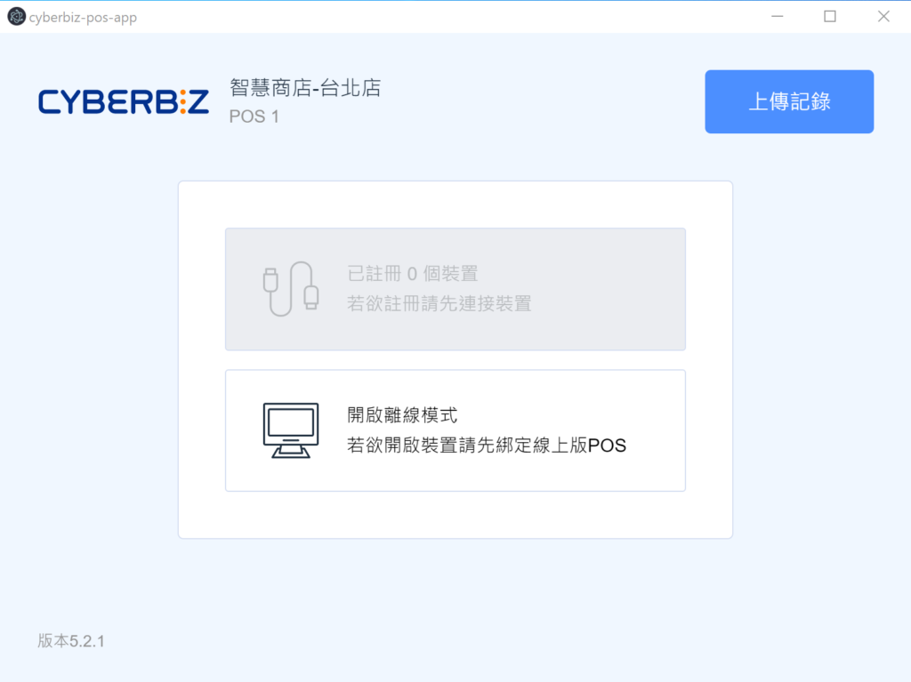
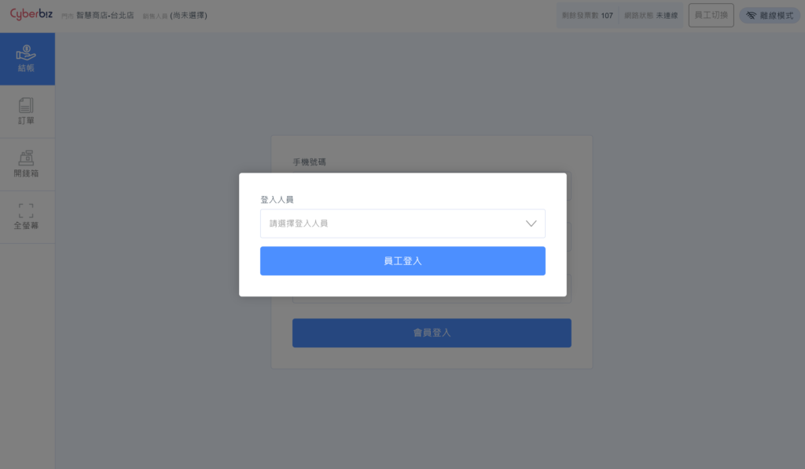
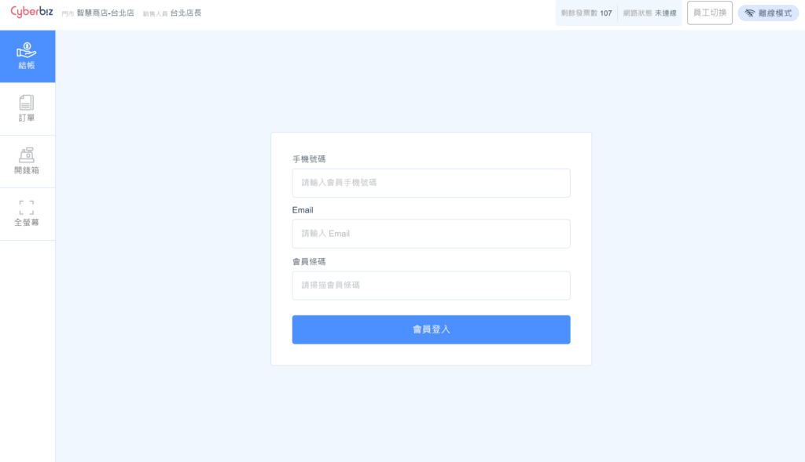
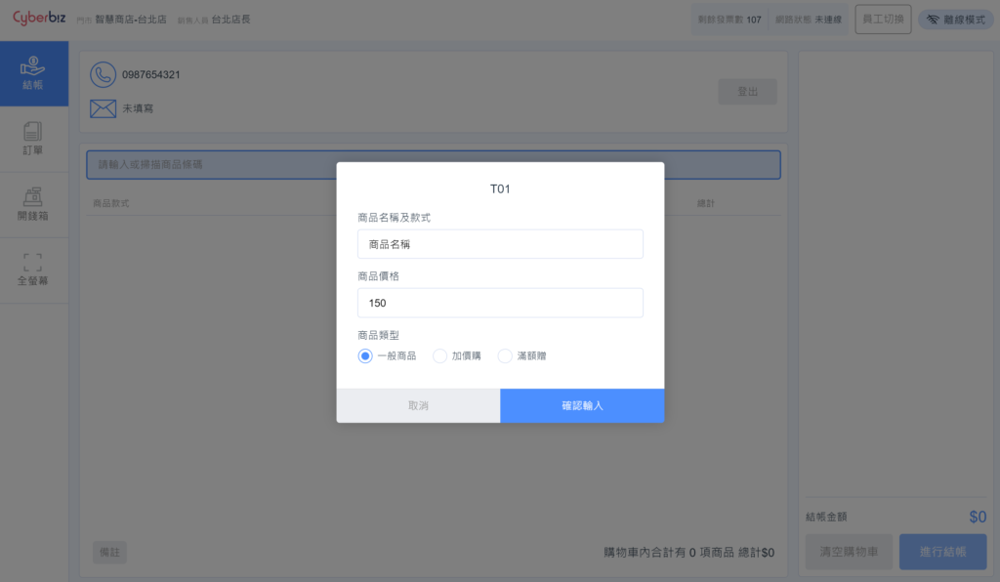
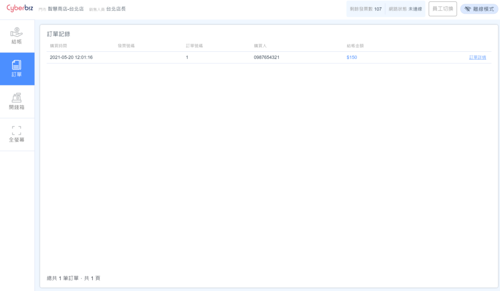
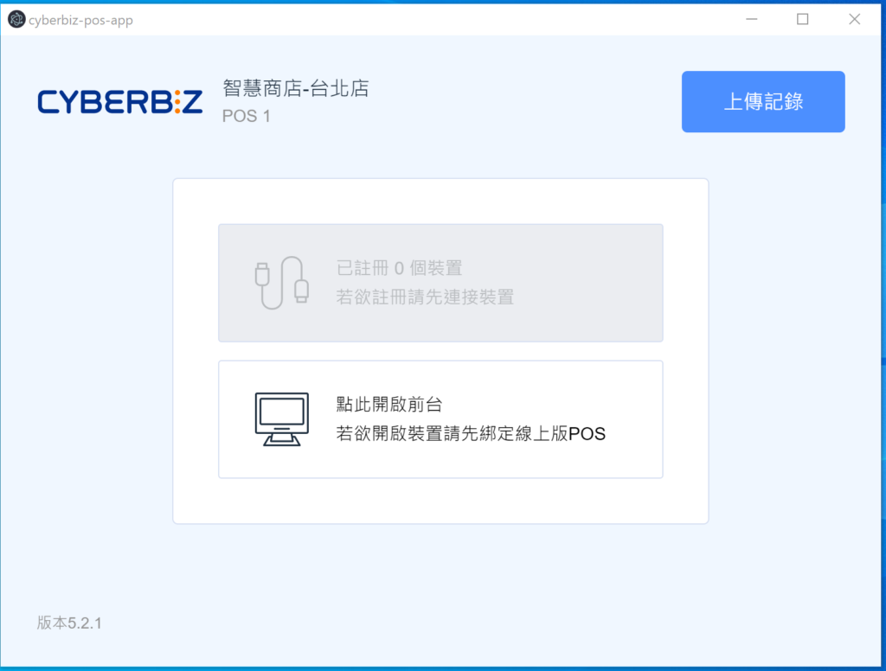
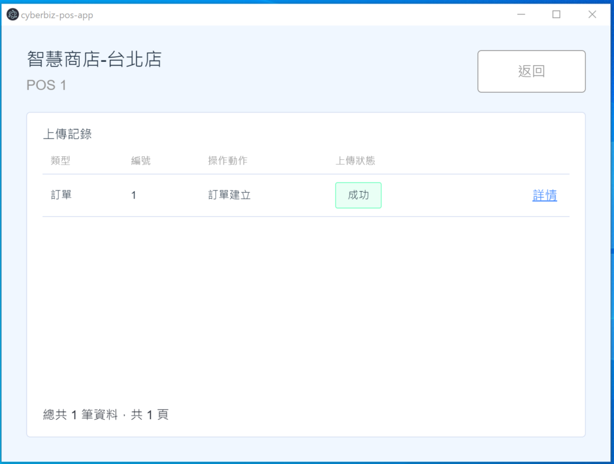

# 離線結帳模式
當門市遇到網路斷線或不穩時，CYBERBIZ 提供「離線模式」應急方案。店員仍可維持正常的結帳、開立發票與列印動作，待網路恢復後，系統將自動同步資料至雲端後台。
{ .subtitle }

[:lucide-tag:{ title="適用方案" }](../../resources/conventions#適用方案) | 進階 PLUS / 高手 PLUS / 企業
{ .doc-badge }

!!! tip "應用情境"
    - **突發斷線**：電信商服務中斷或門市 Wi-Fi 異常時，不間斷完成顧客結帳。
    - **尖峰流量**：網路極度遲緩導致雲端同步失敗時，主動切換至離線模式以確保收銀流暢。
    - **外部展銷**：在網路環境較差的外部場地（如百貨快閃店、市集）進行收銀。

## 使用須知

- **驅動程式要求**：請務必將 [CYBERBIZ POS 驅動程式]() 更新至最新版本，以確保離線同步機制運作正常。

## 離線時操作

### 步驟一：開啟離線模式

當 POS APP 偵測到失去網路連線時，前台登入畫面的按鈕會自動變更。

1. 點擊 **開啟離線模式** 按鈕。
    { .screenshot }
2. 使用下拉選單選擇當前登入的 **店員名稱** 並登入。
    { .screenshot }
3. 若有會員購物，可進行 **會員登入**（搜尋記錄可能受限）。
    { .screenshot }

### 步驟二：掃描與結帳

1. **掃描 SKU**：使用掃碼槍掃描商品標籤，或手動輸入 SKU 碼。

    > :lucide-triangle-alert: 離線模式下需準確掃描商品條碼（或輸入 SKU），以便恢復連線時系統能正確配對商品。

    { .screenshot }

2. **輸入金額**：離線模式需手動輸入商品單價，並點選商品類型（一般價格/加價購/滿額贈）。
3. **完成結帳**：完成付款動作後，系統會自動開立並列印發票。
4. **確認紀錄**：您可於 **訂單列表** 查看該筆已成立的離線交易。

    > :lucide-triangle-alert: 離線時若手動輸入的價格與系統原始設定有出入，恢復連線後，系統會自動將該筆差額標記為「店長改價」。

    { .screenshot }

## 恢復連線後同步

### 步驟一：系統自動偵測

1. 當網路恢復時，POS APP 會自動偵測狀態。
2. 按鈕將從 **開啟離線模式** 變回 **點此開啟前台**。

{ .screenshot }

### 步驟二：上傳離線訂單

離線期間產生的訂單會進入上傳排程，並在背景自動傳送至雲端。

1. 點擊 **上傳紀錄** 檢視同步狀態。
    - **等待中**：訂單尚在排程中。
    - **成功**：訂單已完成同步至後台。
2. 您可點擊 **詳情** 確認訂單內容是否完整。

{ .screenshot }

### 步驟三：雲端資料自動校正

恢復連線後，雲端 POS 會自動執行以下校正：

- **商品資訊**：根據 SKU 自動更新正確的商品名稱。
- **價格紀錄**：若離線輸入價格與後台不同，會自動標記為「店長改價」。

## 常見問題

??? quote "離線模式下可以掃描會員條碼嗎？"
    可以。只要條碼內含的是會員手機號碼或卡號，系統會記錄下來。但由於無法即時與雲端資料庫比對，部分會員權益（如紅利點數、特定 VIP 折扣）可能無法即時顯示，需待同步後由系統計算。

??? quote "恢復連線後，發現訂單上傳失敗怎麼辦？"
    請先確認網路連線是否已完全穩定。若持續失敗，請點開 **上傳紀錄** 查看錯誤原因，並聯繫技術客服協助。請勿在訂單成功上傳前清除瀏覽器暫存或解除安裝 POS APP。

??? quote "離線模式可以進行退貨操作嗎？"
    建議待恢復連線後再進行退貨。離線模式主要設計為「應急結帳」，退貨涉及庫存返還與款項退回，需在連線狀態下作業較為精確。

