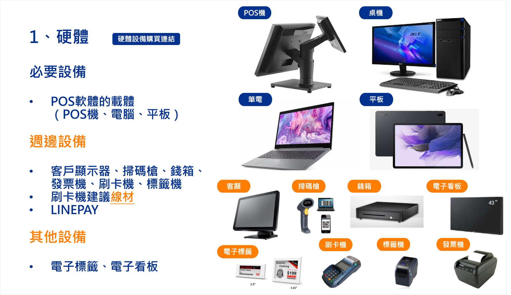

# 開始使用
建立門市營運的第一步：了解智能 POS 的軟硬體需求、第三方服務申請及核心系統邏輯。
{ .subtitle }

[:lucide-tag:{ title="適用方案" }](../../resources/conventions#適用方案) | 進階 PLUS / 高手 PLUS / 企業
{ .doc-badge }

## 設備與軟體清單

在正式開通 POS 功能前，請確保已完成以下硬體設備與軟體環境的規劃。

{ .screenshot }

=== "硬體設備"

    === "必要設備"

        

        - :lucide-settings:{ .lg }
          __POS 結帳點__ 
          作為 POS 軟體的運行平台。您可以依據結帳場景（如：固定櫃台或移動結帳），選擇 **POS 機、桌上型電腦、筆電或平板電腦**。  
          [→ 了解系統硬體與環境需求](../hardware/)

        

    === "周邊設備"
    
        

        - :lucide-printer:{ .lg }
          __發票機__ 
          用於列印電子發票。支援 [EPSON](../hardware/EPSON%20有線發票機/) 或 [Posiflex](../hardware/Posiflex%20有線發票機) 等有線發票機。

        - :lucide-credit-card:{ .lg }
          __刷卡機__ 
          串接金流服務。支援 [台新有線刷卡機](../hardware/台新有線刷卡機/)或 [MYPAY 無線刷卡機](../hardware/MYPAY%20無線刷卡機/)。

        - :lucide-tags:{ .lg }
          [__標籤機__](../hardware/標籤印表機/) 
          列印商品條碼或分類標籤。

        - :lucide-monitor:{ .lg }
          [__客顯螢幕__](../hardware/客顯螢幕/) 
          向顧客展示交易金額與促銷資訊。

        - :lucide-scan-barcode:{ .lg }
          __掃碼槍__ 
          快速讀取商品 SKU 條碼與會員載具。

        - :lucide-archive:{ .lg }
          __錢箱__ 
          存放營業現金，可由 POS 系統連動開啟。
        

    === "其他設備"

        

        - :lucide-cpu:{ .lg }
          __電子標籤__ 
          實現門市與官網價格同步顯示。

        - :lucide-tv-2:{ .lg }
          __電子看板__ 
          播放品牌宣傳影片或門市優惠活動。
          
        

    !!! warning "服務支援限制"
        為確保系統穩定性，商家選用軟硬體時請務必確認系統支援。若非採用 CYBERBIZ 官方認證設備，將無法提供相關的技術服務支援。
        

=== "軟體安裝"

    

    - :lucide-layers:{ .lg }
      __CYBERBIZ 智能 POS 系統__ 
      核心銷售系統，請洽您的開店顧問取得網站連結與帳戶。

    - :lucide-download:{ .lg }
      [__POS 驅動程式__](../software/驅動程式/) 
      用於連結周邊硬體設備（如發票機、印表機）的必要驅動程式。

    

=== "第三方服務"

    

    - :lucide-file-text:{ .lg }
      [__盟立電子發票__](../third-party/盟立電子發票/) 
      電子發票服務中心申請，確保發票開立合規。

    - :lucide-qr-code:{ .lg }
      [__LINE Pay 掃碼支付__](../check/LINE%20PAY%20掃碼支付/) 
      申請 LINE Pay 商家權限，支援行動支付結帳。

    

## 建置前準備

在開通 POS 功能前，請先完成官網端的基礎設定，並理解系統運作邏輯。

=== "官網預設置"

    

    - __① 費用結清__ 
      確認 POS 系統相關費用已完成付款。

    - [__② 建立商品與 SKU__]() 
      確認官網商品已建置，且 **每款商品皆已填寫 SKU 碼**（SKU 為商品唯一身分證）。  
      [→ 大量填補商品 SKU 碼教學]()

    - __③ 更新庫存設定__ 
      檢查官網商品庫存。若未設定為 **無限庫存 (∞)**，在 POS 開通後庫存將預設歸零。

    - __④ 提出開通申請__ 
      向開店顧問提出需求，開通後後台選單將出現 **POS 功能** 頁籤。

    

=== "核心概念理解"

    

    - :lucide-git-branch:{ .lg }
      [__全通路庫存管理__](../inventory/全通路庫存管理/) 
      EC 官網與 POS 門店為 **獨立門市、獨立庫存**。系統開通後，可使用進/出/調倉單或盤點功能進行庫存增減調整。

    - :lucide-plug:{ .lg }
      [__帳號權限管理__](../others2/員工權限與帳號管理/) 
      理解角色身分建置方式，並將員工帳號綁定身分

    
