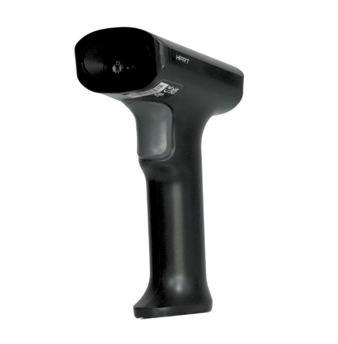

# 設定 POS 掃碼槍 (HPRT N130)
了解如何連接 HPRT N130 條碼掃描器至 POS 系統，並進行連線測試、商品掃描與常見故障排除。
{ .subtitle }

[:lucide-layers:{ title="適用產品" }](../../resources/conventions#適用產品) | 智能 POS
{ .doc-badge }

!!! tip "應用情境"
	- **快速結帳**：在 POS 結帳畫面直接掃描商品條碼，自動帶入商品資訊與金額。
	- **商品搜尋**：於後台或 POS 搜尋欄位掃描條碼，快速定位特定商品。
	- **庫存盤點**：配合盤點功能掃描商品，提升庫存校對效率。

## 使用須知

- **適用設備**：HPRT N130 採用 USB 介面，連接後系統會自動辨識為輸入裝置，無需額外安裝驅動程式。

  	{ .small-image }

- **輸入法限制**：掃描時請確保目前的輸入法切換至 **英文模式**，避免掃描出的條碼數字因輸入法干擾而產生錯誤。
- **事前建檔準備**：掃描器只負責讀取條碼，不會自動建立商品資料。若 POS 查無商品，請優先確認商品後台條碼設定。
- **維護建議**：請保持掃描視窗乾淨，避免刮傷或沾污，以免影響掃描效果。

## 連接與連線測試

首次使用或更換裝置時，建議先進行基礎連線測試。

1. 將掃描器 USB 接頭插入電腦或 POS 主機的 USB 埠。
2. 掃描器將自動開機並發出提示音。
3. 開啟電腦中的 **記事本** 或 **Excel**。
4. 將游標置於空白處，掃描任一商品條碼。
5. **預期結果**：畫面應正確顯示該條碼的數字序列。

## 執行商品掃描

在 POS 系統中進行結帳或搜尋。

1. 登入 POS 系統，進入 **結帳** 或 **商品搜尋** 畫面。
2. 點擊搜尋欄位，**確保游標位於欄位中**，將掃描器光線對準商品條碼中央。
3. 聽到提示音後，系統將自動將條碼輸入欄位並帶出對應商品。

!!! info "記事本可以掃出條碼，但 POS 無法帶出商品？"
    掃碼槍僅負責讀取條碼數字。若掃描後 POS 查無商品，請優先確認後台商品資料中是否已正確填寫該條碼。

## 常見問題

??? quote "掃描器沒有反應，燈號未亮？"
    1. 檢查 USB 線是否插緊。
    2. 嘗試更換其他 USB 埠位測試。
    3. 若仍無反應，請聯繫硬體供應商確認裝置狀態。

??? quote "掃描有聲音，但畫面沒有出現條碼數字？"
    請確認：

    - 是否有先點選要輸入條碼的欄位。
    - 可先開啟記事本測試是否能掃出條碼。
    - 若記事本也沒有顯示，請重新插拔掃描器，或改插其他 USB 孔測試。

    若只有特定商品無法掃出，請改掃描其他商品測試：

    - 若其他商品可正常掃出，請檢查該商品條碼是否清楚、完整。
    - 若條碼可掃出，但 POS 查無商品，請確認後台是否已建立該商品條碼。

??? quote "掃描後 POS 顯示「查無商品」？"
    - **確認建檔**：商品後台是否已建置該商品條碼。
    - **核對條碼**：請至管理後台確認該商品的「條碼」欄位是否與掃描出的數字完全一致。
    - **條碼完整性**：檢查商品包裝上的條碼是否破損、髒污或印刷不清楚。

??? quote "掃描器設定異常，如何恢復預設值？"
    請使用原廠手冊中的 **Restore Factory Defaults** 設定條碼，掃描後會恢復原廠預設值，**原本調整過的掃描器設定會被清除**。

