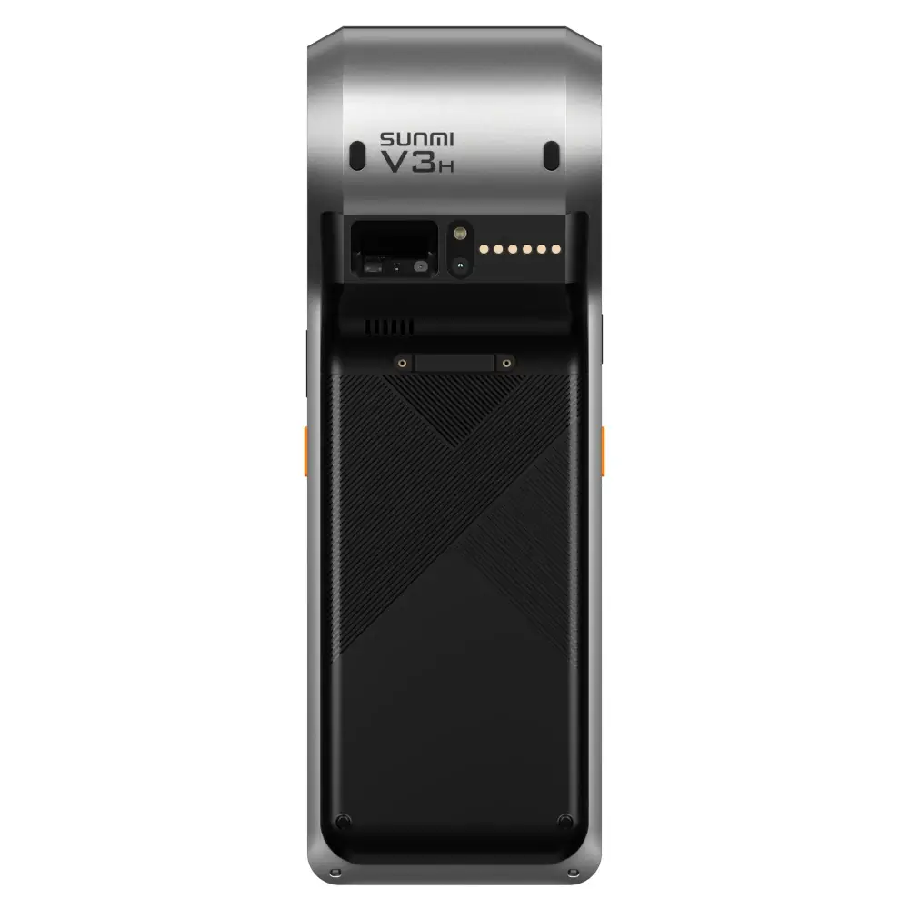
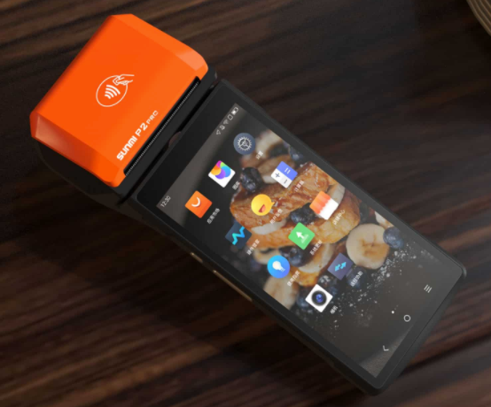
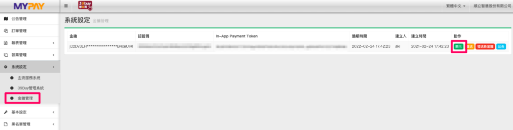
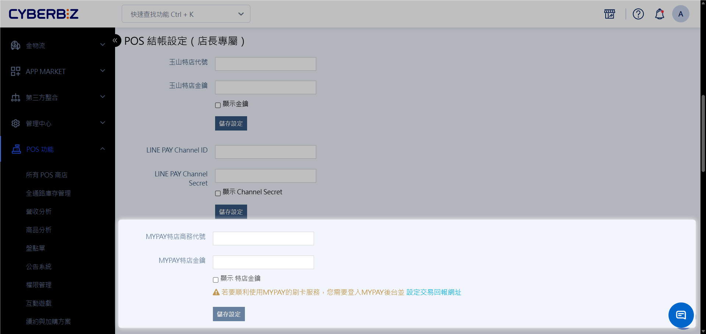
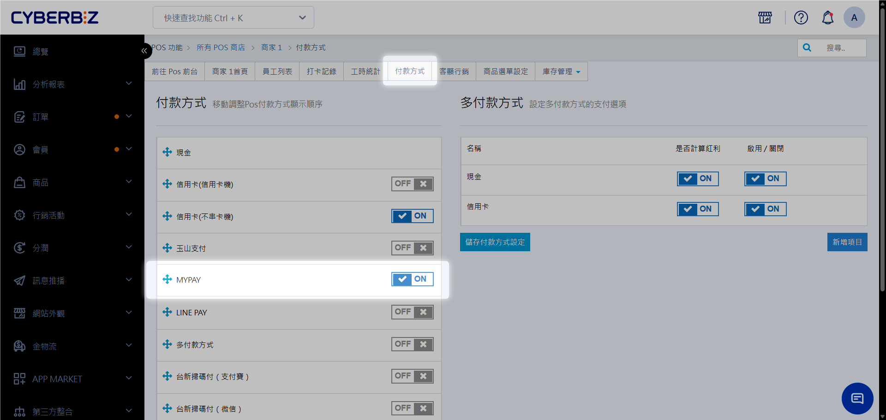
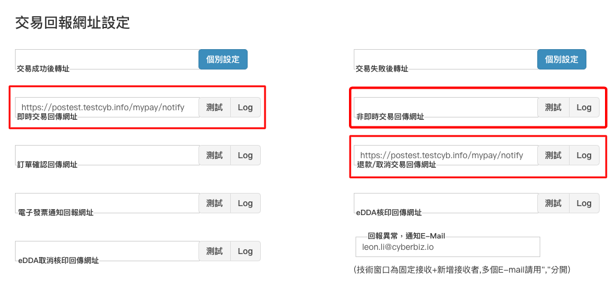
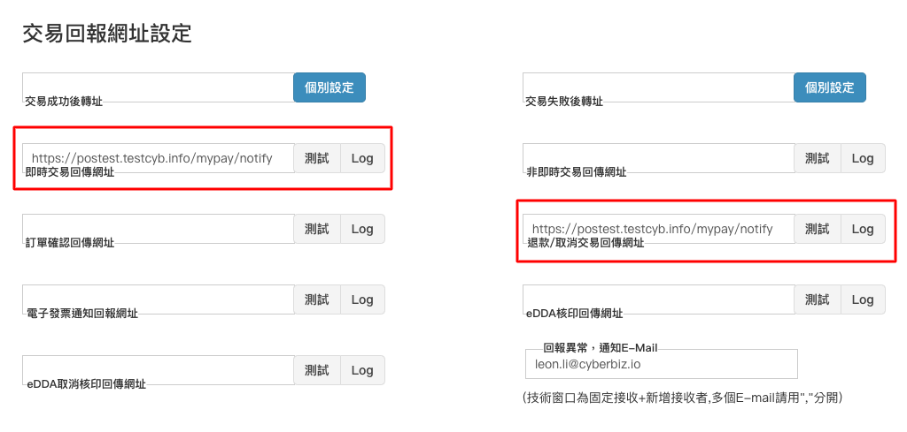
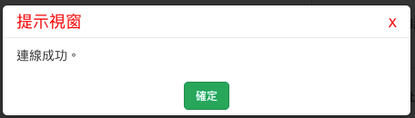

# 商米無線刷卡機
透過商米（Sunmi）無線刷卡發票機，商家可以結合平板電腦實現「移動式 POS」店點，適合快閃店、外帶櫃檯或大型門市的機動結帳需求。
{ .subtitle }

[:lucide-tag:{ title="適用方案" }](../../resources/conventions#適用方案) | 進階PLUS / 高手 PLUS / 企業
{ .doc-badge }

!!! tip "應用情境"
    - **移動結帳**：在展場或快閃店環境，**只需 Wi-Fi 即可完成收款與發票列印**，無需傳統收銀台的大型線路。
    - **分流作業**：在門市人潮擁擠時，店員可手持設備在排隊人群中先行結帳，紓解櫃檯壓力。
    - **一機多用**：整合 **信用卡刷卡、條碼掃描與發票列印** 功能，簡化門市硬體配置。

## 使用須知

- **金流限制**：商米刷卡機方案必須搭配 **MyPay 金流服務**，請務必先完成金流申請。
- **發票規範**：刷卡機僅作為「印表機」使用，不含發票開立服務。商家必須購買 [盟立]() 發票服務方可開立發票。
- **驅動程式**：使用 MyPay 刷卡機方案時，**請勿安裝** CYBERBIZ POS APP 驅動程式，兩者通訊機制不同。
- **耗材規格**：限用 **10m 公版感熱紙捲**（寬 5.7cm / 外徑 3.6cm），使用過大紙捲將導致機蓋無法關閉。

## 設備認識

=== "商米 V3H"
    
    **特點**：

    - 專業手持式 POS 終端。
    - 內建 5.7 吋螢幕與高速熱感式印表機。
    - 支援 4G 與雙頻 Wi-Fi。

    { .screenshot }
    

=== "商米 P2 Pro"
    
    **特點**：

    - 全螢幕觸控設計。
    - 輕薄美觀，適合高質感門市。
    - 支援磁條卡、晶片卡與感應支付。

    { .screenshot }

## 前置作業：MyPay 金流申請

在進行系統設定前，請確保已取得以下資料：

1. **選購設備**：請洽您的 CYBERBIZ 業務窗口選購對應型號。
    - 若您自 CYBERBIZ 購買刷卡機，機器內將內附上一捲紙捲。
2. **申請金流**：前往 [MyPay 申請網址](https://query.onecardpass.com/application/cardreader/b7b68f) 填寫資料。
    - **審核時程**：約需 2 週，結果將以 Email 通知負責人。(若申請失敗，需重新申請)
    - **諮詢電話**：MyPay 客服 04-23220267 #25。
3. **取得金鑰**：審核通過後，您將獲得：
    - **MyPay 特店商務代號**
    - **MyPay 後台帳號**
    - **MyPay 卡機名稱**

## 操作流程

### 步驟一：綁定設備裝置

收到刷卡機後，登入刷卡機上的 MyPay App，[完成綁定](https://www.mypay.com.tw/index.php/zh-tw/news/new-features-online/bind-your-device-and-activate-the-mypay-with-confidence-easy-to-get-started-and-a-smooth-experience)。

- 設備名稱請輸入：`[您的統編]_01`，例如：`12345678_01`

### 步驟二：綁定 CYBERBIZ 管理後台

1. **取得 MyPay 金鑰**：登入 [MAPAY 管理後台](https://biz.spay.com.tw/auth/login)，前往 **系統設定 > 金鑰管理**，取得 **MYPAY 特店金鑰**。
    { .screenshot }
2. **進入 CYBERBIZ 後台**：登入 CYBERBIZ 管理後台，前往 **POS 功能 > 所有 POS 商店**。
3. **填寫 API 資訊**：於 **POS 結帳設定** 區塊填入 **MyPay 特店商務代號** 與 **MyPay 特店金鑰**。
    { .screenshot }
4. **設定發票系統**：點擊 **修改 POS 設定**。
    { .screenshot }
    - **POS 發票設定**：選擇 **盟立發票**。
    - **發票機設定**：選擇 **MYPAY 發票機**。
    { .screenshot }
5. **配置卡機代碼**：**MYPAY 卡機名稱**：填入 `[您的統編]_01`（例：`12345678_01`）。
    { .screenshot }
6. **啟用付款方式**：點擊 **付款方式** 頁籤，將 **MYPAY** 開關切換為 `開啟 (ON)` 並儲存。
    { .screenshot }

### 步驟三：MyPay 後台 Webhook 設定

為了確保交易成功後能正確回傳至 CYBERBIZ 系統，必須設定回報網址。

1. 登入 [MyPay 管理後台](https://biz.spay.com.tw/auth/login)。
2. 前往 **系統設定 > 金流服務系統 > 連線通知設定**。
3. 根據使用機型，於指定欄位填入對應網址。
    - **網址格式**：`https://[您的商家網址]/mypay/notify`
    - **網址範例**：`https://shop123.cyberbiz.co/mypay/notify`

    === "商米 V3H"

        以下 **三個欄位** 填入上述相同的回傳網址：

        - **即時交易回傳網址**
        - **非即時回傳網址**
        - **退款/取消交易回傳網址**

        { .screenshot }

    === "商米 P2 Pro"

        以下 **兩個欄位** 填入上述相同的回傳網址：

        - **即時交易回傳網址**
        - **退款/取消交易回傳網址**

        { .screenshot }

4. 點擊 **測試** 按鈕，顯示「連線成功」即設定完成。

    > 若連線失敗，請先再次確認 **回傳網址** 的拼字與格式。若排除網址因素後仍有異常，請洽詢 CYBERBIZ 技術客服支援。

    { .screenshot }

5. 前往 POS 前台結帳頁，檢查 **付款方式** 是否成功顯示 **MYPAY** 選項。

    > 可發起測試訂單，確認掃碼或感應後，POS 能順利完成結帳。

### 步驟四：刷卡機操作與結帳

1. **登入設備**：開啟刷卡機內的 **MyPay APP**，輸入帳號密碼登入。
2. **前台結帳**：
    - 在 POS 前台選取商品後，選擇 **MyPay** 支付方式。
    - 點擊 **付款**，系統會自動喚起刷卡機感應畫面。
    - 消費者感應或插卡完成付款，機器將自動列印簽單與發票。
3. **取消退款處理**：
    - 於 POS 前台訂單列表點選 **取消訂單**。
    - 點選 **退款**，刷卡機將自動列印退款簽單。

## 常見問題

??? quote "為什麼點擊付款後，刷卡機沒有反應？"
    1. 請確認平板 POS 與刷卡機是否連接在同一個 Wi-Fi 環境。
    2. 檢查 CYBERBIZ 後台設定的「卡機名稱」是否與 MyPay APP 登入的名稱完全一致。
    3. 確認是否誤裝了 POS 驅動程式，請將其移除。

??? quote "刷卡機可以刷 LINE Pay 嗎？"
    目前商米刷卡機僅支援實體信用卡支付。若需使用 LINE Pay，請參考 [POS LINE Pay 掃碼支付](POS LINE PAY 掃碼支付.md) 教學，使用掃碼槍作業。

??? quote "發票紙捲沒了，可以去哪裡買？"
    請至 [財政部電子發票感熱紙平台](https://invoice.ppmof.gov.tw/PSJ_Web/) 或辦公用品店添購。請指名 **10m 公版感熱紙捲**（外徑約 3.6cm），一般桌上型發票機用的 50m 或 80m 紙捲會太厚無法放入。

## 更多操作

- :lucide-hand-coins:{ .lg }   
  [__商米 P2 Pro 操作指引__](https://drive.google.com/file/d/1r7yUn55ci36ZcQytTHZm1aQuuOQb6Qp6/view?usp=sharing)     
  商米 P2 Pro 的實機操作教學，助您門市人員快速上手。

