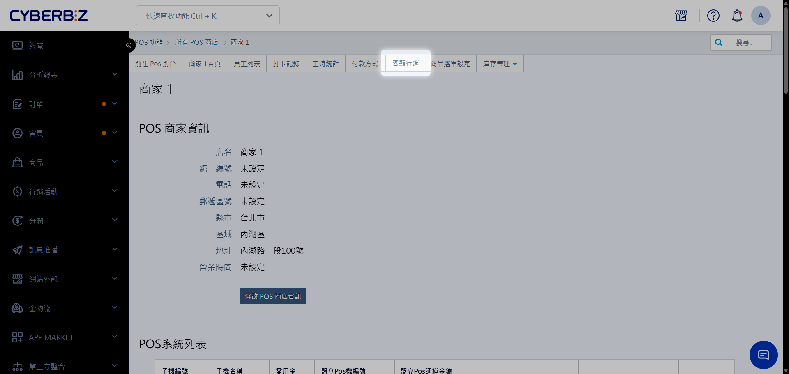
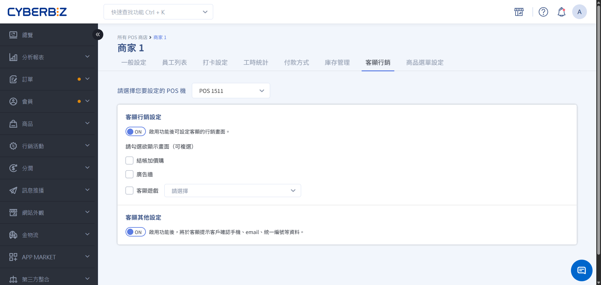
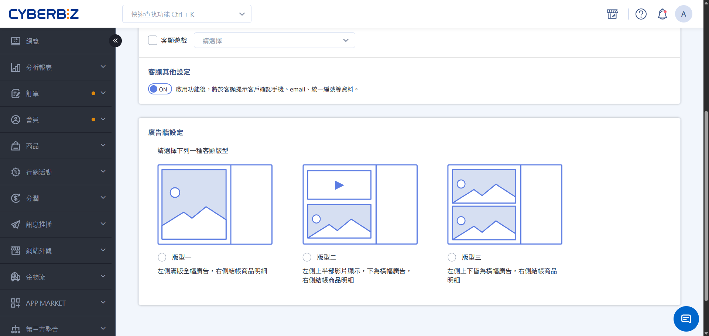
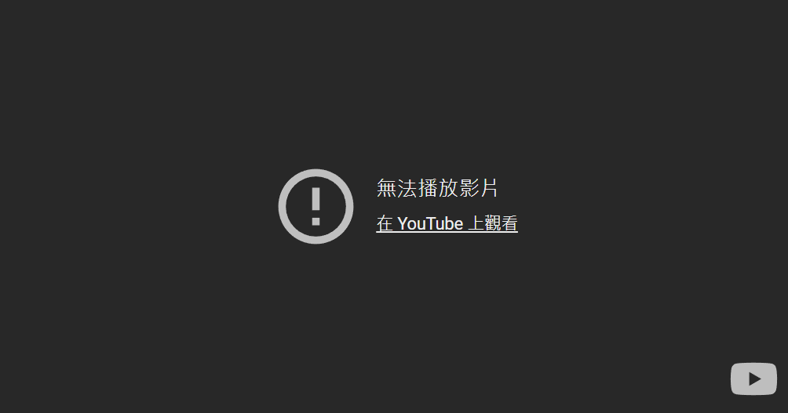
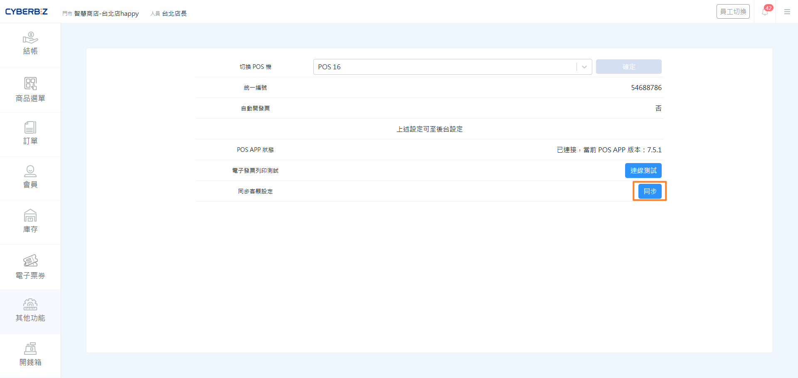
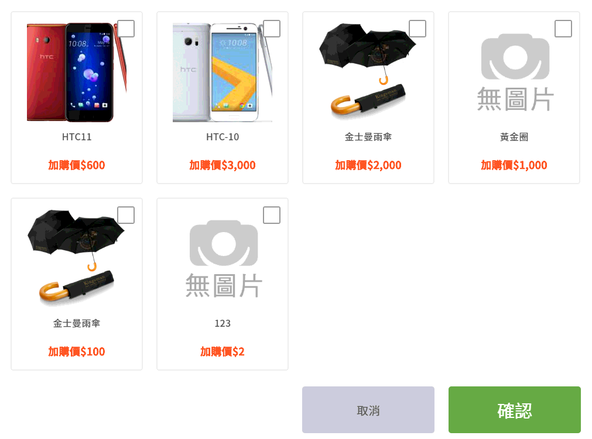
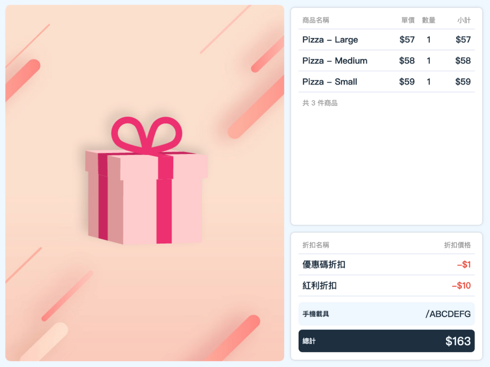
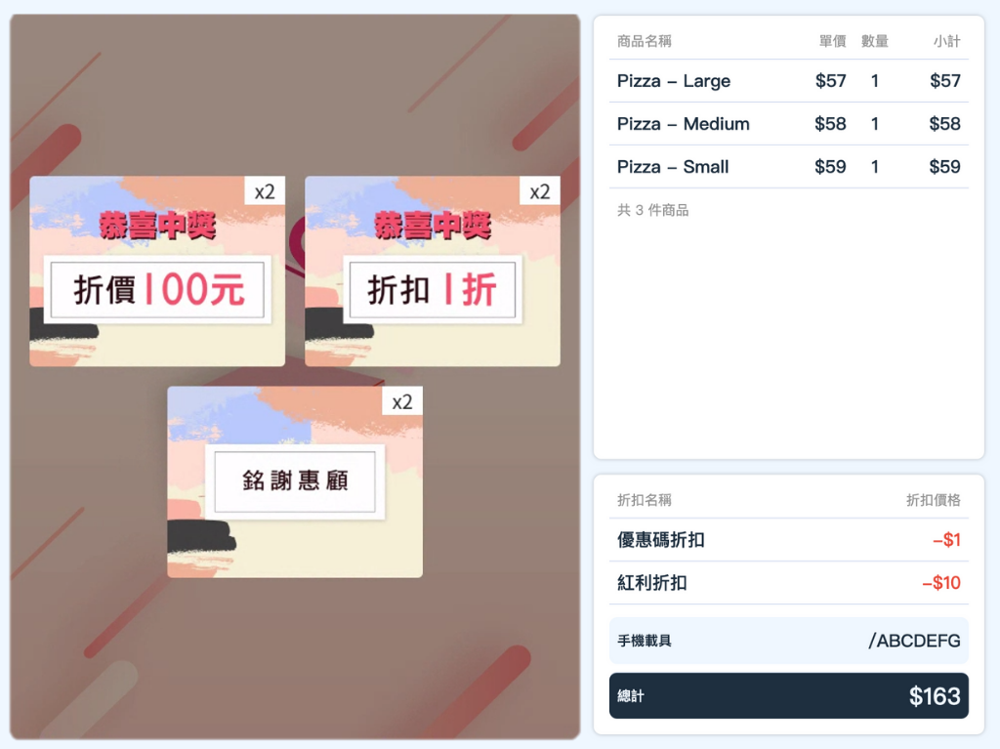

# 客顯螢幕
POS 客戶顯示器（簡稱「客顯」）是 POS 系統的輔助設備，讓顧客在結帳時即時查看購物明細、交易金額與品牌廣告。
{ .subtitle }

[:lucide-tag:{ title="適用方案" }](../../resources/conventions#適用方案) | 進階 PLUS / 高手 PLUS / 企業
{ .doc-badge }

!!! tip "應用情境"
    - **品牌宣傳**：在結帳螢幕播放品牌形象影片或最新促銷活動圖片，將客顯轉化為數位看板。
    - **促進消費**：顯示結帳加價購資訊，在顧客付款前最後一刻引導追加購買，提升客單價。
    - **趣味互動**：透過互動遊戲（如轉盤、抽獎）增加顧客結帳時的趣味體驗，提升會員黏著度。
    - **資訊確認**：引導顧客核對會員資料與購物明細，降低人工溝通錯誤率。

## 使用須知

- **硬體需求**：需準備外接螢幕並與 POS 主機連線（建議投影模式設為 **延伸**）。
- **軟體需求**：POS 主機需安裝 [POS APP 驅動程式]()，並開啟 POS APP。
- **生效機制**：後台設定後，需於 POS 前台執行 **同步客顯設定** 方可更新顯示內容。
- **影片規範**：廣告牆影片僅支援 YouTube 網址，若影片包含版權音樂，可能導致客顯端無法播放。

## 操作流程

### 步驟一：後台設定客顯行銷內容

1. 登入 CYBERBIZ 管理後台，前往 **POS 功能 > 所有 POS 商店**，選擇欲設定的商店後點擊 **客顯行銷**。
    { .screenshot }
2. 在頁面中選擇要套用的 **POS 機台**。
3. 開啟 **客顯行銷設定** 開關，並勾選欲顯示的資訊：
    - **結帳加價購**：開啟後，系統會自動套用已建立的 **訂單加價購** 活動。若符合條件，結帳前會跳出加價購彈窗。
    - **廣告牆**：開啟後，可於下方設定廣告版型與內容。
    - **客顯遊戲**：從已建立的互動遊戲中選擇一項顯示。
4. 若需讓顧客確認會員資料，請開啟 **客顯其他設定** 中的資訊確認開關。
    { .screenshot }

!!! info "客顯螢幕預設顯示內容"
    不論是否開啟行銷設定，客顯螢幕右側預設會即時顯示以下內容：

    - **購物明細**：商品名稱、數量、小計。
    - **交易資訊**：折扣明細、結帳總額。
    - **載具資訊**：顯示顧客提供的載具號碼。

### 步驟二：設定廣告牆版型與內容

在同一頁面的 **廣告牆設定** 區塊中，您可以自訂顯示的視覺內容。廣告牆會於 POS 結帳畫面的 **左側** 欄位顯示。

1. **選擇版型**：系統提供 3 種版型供選擇。
    - **版型一**：純圖片。
    - **版型二/三**：圖影組合。
2. **上傳素材**：
    - **圖片**：上傳 JPG/PNG 格式素材。
    - **影片**：貼上 YouTube 影片網址（僅支援 YouTube）。

{ .screenshot }

!!! warning "影片播放異常排除"
    若客顯端出現「無法播放影片」，通常是因為 YouTube 影片包含版權音樂。請至 YouTube 後台更換背景音樂或將該片段靜音，或參考 [YouTube 官方說明](https://support.google.com/youtube/answer/2902117) 移除版權聲明。

    { .small-image }

### 步驟三：POS 前台連接與同步

完成後台設定後，需在 POS 機台端完成最後的連線步驟。

1. 確保 POS 主機已下載並執行 [POS APP 驅動程式]()，點選 **點此開啟前台**。
2. 進入 POS 前台，點選 **其他功能 > 設定及連線測試**。
3. 在 **切換 POS 機** 欄位，確認已選取正確的機台。
4. 找到 **同步客顯設定** 欄位，點擊 **同步**。
5. 確認電腦外接螢幕已設定為 **延伸** 投影模式，畫面即可正常顯示。

{ .screenshot }

## 客顯螢幕顯示畫面

=== "加價購"

    { .medium-image }

=== "廣告牆"

    { .medium-image }

=== "互動遊戲"

    { .medium-image }

=== "結帳資訊確認提示"

    { .medium-image }

## 常見問題

??? quote "為什麼修改了後台設定，客顯螢幕卻沒有更新？"
    後台儲存設定後，POS 前台不會自動抓取更新。請務必在 POS 前台的 **設定及連線測試** 頁面中，點擊 **同步客顯設定**。若仍未更新，請嘗試重啟 POS APP。

??? quote "客顯螢幕上顯示 **無法播放影片** 怎麼辦？"
    這通常是 YouTube 影片的版權限制。建議上傳不含版權音樂的影片，或是將影片上傳至 YouTube 時設定為「不公開」，並確保影片允許在外部網站嵌入。

??? quote "客顯螢幕顯示的加價購商品不正確？"
    客顯加價購是抓取 **行銷活動 > 訂單加價購** 的設定。請確認該活動的生效時間、適用門市（商店）以及商品庫存是否正常。

## 更多操作

- :lucide-banknote:{ .lg }   
[__建立 POS 互動遊戲__](連結)     
設計 POS 專屬轉盤或抽獎活動。

- :lucide-banknote:{ .lg }   
[__建立訂單加價購活動__](連結)     
預先規畫適用的加購品項與觸發門檻。

