# 有線刷卡機
申請與安裝有線信用卡刷卡機，包含硬體轉接線選購、CYBERBIZ 驅動程式安裝、以及 POS 前後台的串接設定與測試流程。
{ .subtitle }

[:lucide-tag:{ title="適用方案" }](../../resources/conventions#適用方案) | 進階 PLUS / 高手 PLUS / 企業
{ .doc-badge }

!!! tip "應用情境"
    - **加速結帳流程**：金額由系統自動同步至刷卡機，店員僅需引導顧客插卡或感應，避免輸入錯誤。
    - **精確對帳**：每筆刷卡交易皆有對應的系統訂單編號，後台對帳更輕鬆。

## 使用須知

- **申請時程**：信用卡機申請由銀行審核，時程依銀行作業為準。
- **支付類型**：系統區分為「串卡機」與「不串卡機」。本教學針對 **串接式信用卡機** 進行說明。
- **多元支付**：除了實體信用卡，串接後的機台通常支援 Apple Pay、Google Pay 與 Samsung Pay。
- **線材要求**：使用有線信用卡機，**必須** 採用特定的轉接線才可正常運作。

!!! warning "必備硬體線材"
    因驅動程式綁定問題，請務必選購 **[SUNBOX 品牌 USB to RS232 轉接線](https://24h.pchome.com.tw/prod/DCAX1V-A9005MDWH)**。請勿購買其他牌轉接線，以免發生無法識別或綁定失敗之情況。
    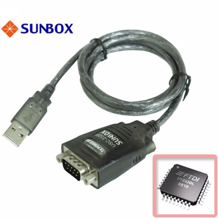{ .screenshot }

## 申請與前置準備

1. **提交申請**：收取 **CYBERBIZ POS 多元支付申請通知信** 後，回傳所需的營運資料給開站顧問。
    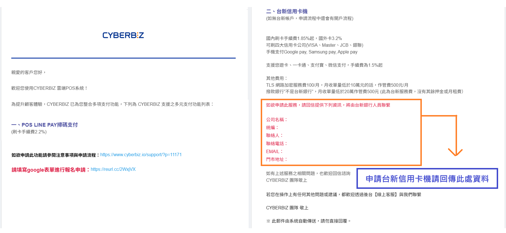{ .screenshot }
2. **購買線材**：確認選購 SUNBOX 品牌 USB to RS232 之轉接線。
3. **領取機台**：待銀行將刷卡機寄達門市後，即可開始安裝流程。

## 操作流程

### 步驟一：下載並安裝硬體驅動程式

在連接硬體前，電腦需先安裝通訊驅動程式。

1. 前往下載 [CYBERBIZ 硬體驅動程式]()。
2. 執行安裝程式並開啟。
    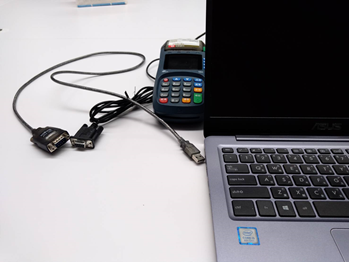{ .screenshot }

### 步驟二：硬體連線與連接埠設定

1. **連接線材**：
    - 將 **USB 接頭** 插入信用卡機後方的 RS232 接口。
        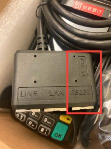{ .screenshot }
    - 將 **RS232 接頭** 插入安裝有 POS 系統的電腦。
        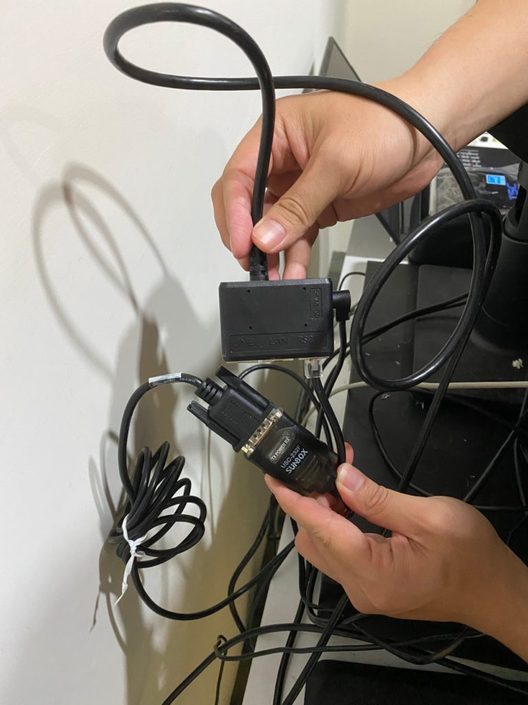{ .screenshot }
2. **軟體偵測**：在已開啟的 CYBERBIZ 驅動程式視窗中，選擇 **台新信用卡機**。
    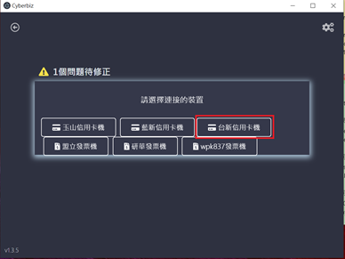{ .screenshot }
3. **完成連接**：信用卡機狀態顯示為 **已連接**。
    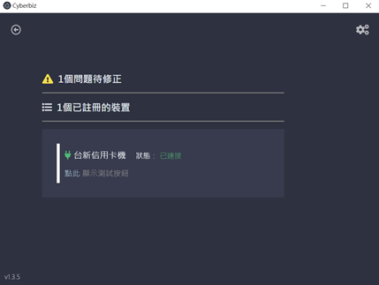{ .screenshot }

    > 提示：若出現偵測訊息可先忽略，確保選單有選中正確項目即可。
        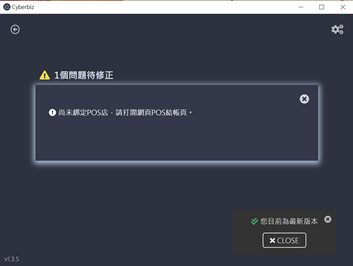{ .screenshot }

### 步驟三：連線快速測試

1. 在驅動程式中點擊 **測試** 按鈕。
    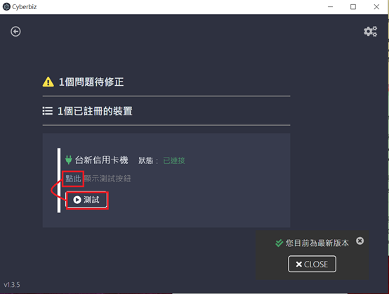{ .screenshot }
2. 若串接成功，信用卡機會自動跳出測試刷卡畫面。
    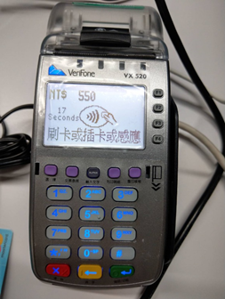{ .screenshot }
3. 確認有畫面後，按下刷卡機上的「清除」鍵結束測試。

### 步驟四：後台啟用與結帳測試

1. **後台設定**：
    - 登入管理後台，前往 **POS 功能 > 所有 POS 商店**。
    - 點選商店名稱後進入 **付款方式** 頁籤。
    - 將 **信用卡(信用卡機)** 選項切換為 `開啟 (ON)` 並儲存。

    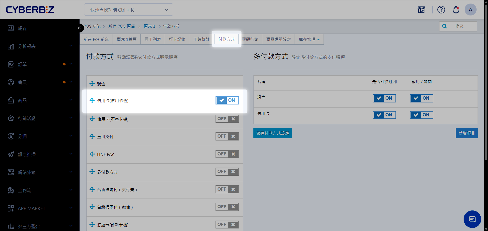{ .screenshot }

2. **前台測試**：
    - 進入 POS 前台，隨選商品進行結帳。
    - 付款方式選擇 **信用卡(信用卡機)**，並點選 **收款**。
    - 刷卡機應會自動顯示訂單金額，完成刷卡流程。

    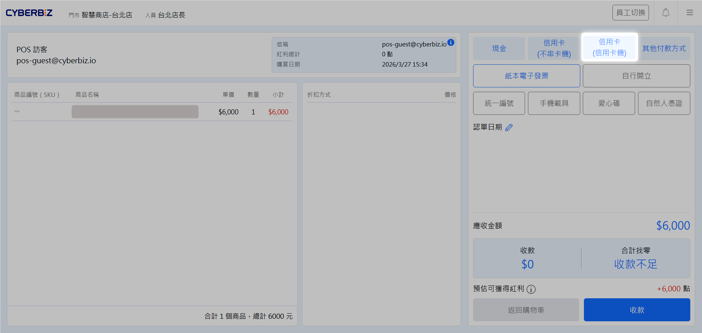{ .screenshot }

## 常見問題

??? quote "可以使用平板 (iPad) 串接這種有線刷卡機嗎？"
    不行。有線刷卡機需透過 USB 轉接線連接電腦執行驅動程式。若您使用平板裝置，建議選購 [商米無線刷卡機](商米無線刷卡機安裝教學.md)。

