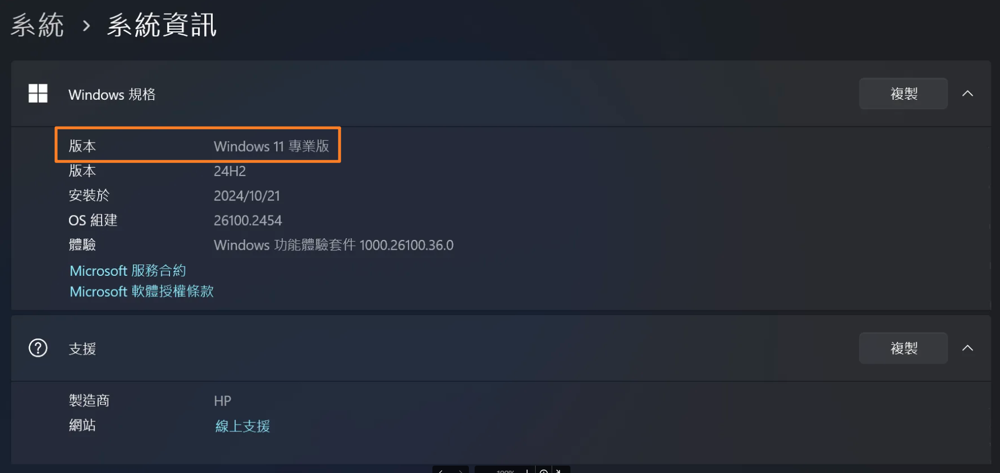
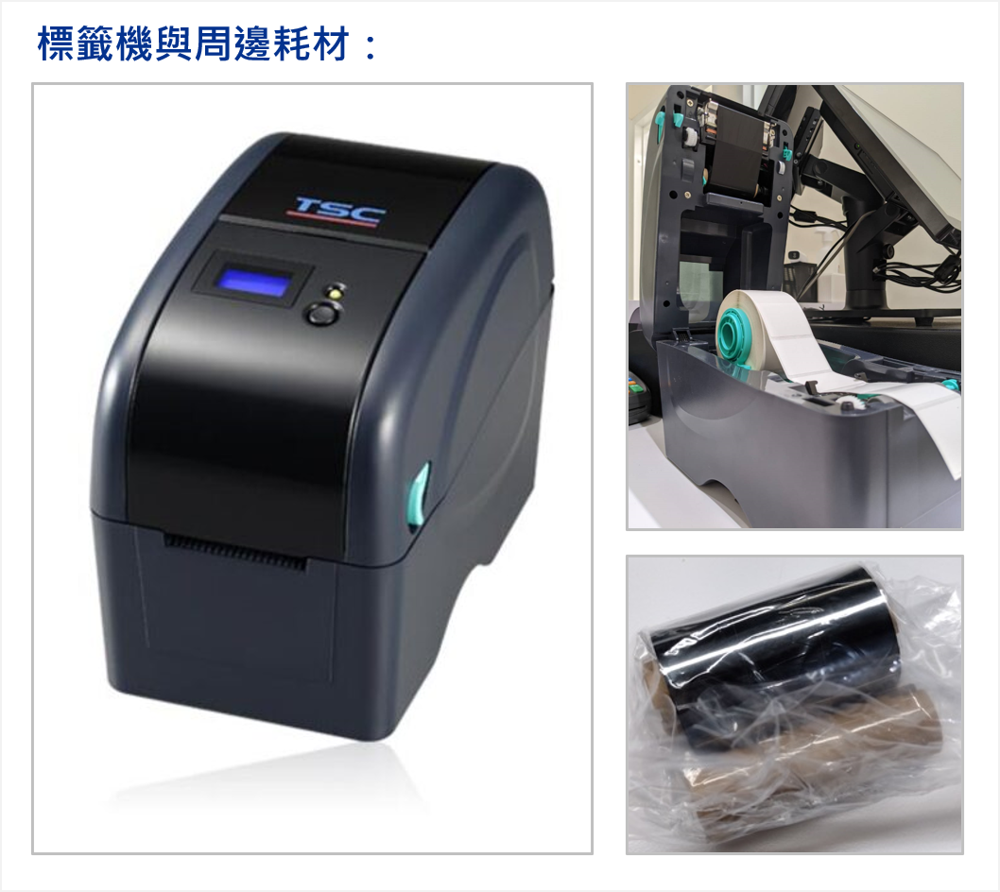

# 標籤印表機
商家可以自行印製含有條碼、價格、保存期限等資訊的商品標籤，加速門市結帳效率並提升庫存管理精確度。
{ .subtitle }

[:lucide-tag:{ title="適用方案" }](../../resources/conventions#適用方案) | 進階 PLUS / 高手 PLUS / 企業
{ .doc-badge }

!!! tip "應用情境"
    - **新品上架**：為新到貨且無原始條碼的商品印製專屬標籤，確保前台能快速掃描結帳。
    - **變更價格**：當商品進行調價或行銷活動時，重新列印標籤貼標。
    - **效期管理**：針對生鮮或有期限限制的商品，在標籤上加印保存期限，方便店員與顧客辨識。
    - **自營品牌**：自產自銷商品透過標籤機產出符合國際標準的條碼標籤，提升專業感。

## 使用須知

- **指定型號**：系統目前僅支援 **TSC TTP-225** 與 **TSC TTP-323** 型號之標籤印表機。
- **作業系統規範**：電腦必須使用 Windows 專業版（家用版將無法正常執行）。

    > 查詢路徑：設定 > 系統 > 系統資訊 > Windows 規格（以 Windows 11 為例）。
        { .screenshot }

- **功能開通**：請聯繫 CYBERBIZ 客服人員協助開啟後台的 **標籤列印** 功能。
- **軟體環境**：標籤機必須先與安裝有 **POS APP 驅動程式** 的電腦完成連線。
- **編碼限制**：
    - 商品 SKU 碼建議在 **15 碼** 以內（英文字母或數字）。
    - 暫不支援包含特殊字元（如：@, #, *, & 等）的 SKU 進行條碼轉化。
- **硬體相容性預警**：若您使用非指定型號之現有設備，系統不保證可順利串接。

    > 建議配套：請先下載 [POS 專屬設備串接驅動程式]() 進行標籤列印測試，確認相容後再行使用。

## 操作流程

### 步驟一：選擇標籤機與耗材規格

| **機型** | **TSC TTP-225** | **TSC TTP-323** |
| -------- | --------------- | --------------- |
| **解析度** | 203 dpi（8點/毫米） | 300 dpi（12點/毫米） |
| **列印方式** | 熱感式/熱轉式 | 熱感式/熱轉式 |
| **SDRAM** | 4 MB SDRAM | 4 MB SDRAM |
| **Flash** | 8 MB | 8 MB |
| **最大碳帶長度** | 90公尺 | 90公尺 |
| **印製速度** | 5 ips（127 毫米 / 秒） | 3 ips（76 毫米 / 秒） |
| **耗材規格** | 1. 碳帶 Ribbon VSI 5cmX74M 2. 貼紙 Label_40X30X1500 | 1. 碳帶 Ribbon VSI 5cmX74M 2. 貼紙 Label_40X30X1500 |

{ .screenshot }

### 步驟二：硬體安裝與連線測試

在開始列印前，請確保標籤機已完成硬體整備。

1. **安裝耗材**：可參考 TSC 官方教學影片 [安裝碳帶](https://www.youtube.com/watch?v=tEFeqpA--hs) 與 [標籤紙](https://www.youtube.com/watch?v=thvZkQJV-Rs)。
2. **連接電腦**：將標籤機透過 USB 與電腦連接。
3. **啟動驅動程式**：開啟電腦端的 [POS APP 驅動程式]()。
4. **自動偵測**：POS APP 將自動偵測新裝置，請於彈窗中選擇 **TSC 標籤機** 並點擊開始使用。

## 更多操作

- :lucide-printer-check:{ .lg }   
  [__列印商品標籤__](../check/列印商品標籤.md)     
  於後台進行列印測試。

