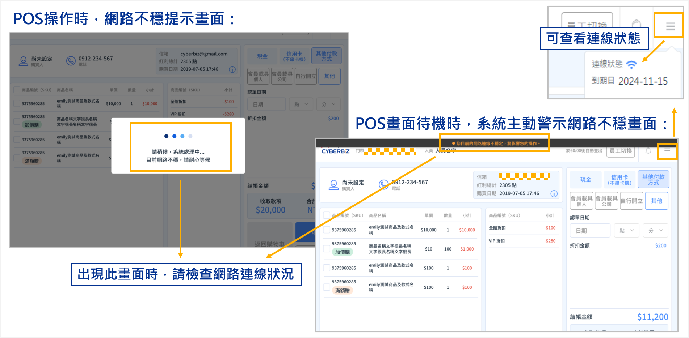
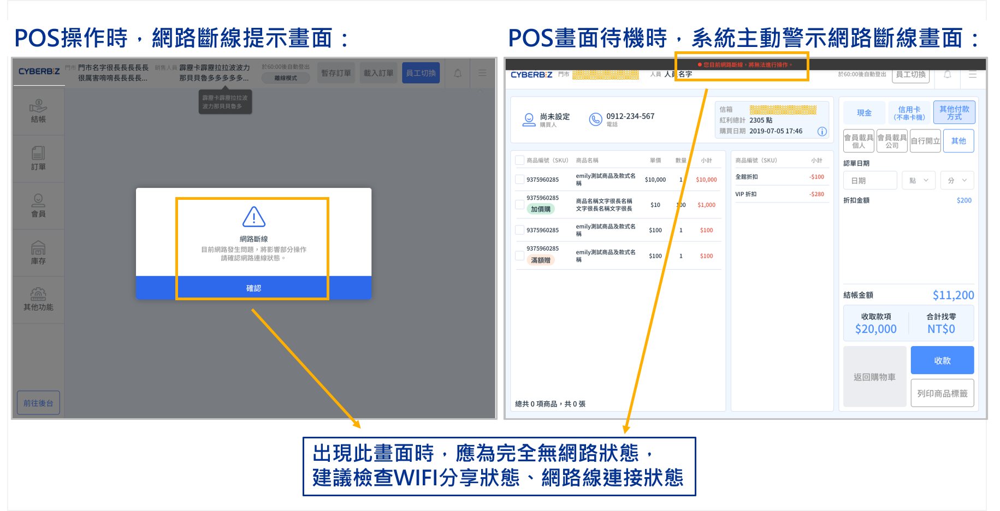
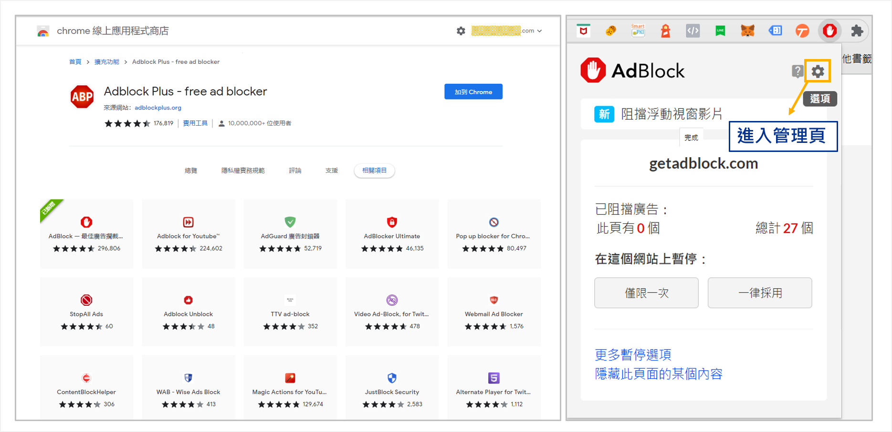
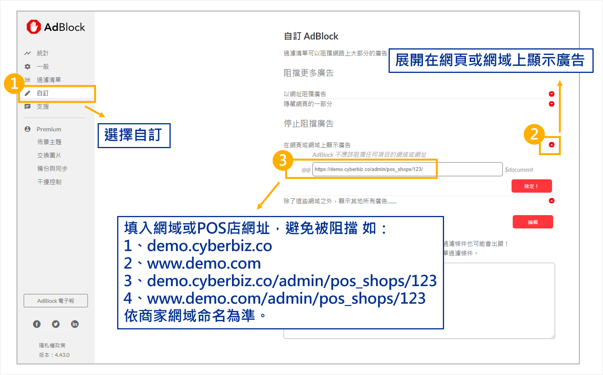

# 網路連線異常與斷線提示
了解當 POS 前台偵測到網路連線不穩或中斷時的系統提示機制，以及如何排查因瀏覽器廣告阻擋套件造成的誤判問題。
{ .subtitle }

[:lucide-tag:{ title="適用方案" }](../../resources/conventions#適用方案) | 進階 PLUS / 高手 PLUS / 企業
{ .doc-badge }

!!! tip "應用情境"
    - **尖峰時段預警**：在結帳人潮眾多時，若網路突然變慢，透過提示可提前評估是否切換至離線模式。
    - **環境網路排查**：當系統顯示連線不穩，可確認是否為門市 Wi-Fi 或電信訊號異常。
    - **誤判排除**：解決因瀏覽器擴充套件（如 AdBlock）導致的假性斷線問題。

## 使用須知

- **判定標準**：當系統接收 POS 店端上傳資料超過 **5 秒** 未果，即被系統判定為 **網路不穩定**。
- **檢測建議**：若感到連線緩慢，可使用第三方工具（如 [fast.com](https://fast.com/zh/tw/)）測試目前的下行速度。
- **應急方案**：若網路環境短期內無法復原且急需結帳，可參考 [離線模式]() 繼續作業。

## 系統警示機制

系統會透過「主動偵測」與「操作觸發」兩種方式，提供不同層級的提示。

### 1. 網路連線不穩 (Network Unstable)

當連線速度過慢但未完全中斷時：

- **背景偵測**：若在背景偵測到不穩，畫面頂端會出現 **黑底橘字** 警示條：「您目前的網路連線不穩定，將影響您的操作。」
- **操作觸發**：當您執行結帳、搜尋等操作且等待時間過長時，會出現 **蓋版提示畫面**。

{ .screenshot }

### 2. 網路斷線 (Network Disconnected)

當連線完全中斷時：

- **背景偵測**：畫面頂端會出現 **黑底紅字** 警示條：「您目前網路斷線，將無法進行操作。」
- **操作觸發**：操作過程中斷線會立即出現 **蓋版警示**，提醒您檢查網路連線。

{ .screenshot }

## 疑難排解：排除廣告阻擋套件的誤判

若您確認現場網路正常（其他網頁可流暢開啟），但 POS 仍持續提示 **網路斷線**，通常是受瀏覽器廣告阻擋套件（如 AdBlock）影響。

### 解決步驟

1. 檢查 Chrome 瀏覽器的 **擴充套件** 中，是否包含 AdBlock 或類似的廣告阻擋程式。
    { .screenshot }
2. 將 CYBERBIZ 網域加入 **白名單**(以 AdBlock 示範)：

    - 開啟廣告阻擋套件的設定頁面。
    - 尋找 **自訂** 或 **排除網域** 選項。
    - 填入您的 CYBERBIZ 商店網址或後台網域（例如：`demo.cyberbiz.co`）。

    { .screenshot }

3. 儲存設定後，重新整理 POS 前台頁面。

