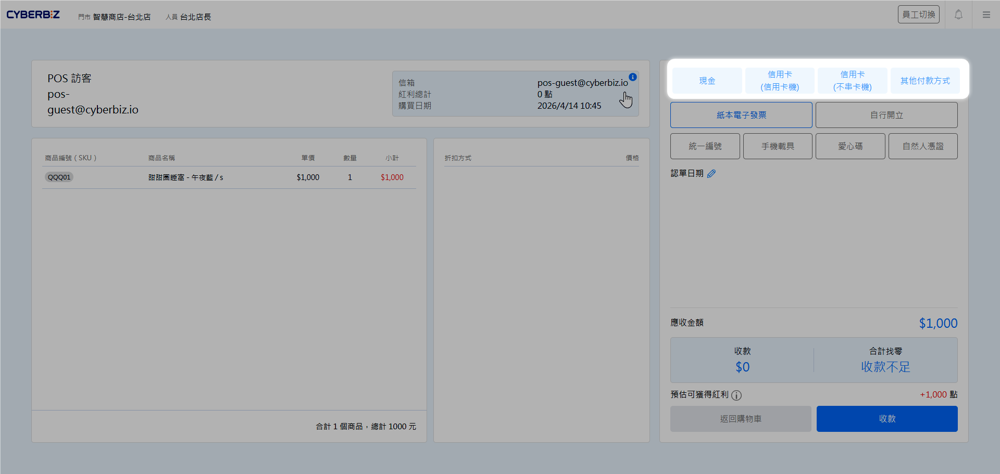

  <!-- LEFT: Hero -->
  

    <h1>
      智能 
      
        POS
      
    </h1>

    

      <big><strong>一站式全通路零售管理解決方案</strong></big> 
      從基礎收銀到全通路會員整合，提供您最完整的一站式零售解決方案。 
      協助商家累積會員資產並精準行銷，讓線上線下經營從此無縫銜接。
    

    

      <a href="get-started/index.md" class="md-button md-button--primary">新手上路 ➜</a>
      <a href="hardware/index.md" class="md-button">硬體安裝</a>
    

  

  <!-- RIGHT: POS Callout -->
  

  

    <!-- Tabs -->
    

      <button role="tab" aria-selected="true" class="tab-btn active"
        onclick="openTab(event, 'latest')">最新文件</button>
      <button role="tab" aria-selected="false" class="tab-btn"
        onclick="openTab(event, 'popular')">熱門文章</button>
    

    <!-- Latest -->
    

      <a href="hardware/epson-tm-m30iii-invoice-printer.md">新增EPSON TM-M30III 發票機安裝教學 (Wi-Fi 連接)</a>
      <a href="others/daily-closing.md">更新小結關帳可列印紙本帳條</a>
	  <a href="../ec/marketing/coupon/multiple-coupons.md">新增POS 多優惠券結帳功能</a>
    

    <!-- Popular -->
    

      <a href="software/drivers.md">更新安裝驅動程式</a>
      <a href="store/renewal-and-add-on-plans.md">更新續購與加購方案</a>
    

  

  

---

## 核心功能概覽

-   :lucide-credit-card: __流暢結帳__
    
    ---
    支援多種支付方式與電子發票開立

    [:octicons-arrow-right-24: 建立支付工具](check/payment-method/index.md) 
    [:octicons-arrow-right-24: 盟立電子發票](third-party/monolith-e-invoice.md) 
    [:octicons-arrow-right-24: 星益欣電子發票](third-party/wixtar-e-invoice.md) 

-   :lucide-package-check: __精準庫存__
    
    ---
    即時掌握門市與電商全通路庫存
    
    [:octicons-arrow-right-24: 庫存管理](inventory/index.md)

-   :lucide-users: __會員經營__
    
    ---
    整合紅利商城、客顯互動遊戲與線下分潤
    
    [:octicons-arrow-right-24: 紅利商城](check/bonus-point-mall.md) 
    [:octicons-arrow-right-24: 客顯互動遊戲](check/customer-display-interactive-games.md) 
    [:octicons-arrow-right-24: 推薦人分潤](../ec/profit-sharing/referrer-profit-sharing.md) 
    [:octicons-arrow-right-24: 註冊人分潤](../ec/profit-sharing/registrant-profit-sharing.md) 
    [:octicons-arrow-right-24: 門市取貨店員分潤](store/pos-store-pickup-staff-commission.md)

-   :lucide-bar-chart-3: __營運分析__
    
    ---
    多維度報表助您掌握銷售脈絡
    
    [:octicons-arrow-right-24: 報表分析](store/business-intelligence/pos-revenue-analysis/)

---

## 核心營運場景

 

   
<big><strong>櫃檯營運一站式流程</strong></big> 
確保您的收銀台運作無虞。包含刷卡機、發票機安裝，以及離線結帳、子機綁定等進階功能說明。 
  

<a href="check/index.md" class="md-button md-button--primary">查看結帳功能全指南 ➜</a>

---

## 依角色探索

-   :lucide-user: __門市店員__
    
    ---
    專注於日常銷售與顧客服務
    
    [:octicons-arrow-right-24: 前台人員登入](store/staff-login.md) 
    [:octicons-arrow-right-24: 一般訂單管理](orders/manage-general-orders.md) 
    [:octicons-arrow-right-24: 建立前台商品選單](check/pos-frontend-menu-settings.md) 
    [:octicons-arrow-right-24: 磅秤商品結帳](others/scale-settings.md)

-   :lucide-user-cog: __店長與管理者__
    
    ---
    專注於門市效能與資源調度
    
    [:octicons-arrow-right-24: 員工權限管理](store/staff-permissions-and-account-management.md) 
    [:octicons-arrow-right-24: 建立公告](store/announcement-system.md) 
    [:octicons-arrow-right-24: 安全性與系統設定](store/pos-security-settings.md)<b>

