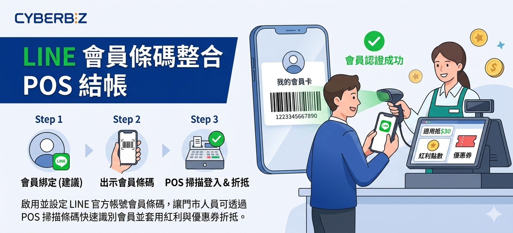
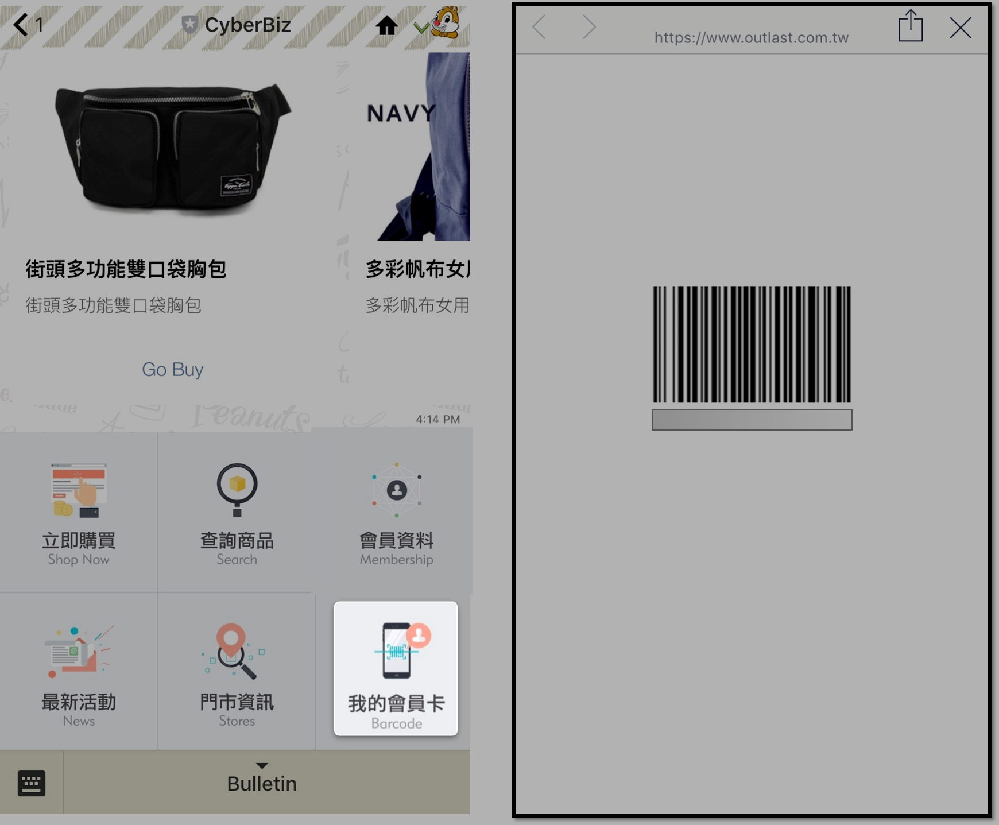
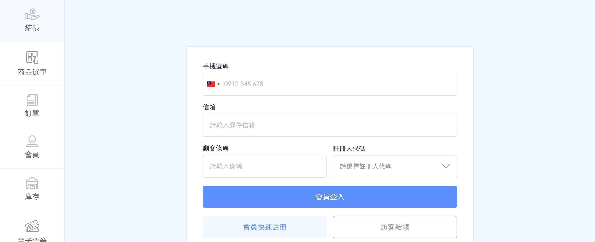
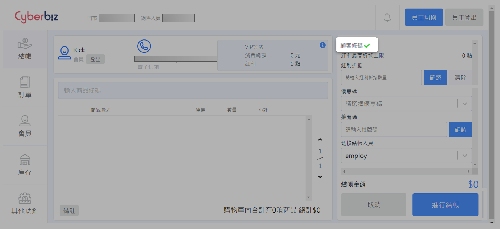

# 設定與使用 LINE 顯示會員條碼（串接 POS 結帳）

啟用並設定 LINE 官方帳號會員條碼，讓門市人員可透過 POS 掃描條碼快速識別會員並套用紅利與優惠券折抵。
{ .subtitle }

{ .hero-page }

## LINE 顯示會員條碼說明

**LINE 顯示會員條碼** 功能主要用於優化線下門市的結帳體驗。顧客只需在門市出示 LINE 官方帳號中的會員條碼，店員即可透過 POS 機掃描完成會員認證，進而執行紅利點數或優惠券的折抵。

以下為此功能的詳細說明與設定教學：

## 功能前提與準備事項

- **適用對象**：此功能僅限於有使用 **CYBERBIZ POS 系統** 的商家。
- **前置設定**：
    - [x] 商家必須先完成 [**LINE Messaging API** 串接](../../../ec/integrations/line/串接 LINE Messaging API.md){ data-preview }  ，並設定好 [**LINE 圖文選單**](../../../ec/integrations/line/設定 LINE 圖文選單.md){ data-preview }  。
    - [x] 建議引導顧客先完成 [**LINE 官方帳號綁定官網會員**](../../../ec/integrations/line/綁定 LINE 官方帳號與官網會員.md){ data-preview }  ，以便掃描後直接帶入會員資料。

## 後台設定步驟：配置圖文選單

若要使消費者能顯示會員條碼，商家必須在 LINE 官方帳號的圖文選單中建立對應連結：

1. 進入 [**LINE Official Account Manager** :lucide-external-link:](https://manager.line.biz/) 後台，選擇 **聊天室相關 > 圖文選單**。
2. 建立或編輯選單項目，將其中一個區塊設定為 **「我的會員卡」**。
3. **設定動作連結**：在連結欄位輸入專屬代碼：
    - 連結網址：`https://您的網址/account/id_barcode`。
4. 儲存選單後，顧客點擊此區塊即可在手機上呼叫出個人會員條碼。

!!! note "LINE 圖文選單詳細設定說明，請參閱 [如何設定 LINE 圖文選單](../../../ec/integrations/line/設定 LINE 圖文選單)。"

## 前台操作流程

### 顧客端操作

- 消費者於門市結帳時，打開品牌的 LINE 官方帳號。
- 點選圖文選單中的 **「我的會員卡」**，手機畫面會顯示專屬的 **【會員條碼】** 與編號。

### 店員端操作 (POS 機)

1. 店員登入 POS 前台，點選 **結帳** 鍵。
2. 在會員登入介面，使用條碼槍掃描消費者的手機條碼，或是手動輸入條碼編號進行登入。
3. 確認會員資料後，即可開始掃描商品。

## 紅利與優惠券折抵方式

結帳商品掃描完成後，依據登入情況進行折抵：

- **情況一（手機/信箱登入）**：若店員是先用手機號碼搜尋會員，後續欲執行折抵時，需再掃描一次消費者的 LINE 會員條碼，出現 **綠色勾號** 後即可折抵。
- **情況二（條碼機直接登入）**：若一開始就是用條碼槍掃描登入，則不需重複掃描，可直接在結帳介面點選紅利或優惠券進行扣抵。

## 常見問題

??? quote "為什麼門市掃描槍無法讀取會員條碼"
	若發生掃描失敗，請依序確認以下排除步驟：

	- **更新條碼狀態**：條碼具備時效性。若掃描失敗或顯示過期，請引導消費者重新點擊圖文選單中的「我的會員卡」，系統將自動重新產生有效的條碼編號。
	- **調整螢幕亮度**：手機螢幕過暗或反光會影響條碼槍判讀。請提醒消費者將手機螢幕亮度調至最高後再次嘗試。
	- **硬體環境檢查**：確認掃描槍鏡頭是否清潔，並保持適當的掃描距離（約 5-10 公分）。