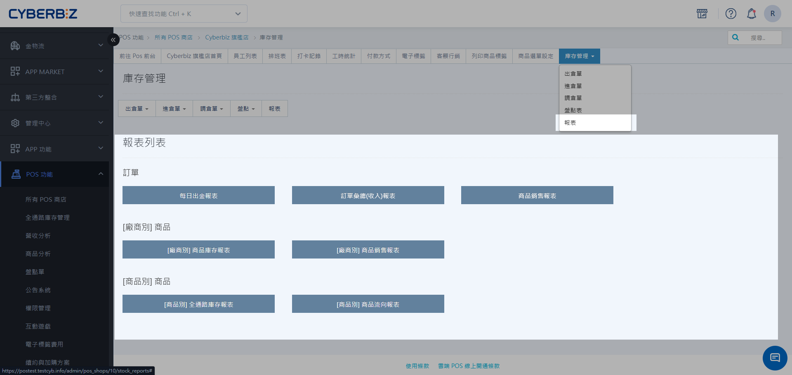

# POS 庫存管理報表
報表列表提供了多維度的數據分析工具，協助管理者核對每日帳務、監控銷售表現及追蹤全通路庫存流向。
{ .subtitle }

[:lucide-layers:{ title="適用產品" }](../../resources/conventions#適用產品) | 智能 POS
{ .doc-badge }

## 進入路徑

1. 登入管理後台，前往 **POS 功能 > 所有 POS 商店**，選擇指定門市。
2. 點擊 **庫存管理 > 報表**。

{ .screenshot }

## 報表類型

### 每日出金報表

*   **功能**：查看每日關帳詳情、現金入庫、零用金存額、收入狀況以及執行操作的人員資訊。
*   **應用**：適合門市店長用於每日營業後的現金對帳。

### 訂單匯總報表

*   **功能**：查看訂單建立日期、認單日期、取消日期、訂單編號、發票資訊、POS 機台編號、客戶名稱、付款方式及訂單備註。
*   **應用**：營收計算及庫存查實。

### 商品銷售報表

*   **功能**：查看個別商品的廠商來源、類別、銷售數量、退回數量及總銷售額。
*   **應用**：業績認列與獎金計算。

{ .screenshot }

### 商品庫存、銷售報表（依廠商別）

*   **功能**：依據廠商分類，一次檢視該廠商商品的庫存餘額與銷售狀況。

{ .screenshot }

### 全通路庫存、商品流向報表（依商品別）

*   **功能**：查看特定商品在各分店的庫存數，以及該商品的流向紀錄。

{ .screenshot }

## 報表統計標準

- **訂單匯總報表**：以 **訂單建立時間** 為準。
- **商品銷售報表**：以 **認單日期** 為準。

    !!! tip "認單日期設定與檢索"
        - **設定方式**：POS 結帳人員可於 [收款作業](../check/index.md#收款作業) 時手動填寫。
        - **查詢路徑**：前台人員可於 [訂單](../orders/manage-general-orders.md#查詢訂單) 分頁，透過 **進階篩選** 功能依指定時間區間檢索訂單。

- **商品流向表**：以 **訂單建立時間** 為準。

