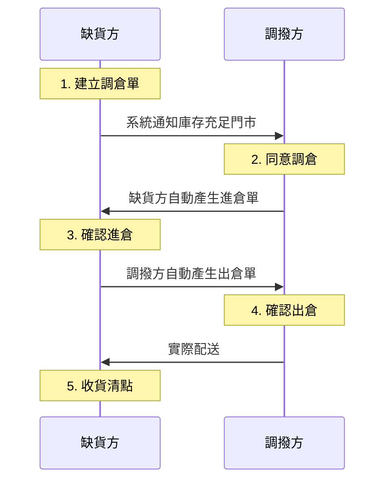

# 調倉完整流程
由需求方發起申請，透過系統自動化產單與雙向確認機制，確保門市間調撥的庫存一致性。
{ .subtitle }

[:lucide-layers:{ title="適用產品" }](../../resources/conventions#適用產品) | 智能 POS
{ .doc-badge }

調倉是由 **需求方** 發起申請：

- **發起端(缺貨方)**：建立調倉單並待對方同意核准，由系統自動產出進倉單後接續執行後續收貨流程。
- **接收端(調撥方)**：核准接收到的調倉申請，由系統自動產出對應的出倉單作為扣庫與實體撥貨憑據。

1. [[缺貨方] 建立調倉單](transfer-orders/#建立調倉單)
2. [[調撥方] 同意調倉](transfer-orders/#同意--拒絕調倉)
3. [[缺貨方] 確認進倉](inbound-orders/#確認--取消進倉)
4. [[調撥方] 確認出倉](outbound-orders/#確認--取消出倉)
5. [[缺貨方] 收貨清點](inbound-orders/#收貨清點)
