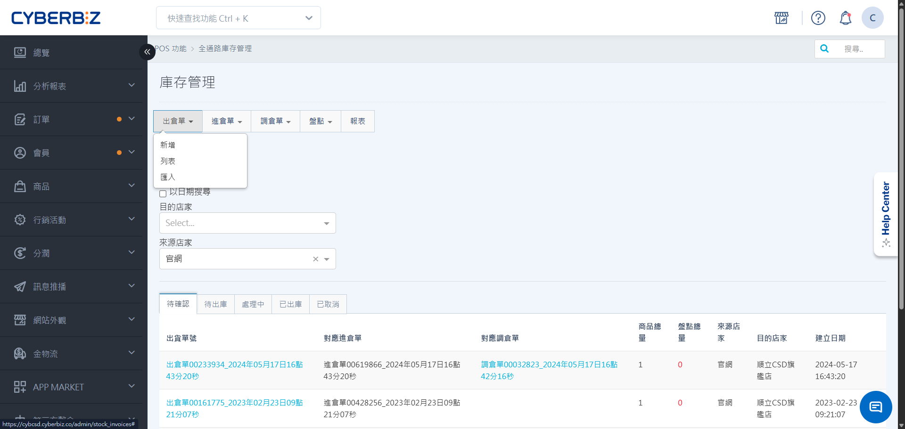
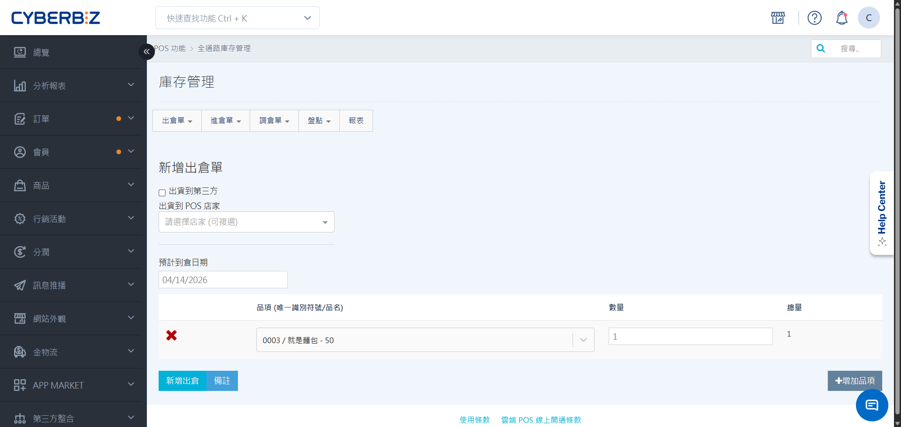
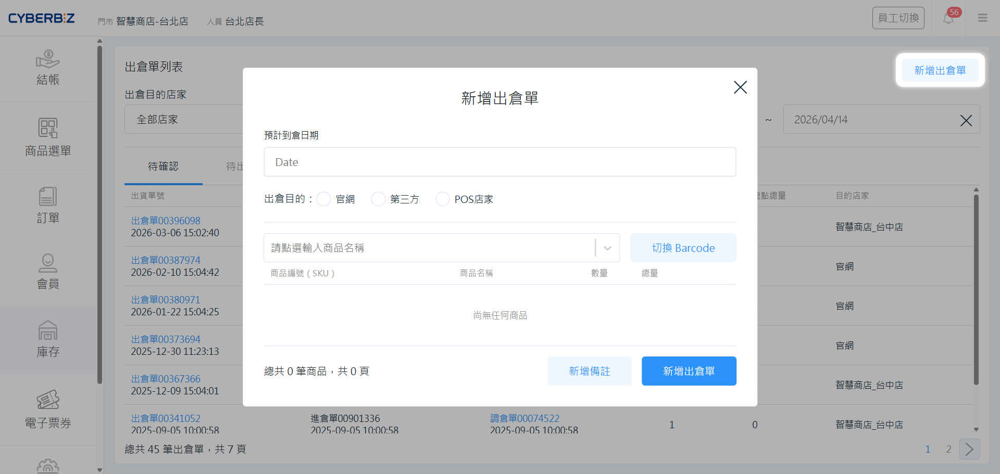
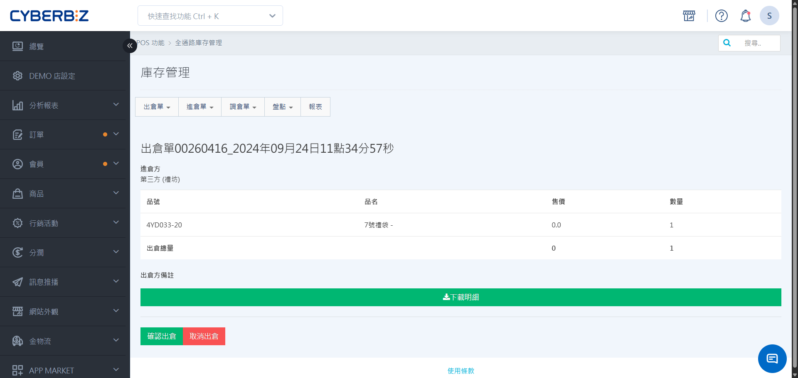
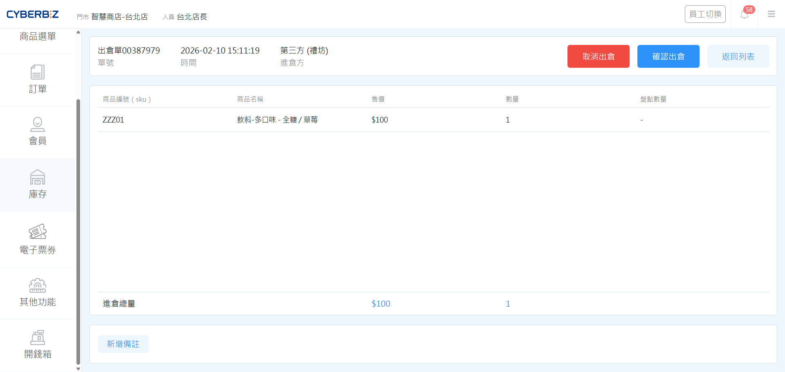

# 出倉單
管理商品從目前倉庫撥出的單據，支援手動發起、接收請求或調倉轉單等多種情境。
{ .subtitle }

[:lucide-tag:{ title="適用方案" }](../../resources/conventions#適用方案) | 進階 PLUS / 高手 PLUS / 企業
{ .doc-badge }

{ .hero-page }

## 使用須知

- **線上線下商品連動**：線上與線下商品的共通識別碼為 **SKU**。在執行跨倉調撥前，請確保該商品已同時存在於來源倉與目的倉的商品列表中。
（例：EC倉要將商品出倉給POS店，需確認該商品存在於該POS店商品列表中）
- **流程完整性**：所有 **出倉** 或 **調倉** 任務，皆須由接收端執行 **確認進倉** 後，庫存異動才正式生效。
- **第三方定義**：若出貨對象非系統內的 EC 或 POS 倉（如外部供應商），請選擇 **第三方** 並於備註註明。

## 出倉單類型

出倉單不限於手動建立，系統會根據不同通路的庫存需求，自動連動產生對應單據：


=== "我方主動發起（我方出倉）"

    由我方人員於後台手動建立出倉單，將貨物撥往其他通路。

    ```mermaid
    flowchart LR

        subgraph 我方
            A["1. 手動建立出倉單"]
        end

        subgraph 他方
            B["2. 系統自動產生進倉單"]
        end

        A --出貨--> B
    ```
    
    → [了解出倉完整流程](出倉完整流程)


=== "接收進倉請求（他方進倉）"

    當 **他方（如另一間分店或總倉）** 發起進倉申請時，系統會同步於我方自動產出對應的 **出倉單**，待我方核准後扣除庫存。

    ```mermaid
    flowchart RL

        subgraph 他方
            B["1. 手動建立進倉單"]
        end

        subgraph 我方
            A["2. 系統自動產生出倉單"]
        end

        A --出貨--> B
    ```

    → [了解進倉完整流程](進倉完整流程)


=== "完成調撥協作（調倉轉單）"

    當 **他方** 發起跨店調倉申請，在我方點選 **同意調倉** 後，系統會自動生成出倉單，確保撥貨流程的軌跡完整且可被追蹤。

    **第一步**

    ```mermaid
        flowchart LR

        subgraph 我方
            A["2. 同意調倉"]
        end

        subgraph 他方
            B["1. 手動建立調倉單"]
        end

        B ----> A

    ```

    **第二步**

    ```mermaid
        flowchart RL

        subgraph 我方
            C["系統自動產生出倉單"]
        end

        subgraph 他方
            D["系統自動產生進倉單"]
        end

        
        C --出貨--> D
    ```

    → [了解調倉完整流程](調倉完整流程)


## 建立出倉單

=== "於後台操作"

    1. 依權限與門市管理需求選擇操作路徑：
        - **EC POS 全通路出倉**：前往 **POS 功能 > 全通路庫存管理**。
        - **指定門市出倉**：前往 **POS 功能 > 所有 POS 商店**，選擇指定門市。
    2. 點擊 **出倉單**，點擊 **新增**。
    3. 選擇 **目的店家** 並設定 **預計到貨日**。
    4. 點擊 **新增出倉品項**，輸入 SKU 或名稱搜尋商品，並填寫數量。
    5. 點擊 **新增出倉單**，完成發貨申請。
    
    !!! tip "批量操作"
        若品項眾多，可點擊 **匯入**，下載範例 Excel 填寫後上傳，支援同時發貨至多個門市（店名以逗號分隔）。

    { .screenshot }

=== "於前台操作"

    1. 在 POS 前台點選 **庫存 > 出倉單**。
    2. 點擊 **新增出倉單**，選擇目的單位（如 EC 倉或其他門市）。
    3. 掃描商品條碼並輸入數量。
    4. 點擊 **新增出倉單**，等待對方接收。

    { .screenshot }


## 出倉單管理

### 狀態說明

| 順序 | 狀態 | 說明  | 我方下一步操作 |
| ---- | --- | ---- | -------- |
| 1 | 待確認 | 單據已建立，正等待進倉方核准 | - |
| 2 | 待出庫 | 雙方已達成移轉共識，等待發起端發貨 |  [確認 / 取消出倉](出倉單/#確認--取消出倉) | 
| 3 | 處理中 | 貨物已離開原倉庫，正在運輸途中 | - | 
| 4 | 已出庫 | 流程完成，庫存已成功移轉至接收方 | - | 
| 特殊情境 | 已取消 | 行為終止，不執行庫存異動 | - | 

### 確認 / 取消出倉

=== "於後台操作"

    1. 依權限與門市管理需求選擇操作路徑：
        - **EC POS 全通路出倉**：前往 **POS 功能 > 全通路庫存管理**。
        - **指定門市出倉**：前往 **POS 功能 > 所有 POS 商店**，選擇指定門市。
    2. 點擊 **出倉單**，進入 **列表**，查看 **待出庫** 頁籤。
    3. 進入出倉單，點選 **確認出倉** / **取消出倉**。

    { .screenshot }


=== "於前台操作"

    1. 在 POS 前台點選 **庫存 > 出倉單**。
    2. 點選 **出倉單列表**，查看 **待出庫** 頁籤.
    3. 進入出倉單，點選 **確認出倉** / **取消出倉**。

    { .screenshot }
   

## 出倉單列表

### 篩選與搜尋

- **搜尋單號**：可依 **日期** 搜尋或依 **目的店家** 篩選。
- **搜尋商品**：請優先使用 **Barcode 條碼掃描** 或輸入完整 **SKU 碼**，以確保準確性。


## 後續操作

<div class="grid cards" markdown>

- :lucide-arrow-right:{ .lg }   
  [__出倉完整流程__](出倉完整流程.md){ data-preview }       
  從單據建立到庫存異動完成的完整流程式說明，協助您掌握跨單位撥貨的自動轉單機制與作業進度。

</div>