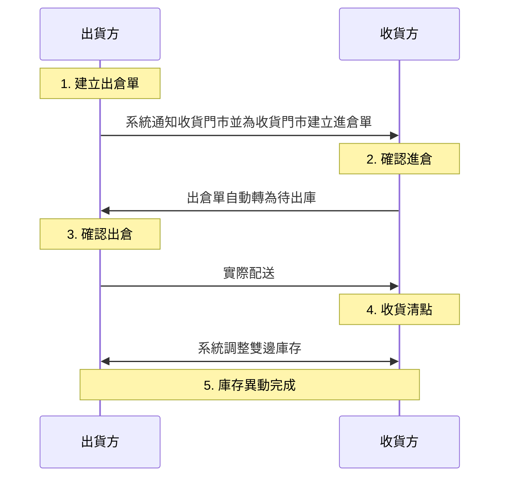

# 出倉完整流程
由出貨方主動發起，透過系統自動轉單機制，確保跨單位撥貨的庫存準確性與軌跡追蹤。
{ .subtitle }

[:lucide-tag:{ title="適用方案" }](../../resources/conventions#適用方案) | 進階 PLUS / 高手 PLUS / 企業
{ .doc-badge }

出倉是由 **出貨方** 發起申請：

- **發起端（出貨方）**：手動執行出倉動作，將貨物從目前庫存扣除，並發送至指定單位。
- **接收端（收貨方）**：當出倉單成立時，系統將自動於收貨方後台建立一筆對應的 **進倉單**。

1. [[出貨方] 建立出倉單]()
2. [[收貨方] 確認進倉]()
3. [[出貨方] 確認 / 取消出倉]()
4. [[收貨方] 收貨清點]()
