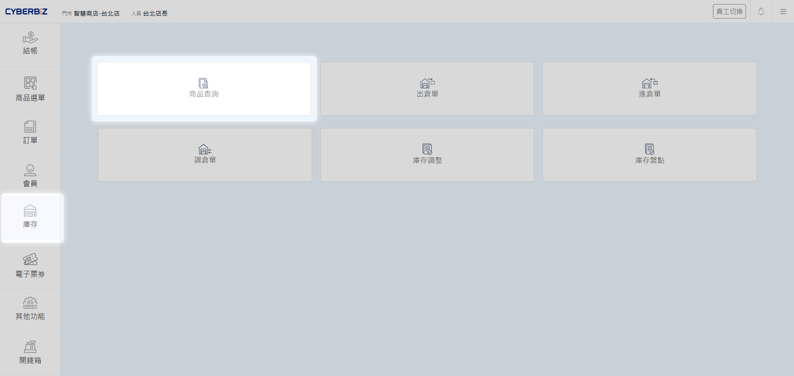
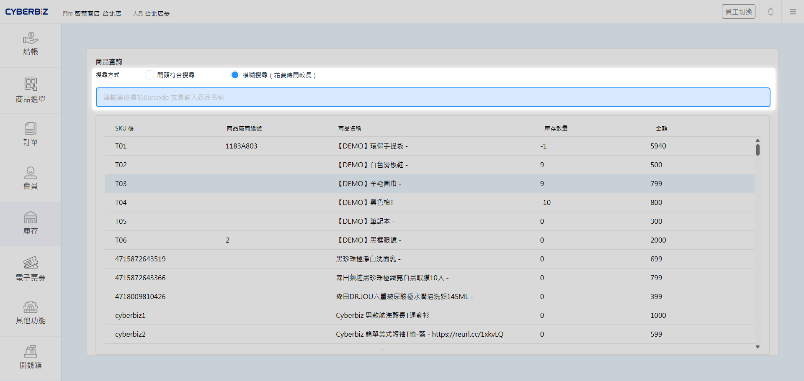

# 商品查詢
門市人員可透過 POS 前台快速檢索商品資訊與庫存狀態，支援多種搜尋模式以滿足不同情境下的查找需求。
{ .subtitle }

[:lucide-tag:{ title="適用方案" }](../../resources/conventions#適用方案) | 進階 PLUS / 高手 PLUS / 企業
{ .doc-badge }

{ .hero-page }

!!! tip "應用情境"
    - **顧客詢價**：快速查找特定商品的價格與規格。
    - **庫存確認**：即時確認門市內或全通路的剩餘庫存量。

## 操作流程

1. 在 POS 前台選單點選 **庫存 > 商品查詢**。
2. 在搜尋框中手動輸入 **商品名稱**，或使用掃碼槍 **掃描商品條碼**。

    > 建議優先以 **掃碼槍掃描條碼**，較為快速準確。

3. 根據需求選擇搜尋模式：

    | 模式 | 說明 | 適用情境 | 搜尋時間 | 
    | :--- | :--- | :--- | :--- |
    | **開頭符合搜尋** | 僅顯示關鍵字位於開頭的搜尋結果 | 已知商品編號或名稱開頭時 | 速度較快 |
    | **模糊搜尋** | 顯示包含關鍵字的所有結果 | 僅記得商品部分關鍵字時 | 搜尋時間較長 | 

    !!! warning "效能提醒"
        若門市商品品項眾多，使用 **模糊搜尋** 可能會產生較長的讀取時間，建議優先使用 **開頭符合搜尋** 或以掃碼槍輸入完整 SKU 以提升效率。

4. 點擊搜尋後，系統將列出符合條件的商品清單。

{ .screenshot }
