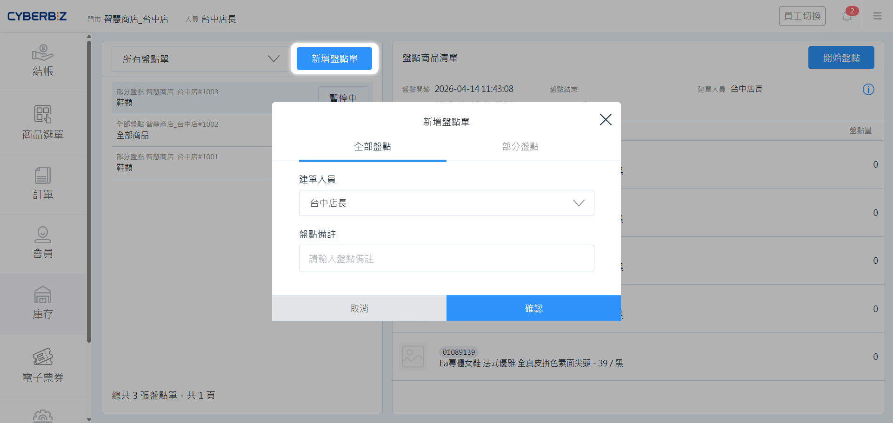
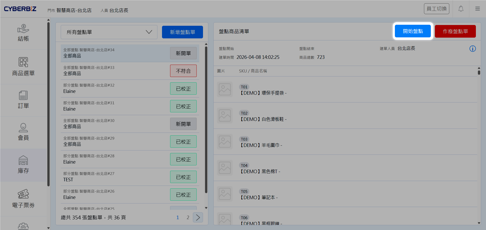
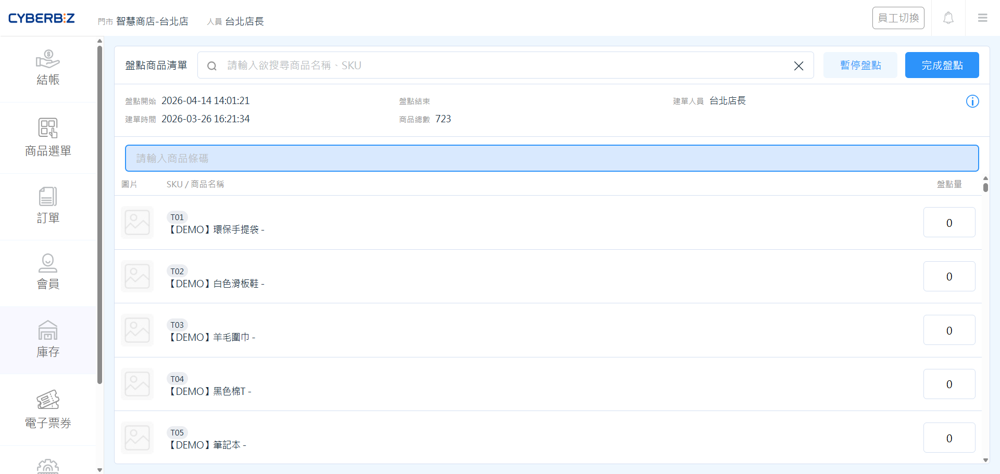
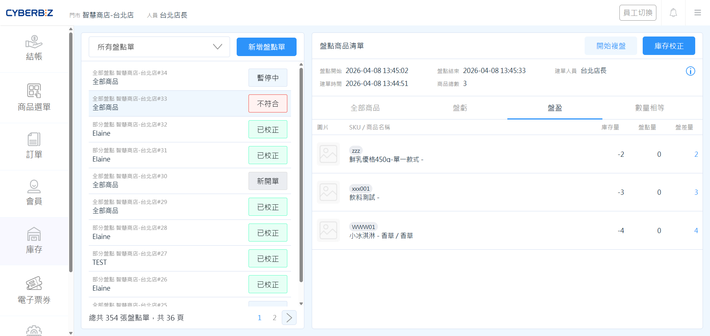
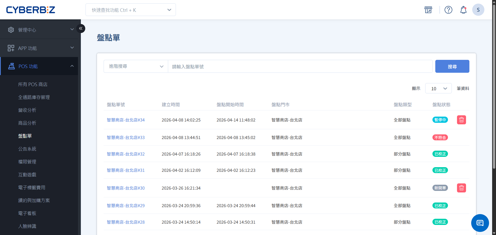
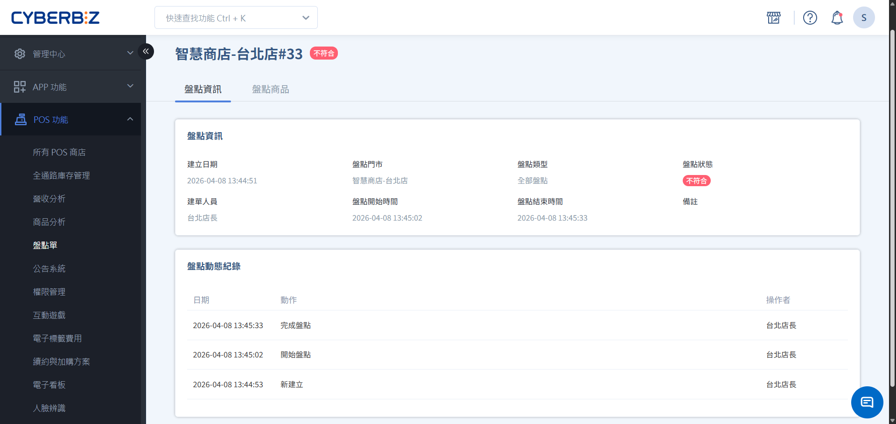
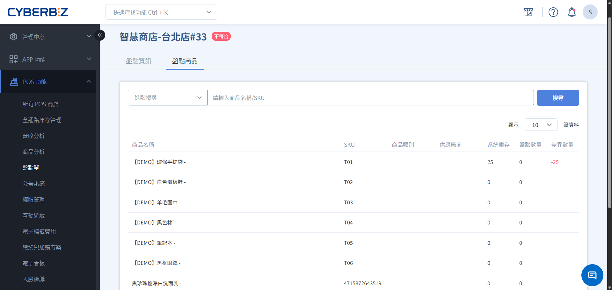

# 庫存盤點
了解如何執行門市商品盤點，並追蹤盤點進度與結果，確保帳面數量與實際庫存一致。
{ .subtitle }

[:lucide-tag:{ title="適用方案" }](../../resources/conventions#適用方案) | 進階 PLUS / 高手 PLUS / 企業
{ .doc-badge }

{ .hero-page }

!!! tip "應用情境"
    - **定期大盤**：每季或每半年對門市所有商品進行全面清點。
    - **循環盤點**：針對特定類別或高單價商品進行局部抽盤。
    - **庫存校正**：發現帳面數量與實體不符時，透過盤點流程進行正式修正。

## 使用須知

- **盤點期間銷售**：盤點開始時系統會記錄當下庫存量。建議在非營業時間或人流較少時進行，以避免盤點期間的銷售影響準確性。

## 門市端盤點庫存

門市人員透過 POS 機台執行實際的清點任務。

### 步驟一：新增盤點單

1. 在 POS 前台點選 **庫存 > 庫存盤點**。
2. 點擊 **新增盤點單**。
3. 選擇盤點範圍：
    - **全部盤點**：清點門市內所有商品。
    - **部分盤點**：依 **商品類型** 或 **商品廠商** 清點特定範圍商品。
4. 選擇 **建單人員** 並輸入 **備註** (選填)。
5. 點擊 **確認**，系統將產生盤點單並預載待盤商品。

{ .screenshot }

### 步驟二：執行清點

1. 在盤點單列表中，點擊狀態為 **新開單** 或 **暫停中** 的單據，點選 **開始盤點**。
    { .screenshot }
2. 使用掃描槍刷取商品條碼，或手動搜尋商品並輸入實盤數量。
3. **暫停盤點**：若需暫時中斷，點擊右上角 **暫停盤點**，系統將保留已清點數量。再次點選 **開始盤點** 可接續盤點。
4. **完成盤點**：清點完畢後，點擊 **完成盤點**。
    { .screenshot }

### 步驟三：處理盤點結果

1. 完成盤點後，系統會比對 **原庫存量** 與 **盤點量**，並顯示 **盤差量**。
2. 檢視 **實體盤點結果** 是否與 **系統庫存紀錄** 相符：
    - **符合**：盤差為 0，流程結束。

        > 盤點單狀態將轉為 **符合**。

    - **不符合**：系統會顯示盤盈 (綠色) 或盤虧 (紅色)。您可以執行以下動作：
        - **開始複盤**：針對不符合的商品再次清點。
        - **庫存校正**：點擊 **庫存校正**，系統將帳面庫存更新為實盤數量。

            > 僅能針對狀態為 **不符合** 的盤點單執行校正。校正後狀態將轉為 **已校正**。
            
            !!! warning "校正不可逆"
                執行 **庫存校正** 後，系統庫存將立即更新為盤點結果，此動作無法復原。
                
{ .screenshot }

## 管理端追蹤盤點狀態

管理者可從後台監控各門市的盤點狀況與損益情形。

### 步驟一：搜尋與監控盤點單

1. 登入管理後台，前往 **POS 功能 > 盤點單**。
2. 使用 **進階搜尋** 精確定位：
    - **時間/分店**：查看特定時段或門市的紀錄。
    - **盤點類型**：區分 **全部盤點** 或 **部分盤點**。
    - **盤點狀態**：追蹤哪些單據尚未完成校正。
3. 點擊 **盤點單號** 進入詳情頁。

{ .screenshot }

### 步驟二：掌握盤點歷程

在 **盤點資訊** 頁籤中，管理者可掌握該次作業的完整輪廓：

- **基礎資訊**：包含建立日期、目標門市、類型（全盤/選盤）及建單人員。
- **時間軸監控**：紀錄盤點的開始時間與結束時間，用以評估門市作業效率。
- **動態紀錄**：追蹤盤點單的所有異動軌跡，包含誰在何時執行了「儲存」或「完成盤點」，確保管理責任落實。

{ .screenshot }

### 步驟三：分析盤盈盤虧

切換至 **盤點商品** 頁籤，進行核心的數據比對與分析：

- **數據對照**：系統將條列顯示 **系統庫存**、**盤點數量** 與 **差異數**。
- **異常商品鎖定**：
    - **盤虧分析**：篩選出盤差為 **負數** 的商品，針對高單價或高損耗品項進行複查。
    - **盤盈分析**：篩選出盤差為 **正數** 的商品，檢視是否有進貨漏入帳之情事。
- **後續處理**：確認差異原因後，可作為後續帳務調整、損耗報廢或補貨計畫的依據。

{ .screenshot }

## 盤點單狀態說明

| 狀態 | 說明 |
| :--- | :--- |
| **新開單** | 盤點單已建立，尚未開始清點 |
| **盤點中** | 門市人員正在執行清點作業 |
| **暫停中** | 盤點作業中斷，已保留數據 |
| **符合** | 實盤數量與系統庫存完全一致 |
| **不符合** | 實盤數量與系統庫存存在差異 (盤盈或盤虧) |
| **已校正** | 已根據盤點結果更新系統庫存 |

## 常見問題

??? quote "為什麼盤點單預載商品不完整？"
    盤點開始時，系統預設載入首 1,000 項商品。若門市商品數超過此限制，建議直接使用掃描槍刷取條碼或搜尋商品名稱，系統會自動帶出該商品資訊。

??? quote "盤點期間如果發生退貨，庫存會如何計算？"
    盤點單記錄的是 **點擊開始盤點當下** 的系統庫存。若盤點期間發生庫存異動（如退貨入庫），建議在完成該筆異動後再進行盤點，或在盤點結果中透過 **複盤** 來修正。

??? quote "可以刪除已校正的盤點單嗎？"
    已校正的盤點單代表庫存異動已生效，為確保稽核軌跡完整，系統不建議刪除。您可以透過後台的搜尋功能過濾掉舊有的紀錄。

