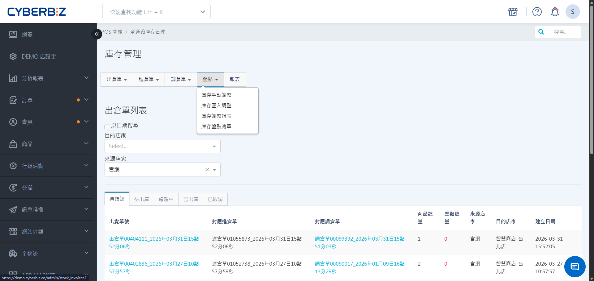
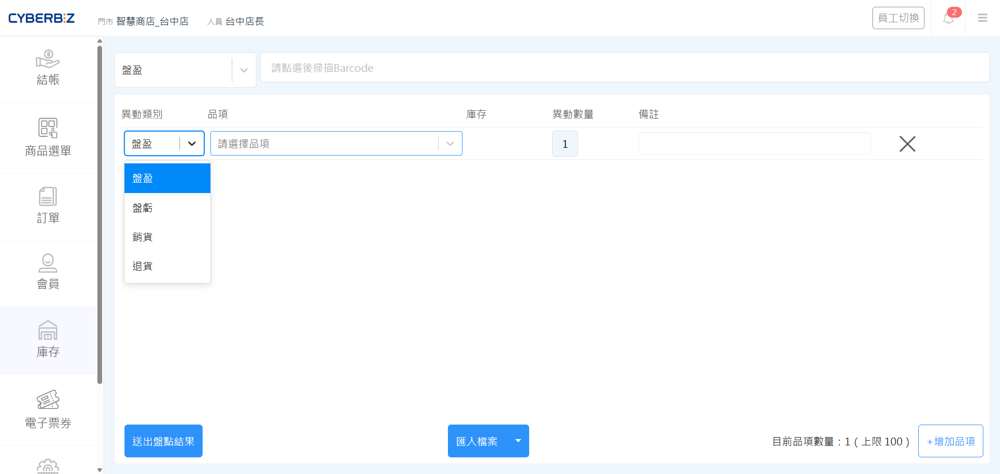
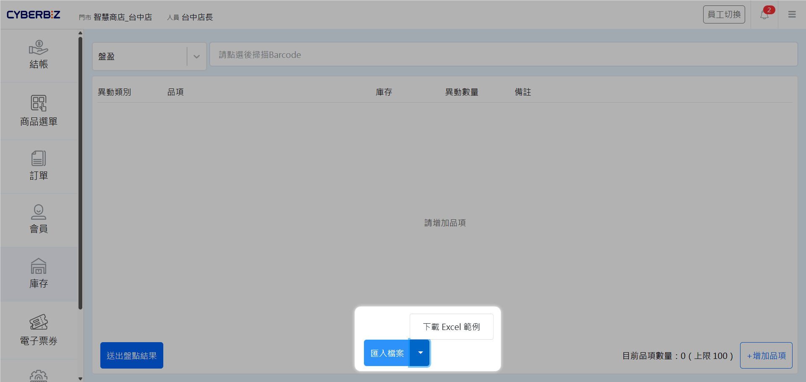
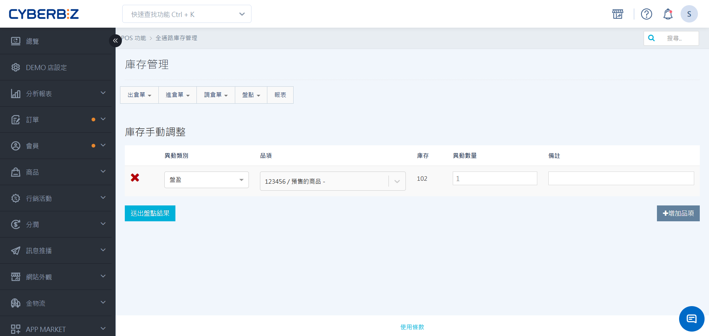
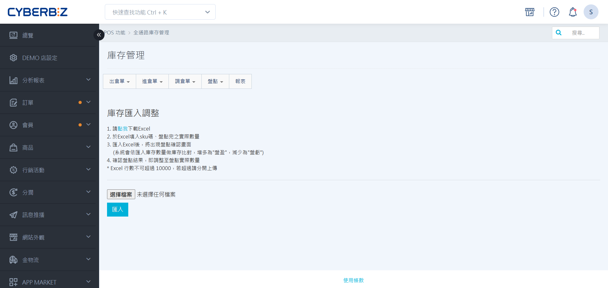
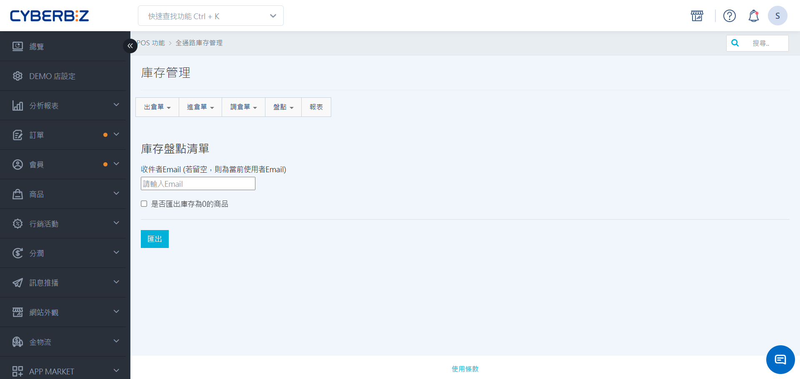

# 庫存調整
當實際商品數量與系統帳面庫存不符時，您可以透過盤盈、盤虧、銷貨或退貨等類別，快速更新 EC 或 POS 的庫存數據。
{ .subtitle }

[:lucide-tag:{ title="適用方案" }](../../resources/conventions#適用方案) | 進階 PLUS / 高手 PLUS / 企業
{ .doc-badge }

{ .hero-page }

!!! tip "應用情境"
    - **少量修正**：發現單一商品數量有誤時，直接在 POS 前台手動加減。
    - **批量更新**：定期小規模盤點後，透過 Excel 匯入多項商品的實際數量。
    - **異動追蹤**：調閱報表確認特定時間內的庫存異動原因與負責人。

## 異動類別說明

在執行調整時，請根據實際情況選擇正確的異動類別：

| 異動類別 | 庫存變化 | 適用情境 |
| :--- | :--- | :--- |
| **盤盈** | 增加 (+) | 實體數量多於系統帳面數量 |
| **盤虧** | 減少 (-) | 實體數量少於系統帳面數量 |
| **銷貨** | 減少 (-) | 透過非官網/POS 管道銷售（如：線下特賣、贈送） |
| **退貨** | 增加 (+) | 商品退回入庫，需補回庫存 |

## 前台操作 (門市人員)

適用於門市店員在現場進行即時的少量庫存修正。

### 手動調整單一商品庫存

1. 在 POS 前台選單點選 **庫存 > 庫存調整**。
2. 選擇 **異動類別** (如：盤盈、盤虧)。
3. 點擊 **增加品項**。
4. 掃描商品條碼或輸入 **SKU 碼** 搜尋商品。
5. 在 **異動數量** 欄位輸入欲調整的數值，並填寫 **備註**。
6. 點擊 **送出盤點結果**，庫存將立即更新。

{ .screenshot }

### 批量匯入調整

1. 在 POS 前台 **庫存 > 庫存調整** 頁面，點擊 **匯入檔案** 旁的下拉箭頭。
2. 下載 Excel 範例。
3. 在 Excel 中填寫商品 **SKU** 與 **實際數量**。
4. 點擊 **匯入檔案** 並上傳。

!!! warning "計算邏輯差異"
    - **手動調整**：輸入的是 **異動數量**（加減值）。例如：系統有 10 個，實體有 12 個，請輸入 `2`。
    - **匯入調整**：輸入的是 **實際到貨總數**。例如：實體有 12 個，請輸入 `12`，系統將自動計算與帳面的差異。

{ .screenshot }

## 後台操作 (管理者)

適用於管理者針對 EC 倉或特定 POS 門市執行大規模調整與紀錄調閱。

### 手動/匯入調整

1. 依欲調整的倉別，前往指定設定頁面：
    - EC 倉：前往 **POS 功能 > 全通路庫存管理** 
    - POS 倉：前往 **POS 功能 > 所有 POS 商店 > 選擇商店 > 庫存管理**。
2. 點擊 **盤點** 按鈕。
    - **手動調整**：點擊 **庫存手動調整**，選擇類別並輸入 SKU 與 **異動數量**。
        { .screenshot }
    - **匯入調整**：點擊 **庫存匯入調整**，下載範例表單填寫 **實際數量** 後上傳。
        { .screenshot }
3. 完成後可於右上角的 :lucide-bell: **通知小鈴鐺** 查看 **庫存調整成功** 的系統通知。

!!! warning "計算邏輯差異"
    - **手動調整**：輸入的是 **異動數量**（加減值）。例如：系統有 10 個，實體有 12 個，請輸入 `2`。
    - **匯入調整**：輸入的是 **實際到貨總數**。例如：實體有 12 個，請輸入 `12`，系統將自動計算與帳面的差異。

### 調閱庫存調整報表

1. 在後台庫存管理介面點擊 **盤點 > 庫存調整報表**。
2. 選擇欲下載的 **時間區間** 並點擊 **匯出**。
3. 系統將發送報表至您的 Email，內容包含異動類別、數量、備註及回報人。

{ .screenshot }

### 匯出盤點清單

1. 在後台庫存管理介面點擊 **盤點 > 庫存盤點清單**。
2. 輸入收件 Email，並選擇是否包含庫存為 0 的商品。
3. 點擊 **匯出**，此清單可用於實體盤點時的紀錄表。

{ .screenshot }

!!! info  "**庫存調整報表** 與 **庫存盤點清單** 有什麼不同？我該在什麼時候使用它們？"
    這兩份文件的功能完全不同，主要區別在於其對應的 **使用情境**。請參考以下對照：

    | 項目 | **庫存調整報表** | **庫存盤點清單** |
    | :--- | :--- | :--- |
    | **使用情境** | **追蹤過去的異動紀錄** | **實體點貨時的商品名單表** |
    | **核心內容** | 包含異動類別、異動數量、備註、回報人員 | 包含系統商品、庫存量、商品類別、售價 |
    

## 常見問題

??? quote "調整後可以撤回嗎？"
    庫存調整一旦送出即生效。若輸入錯誤，請再次執行一筆反向的調整。例如：誤加了 5 個，請再執行一筆「盤虧」並輸入 5 個。

