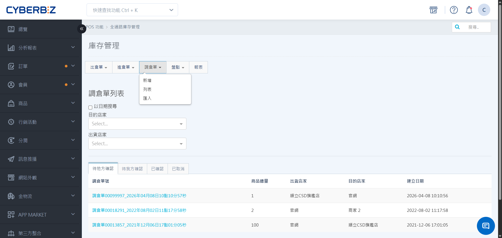
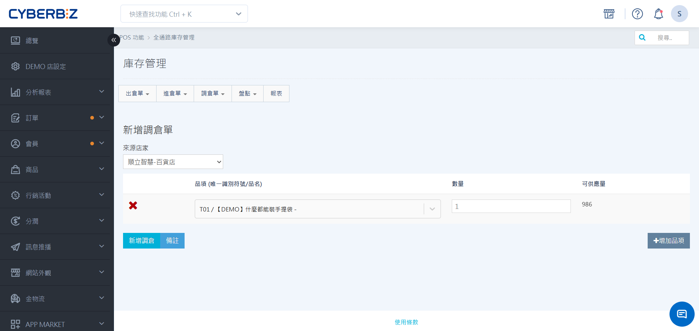
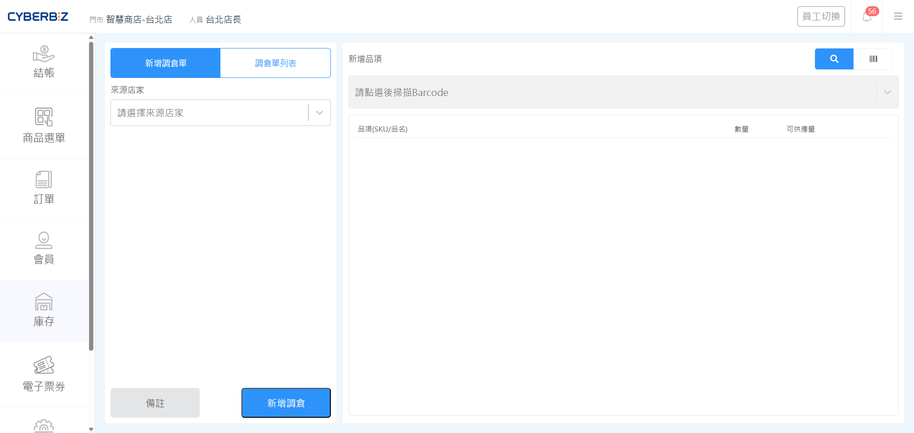
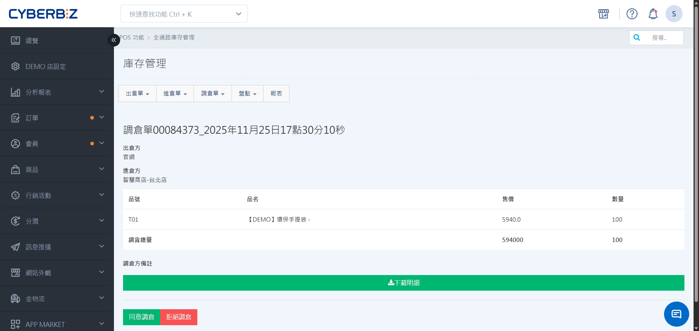
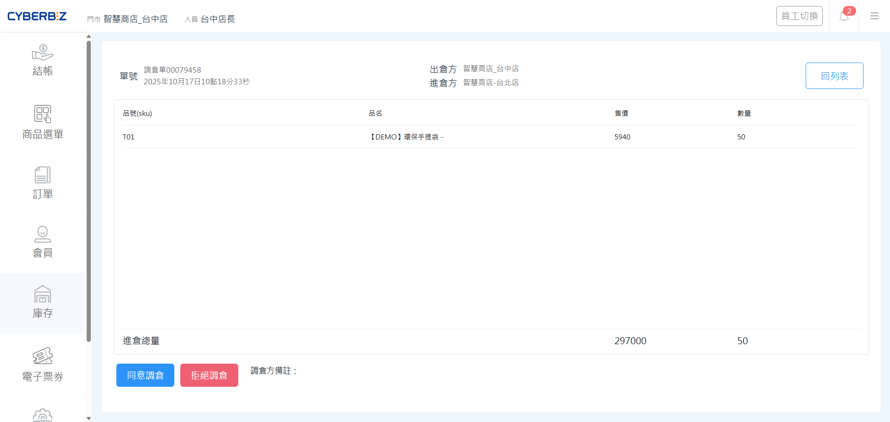

# 調倉單
處理門市間的庫存調撥需求，由缺貨方發起請求，待對方核准後啟動後續撥貨流程。
{ .subtitle }

[:lucide-tag:{ title="適用方案" }](../../resources/conventions#適用方案) | 進階 PLUS / 高手 PLUS / 企業
{ .doc-badge }

{ .hero-page }


## 使用須知

- **線上線下商品連動**：線上與線下商品的共通識別碼為 **SKU**。在執行跨倉調撥前，請確保該商品已同時存在於來源倉與目的倉的商品列表中。
（例：EC倉要將商品出倉給POS店，需確認該商品存在於該POS店商品列表中）
- **第三方定義**：若出貨對象非系統內的 EC 或 POS 倉（如外部供應商），請選擇 **第三方** 並於備註註明。

## 調倉單類型

=== "我方主動發起（手動調倉）"

    當 **我方** 發起跨店調倉申請，在他方點選 **同意調倉** 後，系統會自動生成進倉單，確保撥貨流程的軌跡完整且可被追蹤。

    **第一步**

    ```mermaid
        flowchart LR

        subgraph 他方
            A["2. 同意調倉"]
        end

        subgraph 我方
            B["1. 手動建立調倉單"]
        end

        B ----> A

    ```

    **第二步**

    ```mermaid
        flowchart LR

        subgraph 我方
            D["系統自動產生進倉單"]
        end

        subgraph 他方
            C["系統自動產生出倉單"]
        end

        
        C --出貨--> D
    ```

=== "接收進倉請求（被動調倉）"

    當 **他方** 發起跨店調倉申請，在我方點選 **同意調倉** 後，系統會自動生成出倉單，確保撥貨流程的軌跡完整且可被追蹤。

    **第一步**

    ```mermaid
        flowchart LR

        subgraph 我方
            A["2. 同意調倉"]
        end

        subgraph 他方
            B["1. 手動建立調倉單"]
        end

        B ----> A

    ```

    **第二步**

    ```mermaid
        flowchart LR

        subgraph 我方
            C["系統自動產生出倉單"]
        end

        subgraph 他方
            D["系統自動產生進倉單"]
        end

        
        C --出貨--> D
    ```

→ [了解調倉完整流程](調倉完整流程)

    
    
## 建立調倉單

=== "於後台操作"

    1. 登入 POS 管理後台，前往 **POS 功能 > 所有 POS 商店**，選擇您的商店。
    2. 進入 **庫存管理 > 調倉單**，點擊 **新增**。
    3. 選擇 **來源店家** (提供貨物的單位)。
    4. 增加品項並輸入數量，點擊 **新增調倉單**。
    5. 狀態轉為 **待他方確認**，待對方同意後，系統會自動產出對應的進倉單，請執行進倉流程。

    { .screenshot }

=== "於前台操作"

    1. 在 POS 前台點選 **庫存 > 調倉單**。
    2. 點擊 **新增調倉單**。
    3. 選擇 **來源店家** (提供貨物的單位)。
    4. 增加品項並輸入數量，點擊 **新增調倉**。
    5. 狀態轉為 **待他方確認**，待對方同意後，系統會自動產出對應的進倉單，請執行進倉流程。

    { .screenshot }


## 調倉單管理

### 狀態說明

| 順序 | 狀態 | 說明  | 出貨方操作 | 
| --- | ---- | ----- | --------- | 
| 1-1 | 待他方確認 | 此單由我方發起，須待他方同意調倉 | [同意/ 拒絕調倉](調倉單/#同意--拒絕調倉)|
| 1-2 | 待我方確認 | 此單由他方發起，須待我方同意調倉 | [同意/ 拒絕調倉](調倉單/#同意--拒絕調倉) |
| 2 | 已確認 | 調倉已成立 | - | 
| 特殊情境 | 已取消 | 調倉已取消 | - |

!!! info "調倉轉單機制"
    調倉單核准並轉為 **已確認** 後，系統將同步產出收貨方的 **進倉單** 與出貨方的 **出倉單**；後續請依各單據標準流程作業。<br>
    詳情請參閱 [調倉完整流程](調倉完整流程)。


### 同意 / 拒絕調倉

=== "於後台操作"

    1. 登入 POS 管理後台，前往 **POS 功能 > 所有 POS 商店**，選擇您的商店。
    2. 進入 **庫存管理 > 調倉單 > 列表**，查看 **待我方確認** 頁籤。
    3. 點擊 **同意調倉**，系統將自動為同意調倉門市建立出倉單。後續流程與出倉流程相同，待需求方確認進倉後，即可執行出倉。

    { .screenshot }

=== "於前台操作"

    1. 在 POS 前台點選 **庫存 > 調倉單**。
    2. 點選 **調倉單列表**，查看 **待我方確認** 頁籤。
    3. 點擊 **同意調倉**，系統將自動為同意調倉門市建立出倉單。後續流程與出倉流程相同，待需求方確認進倉後，即可執行出倉。

    { .screenshot }

## 調倉單列表

### 篩選與搜尋

- **搜尋單號**：可依 **日期** 搜尋或依 **出貨店家** 篩選。
- **搜尋商品**：請優先使用 **Barcode 條碼掃描** 或輸入完整 **SKU 碼**，以確保準確性。

## 後續操作

<div class="grid cards" markdown>

- :lucide-arrow-right:{ .lg }   
  [__調倉完整流程__](調倉完整流程.md){ data-preview }       
  從單據建立到庫存異動完成的完整流程式說明，協助您掌握跨單位撥貨的自動轉單機制與作業進度。

</div>