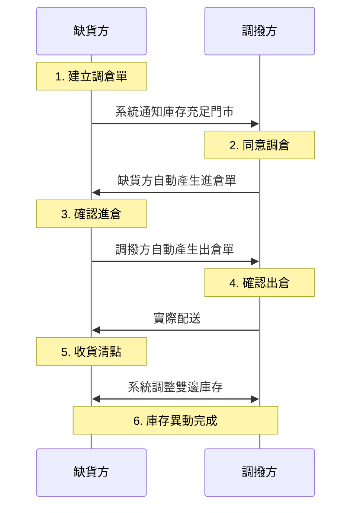

# 調倉完整流程
由需求方發起申請，透過系統自動化產單與雙向確認機制，確保門市間調撥的庫存一致性。
{ .subtitle }

[:lucide-tag:{ title="適用方案" }](../../resources/conventions#適用方案) | 進階 PLUS / 高手 PLUS / 企業
{ .doc-badge }

調倉是由 **需求方** 發起申請：

- **發起端(缺貨方)**：建立調倉單並待對方同意核准，由系統自動產出進倉單後接續執行後續收貨流程。
- **接收端(調撥方)**：核准接收到的調倉申請，由系統自動產出對應的出倉單作為扣庫與實體撥貨憑據。

1. [[缺貨方] 建立調倉單]()
2. [[調撥方] 同意調倉]()
3. [[缺貨方] 確認進倉]()
4. [[調撥方] 確認出倉]()
5. [[缺貨方] 收貨清點]()
