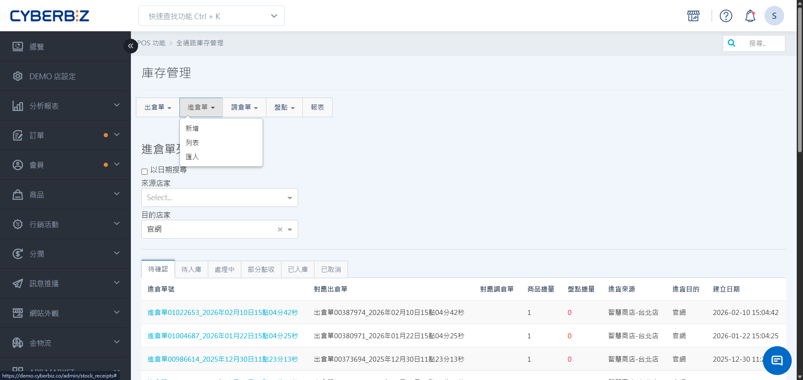
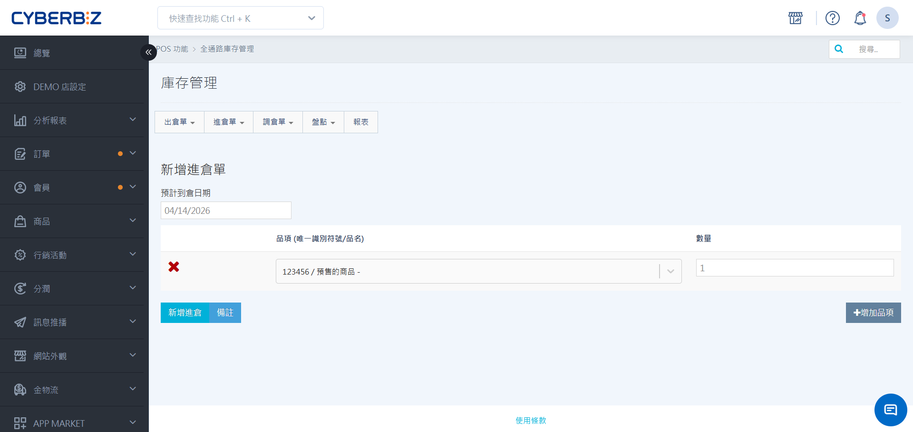
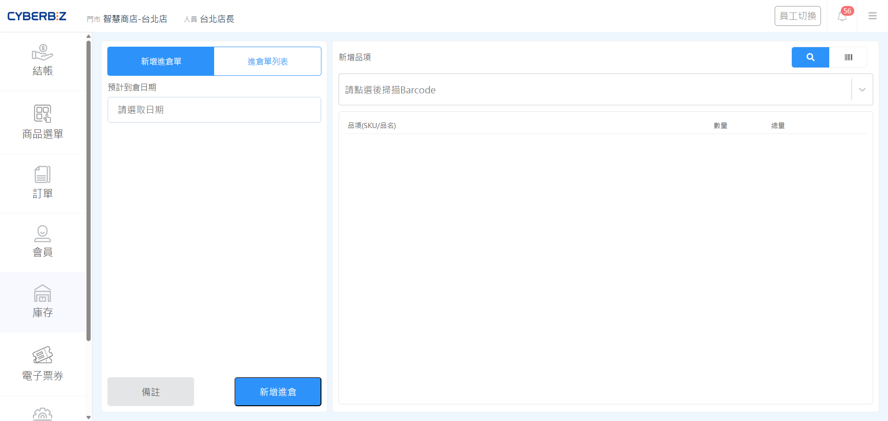
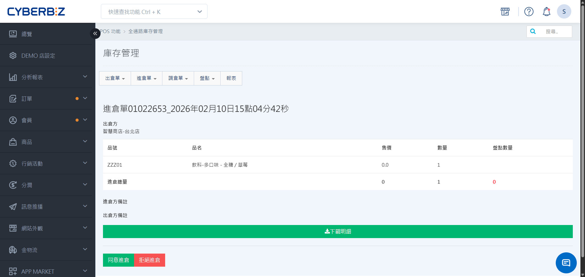
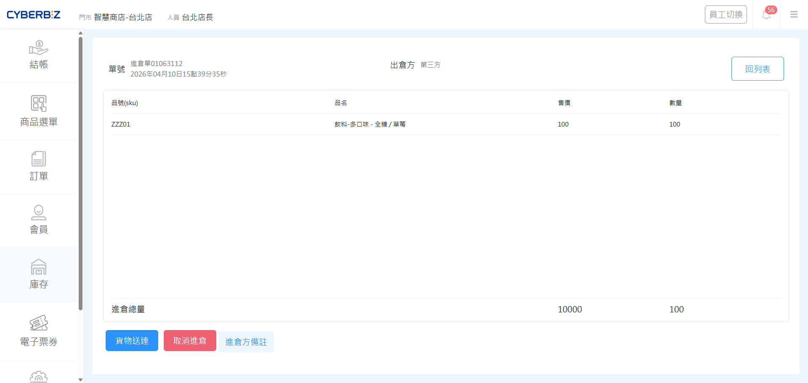
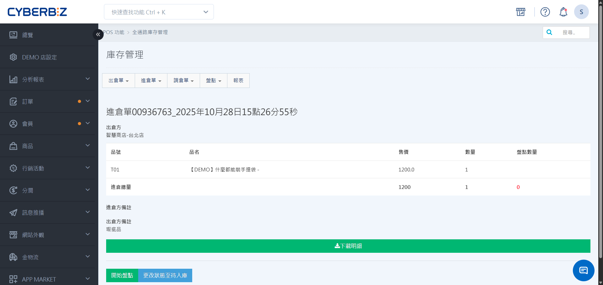
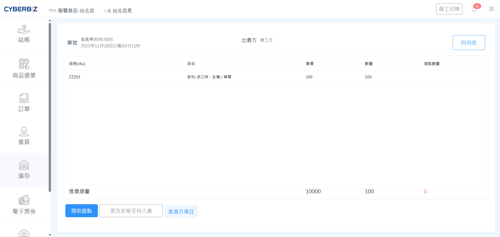

# 進倉單
管理商品撥入倉庫的單據，支援手動發起、接收出倉請求或第三方供應商進貨等多種情境。
{ .subtitle }

[:lucide-tag:{ title="適用方案" }](../../resources/conventions#適用方案) | 進階 PLUS / 高手 PLUS / 企業
{ .doc-badge }

{ .hero-page }

## 使用須知

- **線上線下商品連動**：線上與線下商品的共通識別碼為 **SKU**。在執行跨倉調撥前，請確保該商品已同時存在於來源倉與目的倉的商品列表中。
（例：EC倉要將商品出倉給POS店，需確認該商品存在於該POS店商品列表中）

## 進倉單類型

出倉單不限於手動建立，系統會根據不同通路的庫存需求，自動連動產生對應單據：

=== "我方主動發起（手動進倉）"

    由我方人員於後台手動建立進倉單，將貨物撥向自家門市。

    ```mermaid
    flowchart LR

        subgraph 我方
            A["1. 手動建立進倉單"]
        end

        subgraph 他方
            B["2. 系統自動產生出倉單"]
        end

        B --出貨--> A
    ```
    
    → [了解進倉完整流程](進倉完整流程)

=== "接收進倉請求（被動進倉）"

    當 **他方（如另一間分店 or 總倉）** 發起出倉申請時，系統會同步於我方自動產出對應的 **進倉單**，待我方核准後出倉。

    ```mermaid
    flowchart LR

        subgraph 我方
            A["2. 系統自動產生進倉單"]
        end

        subgraph 他方
            B["1. 手動建立出倉單"]
        end

        B --出貨--> A
    ```

    → [了解出倉完整流程](出倉完整流程)

=== "完成調撥協作（調倉轉單）"

    當 **我方** 發起跨店調倉申請，在他方點選 **同意調倉** 後，系統會自動生成進倉單，確保撥貨流程的軌跡完整且可被追蹤。

    **第一步**

    ```mermaid
        flowchart LR

        subgraph 他方
            A["2. 同意調倉"]
        end

        subgraph 我方
            B["1. 手動建立調倉單"]
        end

        B ----> A

    ```

    **第二步**

    ```mermaid
        flowchart LR

        subgraph 我方
            D["系統自動產生進倉單"]
        end

        subgraph 他方
            C["系統自動產生出倉單"]
        end

        
        C --出貨--> D
    ```

    → [了解調倉完整流程](調倉完整流程)

## 進倉單操作

### 建立進倉單

=== "於後台操作"

    1. 依權限與門市管理需求選擇操作路徑：
        - **EC POS 全通路出倉**：前往 **POS 功能 > 全通路庫存管理**。
        - **指定門市出倉**：前往 **POS 功能 > 所有 POS 商店**，選擇指定門市。
    2. 點擊 **進倉單**，點擊 **新增**。
    3. 設定 **預計到貨日**。
    4. 新增出倉品項，輸入 SKU 或名稱搜尋商品，並填寫數量。
    5. 點擊 **新增進倉**，完成發貨申請。
    
    !!! tip "批量操作"
        若品項眾多，可點擊 **匯入**，下載範例 Excel 填寫後上傳，支援同時發貨至多個門市（店名以逗號分隔）。

    { .screenshot }

=== "於前台操作"

    1. 在 POS 前台點選 **庫存 > 進倉單**。
    2. 點擊 **新增出倉單**，設定 **預計到倉日期**。
    3. 掃描商品條碼並輸入數量。
    4. 點擊 **新增進倉**，等待對方接收。

    { .screenshot }

#### 第三方進倉作業

- **第三方定義**：凡進貨對象非系統內之通路 **（如外部供應商、既有庫存初始化）**，**來源店家** 請統一選擇 **第三方** 並於備註載明細項。
- **自動轉單機制**：第三方進倉無需經由出貨方確認或執行出倉，單據建立後將直接進入 **待入庫** 狀態供門市收貨點收。


## 進倉單管理

### 狀態說明

| 順序 | 狀態 | 說明 | 我方下一步操作 |
| ---- | --- | ---- | ------------- | 
| 1 | 待確認 | 單據已建立，正等待收貨方核准 | [確認 / 取消進倉](進倉單/#確認--取消進倉) | 
| 2 | 待入庫 | 收貨方已核准，等待發起端發貨 | [確認 / 取消收貨](進倉單/#確認--取消收貨) |
| 3 | 處理中 | 貨物已離開門市，正在運輸途中 | [收貨清點](進倉單/#收貨清點) |
| 4 | 部分點收 | 貨品分次抵達，盤點數未達總數<br>待貨品全部抵達，可再次執行盤點 | [收貨清點](進倉單/#收貨清點) | 
| 5 | 已入庫 | 流程完成，庫存已成功移轉至接收方 | - | 
| 特殊情境 | 已取消 | 行為終止，不執行庫存異動 | - |

### 確認 / 取消進倉


=== "於後台操作"    
    
    1. 依權限與門市管理需求選擇操作路徑：
        - **EC POS 全通路進倉**：前往 **POS 功能 > 全通路庫存管理**。
        - **指定門市進倉**：前往 **POS 功能 > 所有 POS 商店**，選擇指定門市。
    2. 點擊 **進倉單**，進入 **列表**。
    3. 查看 **待確認** 頁籤，核對品項後，點擊 **同意進倉** / **拒絕進倉**。

    { .screenshot }

=== "於前台操作"

    1. 在 POS 前台選單點選 **庫存 > 進倉單**。
    2. 點選 **進倉單列表**，查看 **待確認** 頁籤。
    3. 進入進倉單，核對品項後，點擊 **同意進倉** / **拒絕進倉**。

    { .screenshot }

### 確認 / 取消收貨

=== "於後台操作"

    1. 依權限與門市管理需求選擇操作路徑：
        - **EC POS 全通路進倉**：前往 **POS 功能 > 全通路庫存管理**。
        - **指定門市進倉**：前往 **POS 功能 > 所有 POS 商店**，選擇指定門市。
    2. 點擊 **進倉單**，進入 **進倉單列表**，查看 **待入庫** 頁籤。
    3. 點選 **貨物送達**，確認貨物已到貨。

        > **狀態同步**：
            我方 **入倉單** 與對方的 **出倉單**，同步切換為 **處理中** 狀態
    
    { .screenshot }

=== "於前台操作"    
    
    1. 在 POS 前台選單點選 **庫存 > 進倉單**。
    2. 點選 **進倉單列表**，查看 **待入庫** 頁籤。
    3. 進入進倉單，點擊 **貨物送達**。
    4. 點選 **貨物送達**，確認貨物已到貨。

        > **狀態同步**：
            我方 **入倉單** 與對方的 **出倉單**，同步切換為 **處理中** 狀態

    { .screenshot }

### 收貨清點

=== "於後台操作"

    1. 依權限與門市管理需求選擇操作路徑：
        - **EC POS 全通路進倉**：前往 **POS 功能 > 全通路庫存管理**。
        - **指定門市進倉**：前往 **POS 功能 > 所有 POS 商店**，選擇指定門市。
    2. 點擊 **進倉單**，進入 **進倉單列表**，查看 **處理中** 頁籤。
    3. 點選 **開始盤點**，輸入實際到貨量後點擊 **送出盤點結果**。

        > **狀態同步**： <br> 我方 **入倉單** 自動切換為 **已入庫** 狀態 / 對方 **出倉單** 自動切換為 **已出庫** 狀態

    { .screenshot }

=== "於前台操作"    
    
    1. 在 POS 前台選單點選 **庫存 > 進倉單**。
    2. 點選 **進倉單列表**，查看 **處理中** 頁籤。
    3. 進入進倉單，點擊 **開始盤點**。
    4. 使用掃描槍清點數量，完成後點擊 **送出盤點結果**。

        > **狀態同步**：<br> 我方的 **入倉單** 自動切換為 **已入庫** 狀態 / 對方的 **出倉單** 自動切換為 **已出庫** 狀態

    { .screenshot }

## 進倉單列表

### 篩選與搜尋

- **搜尋單號**：可依 **日期** 搜尋或依 **來源店家** 篩選。
- **搜尋商品**：請優先使用 **Barcode 條碼掃描** 或輸入完整 **SKU 碼**，以確保準確性。


## 後續操作

<div class="grid cards" markdown>

- :lucide-arrow-right:{ .lg }   
  [__進倉完整流程__]([進倉完整流程.md){ data-preview }       
  從單據建立到庫存異動完成的完整流程式說明，協助您掌握跨單位撥貨的自動轉單機制與作業進度。

</div>