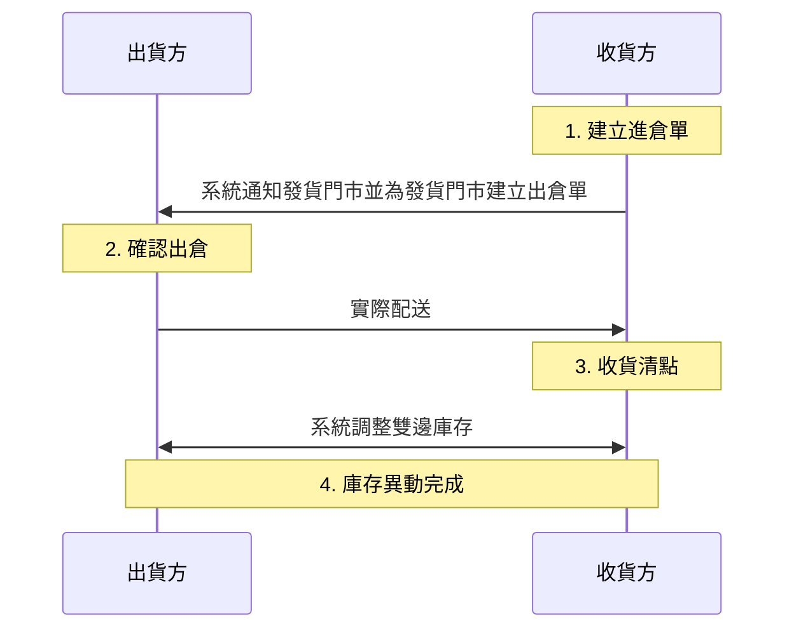

# 進倉完整流程
掌握由收貨方發起的完整進倉作業流程，從建立請求、系統自動轉單、出貨方發貨到最終的收貨清點與庫存同步。
{ .subtitle }

[:lucide-tag:{ title="適用方案" }](../../resources/conventions#適用方案) | 進階 PLUS / 高手 PLUS / 企業
{ .doc-badge }

進倉是由 **收貨方** 發起申請：

- **發起端(收貨方)**：向指定單位（如總倉或其他分店）提出貨物請求，並建立 **進倉單**。
- **接收端(出貨方)**：當進倉單成立時，系統將自動於收貨方後台建立一筆對應的 **出倉單**。

1. [[收貨方] 建立進倉單]()
2. [[出貨方] 確認 / 取消出倉]()
3. [[收貨方] 收貨清點]()

