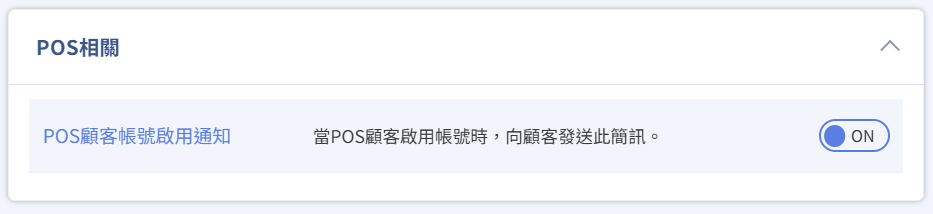
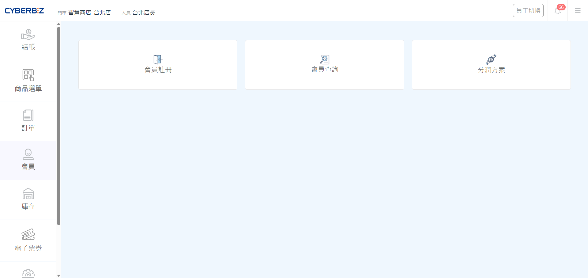
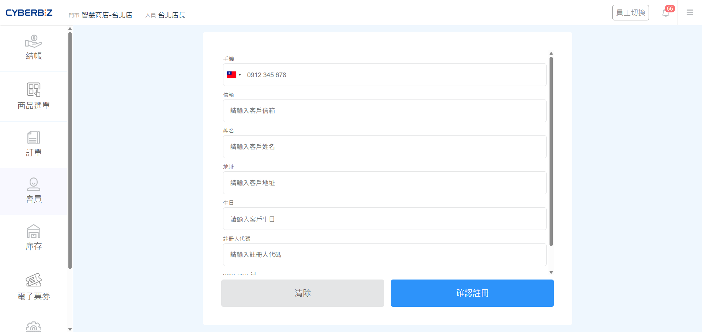
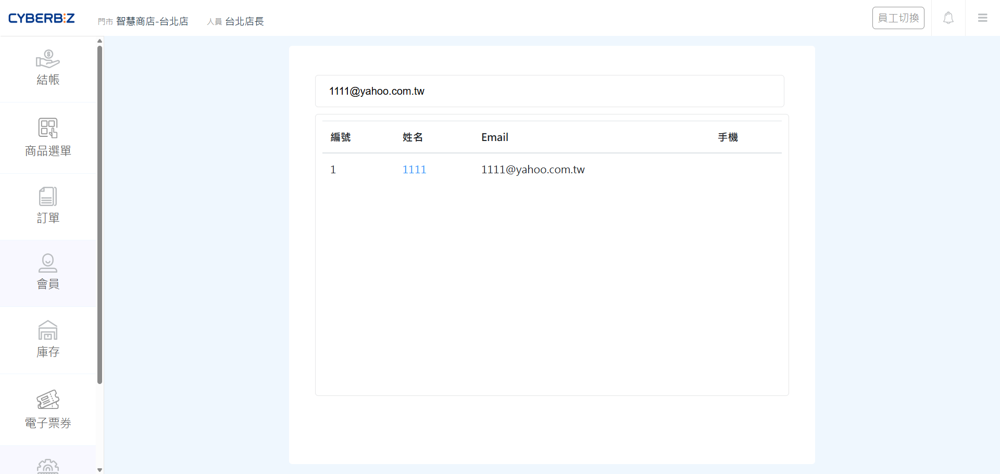
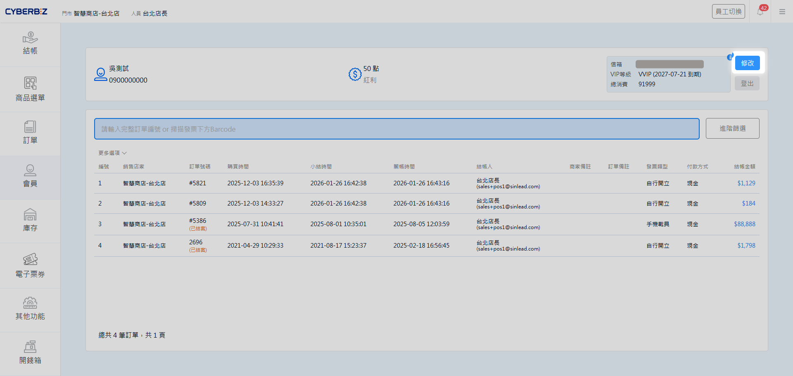
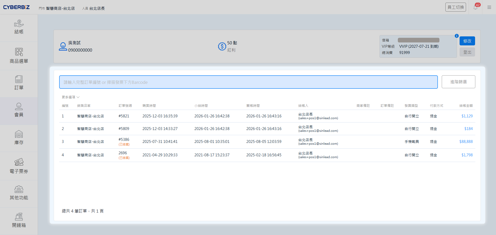
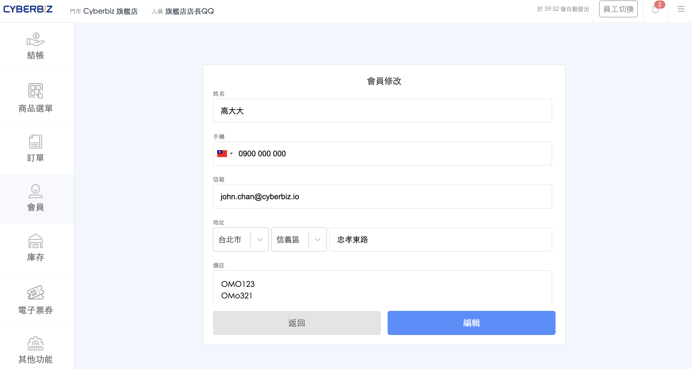
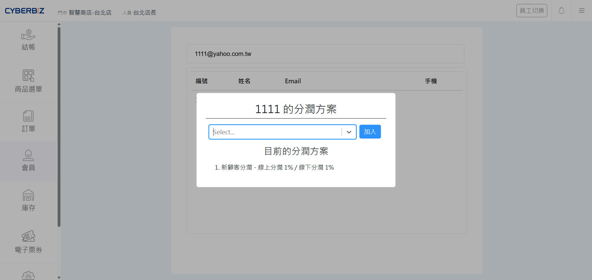
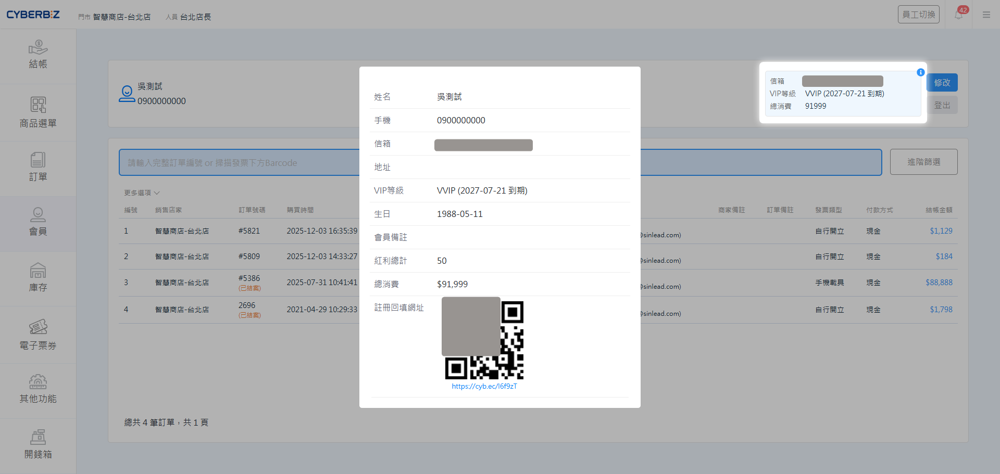

# 使用 POS 前台管理會員
透過 POS 前台快速註冊新會員、查詢顧客資料與管理推薦分潤，提升門市會員經營效率。
{ .subtitle }

[:lucide-tag:{ title="適用方案" }](../../resources/conventions#適用方案) | 進階 PLUS / 高手 PLUS / 企業
{ .doc-badge }

!!! tip "應用情境"
    - **快速轉化路過客**：在結帳流程中為顧客快速註冊，提高會員轉換率並累積行銷名單。
    - **精準服務查詢**：根據顧客手機或 Email 即時調閱消費記錄，提供個人化服務。
    - **忠誠度激勵**：查詢並管理顧客的推薦分潤方案，鼓勵顧客進行口耳相傳。

## 使用須知

- **搜尋準確度**：搜尋會員時必須輸入完整的正確資訊（如完整手機號碼 0912345678 或完整 Email），系統不支援模糊搜尋。
- **簡訊功能設定**：註冊會員前，必須先於管理後台開啟 **POS 顧客帳號啟用通知** 簡訊樣版。

    > **設定位置**：前往 **訊息推播 > 簡訊通知樣版 > POS 相關**，開啟 **POS 顧客帳號啟用通知**。

    { .screenshot }

- **發送費用**：系統發送註冊啟用簡訊時，將根據簡訊發送數量收取額外費用。

## 操作流程

### 註冊新會員

引導新顧客加入會員，使其可享有註冊相關優惠。

1. 在 POS 前台點擊 **會員 > 會員註冊**。
    { .screenshot }
2. 在 **手機** 或 **信箱** 欄位輸入正確資訊（其中一項為必填）。
    { .screenshot }
3. 點擊 **確認註冊**，系統將發送包含啟用連結的簡訊至顧客手機，請引導顧客開啟簡訊，完成帳戶啟用後，方可結帳。

### 查詢與編輯會員資料

即時查看會員的消費細節或修改其個人資訊。

1. 在 POS 前台點擊 **會員 > 會員查詢**。
    { .screenshot }
2. 輸入欲查詢的會員 **姓名**、**手機** 或 **Email**（需輸入完整資訊）。
3. 點擊 **搜尋**，系統將顯示符合條件的會員列表。
    { .screenshot }
4. 點選目標會員進入資訊頁面：
    { .screenshot }

    - 點擊訂單項目可查看消費細節。

        { .screenshot }

    - 點擊 **修改** 可編輯會員資料。

        { .screenshot }

        !!! note "會員欄位同步"
            **備註** 一欄資訊會同步顯示於官網後台，並可於會員明細頁面中查看。
            { .screenshot }
    

### 管理推薦分潤方案

查詢顧客適用的 [推薦分潤](../../ec/profit-sharing/設定推薦人分潤方案/) 方案細節。

1. 在 POS 前台點擊 **會員 > 分潤方案**。
    { .screenshot }
2. 輸入會員完整資訊進行搜尋。
    { .screenshot }
3. 點擊會員名稱，進入該消費者的分潤方案查看頁面。
    - **查看現有權益**：於 **目前的分潤方案** 欄位，核對該會員目前適用的方案名稱。
    - **手動綁定方案**：若需新增權限，請點擊下拉選單選擇目標方案，並點擊 **加入** 完成綁定。

    { .screenshot }

## 常見問題

??? quote "顧客表示註冊後未收到簡訊？"
    若顧客表示未收到帳號啟用簡訊，可透過 **會員查詢** 前往會員資訊頁面，點擊 **i** 按鈕，系統將顯示 **QR Code**，讓顧客現場掃碼完成帳號啟用。
    { .screenshot }

