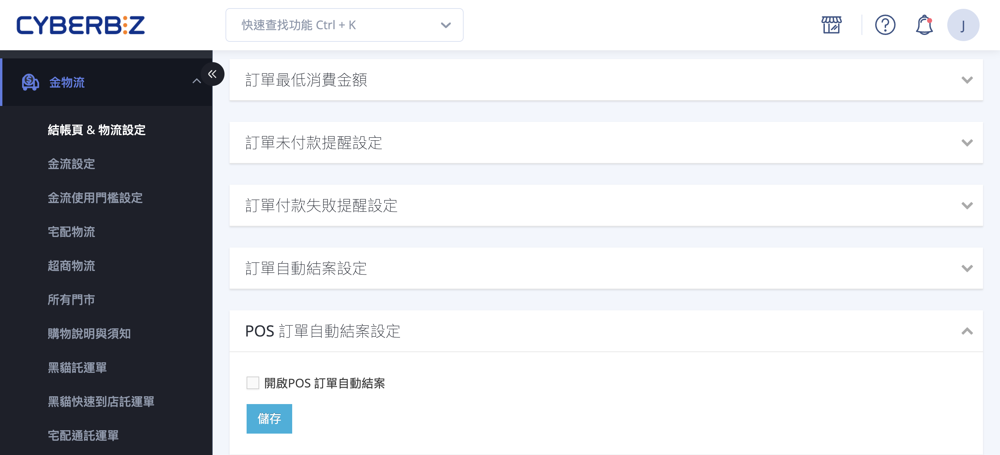

[:lucide-layers:{ title="適用產品" }](../../resources/conventions#適用產品) | 智能 POS
{ .doc-badge }

{ title="POS 訂單自動結案設定" .hero-page }

## POS 訂單自動結案說明 { #intro-pos-auto-close }

「POS 訂單自動結案」是針對 **POS 門市訂單** 的自動化設定。門市現場結帳後，訂單會先停留在「未結案」狀態；唯有當訂單進入 **「已結案」** 後，系統才會接著執行下列動作：

- **發送購物紅利**：顧客在該筆訂單獲得的紅利點數正式匯入帳戶。
- **生效贈送的優惠券**：滿額贈送的優惠券會在結案後才正式生效、可供使用。
- **認列分潤獎金**：店員或推薦人的分潤業績會在此時計算認列。
- **整理未結案清單**：結案後，該筆訂單會從後台「未結案」清單中移除，維持訂單管理介面整潔。

開啟自動結案後，您就不必每天手動逐筆結案，系統會依設定的時機自動完成上述流程。

## 使用前提與限制 { #prerequisites-pos-auto-close }

- [x] **已開通 POS 功能**：此設定僅在已開通 POS 的商店中顯示，未開通則不會看到此區塊。
- [x] **網站擁有者權限**：僅 **網站擁有者** 可以變更此設定，其他帳號無法修改。

## 操作步驟教學 { #operate-pos-auto-close }

1. **進入設定頁：** 前往後台路徑：「金物流」>「結帳頁 & 物流設定」> 捲動至 **「訂單相關設定」** 區塊，找到 **「POS 訂單自動結案設定」** 並點擊展開。
2. **開啟功能：** 勾選 **「開啟POS 訂單自動結案」**，下方才會出現結案方式的選項。

    { title="開啟自動結案功能畫面" }

3. **選擇結案方式：** 於下列兩種方式 **二擇一** 設定[^mode]。

    === "結帳後立即結案"

        勾選 **「結帳後立即結案訂單」**。顧客在門市結帳完成的當下，該筆訂單即自動結案，紅利與優惠券能最快發放給顧客。

        { title="立即結案設定畫面" }

        !!! tip "建議門市優先採用"
            立即結案能讓顧客現場結帳後馬上拿到紅利或優惠券，提升回購便利性，適合多數實體門市。

    === "結帳後指定天數結案"

        不要勾選立即結案，於 **「當結帳後 ＿ 天訂單自動結案」** 欄位填入天數（例如 `7`）。系統會在訂單付款滿指定天數後，於每日批次時間自動將其結案。

        { title="指定天數結案設定畫面" }

4. **儲存設定：** 完成後點擊 **「儲存」**，設定即時生效。

[^mode]: 兩種方式互斥，勾選「立即結案」後就不會顯示天數欄位。

## 系統執行規則與注意事項 { #specs-pos-auto-close }

### 兩種結案方式的差異 { #specs-pos-auto-close-modes }

| 結案方式 | 結案時機 | 是否處理「設定前」既有的未結案訂單 |
| :-- | :-- | :-- |
| 結帳後立即結案 | 訂單付款完成的當下立即結案 | 否，僅對開啟設定之後成立的訂單生效 |
| 結帳後指定天數結案 | 付款滿 N 天後，於每日批次時間結案 | 是，會一併處理設定前就已存在的未結案訂單 |

!!! note "註釋"
    若您希望系統回頭整理開啟設定前就累積的未結案訂單，請選擇 **「指定天數」** 方式；「立即結案」只會處理之後新成立的訂單。

---

### 結案的前提與時間 { #specs-pos-auto-close-timing }

- **訂單必須已付款**：只有 **已結帳付款** 的訂單會被自動結案，尚未付款的訂單不會自動結案。
- **已取消訂單不處理**：已取消的訂單不會被自動結案。
- **每日固定批次時間**：採用「指定天數」方式時，系統每日清晨 **06:15** 進行一次批次掃描結案，因此訂單不會在滿期的「分秒」當下立即結案，而是在下一個批次時間完成。
- **天數計算範例**：以設定 7 天為例，**1 月 1 號結帳的訂單會在 1 月 8 號自動結案**。

---

## 後續操作 { #next-steps-pos-auto-close }

- :lucide-check-check:{ .lg }  
  [__訂單相關設定總覽__](../../ec/payments-and-logistics/payments/order-settings.md){ title="訂單相關設定" }  
  查看自動結案、自動取消、未付款提醒等同一頁面的其他訂單規則。

- :lucide-list-ordered:{ .lg }  
  [__訂單部分出貨__](../../ec/orders/home-delivery/partial-shipment.md){ title="設定訂單部分出貨" }  
  了解訂單的出貨與狀態流程，掌握結案前的訂單處理。

## 常見問題 { #faq-pos-auto-close }

??? quote "開啟自動結案後，為什麼之前的未結案訂單沒有被結案？"
    { #faq-pos-auto-close-existing-orders }
    這取決於您選擇的結案方式：

    - **結帳後立即結案**：只對 **開啟設定之後** 成立的訂單生效，不會回頭處理設定前的舊訂單。
    - **結帳後指定天數結案**：會一併處理設定前就存在的未結案訂單，但需等到付款滿指定天數、且經過每日批次時間後才會結案。

    若想結案設定前的舊訂單，請改用「指定天數」方式，或直接手動結案。

??? quote "設定完成後，訂單沒有馬上結案是正常的嗎？"
    { #faq-pos-auto-close-not-closed }
    若您採用 **指定天數** 方式，系統是 **每日清晨固定批次** 統一處理，並非在訂單滿期的當下即時結案，因此會有時間差，屬正常現象。此外請確認該筆訂單 **已完成付款**，未付款的訂單不會被自動結案。

??? quote "找不到「POS 訂單自動結案設定」這個區塊？"
    { #faq-pos-auto-close-not-found }
    請確認以下兩點：

    - 您的商店 **已開通 POS 功能**，此設定僅對有 POS 的商店顯示。
    - 您是以 **網站擁有者** 身分登入，僅擁有者可變更此設定。

??? quote "訂單結案後又發生退貨，紅利與分潤會怎麼處理？"
    { #faq-pos-auto-close-return }
    訂單一旦結案，紅利與分潤即已正式發放與認列。後續若發生退貨，相關紅利與分潤的回收方式會依您商店的 **退貨與紅利相關設定** 而定，建議至該筆訂單或會員頁面確認實際狀態，必要時再做調整。

---

## 參考資料 { #reference-pos-auto-close }

- [付款狀態說明](../../ec/orders/references/payment-statuses.md)
