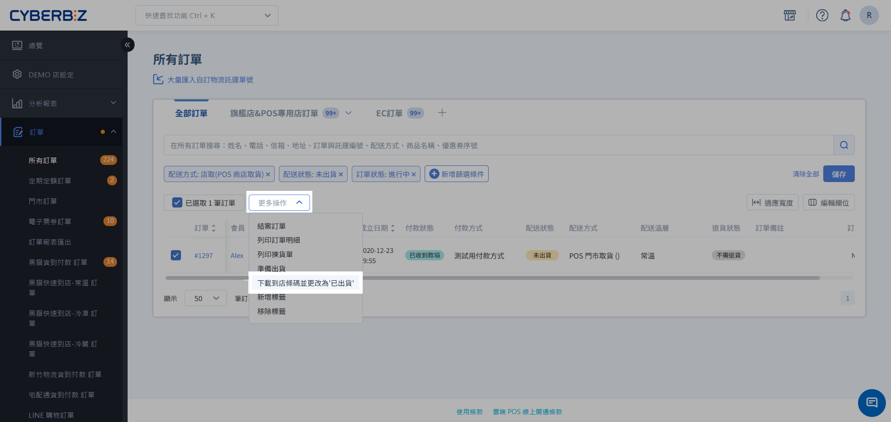
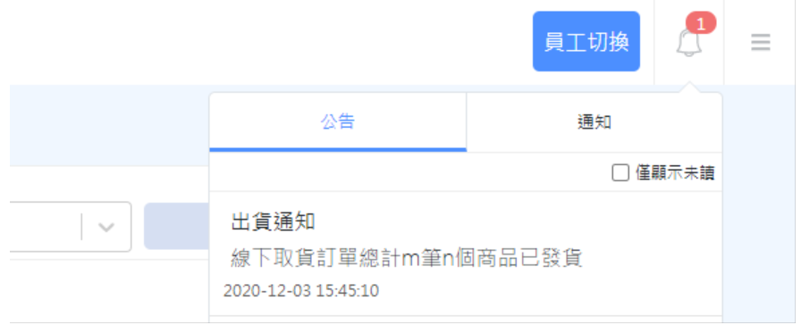
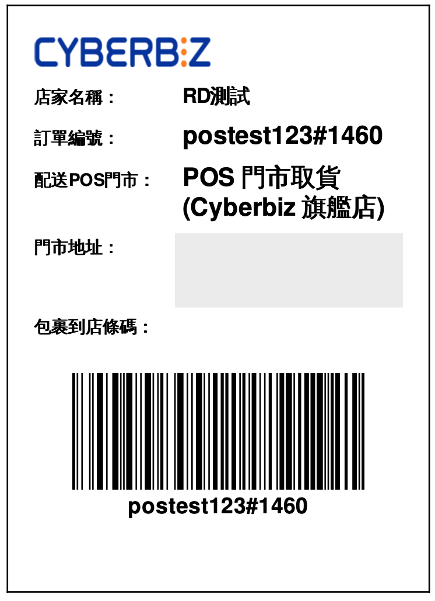
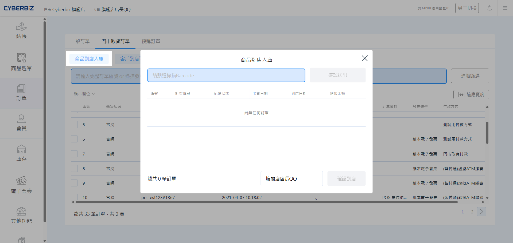
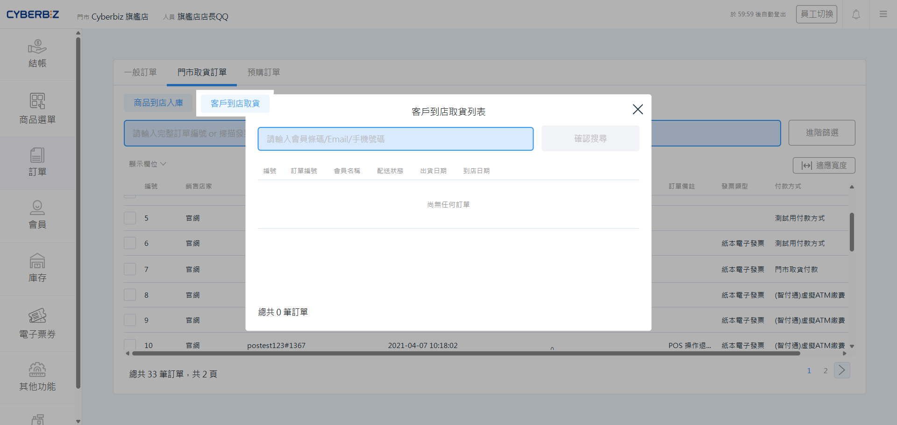
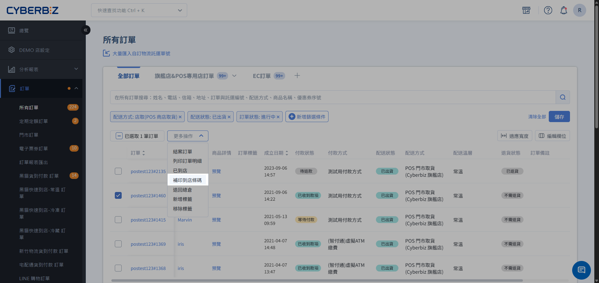
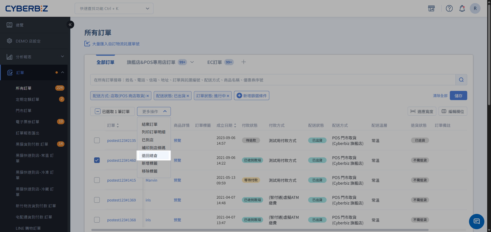
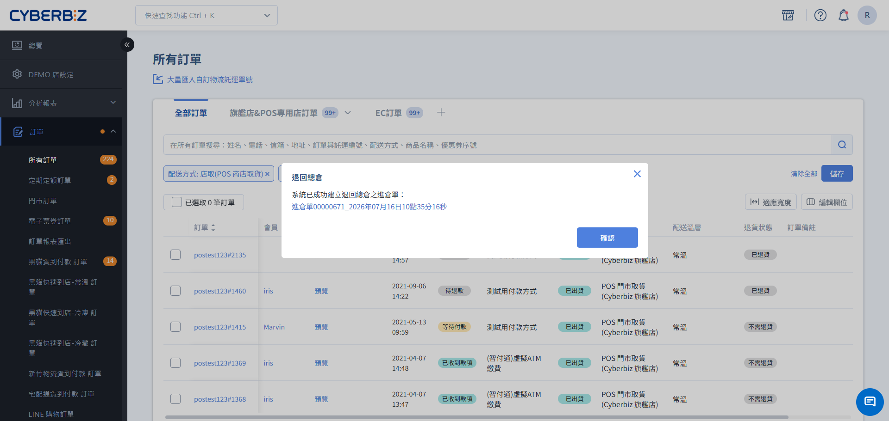
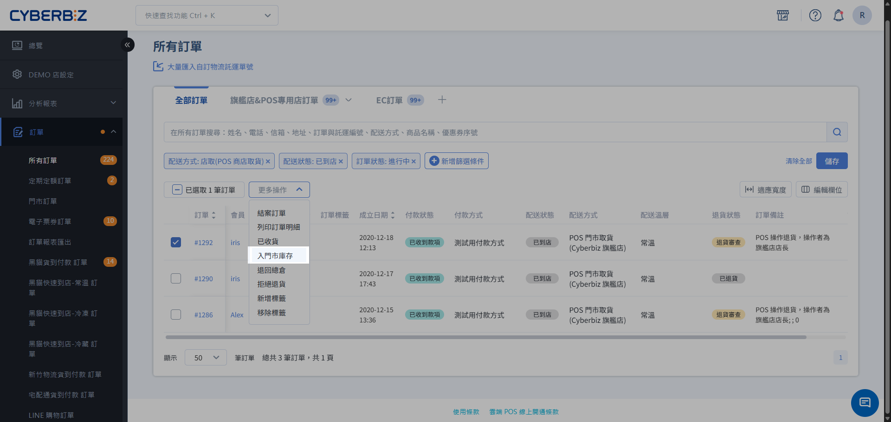

# 門市取貨訂單(入庫/取貨)
瞭解如何在 POS 前台處理官網訂單的包裹到店入庫、客戶取貨與逾期訂單管理，實現官網下單、門市取貨的 OMO 營運。
{ .subtitle }

[:lucide-layers:{ title="適用產品" }](../../resources/conventions#適用產品) | 智能 POS
{ .doc-badge }

!!! tip "適用範圍與對照"
    本文件僅適用於 **POS 門市訂單** 的出貨管理。若需操作 **一般門市訂單**，請參閱 [門市取貨訂單出貨](../../ec/orders/store-pickup-orders.md)。

## 使用須知

- **前置條件**：此功能僅適用於已開通 **POS 門市取貨**。
- **訂單條件**：管理後台已標記為 **已出貨** 的訂單。
- **分潤連動**：若商家已設定 [門市取貨店員分潤](../store/pos-store-pickup-staff-commission.md)，系統將根據操作流程中選擇的 **收貨點貨人員** 作為分潤計算對象。
- **全單退貨限制**：POS 門市取貨訂單僅支援 **全單退貨**，無法進行部分商品退貨。

## 出貨流程

### 步驟一：訂單出貨

1. 登入 CYBERBIZ 管理後台，前往 **訂單 > 所有訂單**。

    > 您可使用訂單篩選器，在 **配送方式** 中選擇 `POS 商店取貨`，找出待處理訂單。

2. 勾選欲處理的訂單（可單筆或批次勾選相同配送方式的訂單）。
3. 點選右上角 **選擇操作**，選擇 **下載到店條碼並改為已出貨**。

    { .screenshot }

    !!! info "POS 門市到店條碼"
        - **使用情境**：供門市收貨人員 **掃描入庫** 及顧客取貨時 **核銷結帳**。
        - **產生時機**：將訂單標記為 **已出貨** 時，系統會自動生成條碼文件並扣除 EC 庫存，同時推送通知至對應 POS 門市。
        
            { .small-image }
        - **操作方法**：列印下載的 PDF 到店條碼單，並貼在包裹外箱。
        - **注意事項**：此條碼僅供 **內部管理與門市核銷** 使用，**不具備** 第三方物流（如黑貓、宅配通）的配送與貨態追蹤功能。

        { .small-image }

  

### 步驟二：包裹到店入庫

當總倉寄送的包裹抵達門市時，店員需執行入庫動作，系統將同步發送簡訊或 Email 通知顧客。

1. 在 POS 前台首頁，點選 **訂單 > 門市取貨訂單**。
2. 點擊左上角 **商品到店入庫**。
3. 在彈窗中點選 **請點選後掃描Barcode**，使用掃碼槍掃描包裹上的 **到店條碼**。
4. 系統自動帶入訂單資訊後，在 **收貨點貨人員** 下拉選單中選擇您的名稱。
5. 點擊 **確認到店**。
    
    > 訂單的配送狀態將從 **已出貨** 變更為 **已到店**。

{ .screenshot }

### 步驟三：客戶到店取貨

顧客臨櫃時，店員需核對資料並完成交付。

1. 在 POS 前台首頁，點選 **訂單 > 門市取貨訂單**。
2. 點擊左上角 **客戶到店取貨**。
3. 輸入顧客的 **手機號碼** 或 **Email**（或掃描 APP 會員條碼），點擊 **確認搜尋**。
4. 系統將列出該顧客所有 **已到店** 的訂單，點選欲取貨的項目並點擊 **取貨**。
5. 依照系統提示，再次掃描包裹上的條碼進行複核。
6. 選擇 **收貨點貨人員** 並點擊 **確認**，將貨品交給顧客。
    
    > 訂單的配送狀態將變更為 **已收貨**。

{ .screenshot }

## 限定會員條碼取貨

為確保領取人身分，您可於管理後台，前往 **金物流 > 結帳頁與物流設定**，開啟 **限定會員條碼取貨設定**。

!!! warning "設定風險"
    此功能需要配合 OMO_APP 或 LINE@ 產生會員條碼。(若欲使用 LINE@ 會員條碼，則每位顧客都需綁定 Line@ 會員，並取得會員條碼)
    
    開啟此設定後，店員僅能透過掃描顧客手機 APP 的 **會員條碼** 進入取貨流程，無法手動輸入電話或 Email 搜尋。

## 退貨流程

當顧客對取貨商品有退貨需求時，請依據顧客所在的場域選擇對應的處理方式。

### 場景一：顧客取貨當下於門市退貨

若顧客於門市拆開包裹後立即要求退貨，請由門市人員透過 POS 前台操作。

1. 在 POS 前台 **門市取貨訂單** 頁面，點選該筆訂單。
2. 點擊右下角 **申請退貨**。

    > 訂單狀態將變更為 **退貨中**。

3. 門市人員將包裹妥善包裝後，寄回總倉。
4. 待總倉管理員於管理後台執行 [退貨審查](../../ec/orders/order-return-process.md#步驟-2執行退貨審查) 後，完成退貨程序。

### 場景二：顧客取貨回家後辦理退貨

若顧客已將商品攜離門市，則需透過官網前台或連繫客服辦理。

1. 顧客登入官網 **會員中心 > 訂單查詢**，點選 **申請退貨**。
2. 管理員前往後台，將訂單 `配送狀態` 切換為 `退貨中`。
3. 可安排逆物流回收包裹。

    - [7-11 C2B 退貨便](../../ec/orders/returns-refunds/cvs-c2b-return.md) 
    - [7-11 C2C 退貨便](../../ec/orders/returns-refunds/7-11-c2c-return.md) 
    - [黑貓逆物流](../../ec/payments-and-logistics/setup-print-tcat-waybill-v2.md#ezcat-shipping-note-reverse)
    - [宅配通逆物流](../../ec/payments-and-logistics/setup-pelican-waybill-v2.md#operate-pelican-shipping-reverse) 
    - [新竹物流逆物流](../../ec/payments-and-logistics/setup-hct-waybill-v2.md#operate-hct-setup-reverse) 

4. 包裹回倉後，由管理員於後台進行 [退貨審查](../../ec/orders/order-return-process.md#步驟-2執行退貨審查)，並執行後續退款作業。

## 特殊情境處理

### 補印到店條碼單

若訂單已改為 **已出貨** 但需重新列印條碼，請勾選該訂單，於 **選擇操作** 選單中點選 **補印到店條碼**。

{ .screenshot }

### 處理逾期未取訂單

若包裹在店存放超過指定天數，可依以下步驟清理。

1. 前往 **門市取貨訂單**，點選 **進階篩選**。
2. 將訂單狀態勾選為 **已逾期**，點擊 **確認**。
3. 針對篩出的訂單，您可以：
    - **通知取貨**：聯繫顧客後，依標準流程辦理取貨。
    - **申請退貨**：若聯繫未果或顧客要求退貨，點擊訂單明細右下角的 **申請退貨**。
4. 申請退貨後，請依照後續指示將商品 **退回總倉** 或 **入門市庫存**。
    - 流程可參照 [訂單取消 - 包裹已到店（顧客尚未取貨）](#三包裹已到店顧客尚未取貨)。

!!! info "如何啟用功能"
    請登入 CYBERBIZ 管理後台，前往 **金物流 > 結帳頁與物流設定**，於 **POS 商店取貨訂單逾期設定** 開啟功能並自訂天數。

### 取消訂單與退回總倉

根據訂單所處的不同階段，處理方式如下：

#### 一、包裹出貨前（未出貨）

=== "商家"

    若配送狀態為 `未出貨`，管理員可直接在訂單內點選 **取消訂單**。

    { .screenshot }

=== "消費者"
    
    消費者也可於前台訂單明細頁 **取消訂單**。

    { .screenshot }

#### 二、包裹已出貨但尚未到店

若需攔截已寄出的包裹，請執行以下操作：

1. 於訂單列表勾選訂單，點選右上角 **選擇操作 > 退回總倉**。
    { .screenshot }
2. 訂單狀態將變更為 `已退貨`，系統會自動建立一筆進倉單。

    > 來源店家為 **第三方**，狀態為 **待入庫**

    { .screenshot }
    

3. 前往 **POS 功能 > 全通路庫存管理 > 進倉單** 完成 [收貨清點](../inventory/inbound-orders/#收貨清點)，回補 EC 庫存。

#### 三、包裹已到店（顧客尚未取貨）

當包裹已抵達門市但顧客要求退貨時，管理員可選擇 **入門市庫存** 或 **退回總倉**：

=== "入門市庫存"

    由後台執行 **入門市庫存**，此時訂單變更為 `退貨中`。系統會自動在該門市建立進倉單，由門市人員 [收貨清點](../inventory/inbound-orders/#收貨清點) 後轉為店內庫存。

    { .screenshot }

=== "退回總倉"

    由店員在 POS 端申請退貨，此時訂單變更為 `退貨中`。包裹寄回後由後台執行 **退貨審查** 並改為 `已退貨`。若選擇 **退回總倉**，訂單狀態即變更為 `已退貨`，再進行退款程序。

    { .screenshot }

    

## 常見問題

??? quote "為什麼下載到店條碼時提示失敗？"
    請檢查該訂單是否包含「貨到付款」選項。目前 POS 門市取貨僅支援「先付款後取貨」，若設定包含貨到付款，將無法產生到店條碼。

??? quote "消費者取貨後如何退貨？"
    - **現場退貨**：門市人員可在 POS 前台點選「申請退貨」，狀態會轉為 `退貨中`，後續由管理後台完成審查。
    - **官網退貨**：消費者可在官網前台申請退貨，流程與一般 EC 訂單相同。

??? quote "忘記選收貨點貨人員會影響分潤嗎？"
    是的。分潤計算依賴操作當下選取的員工。若操作時漏選，系統將無法自動歸屬該筆分潤。

