# 管理 POS 前台訂單
掌握 POS 前台的訂單查詢、取消與換貨流程，並瞭解發票作廢、折讓與庫存回補等系統自動化邏輯。
{ .subtitle }

[:lucide-tag:{ title="適用方案" }](../../resources/conventions#適用方案) | 進階 PLUS / 高手 PLUS / 企業
{ .doc-badge }

!!! tip "應用情境"
    - **顧客退換貨**：當顧客持發票或訂單號碼回門市退換貨時，快速進行系統端處理。
    - **訂單資訊核對**：每日結帳前核對訂單狀態，確保已結案或取消的訂單數量正確。
    - **發票錯誤修正**：若結帳當下發現發票開立錯誤，可立即取消訂單以作廢發票。

## 查詢訂單

1. 在 POS 前台點擊 **訂單**。
2. 您可指定查詢 **一般訂單**、**門市取貨訂單** 或 **預購訂單**：
    - **搜尋**：輸入訂單號碼或直接掃描發票上的條碼。
    - **篩選**：點擊進階篩選，設定 **訂單成立時間** 或 **認單日期**。
    - **狀態過濾**：勾選是否顯示已取消的訂單。
3. 點選目標訂單進入詳細頁面。

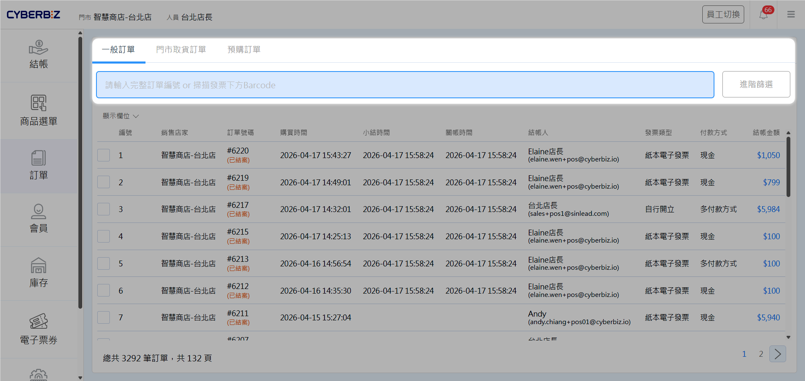{ .screenshot }

## 取消訂單

### 操作步驟

1. 進入目標訂單詳細頁面，確認訂單基礎資訊。
2. 點擊 **取消訂單**。
3. 系統彈出提醒視窗，告知 **發票將作廢/折讓** 且 **庫存將返回**。
4. 確認無誤後點擊 **確定**。

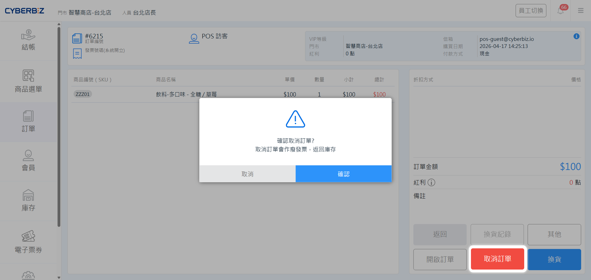{ .screenshot }

### 操作須知

- **操作不可逆性**：訂單一旦執行 **取消**，系統即無法再將其恢復為正常訂單，請務必三思。
- **發票處理規則**：
    - **申報期內**：當期月 4 日 23:59 前取消，系統自動執行 **發票作廢**。
        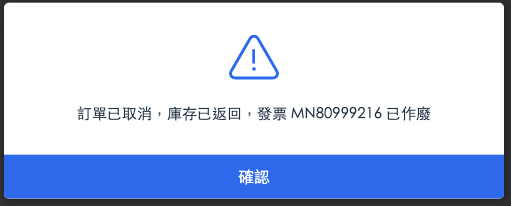{ .small-image }
    - **跨申報期**：5 日 00:00 後取消，系統執行 **發票折讓**，需自行至盟立後台列印折讓單供顧客簽名。
        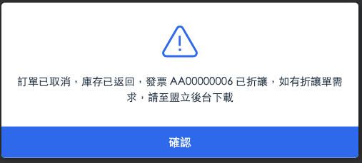{ .small-image }

        > 盟立後台列印位置：首頁 > 功能總覽 > 各類查詢作業 > 折讓資料查詢

- **行銷活動優惠**：取消訂單後，商品庫存會自動回補，顧客使用的紅利與優惠券將返還，且使用效期不變。
- **庫存管理**：訂單取消後，系統將自動回補庫存。若退貨原因為 **商品瑕疵**，請務必再依 [庫存調整](../inventory/庫存調整/) 執行 **盤虧**。

## 辦理換貨

### 操作步驟

1. 進入目標訂單，點擊 **換貨**。
    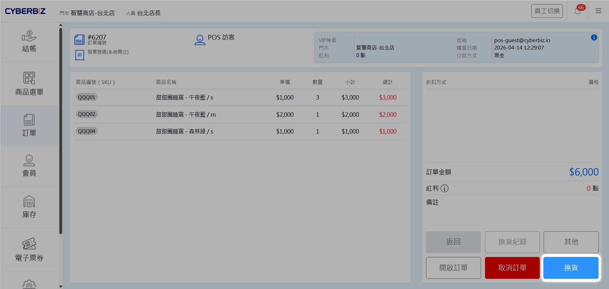{ .screenshot }
2. 點選欲退回的商品，該項將進入 **欲換貨商品** 列表。
3. 輸入新商品的 SKU 碼或掃描條碼以添加更換商品。
4. 完成後點擊 **確認** 並執行後續結帳。
    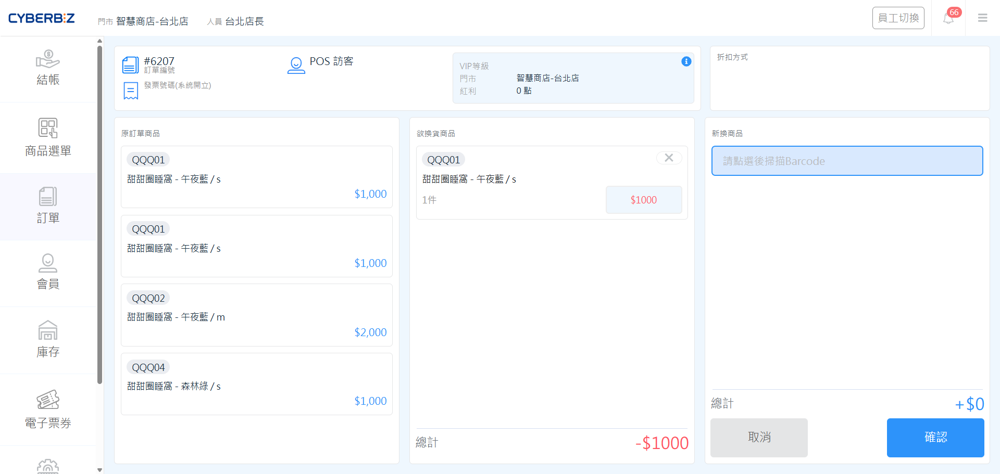{ .screenshot }

### 查看換貨記錄

1. 進入目標訂單，點擊 **換貨紀錄**。
    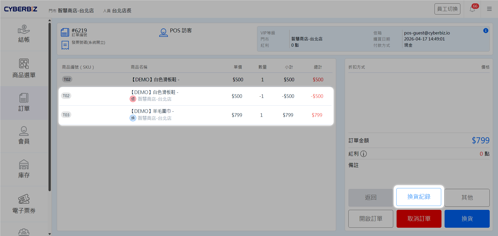{ .screenshot }
2. 了解訂單 **退貨商品** 與 **換貨商品**，並查看 **最終結帳金額**。
    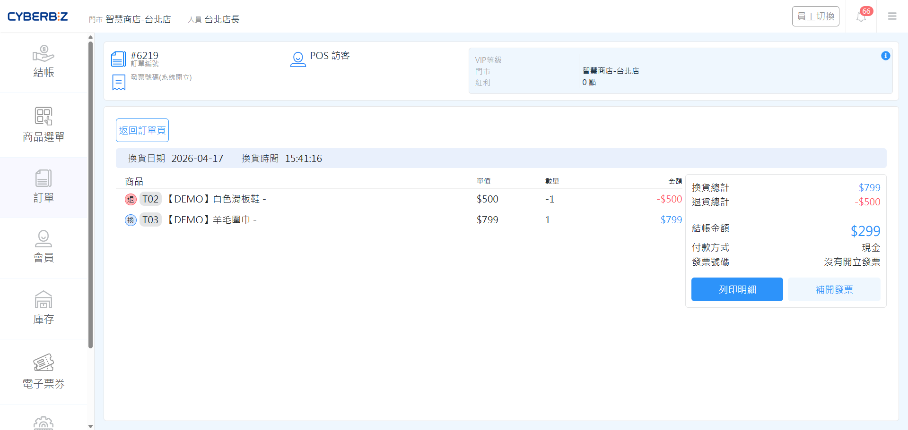{ .screenshot }

### 操作須知

- **金額限制**：換貨後的總額必須 **大於或等於** 原訂單金額。若價格小於原發票金額，請先 **取消原訂單**，再依據實際購買商品 **重新結帳**。
- **同價換貨**：換貨時的商品金額為該筆訂單當下的商品售價，不採計紅利優惠券等行銷活動。
- **差額換貨**：若有差額，系統將在結帳時僅針對差額部分開立新發票，原發票不重新開立。
- **跨門市換貨**：若 A 店成立的訂單在 B 店辦理換貨，B 店必須也有販售該商品才可執行。若 B 店無該商品品項，則無法在 B 門市辦理換貨。
- **換貨限制**：若訂單已辦理過換貨，則無法再透過前台執行 **取消** 或 **退貨**，須轉由管理後台人工處理。

### 人工取消換貨訂單

=== "同價位換貨"

    1. 前往 POS 後台，前往 **訂單**，將訂單 **退貨狀態** 改成 **退貨中 > 退貨審查 > 已退貨**。
        { .screenshot }
    2. 原訂單發票會於隔日作廢。
    3. 差額另行退款給消費者。
    
=== "補差價換貨"

    1. 前往 POS 後台，前往 **訂單**，將訂單 **退貨狀態** 改成 **退貨中 > 退貨審查 > 已退貨**。
        { .screenshot }
    2. 原訂單發票會於隔日作廢。**換貨後開立的發票** 不會更動，**需自行至盟立後台進行作廢**。
    3. 差額另行退款給消費者。

## 結案訂單

1. 進入目標訂單，點擊 **結案訂單**。
2. 手動結案後，觸發紅利、優惠券發送與分潤計算。

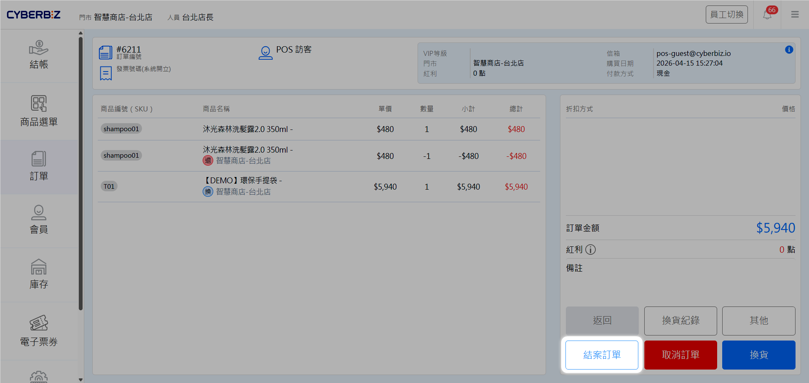{ .screenshot }

!!! tip "建議設定"
    為提高效率，可於管理後台 **金物流 > 結帳頁&金物流設定** 中，開啟 **POS 訂單自動結案** 功能。

    - **結帳後立即結案 (推薦)**：完成交易後即刻更新狀態，顧客可 **立即獲得紅利點數或優惠券**，有助於提升會員滿意度與回購率。
    - **結帳後 N 天結案**：若門市需預留退換貨作業期或帳務查核時間，可依營運需求設定緩衝天數。

    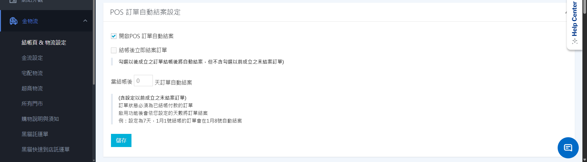{ .screenshot }

## 補開發票 / 列印明細

1. 進入目標訂單，點擊 **其他**。
2. 於彈窗中選擇 **補開發票** / **列印明細**。

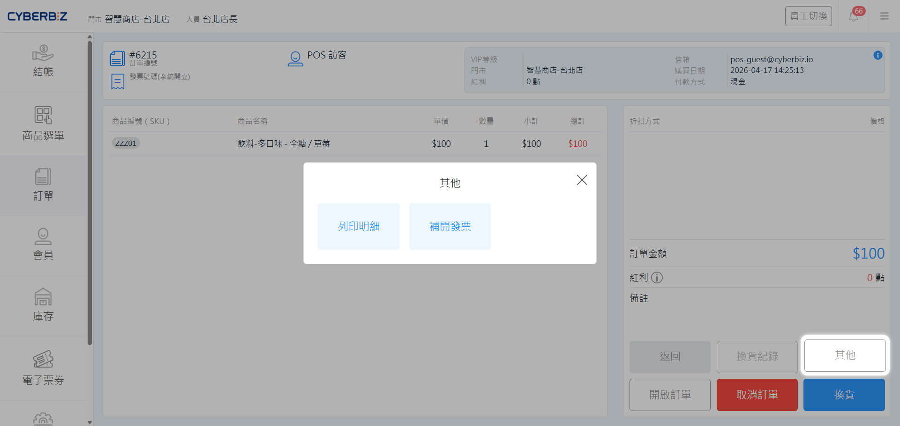{ .screenshot }

## 訂單貼標

勾選訂單前方方框，點擊 **新增標籤** / **移除標籤**，為該訂單貼上或移除標籤。

- **新增標籤**：於彈出視窗的下拉選單中，選擇已在後台建立的現有標籤。

    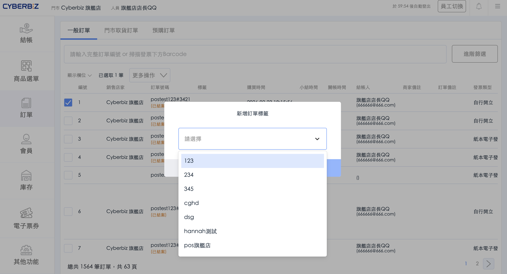{ .screenshot }

    !!! warning "標籤建立權限"
        此介面僅提供 **選取** 功能，不支援直接建立新標籤。若想建立新的訂單標籤，請前往後台，於 **訂單 > 所有訂單** [新增標籤]()。
        
- **移除標籤**：於彈出視窗的下拉選單中，選擇欲解除綁定的標籤。\

    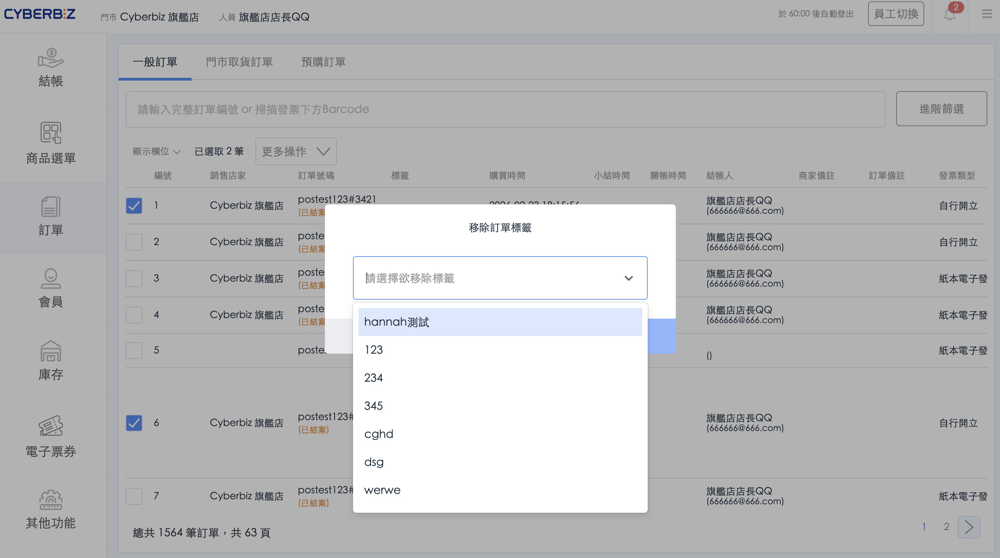{ .screenshot }
