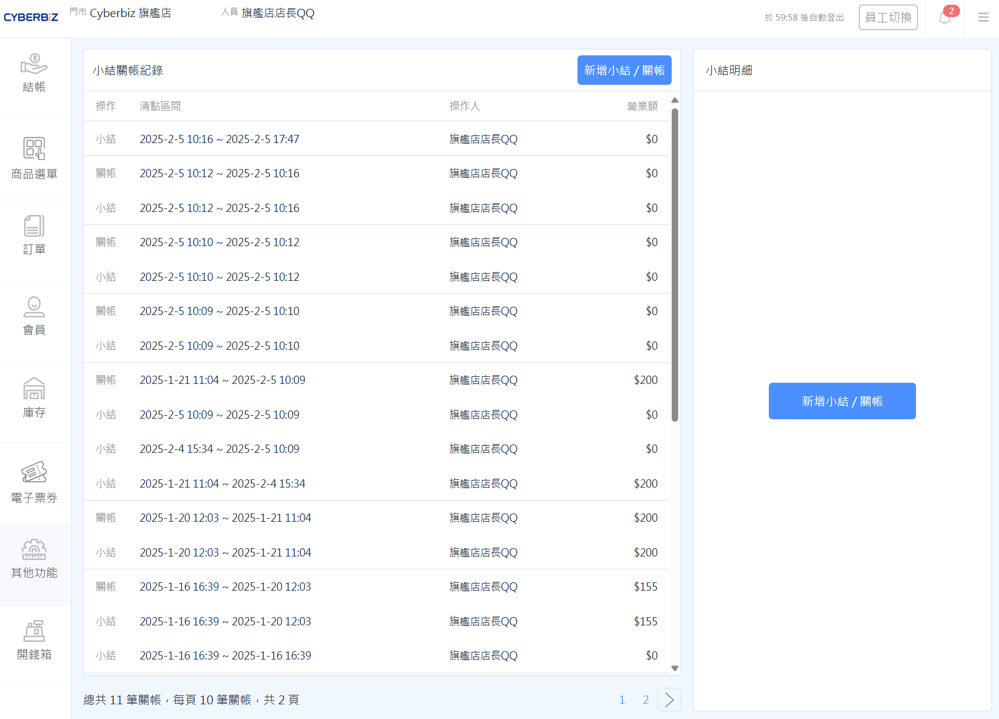
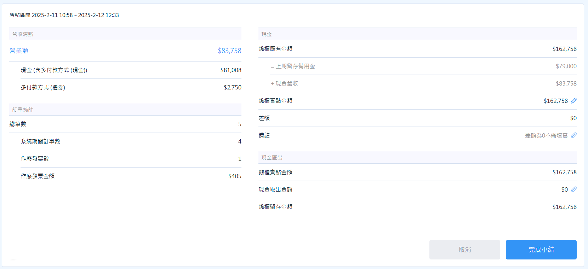
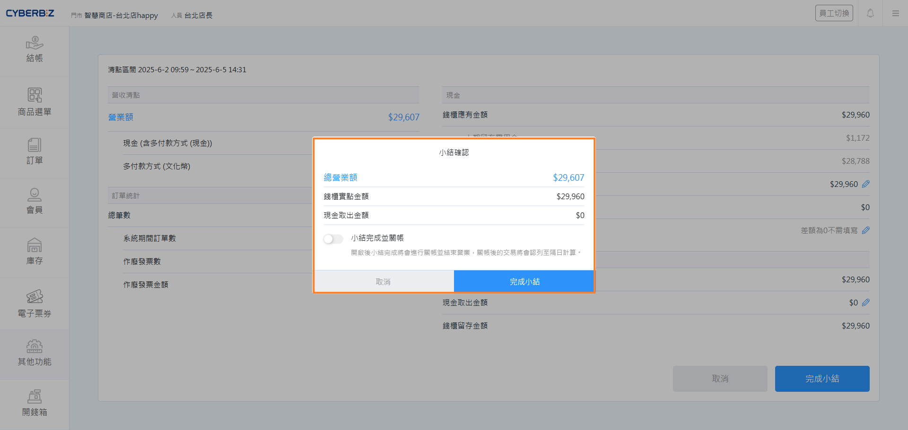
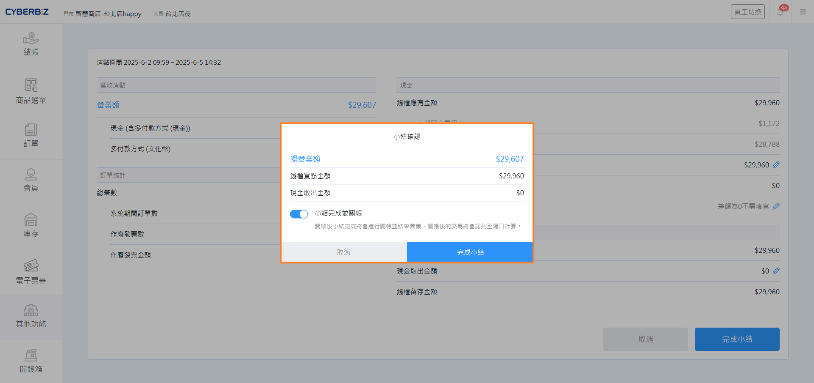
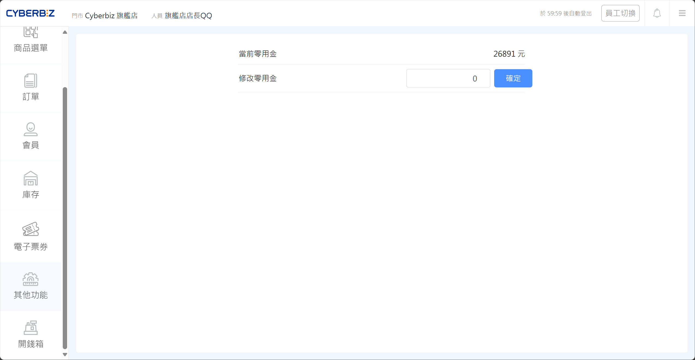

# 小結與關帳作業
透過小結與關帳作業，門市人員可定期清點營收、記錄現金差額，並完成每日的帳務結算。
{ .subtitle }

{ .hero-page }

!!! tip "應用情境"
	- **員工交班**：每班人員下班前執行 **小結**，確認當班帳務。
	- **每日歇業**：營業結束後執行 **關帳**，總結全日營收。
	- **零用金管理**：設定錢櫃保留金額，確保下一班有足夠備用金。

## 使用須知

- **計算範圍**：小結與關帳的統計僅限於執行當下所登入的 **POS 子機**，不包含其他子機的營業額。
- **作廢處理**：期間內若有取消訂單，系統會自動從營業額中扣除，並記錄作廢發票資訊。
- **頻率限制**：一天可執行多次小結與關帳，商家可依實際營運需求彈性操作。

## 操作流程

### 執行小結作業

小結用於交班時清點帳務，幫助店家儘早確認金額是否有誤。

1. 前往 POS 前台，點選 **其他功能 > 小結關帳**。
2. 點擊 **新增小結/關帳**，進入盤點資訊頁。
3. **查看營收數據**：在 **營收清點** 與 **訂單統計** 區塊查看本次小結期間的營業額。
4. **清點現金**：在 **現金** 區塊輸入錢櫃內的實際金額。
    - 系統會自動比對 **上期留存備用金** 與 **本期現金總額**。
    - 若有差額，請記錄差額原因。
5. **現金取出（結存入庫）**：若需將部分現金取出，請在 **現金取出金額** 欄位輸入金額。
    { .screenshot }
6. **完成小結**：點選 **完成小結**。
    - **僅小結**：在確認彈窗中關閉 **小結完成並關帳** 開關。
    - **小結並關帳**：在確認彈窗中開啟 **小結完成並關帳** 開關。
    { .screenshot }

### 執行關帳作業

關帳用於營業結束後，總結該時段內的所有小結紀錄。

1. 前往 POS 前台，點選 **其他功能 > 小結關帳**。
2. 點擊 **新增小結/關帳**。
3. 確認清點資訊無誤後，點選 **完成小結**。
    { .screenshot }
4. 在確認彈窗中開啟 **小結完成並關帳** 開關。
    { .screenshot }
5. 點擊 **確認** 完成關帳。
    - 若今日已有關帳紀錄，系統會彈出提示，商家仍可再次關帳。
    
    

!!! info "小結與關帳的差異"
    - **小結**：統計 **上次小結完成後** 到 **本次小結** 間的交易。
    - **關帳**：統計 **上次關帳完成後** 到 **本次關帳** 間的所有小結紀錄。每次關帳必須至少包含 1 次小結。

### 設定錢櫃保留金額

設定小結明細中 **錢櫃應有金額** 的預設值，方便快速對帳。

1. 前往 POS 前台，點選 **其他功能 > 零用金設定**。
2. 在欄位中輸入欲保留在錢櫃內的固定金額。
3. 點選 **儲存** 完成設定。

{ .screenshot }

## 常見問題

??? quote "忘記關帳隔天會自動清除嗎？"
    不會。系統會持續累計直到您執行關帳為止，但建議每日歇業前完成關帳，以利產出正確的每日營收報表。

