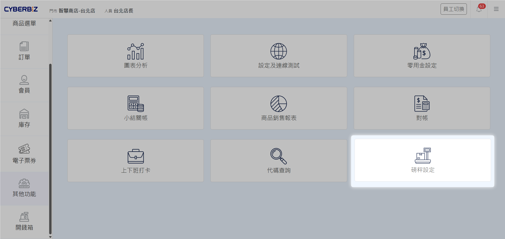
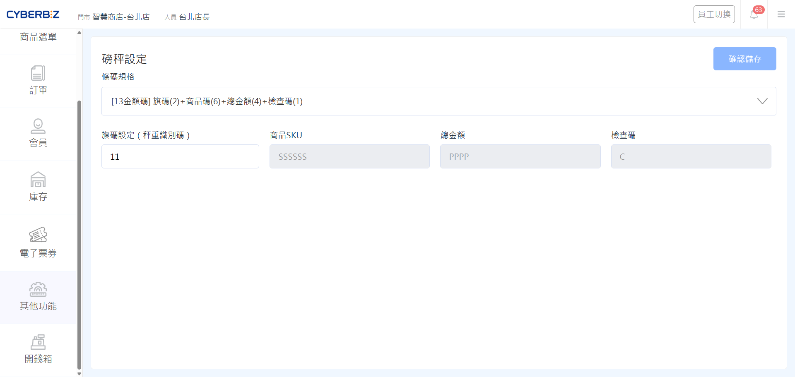

# 秤重商品條碼
針對販售散裝、秤重商品的商家，POS 支援與磅秤標籤機產出的條碼對接。透過掃描含有金額資訊的專屬條碼，店員可快速完成精確結帳。
{ .subtitle }

[:lucide-tag:{ title="適用方案" }](../../resources/conventions#適用方案) | 進階 PLUS / 高手 PLUS / 企業
{ .doc-badge }

!!! tip "應用情境"
    - **生鮮蔬果販售**：顧客挑選不同重量的蔬果，經磅秤秤重後印出內含金額的標籤，前台掃碼即可帶入總價。
    - **熟食/滷味計價**：不同份量的熟食根據重量產出唯一條碼，加速尖峰時段的結帳流速。
    - **固定包裝銷售**：將秤重商品預先包裝成固定重量（如每袋 1 公斤），透過定重條碼進行標準化管理。

## 使用須知

- **權限開通**：此功能需聯繫 CYBERBIZ 客服人員協助開通。
- **SKU 對齊**：磅秤標籤機中設定的商品 SKU 碼，必須與 CYBERBIZ 管理後台設定的 SKU 完全一致。
- **適用對象**：適用於 POS 全版本（含 POS 獨賣商家）。
- **庫存規則**：使用秤重商品條碼結帳時，**系統不會自動扣除商品庫存**。
- **行銷活動適用**：秤重商品同樣適用於 EC 後台設定的行銷活動（如全館折扣、任選折扣等）。

## 操作流程

### 步驟一：啟用磅秤功能與設定旗碼

在 POS 前台進行設定，確保系統能正確解析磅秤標籤機產出的條碼。

1. 進入 POS 前台，點選 **其他功能 > 磅秤設定**。
    { .screenshot }
2. **選擇條碼規格**：系統支援兩種 13 位金額碼格式。
    - **規格 A (SKU 6碼)**：`旗碼(2)` + `SKU(6)` + `總金額(4)` + `檢查碼(1)`。適合商品品項數極多（達六位數 SKU）的商家。
    - **規格 B (金額 5碼)**：`旗碼(2)` + `SKU(5)` + `總金額(5)` + `檢查碼(1)`。適合商品單價較高（總金額可達五位數）的商家。
3. **設定旗碼**：在 **旗碼設定 (秤重識別碼)** 欄位中，輸入磅秤標籤機預設的兩位數號碼（僅限數字）。

    { .screenshot }

    !!! note "什麼是旗碼？"
        旗碼是磅秤標籤機產出條碼的前兩位數字，用於告知 POS 系統 **這是一個秤重商品標籤**，而非一般商品。

### 步驟二：秤重商品結帳規則

設定完成後，您可以在結帳頁面掃描標籤。系統會根據條碼內容區分以下兩種結帳模式：

#### 1. 定重商品結帳

商家將秤重商品預先包裝成固定重量（如每袋 200 元）。

- **顯示方式**：由於條碼內容完全相同，掃描多個相同定重商品時，系統會自動合併計數。
- **範例**：香菇每袋固定售價 200 元，掃描兩袋後，結帳清單顯示「香菇 x 2，總額 400 元」。

#### 2. 不定重商品結帳

商品隨選隨秤，每件包裝的重量與銷售金額皆不同。

- **顯示方式**：由於每個條碼包含的金額資訊不同，系統會分別列出。這在主顯、客顯與收據明細上會逐筆顯示，方便後續退貨核對。
- **範例**：香蕉 A 串 100 元、香蕉 B 串 80 元，掃描後會顯示兩筆獨立的香蕉項目。

