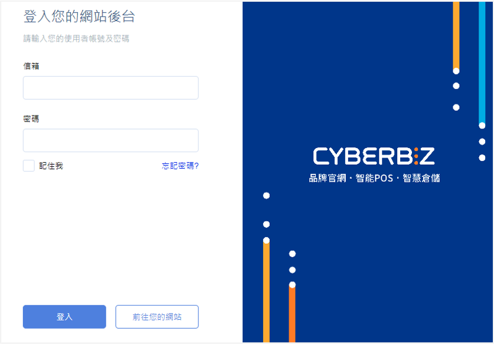
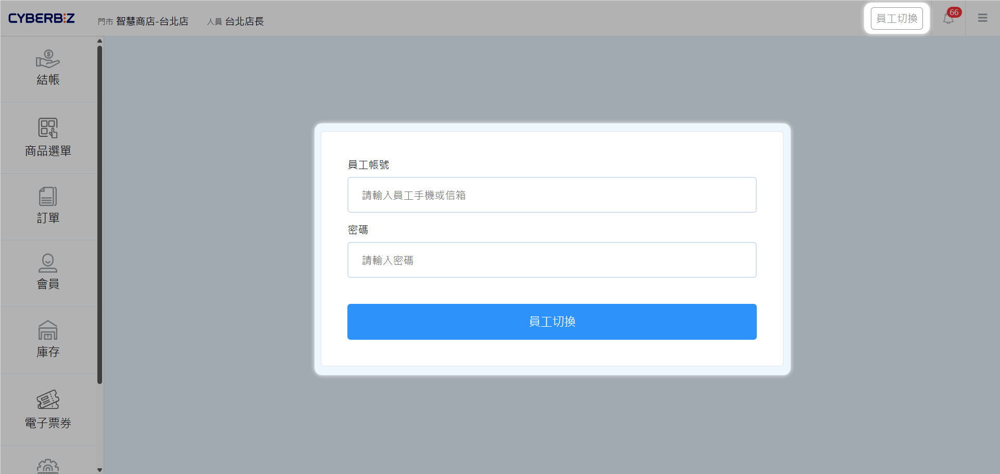
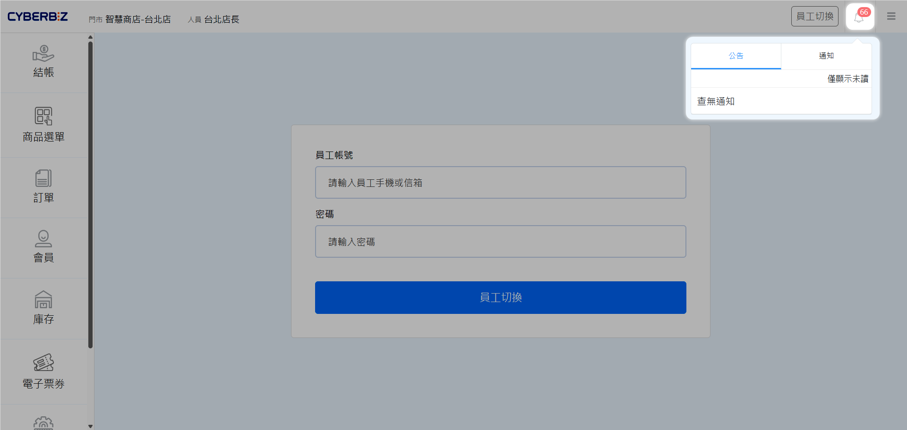
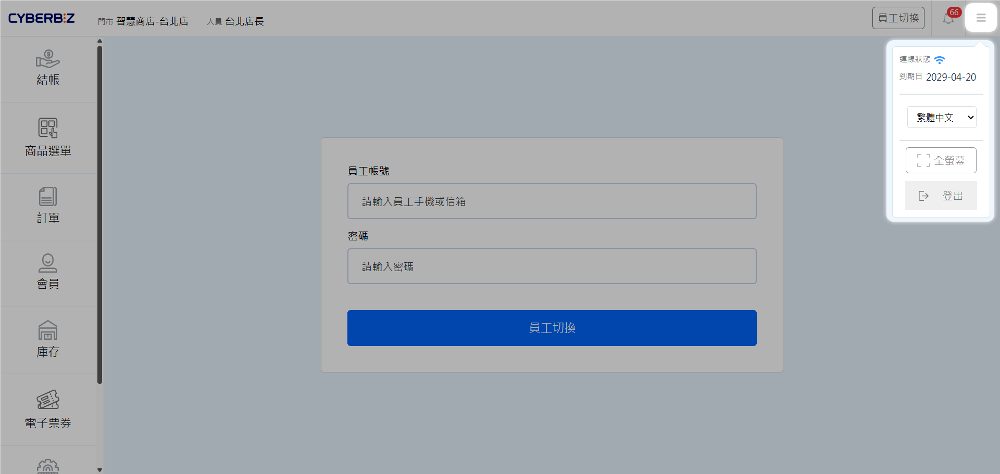

# 登入 POS 前台系統
瞭解如何透過專屬帳號登入 POS 前台，並掌握員工切換、公告查看與系統設定等基礎介面操作。
{ .subtitle }

[:lucide-tag:{ title="適用方案" }](../../resources/conventions#適用方案) | 進階 PLUS / 高手 PLUS / 企業
{ .doc-badge }

!!! tip "應用情境"
    - **開店準備**：門市人員每日開店時，透過專屬帳號進入結帳系統。
    - **交接班作業**：當班人員變更時，快速切換員工帳號以確保銷售記錄準確。
    - **系統狀態確認**：查看最新公告與網路連線狀態，確保營運環境正常。

---

## 使用須知

- **帳號權限限制**：僅具備 **POS 店長** 或 **POS 店員** 權限的帳號可登入 POS 前台。若使用 **網站擁有者** 或 **協同管理者** 權限登入，系統將自動跳轉至管理後台。

## 操作流程

### 登入 POS 前台

進入門市結帳與營運管理的主要介面。

1. 在瀏覽器輸入商店登入網址。（以下擇一輸入）
    - `https://[您的商店名稱].cyberbiz.co/admin`
    - `https://[您的商店名稱].cyberbiz.co/user/sign_in`
2. 在登入頁面輸入 **電子郵件** 與 **密碼**。
3. 點擊 **登入**。
4. 登入成功後，系統將自動導向 POS 前台預設畫面。

{ .screenshot }

### 員工切換

在不登出系統的情況下，更換當前操作的門市人員。

1. 在 POS 前台畫面，點選左側選單的 **員工切換**。
2. 選擇欲切換的員工帳號，並輸入該員工的登入資訊。
3. 完成切換後，系統右上方將顯示當前操作人員姓名。

{ .screenshot }

### 查看公告與系統設定

掌握系統最新訊息並確認設備連線狀態。

1. **查看公告**：點擊右上角 :lucide-bell:**鈴鐺** 圖示。

    - **公告**：查看官方發佈的營運相關訊息。
    - **通知**：查看系統自動發出的重要通知。

    > 若有新訊息，圖示將顯示紅色數字提醒。

    { .screenshot }

2. **系統設定**：點擊右上角 :lucide-menu: **目錄** 圖示，可執行以下動作：

    - 確認 **網路連線狀態**。
    - 查看 **系統到期日**。
    - 執行 **員工登出**。
    - 切換 **全螢幕模式**。

    { .screenshot }

## 更多操作

- :lucide-layout-template:{ .lg }   
  [__建立公告__](../others2/公告系統/){ data-preview }    
  發布全站的公告訊息，即時傳遞重要資訊。

